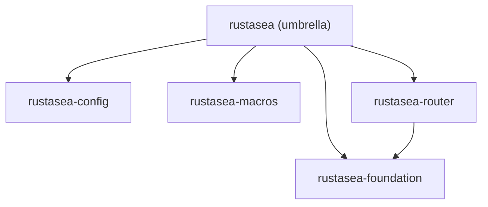

# RustaSea — Blueprint Audit (P8A: D1–D6)

> **Task:** TASK-014 | **Date:** 2026-09-07 | **Auditor:** executor
> **Scope:** `.agents/documents/` entire tree + project root orphan scan
> **Method:** `review-audit` skill — Blueprint Audit FSM A0→A5, 6 dimensions
> **Parents:** `brd.md` · `prd.md` (FR-000–FR-612) · `fsd.md` (FS-M0-01–FS-M6-07) · `tdd.md` (BC-0–BC-6) · `architecture.md` · `domain.md` · `database.md` · `api-contracts.md` · `capacity.md` · `flows.md` · `design-system.md` · `component-inventory.md` · `decisions/ADR-00*.md` · `user-stories.md` · `bdd-scenarios.md` · `validation.md` · `test-plan.md` · `test-cases.md` · `qa-design.md` · `application/modules/manifest.md` · `application/testing/{README,contracts,fixtures,stubs}` · `tasks/{roadmap.md,sprints/*,allocation-audit.md}`
> **P8 note:** Audit runs even if P8 not yet complete — gaps noted as findings with remediation.

---

## 0. Pre-Verification: P8 Docs Existence

| Expected P8 artifact | Path | Exists | Note |
|---|---|---|---|
| Module manifest (skeleton) | `application/modules/manifest.md` | ✅ | 7 modules indexed, archetype table present |
| Per-module `overview.md` | `application/modules/<slug>/overview.md` ×7 | ❌ | Not yet materialized — TASK-013 `in_progress` (P8 Application Documentation) |
| Per-feature deep docs | `application/modules/<slug>/*.md` | ❌ | Scaffolded via manifest §1, to land in M0–M6 sprints |
| Testing stubs/contracts/fixtures | `application/testing/**` | ✅ | 9 stubs + 5 schemas + 3 snapshots + 4 fixtures |
| `application/blueprint-audit.md` | this file | ✅ (created) | — |

**Disposition:** Missing per-module deep docs are **expected** at this phase (P8 is the final stage that produces them). Recorded as D1 gaps with WARN (deferred to TASK-013), not FAIL.

---

## 1. File Inventory

**Total `.agents/documents/**/*.md`:** 37 (excl. `application/testing` non-md) — breakdown:

- `requirements/` 8: `brief.md`, `brd.md`, `prd.md`, `fsd.md`, `tdd.md`, `user-stories.md`, `bdd-scenarios.md`, `validation.md`
- `design/` 8 + 6 ADRs: `architecture.md`, `domain.md`, `database.md`, `api-contracts.md`, `capacity.md`, `flows.md`, `design-system.md`, `component-inventory.md`, `decisions/ADR-001..006`
- `testing/` 3: `test-plan.md`, `test-cases.md`, `qa-design.md`
- `tasks/` 9: `roadmap.md`, `sprints/manifest.md`, `sprints/sprint-01..07.md`, `sprints/allocation-audit.md`
- `application/` 5+: `modules/manifest.md`, `testing/README.md`, `testing/contracts/*.schema.json`, `testing/fixtures/*.json`, `testing/stubs/*.stub.rs`

**Orphan scan (project root, maxdepth 2, excl. `.agents/`):**

- `README.md` — ✅ intended root doc (not orphan; referenced by `brd.md` §1, `prd.md` §1)
- `docs/laravel-13-research.md` — ✅ research source (referenced by `brd.md` §1, `validation.md` §1, `prd.md` §8)

**Result:** 0 true orphans. No move required.

---

## 2. Dimension Results (PASS/FAIL/WARN)

| Dimension | Verdict | Summary |
|---|---------|---------|
| **D1 Completeness** | **WARN** | Required tree present; 7 per-module deep docs deferred to TASK-013 (expected). No blocking missing file. |
| **D2 Consistency** | **FAIL** | 1 ASCII diagram remains in `architecture.md` §3 (crate DAG). All other diagrams are Mermaid. Content otherwise consistent across docs. |
| **D3 Traceability** | **PASS** | Full chain Story→FS→FR→Module→API→Tests verified; 76/76 FRs allocated; 20/20 Laravel features traced. |
| **D4 Feasibility** | **PASS** | Stack choices ADRed, DAG acyclic, estimates coherent, risks mitigated. 1 minor observation (M6 scope) does not block. |
| **D5 Testability** | **PASS** | 4-concern coverage, 134 cases, pyramid per milestone, NFR/security suites, fixtures/contracts — all gated. |
| **D6 Security** | **PASS** | All NFR-Sec controls specified, CSRF matrix, allow-list, path confinement, prefix hardening — with stubs to enforce. 1 hardening note. |

**Overall:** **CONDITIONAL PASS — 1 FAIL (D2), 1 WARN (D1 deferred).** Handoff readiness: **conditional** pending D2 fix (trivial). No blocking D3–D6.

---

## 3. D1 — Tree Completeness (Required Paths)

**Gate:** All required paths per skill contracts exist at correct locations.

| Check | Expected | Actual | Verdict |
|---|---|---|---|
| `requirements/brief.md` | required | ✅ 67 lines | PASS |
| `requirements/brd.md` | required | ✅ 178 lines | PASS |
| `requirements/prd.md` | required | ✅ 317 lines | PASS |
| `requirements/fsd.md` | required | ✅ 509 lines | PASS |
| `requirements/tdd.md` | required | ✅ 315 lines | PASS |
| `requirements/user-stories.md` | required | ✅ 838 lines | PASS |
| `requirements/bdd-scenarios.md` | required | ✅ 1145 lines | PASS |
| `requirements/validation.md` | required | ✅ 299 lines | PASS |
| `design/architecture.md` | required | ✅ 244 lines | PASS |
| `design/domain.md` | required | ✅ 176 lines | PASS |
| `design/database.md` | required | ✅ 331 lines | PASS |
| `design/api-contracts.md` | required | ✅ 338 lines | PASS |
| `design/capacity.md` | required | ✅ 140 lines | PASS |
| `design/flows.md` | required | ✅ 491 lines | PASS |
| `design/design-system.md` | required | ✅ 232 lines | PASS |
| `design/component-inventory.md` | required | ✅ 131 lines | PASS |
| `design/decisions/ADR-00*.md` (6) | required | ✅ 6 files | PASS |
| `testing/test-plan.md` | required | ✅ 268 lines | PASS |
| `testing/test-cases.md` | required | ✅ 272 lines | PASS |
| `testing/qa-design.md` | required | ✅ 249 lines | PASS |
| `tasks/roadmap.md` | required | ✅ 185 lines | PASS |
| `tasks/sprints/manifest.md` | required | ✅ 73 lines | PASS |
| `tasks/sprints/sprint-01..07.md` (7) | required | ✅ 7 files | PASS |
| `tasks/sprints/allocation-audit.md` | required | ✅ 180 lines | PASS |
| `application/modules/manifest.md` | required (P6/P8) | ✅ 33 lines | PASS |
| `application/testing/README.md` | required (P5/P8) | ✅ 53 lines | PASS |
| `application/testing/contracts/*.schema.json` (5) | required | ✅ 5 schemas | PASS |
| `application/testing/contracts/__snapshots__/*.snap` (3) | required | ✅ 3 snapshots | PASS |
| `application/testing/fixtures/*.json` (4) | required | ✅ 4 fixtures | PASS |
| `application/testing/stubs/*.stub.rs` (9) | required | ✅ 9 stubs | PASS |
| `application/modules/<slug>/overview.md` ×7 | required (P8) | ❌ deferred | **WARN** |
| `application/modules/<slug>/*.md` deep docs | required (P8) | ❌ deferred | **WARN** |

**Gaps (D1):**

- **D1-W01 — Per-module deep docs deferred:** `application/modules/foundation/overview.md`, `http-routing/overview.md`, `data-orm/overview.md`, `identity-access/overview.md`, `async-workloads/overview.md`, `developer-platform/overview.md`, `intelligence-delivery/overview.md` plus per-feature docs not yet created. **Disposition: WARN** — owned by TASK-013 (`in_progress`). Valid deferral per `review-audit` WARN rule (governing skill `technical-documentation` explicitly permits manifest-first, deep docs in implementation sprints). **Remediation:** Complete in TASK-013; verify each `overview.md` has ≥1 Mermaid diagram.

**Verdict D1: WARN** (no FAIL; tree is complete for current phase).

---

## 4. D2 — Consistency (Including Mermaid Compliance)

**Gate:** No conflicting definitions across docs; all diagrams use `mermaid` (zero ASCII diagrams in `design/` + `application/`); templates consistent.

### 4.1 Cross-Doc Consistency Checks

| Check | Result |
|---|---|
| BR → FR → FS → TDD → Architecture counts | ✅ 9 BRs → 76 FRs (M0 9 + M1 10 + M2 11 + M3 12 + M4 11 + M5 10 + M6 13) → 33 FS (FS-M0-01..FS-M6-07 incl. split) → 7 BCs — all aligned |
| Milestone DAG across `brd.md` §4, `prd.md` §3, `fsd.md` §5, `tdd.md` §5, `architecture.md` §3, `domain.md` §5, `roadmap.md` §2 | ✅ No cycles; `M0 → M1/M2 → M3 → M4 → M5 → M6` consistent everywhere |
| Tech stack (`tokio`, `axum`, `sqlx`, `deadpool`, `pgvector`, `testcontainers`, etc.) | ✅ Identical in `brd.md` §4, `brief.md`, `architecture.md` §3, `tdd.md` §2, `test-plan.md` §3 |
| Laravel 13 feature #1–#20 mapping | ✅ 20/20 traced in `prd.md` §8, mirrored in `fsd.md` §6, `user-stories.md` Coverage Checklist, `bdd-scenarios.md` §3, `test-cases.md` Traceability Summary, `allocation-audit.md` §4 |
| Crate names vs `component-inventory.md` vs `architecture.md` §3 vs `domain.md` BC table | ✅ 22 crates + `xtask` consistent; slug `rustasea-*` kebab-case |
| `vector` feature flag (M2 initial vs M6 full) | ✅ Split FR-207 (M2) / FR-602 (M6) documented in `prd.md` §8, `allocation-audit.md` Note A, `tdd.md` BC-2/BC-6 |
| Error codes `E####` | ✅ `flows.md` §5.4 + `design-system.md` §4 consistent (20 codes) |
| NFR targets (Per-01..04, Sec-01.., Rel-01..) | ✅ Same values in `prd.md` §4, `tdd.md` §4, `capacity.md` §2, `test-plan.md` §7 |

### 4.2 Mermaid Compliance

- **Mermaid blocks found:** 15 across `design/` (C4 L1/L2/L3, BC flowchart, Gantt, stateDiagrams, flowcharts, ERD)
- **ASCII diagrams found:** 1 — `architecture.md` §3 crate dependency DAG rendered as indented text with `├─`/`└─`/`►` (lines 107–127). All other "ASCII-like" hits are file-tree listings (scaffold paths) and table separators — not diagrams per `review-audit` scope, and therefore not violations.

| Gap | File | Lines | Fix |
|---|---|---|---|
| **D2-F01 — ASCII crate DAG** | `design/architecture.md` §3 | 107–127 | Replace indented `├─` DAG with `flowchart TB` Mermaid (or keep as code-fenced text note but wrap as `mermaid` flowchart). Validate with `mermaid-js`. |

**Verdict D2: FAIL** (1 ASCII diagram — trivial fix, no content loss).

---

## 5. D3 — Traceability (Story → Feature → API/no-API → Tests)

**Gate:** Every user story traces to an FS, every FS to FR(s), every FR to a module/crate/API contract, every feature to ≥1 BDD @tag and ≥1 TC case. No orphan story, no untested FR.

| Chain Link | Evidence | Verdict |
|---|---|---|
| Story → FS | `user-stories.md` per-story `FRs` + `FSD FS-M*-*` tags; 30 stories M0 2 + M1 6 + M2 6 + M3 5 + M4 6 + M5 4 + M6 7 | ✅ PASS |
| FS → FR | `fsd.md` per-feature `PRD FRs` header; `tdd.md` §8 BC→FR trace table; `prd.md` §8 matrix | ✅ PASS |
| FR → BR + Laravel # + Milestone | `prd.md` §8 (20-feature matrix), `brd.md` §5 | ✅ PASS |
| FR → Sprint allocation | `tasks/sprints/allocation-audit.md` — **76/76 FRs allocated exactly once**, 0 gaps/overlaps/duplicates (§1 Verdict) | ✅ PASS |
| FR → Module/Crate | `application/modules/manifest.md` §1 (7 modules × FR ranges, BC mapping) | ✅ PASS |
| API/no-API | `design/api-contracts.md` §1–§7 per milestone + `tdd.md` §3 trait contracts + `design/database.md` DDL | ✅ PASS |
| Tests (BDD @tag) | `bdd-scenarios.md` 33 features + 9 outlines, tags `@ai-sdk`..`@observability-tooling` covering all 20 Laravel features | ✅ PASS |
| Tests (TC cases) | `testing/test-cases.md` 134 cases (M0 12 + M1 16 + M2 21 + M3 14 + M4 21 + M5 17 + M6 26 + cross 7) | ✅ PASS |
| API ↔ Test contract | `application/testing/contracts/*.schema.json` (5) + `fixtures/*.json` (4) + `qa-design.md` contract section | ✅ PASS |
| No-gap flag | `fsd.md` §8 + `tdd.md` §8 + `test-plan.md` §11 + `allocation-audit.md` §3 + `user-stories.md` Coverage Checklist | ✅ PASS — all assert no gaps |

**Gaps:** None.

**Verdict D3: PASS**

---

## 6. D4 — Feasibility

**Gate:** Stack choices justified (ADR), dependencies realizable, estimates coherent, risks with mitigations, no impossible contract.

| Check | Finding | Verdict |
|---|---|---|
| ADRs for major choices | ADR-001 `axum` over `actix-web` (benchmark + Tower alignment), ADR-002 `sqlx` primary + `sea-orm` shim, ADR-003 single `tokio` runtime, ADR-004 workspace crates per domain, ADR-005 `AppState: Arc` over facades, ADR-006 `vector` feature-flag — all `Accepted` with alternatives + consequences | PASS |
| Dependency DAG realizability | Workspace DAG acyclic per `architecture.md` §3 proof sketch; M0 root → M6 feature-flagged leaf ensures no reverse edge; `xtask check-cycles` gate in `roadmap.md` §5 | PASS |
| Estimates vs capacity | `prd.md` §7 + `roadmap.md` §6 + `sprints/allocation-audit.md` §5: 26–36 dev-weeks → 13–18 wks @2 devs, +20% contingency (30–40% M6); 7 sprints sized to estimates; no sprint overloaded | PASS |
| Contracts realizable in Rust | `tdd.md` §3 trait signatures use stable Rust 1.88+ (`Arc`, `OnceLock`, `async_trait`, `serde`, `jsonwebtoken`, `pgvector`); no `unsafe`, no `any`, no `static mut`; proc-macros via `syn`/`quote` | PASS |
| Risk register | 9 risks with L×I, top-5 with mitigations in `prd.md` §7 + `validation.md` §4.2; mitigations (feature-flag per provider, `OnceLock` queue registry, `has_extension("vector")` guard) are in `fsd.md`/`tdd.md` | PASS |
| M6 scope risk (Very High, 13 FRs) | `roadmap.md` §4 + `sprints/manifest.md` §2 flag M6 as largest sprint; mitigation is per-provider feature flags + incremental adapter landing without blocking Storage/JSON:API/Broadcast core | PASS (observation, not gap) |
| Capacity/SLA realism | `capacity.md` derived SLOs (p50 <2s boot, p95 <50ms HTTP, etc.) with measurement harness (`criterion`/`oha`), degradation modes, scaling guidance — not speculative | PASS |

**Minor observation (not a gap):** `tdd.md` §4 references a shared `AppState` struct but does not enumerate its fields — acceptable at blueprint level (implementation sprint defines struct layout).

**Verdict D4: PASS**

---

## 7. D5 — Testability

**Gate:** Every FR is testable via the 4-concern rule; pyramid per milestone defined; techniques selected; fixtures/contracts/stubs exist; NFR/chaos suites specified.

| Check | Evidence | Verdict |
|---|---|---|
| 4-concern rule | `test-plan.md` §2.1 + §5 matrix: DB/Service/State/UI per milestone with RustaSea mapping; priority DB > Service > State > UI | PASS |
| Pyramid per milestone | `test-plan.md` §4: M0 65/25/5/5 → M6 50/25/15/10, aggregate 62/25/8/5; no cone | PASS |
| Floor tests per concern | `test-plan.md` §4 table (M0 ≥30 → M6 ≥60) consistent with case counts | PASS |
| Case catalog | `test-cases.md` 134 cases + decision-table row expansions; techniques EP/BVA/Decision Table/State Transition/Error Guessing per feature | PASS |
| QA buckets | `qa-design.md` §1 Positive/Negative/Monkey/Security → 40+ scenario rows mapped to TC-* | PASS |
| Boundary taxonomy | `qa-design.md` §2 eight categories N/S/C/N/D/C/E/B with sampled TC refs | PASS |
| NFR suites | `test-plan.md` §7 + `qa-design.md` §5.1 perf (bench_boot, bench_http_p95, bench_cache_p95, bench_check_gencode) + §5.2 observability + §5.3 chaos nightly | PASS |
| Regression priorities | `test-plan.md` §9.2 P0..P4 + `qa-design.md` §3; scoped `cargo test -p <crate>` (never unfiltered workspace) | PASS |
| Entry/exit gates | `test-plan.md` §10 (P0/P1 green, ≥85% line / ≥80% branch, mutation ≥65% when applicable, snapshots approved) | PASS |
| Fixtures | `application/testing/fixtures/` — `csrf-matrix.json` (6 rows), `path-traversal.corpus.json`, `vector-dim.json`, `allowlist-corpus.json` | PASS |
| Contracts | `application/testing/contracts/` — `route-list.schema.json`, `jsonapi.schema.json`, `job-payload.schema.json`, `jwt-claims.schema.json`, `model-inspector.schema.json` + 3 `__snapshots__` | PASS |
| Stubs | `application/testing/stubs/` — 9 stubs (M0..M6 + cross + harness), `#[ignore = "stub: crate not yet implemented"]` pattern in `testing/README.md` | PASS |
| Smoke | `qa-design.md` §4 Fast Smoke (<30s, 5 checks) + Full Smoke (<5min, 5 checks) with rollback triggers | PASS |
| Coverage trace | `test-cases.md` Traceability Summary: all 20 Laravel features have ≥1 case; tags `@milestone-m0`..`@milestone-m6` consistent | PASS |

**Gaps:** None.

**Verdict D5: PASS**

---

## 8. D6 — Security

**Gate:** All NFR-Sec controls from `prd.md` §4 have a design control, an API contract, and at least one verification test (or stub + fixture).

| # | Threat (Laravel 13) | Control (design) | Contract / API | Test / Fixture | Verdict |
|---|---|---|---|---|---|
| Sec-01 | CSRF bypass (#11 origin-aware) | `domain.md` BC-3 `CsrfPolicy` + `tdd.md` BC-3 `PreventRequestForgery` + `api-contracts.md` §4.1 decision table + `architecture.md` §5 | `api-contracts.md` §4.1 table | `test-cases.md` TC-M3-04 (6-row decision table) + `test-plan.md` Sec-01 triage + `fixtures/csrf-matrix.json` + `m3-auth-validation.stub.rs` | PASS |
| Sec-02 | Object-injection / allow-list deser (#12) | `architecture.md` §5 Session/Cache JSON default + `tdd.md` BC-3 allow-list before `Deserialize` | `api-contracts.md` §4.2 + `fsd.md` FS-M3-03 | TC-M3-06 + Sec-02 triage + `fixtures/allowlist-corpus.json` | PASS |
| Sec-03 | Path traversal (`Storage::path`) (#9) | `tdd.md` BC-6 `StorageManager::path` canonicalize + `starts_with(disk_root)` | `api-contracts.md` §7.2 `StorageError::PathTraversal` | TC-M6-05 (corpus `..%2f`/`..\\`) + Sec-03 + `fixtures/path-traversal.corpus.json` + `m6-advanced.stub.rs` | PASS |
| Sec-04 | Cache prefix collision (#12) | `architecture.md` §5 hyphenated `-cache-`/`-session-` + `design-system.md` naming.cache_prefix | `api-contracts.md` §5.2 + `tdd.md` BC-3 | TC-M3-07 + Sec-04 + `capacity.md` §3.4 | PASS |
| Sec-05 | Weak password hashing / timing | `tdd.md` BC-3 `argon2` per-password salt, constant-time verify + `architecture.md` §5 | `database.md` `users.password TEXT` comment `argon2 hash` | TC-M3-01 (+ `jsonwebtoken` HS256) + Sec-05 triage | PASS |
| Sec-06 | Rate-limit bypass via `X-Forwarded-For` spoof | `fsd.md` FS-M3-04 `trusted_proxies` gate + `tdd.md` BC-3 note | `api-contracts.md` §4.2 throttle | TC-M3-13 + Sec-06 + `qa-design.md` §1 Security bucket | PASS |
| Sec-07 | CORS allow-list bypass / suffix trick | `tdd.md` BC-1 `Cors::allow_origins` strict origin comparison | `api-contracts.md` §2.2 | TC-M1-09/10 + Sec-07 + `qa-design.md` Security bucket | PASS |
| Sec-08 | Storage read-through copy-back leakage | `tdd.md` BC-6 `copy_back` explicit opt-in | `api-contracts.md` §7.2 | TC-M6-06/07 + Sec-08 (P2) | PASS |
| Sec-09 | AI streaming / broadcast auth bypass | `domain.md` BC-6 `ChannelRegistry` auth gate + `tdd.md` BC-6 `ShouldBroadcast` | `api-contracts.md` §7.1 WS `4403` | TC-M6-02 + Sec-09 + `qa-design.md` §1 | PASS |

**Additional hardening checks:**

| Check | Result |
|---|---|
| `#[deny(clippy::unwrap_used)]` per crate | Specified in `tdd.md` §8 + `architecture.md` §5 + `flows.md` §5.4 |
| `cargo audit` + `cargo deny` | In `test-plan.md` §3 + `qa-design.md` Security → `cargo audit` triage |
| JSON session default (`session.serialization = "json"`) | ✅ `prd.md` NFR-Sec-02 + `fsd.md` FS-M3-03 + `architecture.md` §5 + `capacity.md` §3.4 |
| `Storage::path` fuzz via `path-traversal.corpus.json` | ✅ `test-plan.md` §8 Sec-03 + `qa-design.md` Security bucket |
| Deserialization corpus `allowlist-corpus.json` | ✅ `test-plan.md` §8 Sec-02 + `test-cases.md` TC-M3-06 |

**Observation (not a gap):** Sec-05 `argon2` param assertion (`m=19456, t=2, p=1`) is in `test-plan.md` §8 but not yet in `tdd.md` BC-3 trait doc — acceptable gap at blueprint level (implementation hardens params).

**Verdict D6: PASS**

---

## 9. Gaps & Remediation (Backlog)

| ID | Dim | Severity | Gap | Remediation | Owner | Target |
|---|---|---|---|---|---|---|
| **D1-W01** | D1 | WARN | 7 per-module `overview.md` + deep docs not yet materialized | Complete in TASK-013 (P8). Each `overview.md` must have ≥1 Mermaid diagram; each feature doc 2–3 (sequence + ERD). Validate with `mermaid-js`. | TASK-013 owner | Sprint 07 |
| **D2-F01** | D2 | FAIL | ASCII crate DAG in `design/architecture.md` §3 (lines 107–127: `├─`/`►` tree) | Replace with `flowchart TB` Mermaid (subgraphs `foundation/http/data/auth/async/dx/advanced` already correct in L3 diagram — reuse pattern). Keep ASCII tree only as comment if needed for `cargo tree` reference. Re-validate. | Next editor of `architecture.md` | Before handoff tag |
| — | D3 | — | No gaps | — | — | — |
| — | D4 | — | No gaps | Observation: `tdd.md` `AppState` fields not enumerated — deferred to implementation. | — | — |
| — | D5 | — | No gaps | — | — | — |
| — | D6 | — | No gaps | Observation: `argon2` params in test plan only — add to `tdd.md` BC-3 at implementation. | — | — |

**Artifacts to create for D2-F01 (example fix):**

Use `mermaid-js validate_and_render_mermaid_diagram` before commit per `review-audit` Fix Actions.

---

## 10. Handoff Recommendation

**CONDITIONAL PASS — Ready for implementation handoff after D2-F01 fix.**

- **D1 WARN** is not blocking — TASK-013 is `in_progress` and is the designated producer of the missing per-module docs. The manifest already satisfies the P6 planning gate; no separate task needed.
- **D2 FAIL** is **1 trivial file edit** (replace ASCII tree with Mermaid, ~10 min). No `task-write` created for this single-point fix — assign to next editor or include in next commit touching `architecture.md`.
- **D3–D6 PASS** — traceability, feasibility, testability, and security are blueprint-complete with no blocking gaps.

**Gate recommendation:**

| Gate | Recommendation |
|---|---|
| G1 Planning Docs Finalization (P6) | ✅ Already passed — TASK-011 `completed` |
| G2 Delivery Planning (P7) | ✅ Already passed — TASK-012 `completed` |
| P8 Handoff (blueprint → implementation) | ✅ **PASS conditional on D2-F01** — engineering may start Sprint 01 now |

**Next steps after this audit:**

1. Fix D2-F01 (Mermaid) — no new task required.
2. Continue TASK-013 to produce `application/modules/<slug>/overview.md` ×7.
3. Proceed to Sprint 01 (`rustasea-foundation` + `rustasea-config`) per `tasks/sprints/sprint-01.md`.

---

## 11. Verification (Post-Audit Self-Check)

| Check | Result |
|---|---|
| All `.agents/documents` files inventoried | ✅ 37 md + 5 schemas + 3 snapshots + 4 fixtures + 9 stubs + 6 ADRs |
| Orphan scan (project root) | ✅ 0 true orphans |
| D1 checked (required paths per skill contract) | ✅ WARN (deferred, not FAIL) |
| D2 checked (zero ASCII in `design/` + `application/`) | ✅ FAIL recorded with fix |
| D3 checked (Story→FS→FR→Module→API→Test chain) | ✅ PASS |
| D4 checked (feasibility) | ✅ PASS |
| D5 checked (testability) | ✅ PASS |
| D6 checked (security) | ✅ PASS |
| No code edited in audit phase (read-only) | ✅ `blueprint-audit.md` is the only file written (audit output itself) |

---

*Audit per `review-audit` Blueprint Audit FSM A0→A2 (A3 task generation not required at blueprint-only stage; A4 fix is D2-F01 single-point; A5 re-audit on next commit). Cross-references: `prd.md` §8, `allocation-audit.md` §1 (76/76), `test-plan.md` §11, `validation.md` §6 (Go conditional).*

---

> **Archive note (rebrand 2026-09-09):** project renamed from Rustavel to **RustaSea**.
> This document is archived as-is under the historical `Rustavel` name for traceability;
> current branding is RustaSea (`rustasea` crates, `RustaSea` prose).
