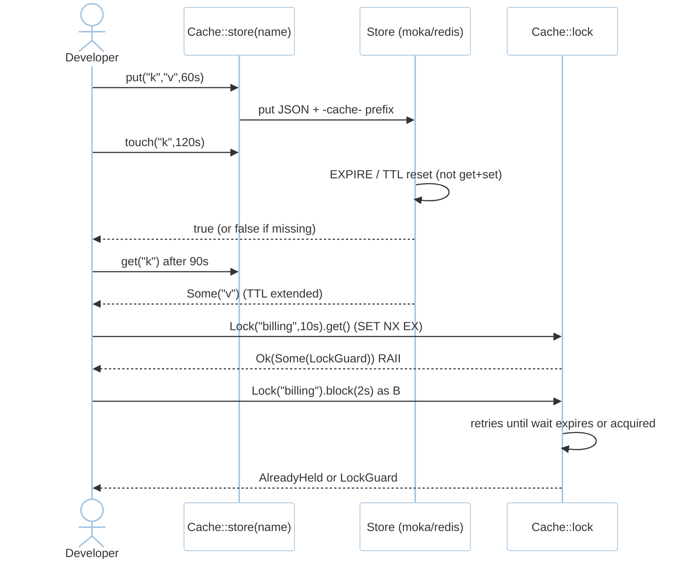
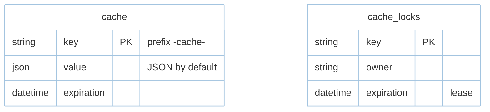

# Feature: Cache (M4)

> **Module:** `async-workloads` — [overview.md](overview.md) · **FSD:** FS-M4-04 · **FR:** FR-403..405 · **BC:** BC-4
> **Stories:** US-M4-03 (touch + Lock) · **BDD:** `@cache-touch`, `@cache`

## 1. Feature Overview
- **Brief Description:** `Store` trait (`get`/`put`/`forget`/`flush`/`increment`/`decrement` + default impl `touch` returning `Ok(false)` so new methods don't break custom drivers) + `Repository` facade (`remember`/`forever`/`pull`/`has`/`withContext`/`store(name)`), stores `memory` (`moka`) + `redis` (`deadpool-redis`) behind shared driver-agnostic API, `touch(key, ttl)` → `EXPIRE`/TTL reset `bool` (`false` if missing, not error; `CacheTouchFailed` only on store errors), `Lock` atomic `get`/`block`/`release` via `SET NX EX` (Redis) / `moka` guard, hyphenated prefixes `-cache-/-session-` + JSON serialization (M3 hardening).
- **Role in Module:** Cheap TTL extension without re-read + distributed locking for `onOneServer` and schedule gating.
- **Business Value:** `touch` extends TTL cheaply; `Lock` serializes critical sections.

## 2. User Stories

### US-M4-03 — Cache touch and Lock
**Sebagai** Rust developer **Saya ingin** `Cache::touch` + `Lock::get`/`block` **Sehingga** TTL extend cheaply + serialize sections

**AC:** `Cache::put("k","v",60s)` + 30s elapsed then `Cache::touch("k",120s)` → `Cache::get("k")` after 90s from touch still `Some("v")`; missing `k` → `touch` returns `false` not error; worker A holds `Lock("billing",10s).get()`, worker B `Lock("billing").block(2s)` → waits up to 2s or `AlreadyHeld` after lease expiry; stores isolated: `redis.k` not visible in `memory` (decision table 2 rows).

## 3. Business Flow & Rules

### 3.1 Business Flow


### 3.2 Business Rules
- Trait evolution: `touch` has default `Ok(false)` so custom drivers not broken (additive contract FSD §4.1).
- P95 memory `<5ms`/redis `<20ms` (NFR-Per-03).
- Deadpool pools sized via `config`; deadlock handled via lease expiry (NFR-Rel-03).
- Driver-agnostic API; stores isolated by name (`redis` vs `memory` → `None`).

## 4. Data Model



- `cache` table only for database driver — `moka`/`redis` backends bypass it (see `database.md §2 cache` variant).

## 5. Public Interface

```rust
#[async_trait]
trait Store: Send + Sync {
    async fn get(&self, key: &str) -> Result<Option<Vec<u8>>, CacheError>;
    async fn put(&self, key: &str, val: Vec<u8>, ttl: Duration) -> Result<(), CacheError>;
    async fn touch(&self, key: &str, ttl: Duration) -> Result<bool, CacheError> { Ok(false) } // default Unsupported → false
    async fn forget(&self, key: &str) -> Result<(), CacheError>;
    async fn flush(&self) -> Result<(), CacheError>;
    async fn increment(&self, key: &str, n: i64) -> Result<i64, CacheError>;
    // Repository adds remember/forever/pull/has/withContext/store(name)
}
struct Lock { key: String, ttl: Duration }
impl Lock {
    async fn get(&self) -> Result<Option<LockGuard>, CacheError>; // SET NX EX
    async fn block(&self, wait: Duration) -> Result<LockGuard, CacheError>;
}
struct LockGuard; // RAII — release on drop
enum CacheError { StoreUnavailable, LockAlreadyHeld, TouchFailed }
```

## 6. Dependencies
- `foundation` (AppState), `tdd.md BC-4 Store/Lock`, `capacity.md §3`.

## 7. Limitations
- `touch` not uniformly available on Redis Cluster — `EXPIRE` fallback via driver abstraction (R-04).

## 8. Compliance
- Hyphenated `-cache-`/`-session-` vs `_cache_` (migration guide documents prefix change).
- Allow-list `serializable_classes` checked before `deserialize` (shared with M3 hardening — see `csrf.md`).

## 9. Implementation Tasks

| ID | Component | Status | Description |
|----|-----------|--------|-------------|
| F-M4-CACHE-01 | Store | Todo | `Store` + `Repository` + moka + redis |
| F-M4-CACHE-02 | touch | Todo | `EXPIRE`/TTL reset without value fetch → `bool` |
| F-M4-CACHE-03 | Lock | Todo | `SET NX EX` + `block` retries + lease expiry |
| F-M4-CACHE-04 | Tests | Todo | touch extends/missing `false`, Lock contention, store isolation |

## 10. Cross-References
- API: [api-cache](../../api/async-workloads/api-cache.md)
- Tests: [test-queue-cache](../../testing/async-workloads/test-queue-cache.md) · BDD `@cache-touch` · `testing/stubs/m4-queue-cache-schedule.stub.rs` · `capacity.md §3`

## 11. Skill Reference
| Layer | Skill |
|-------|-------|
| QA | `test-planning` — BVA TTL 0/1/60/120/MAX, decision table store isolation |
| BDD | `test-generation` `@cache-touch` |
| Security | `security-audit` — `RegisterSec02` (allow-list deserialization) |
| Chaos | `non-functional-testing` — `Lock::block` contention + `docker pause redis` |
