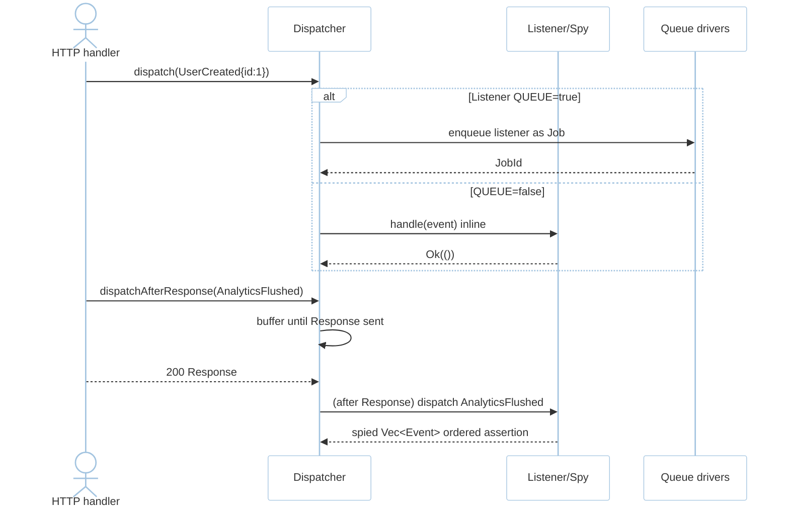
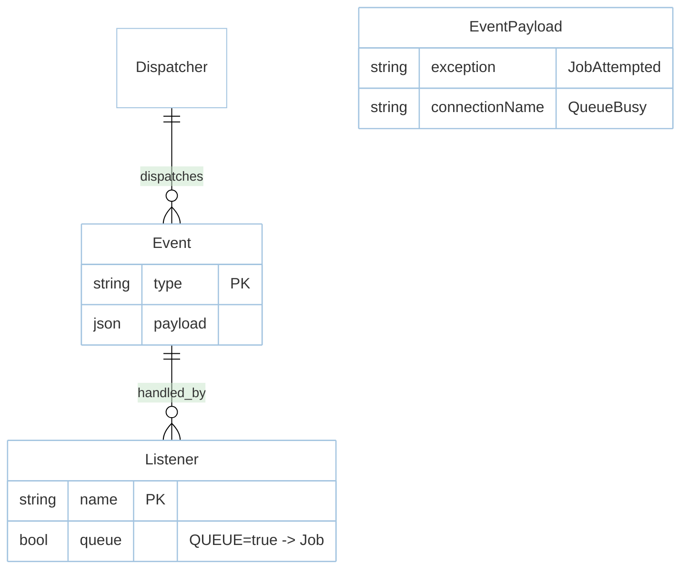

# Feature: Events (M4)

> **Module:** `async-workloads` — [overview.md](overview.md) · **FSD:** FS-M4-03 · **FR:** FR-406 · **BC:** BC-4
> **Stories:** US-M4-04 (dispatch + dispatchAfterResponse + async listeners + renames) · **BDD:** `@contracts-expansion`

## 1. Feature Overview
- **Brief Description:** `Event` trait + `Listener<E>` with `const QUEUE: bool = false` (`true` enqueues listener as `Job` rather than `await` inline), `Dispatcher::dispatch(E)` immediate + `dispatchAfterResponse(E)` buffered until HTTP `Response` sent then flushed, `JobAttempted{ exception }` (not `exceptionOccurred`) + `QueueBusy{ connectionName }` (not `connection`) renames vs Laravel 12, `CacheLockAcquired`/`CacheLockReleased`, example `UserCreated` across bc.
- **Role in Module:** Cross-context decoupling via domain events (no distributed tx across Redis/DB boundaries; eventual consistency).
- **Business Value:** Listeners run off request path.

## 2. User Stories

### US-M4-04 — Events: dispatch, dispatchAfterResponse, async listeners, contract renames
**Sebagai** Rust developer **Saya ingin** `Event`/`Listener` `Queue{enable:true}` + `dispatchAfterResponse` **Sehingga** listeners off request path + field renames correct

**AC:** `impl Listener for SendMail{QUEUE=true}` → `Dispatcher::dispatch(UserCreated{id:1})` enqueues as Job not inline; `dispatchAfterResponse(AnalyticsFlushed)` inside `GET /page` handler → event dispatched after Response sent (test spy `Vec<Event>` ordered assertion); handlers for `JobAttempted`/`QueueBusy` carry fields `exception`/`connectionName`.

## 3. Business Flow & Rules

### 3.1 Business Flow


### 3.2 Business Rules
- Singleton rows: `JobAttempted{exception}` / `QueueBusy{connectionName}` field names are contractual (FSD §4.3; domain event adjacency).
- No `any`: every event is typed `Event: Serialize+DeserializeOwned+Send+Sync+'static` (C-03).
- `dispatchAfterResponse` flushes after HTTP `Response` sent (observable via test spy); not before.

## 4. Data Model



## 5. Public Interface

```rust
#[async_trait] trait Event: Serialize + DeserializeOwned + Send + Sync + 'static {}
#[async_trait] trait Listener<E: Event>: Send + Sync { const QUEUE: bool = false; async fn handle(&self, event: E) -> Result<(), EventError>; }
struct Dispatcher;
impl Dispatcher {
    async fn dispatch<E: Event>(&self, event: E) -> Result<(), EventError>;
    async fn dispatch_after_response<E: Event>(&self, event: E) -> Result<(), EventError>; // buffered
}
// Events
struct JobAttempted { exception: String } // renamed vs exceptionOccurred
struct QueueBusy { connectionName: String } // renamed vs connection
struct SchedulePaused; struct ScheduleResumed; // cross-link to schedule.md
struct UserCreated { id: u64 } // example app-level
```

## 6. Dependencies
- `rustasea-queue` (for `QUEUE=true` → Job), `foundation` (`Dispatcher`), `domain.md §4 Events E-02..E-04`.

## 7. Limitations
- Subsequent `schedule:pause` `SchedulePaused` emission is not duplicated on tick suppression (idempotent flag).

## 8. Compliance
- Metrics emission on `SchedulePaused`/`Resumed` verified via event spy ordered assertion (observability `test-plan §7.3`).

## 9. Implementation Tasks

| ID | Component | Status | Description |
|----|-----------|--------|-------------|
| F-M4-EVT-01 | Event/Listener | Todo | `Event`+`Listener<E>` traits + `QUEUE` |
| F-M4-EVT-02 | Dispatcher | Todo | `dispatch` + `dispatchAfterResponse` buffered flush |
| F-M4-EVT-03 | Renames | Todo | `JobAttempted{exception}`/`QueueBusy{connectionName}` |
| F-M4-EVT-04 | Tests | Todo | async listener→Job, after-response spy, field names |

## 10. Cross-References
- API: [api-events-schedule](../../api/async-workloads/api-events-schedule.md) — events section
- Tests: [test-queue-cache](../../testing/async-workloads/test-queue-cache.md) · BDD `@contracts-expansion`
- Domain: `domain.md §4 Events`

## 11. Skill Reference
| Layer | Skill |
|-------|-------|
| QA | `test-planning` — state transition immediate vs deferred |
| BDD | `test-generation` — `SchedulePaused` adjacency in `schedule.md` |
| Contract | `test-generation` — field-rename invariant via typed probe |
| Chaos | `non-functional-testing` — kill PG while `dispatchAfterResponse` buffered |

---

> **Archive note (rebrand 2026-09-09):** project renamed from Rustavel to **RustaSea**.
> This document is archived as-is under the historical `Rustavel` name for traceability;
> current branding is RustaSea (`rustasea` crates, `RustaSea` prose).
