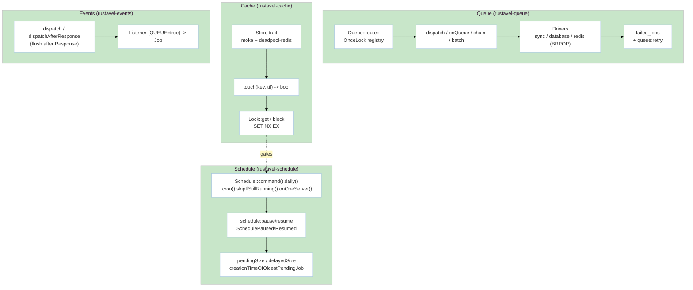

# Module: AsyncWorkloads (M4 — Queue, Cache, Scheduling & Events)

> **Status:** P8 Final — 2026-09-07 | **Task:** TASK-013
> **Parents:** `requirements/{prd §M4,fsd §3.5,tdd BC-4,bdd-scenarios §2.5,user-stories US-M4-01..06}.md` · `design/{architecture BC-4,domain BC-4,database §2 (jobs/cache),api-contracts §4,capacity.md}` · `modules/manifest.md` · `sprints/sprint-05.md`
> **Crates:** `rustavel-queue` · `rustavel-cache` · `rustavel-events` · `rustavel-schedule`
> **Milestone:** M4 | **BR:** BR-05 | **FR:** FR-400..410 | **FSD:** FS-M4-01..05 | **BC:** BC-4 | **Stories:** US-M4-01..06

## Header & Navigation

- [Manifest](../manifest.md) · [App README](../../README.md)
- API: [api-queue](../../api/async-workloads/api-queue.md) · [api-cache](../../api/async-workloads/api-cache.md) · [api-events-schedule](../../api/async-workloads/api-events-schedule.md)
- Testing: [testing/async-workloads/overview.md](../../testing/async-workloads/overview.md)

## 1. Module Introduction

### 1.1 Brief Description
Observable async workloads: typed `Job<T: Serialize+DeserializeOwned>` with `#[tries]`/`#[backoff]`/`#[timeout]`/`#[failOnTimeout]` + `ShouldRetry`/`ShouldRetryUntil`, central `Queue::route::<Job>(connection, queue)` `OnceLock` registry with per-dispatch `onQueue`/`onConnection` override, drivers `sync`/`database`/`redis` (`deadpool-redis` BRPOP), `chain`/`batch`/`failed_jobs` + `queue:failed`/`queue:retry`, cache `Store`+`Repository` (`memory` `moka` + `redis`) with `touch` (TTL extend without `get`/`set`) and `Lock::get`/`block` (`SET NX EX`), events `Event`/`Listener` with `Queue{enable:true}` + `dispatchAfterResponse`, scheduler `daily`/`cron`/`everyMinute`/`skipIfStillRunning`/`onOneServer` (distributed lock) + `schedule:pause`/`resume` (`SchedulePaused`/`Resumed`) + Cloud queue metrics (`pendingSize`/`delayedSize`/`reservedSize`/`creationTimeOfOldestPendingJob`).

### 1.2 Position & Role
- **Type:** Workhorse. HTTP handlers enqueue; workers drain; ticker governs schedule.
- **Value:** Laravel-ergonomic async without ad-hoc glue. Deferred `withScheduling` (provider registration deferred until first `schedule:run` tick — #10).
- **Depends on:** `foundation` (Container/AppState), `data-orm` (jobs DB), `identity-access` hardening (cache prefix/serialization). **Enables:** M6 streaming/broadcast queueing.

## 2. Feature List

| Feature | Description | Detail |
|---------|-------------|--------|
| Queue | Typed `Job<T>`, `Queue::route`, drivers `sync`/`database`/`redis`, `chain`/`batch`/`failed_jobs` | [queue.md](queue.md) |
| Cache | `Store`/`Repository` `memory`+`redis`, `touch`, `Lock`, hyphenated prefixes, JSON serialization | [cache.md](cache.md) |
| Events | `Event`/`Listener` `Queue{enable:true}`, `dispatch` + `dispatchAfterResponse`, `JobAttempted{exception}`/`QueueBusy{connectionName}` renames | [events.md](events.md) |
| Schedule | Frequencies, `skipIfStillRunning`, `onOneServer` (Lock), `schedule:list`/`run`/`pause`/`resume`, metrics, deferred `withScheduling` | [schedule.md](schedule.md) |

## 3. High-Level Architecture

- `dispatchAfterResponse` buffers until HTTP `Response` sent, then flushes (observable via test spy).
- `touch` on missing key → `false`, not error; driver that doesn't implement `touch` uses trait default `Ok(false)` (contract evolution per FSD §4.1).

## 4. Global Dependencies

- **Deps:** `foundation`, `config`, `orm` (DB for queue), `cache` (Lock for schedule `onOneServer`), `moka`, `deadpool-redis`, `tokio-cron`/`cron`.
- **DB tables:** `jobs` (+ partial indexes on `queue/available_at`, `reserved_at`), `failed_jobs`, `job_batches`, `cache` (`key TEXT PRIMARY KEY`, `value JSONB`, `expiration`), `cache_locks`, `schedule_state` singleton row.

## 5. Skill Reference

| Layer | Skill | Trace |
|-------|-------|-------|
| API | `technical-documentation` Part A | [api-queue](../../api/async-workloads/api-queue.md), [api-cache](../../api/async-workloads/api-cache.md), [api-events-schedule](../../api/async-workloads/api-events-schedule.md) |
| QA | `test-planning` | `@queue-routing`, `@queue`, `@cache-touch`, `@contracts-expansion`, `@schedule`, `@queue-metrics`, `@schedule-pauseresume` |
| BDD | `test-generation` | `bdd-scenarios §2.5` |
| Contract | `test-generation` | `contracts/job-payload.schema.json` |
| Security | `security-audit` | cache allow-list, `X-Forwarded-For` adjacency for schedule gate |
| Chaos | `non-functional-testing` | `docker pause redis`, kill PG mid-tx, `schedule:pause` during tick, bounded `mpsc Lagged` |

## 6. Compliance

- Cache p95 <5ms (memory) / <20ms (redis) (`criterion`; NFR-Per-03).
- Cloud metrics via `Queue` trait (NFR-Mai-01, #8).
- Deadpool pools sized via config; `Lock::block` respects timeout + lease expiry (NFR-Rel-03, NFR-Sca-01).
- `JobPayload` contract triaged for security (Sec-02 allow-list) in `queue.md §7`.
