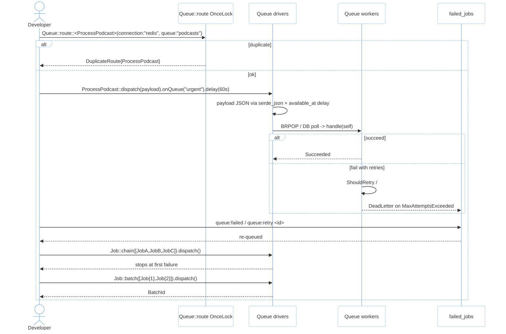
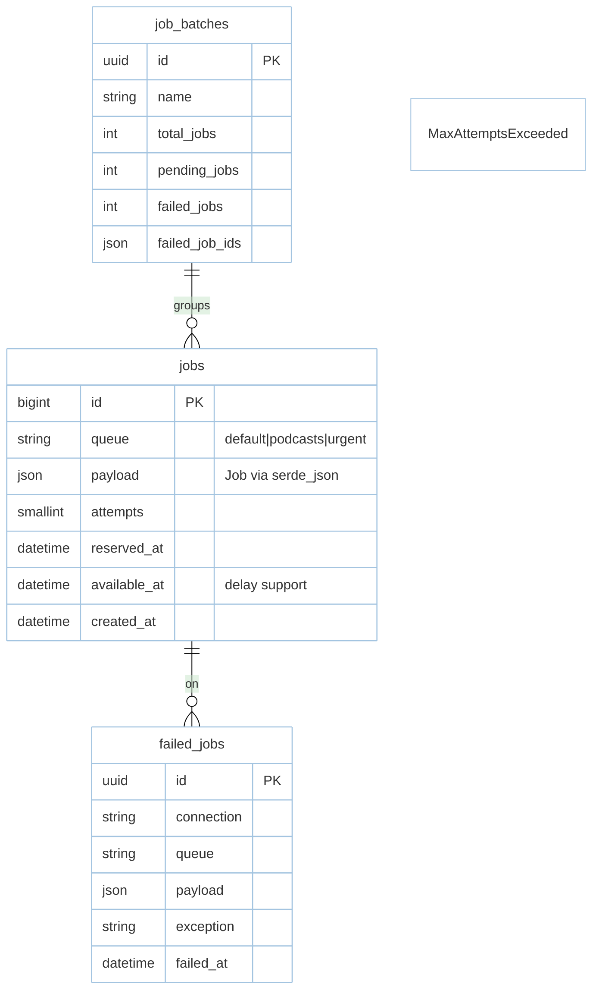

# Feature: Queue (M4)

> **Module:** `async-workloads` — [overview.md](overview.md) · **FSD:** FS-M4-01..02 · **FR:** FR-400..402 · **BC:** BC-4
> **Stories:** US-M4-01 (typed jobs + retry + routing), US-M4-02 (drivers/chaining/batching) · **BDD:** `@queue-routing`, `@queue`, `@attributes`

## 1. Feature Overview
- **Brief Description:** Typed `Job<T>` with generic payload `T: Serialize+DeserializeOwned` and `handle(self)->Result<(),JobError>` plus `ShouldRetry`/`ShouldRetryUntil` plus declarative `#[tries(3)]`/`#[backoff(1|secs)]`/`#[timeout(30)]`/`#[failOnTimeout]`/`#[withoutBroadcasting]` etc., central `Queue::route::<Job>(connection, queue)` `OnceLock` registry (`DuplicateRoute` on second), per-dispatch `onQueue`/`onConnection`/`delay`/`onConnection` overrides, drivers `sync`/`database` (polls `jobs`)/`redis` (`deadpool-redis` BRPOP), `chain` (stop on first failure), `batch` (`BatchId`), `failed_jobs` + `queue:failed`/`queue:retry {id}` CLI, `withScheduling` deferred.
- **Role in Module:** Work dispatcher; registry is `OnceLock` after `boot` — no races; `queue:work --connection --queue --max-jobs` is the CLI surface.
- **Business Value:** Job placement and retry declared once (#4 queue routing + #7 attributes).

## 2. User Stories

### US-M4-01 — Typed jobs with retry and routing
**Sebagai** Rust developer **Saya ingin** typed `Job<T>` + `#[tries]`/`#[backoff]`/`#[timeout]` + `Queue::route::<Job>` central **Sehingga** routing & retry declared once

**AC:** `Queue::route::<ProcessPodcast>(queue:"podcasts")` at boot → `ProcessPodcast::dispatch(payload)` enqueued to `podcasts` without `onQueue`; `onQueue("urgent")` overrides; duplicate `route` same type → `DuplicateRoute{type_name:"ProcessPodcast"}`; `#[tries(3)] #[backoff(1)] Flaky` fails twice → retried twice ~1s backoff succeeds 3rd.

### US-M4-02 — Async job drivers, chaining, batching, failed jobs
**Sebagai** platform engineer **Saya ingin** `sync`/`database`/`redis` + `chain`/`batch` + `failed_jobs` **Sehingga** queue under failure is correct

**AC:** `chain([JobA,JobB,JobC])` where `JobB::handle` fails → `JobC` not executed and `failed_jobs` contains `JobB`; `batch([Job{1},Job{2},Job{3}])` → `BatchId`; failed `abc` + `queue:retry abc` → re-queued and entry cleared after success.

## 3. Business Flow & Rules

### 3.1 Business Flow


### 3.2 Business Rules
- `Job<T>` no `any`/`Box<dyn Any>` for domain payloads (C-03); `T: Serialize+DeserializeOwned`.
- `Queue::route::<J>` is `OnceLock<HashMap<TypeId,Route>>` after `boot`; attempt duplicate `route` returns error; not-yet-registered type → `NotFound` until provider registers (edge per `qa-design §2`).
- `chain` stops sequentially on first failure; `batch` aggregates.
- Backoff is exponential if scalar, fixed if array (per FSD FS-M4-01).
- `JobAttempted{ exception }` (not `exceptionOccurred`) and `QueueBusy{ connectionName }` renames are contract (FSD §4.3 observability crossing).

## 4. Data Model



- Payload deserialization gated by `serializable_classes` allow-list adjacency (see `cache.md` / identity `csrf.md`).

## 5. Public Interface

```rust
#[tries(3)] #[backoff(1)] #[timeout(30)]
struct ProcessPodcast { id: u64 }
impl Job for ProcessPodcast { async fn handle(self) -> Result<(), JobError> { ... } }

struct QueueRegistry;
impl QueueRegistry {
    fn route<J: Job>(&mut self, connection: &'static str, queue: &'static str) -> Result<(), QueueError>;
    async fn dispatch<J: Job>(&self, job: J) -> Result<JobId, QueueError>; // + onQueue/onConnection/delay/chain/batch
    async fn pending_size(&self, conn: &str, queue: &str) -> Result<usize, QueueError>; // see schedule.md metrics
}
trait Job: Serialize + DeserializeOwned + Send + Sync + 'static { async fn handle(self) -> Result<(), JobError>; }
trait ShouldRetry { fn should_retry(&self, attempt: u32, err: &JobError) -> bool; }
trait ShouldRetryUntil { fn retry_until(&self) -> Option<DateTime<Utc>>; }
enum JobError { Timeout, MaxAttemptsExceeded, Exception(String) }
enum QueueError { DuplicateRoute{ type_name: &'static str }, UnknownConnection, StoreUnavailable }
```

## 6. Dependencies
- `foundation` (AppState), `data-orm` (jobs DB), `deadpool-redis`, `moka` not needed here.

## 7. Limitations
- `chain` is sequential per `FSD`; distributed chain ordering not provided.
- `sync` driver is immediate inline (testing only); `database` driver polls `jobs` by `available_at`.

## 8. Compliance
- No `Box<dyn Any>` (C-03); workspace `cargo metadata` DAG has Queue pointing to Cache/Events but no back-edge (NFR-Sca-02).
- `JobPayload` contract `#8` traced; payload additive field via `#[serde(default)]` backwards-compat.

## 9. Implementation Tasks

| ID | Component | Status | Description |
|----|-----------|--------|-------------|
| F-M4-Q-01 | Job trait | Todo | `Job<T>` + `#[tries]`/`#[backoff]`/`#[timeout]` |
| F-M4-Q-02 | Queue::route | Todo | `OnceLock` registry + `DuplicateRoute` |
| F-M4-Q-03 | Drivers | Todo | `sync`/`database`/`redis` BRPOP + `dispatch`/`chain`/`batch` |
| F-M4-Q-04 | failed_jobs | Todo | dead-letter + `queue:failed`/`retry` |
| F-M4-Q-05 | Tests | Todo | chain stop, batch BatchId, duplicate route, retry backoff |

## 10. Cross-References
- API: [api-queue](../../api/async-workloads/api-queue.md)
- Tests: [test-queue-cache](../../testing/async-workloads/test-queue-cache.md) · BDD `@queue-routing`, `@queue` · `testing/contracts/job-payload.schema.json` · `testing/stubs/m4-queue-cache-schedule.stub.rs`
- DB: `database.md §2 jobs/failed_jobs/job_batches`

## 11. Skill Reference
| Layer | Skill |
|-------|-------|
| QA | `test-planning` — state transition `Pending→Reserved→Processing→Retrying→DeadLetter` |
| BDD | `test-generation` `@queue-routing`, `@queue` |
| Contract | `test-generation` — `job-payload.schema.json` |
| Security | `security-audit` — `RegisterSec02` allow-list on payload deser |
| Chaos | `non-functional-testing` — Redis/DB loss mid-queue, `JobAttempted` carry-field rename invariant |

---

> **Archive note (rebrand 2026-09-09):** project renamed from Rustavel to **RustaSea**.
> This document is archived as-is under the historical `Rustavel` name for traceability;
> current branding is RustaSea (`rustasea` crates, `RustaSea` prose).
