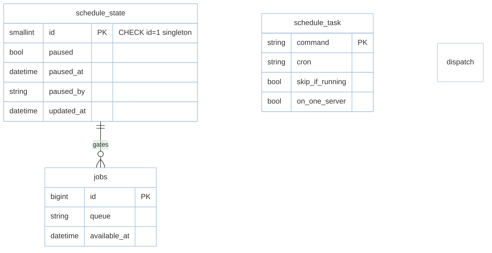

# Feature: Schedule (M4)

> **Module:** `async-workloads` — [overview.md](overview.md) · **FSD:** FS-M4-05 + FS-M4-03 metrics · **FR:** FR-407..410 · **BC:** BC-4
> **Stories:** US-M4-05 (frequencies + pause/resume), US-M4-06 (metrics) · **BDD:** `@schedule`, `@schedule-pauseresume`, `@queue-metrics`

## 1. Feature Overview
- **Brief Description:** `Schedule::command("emails:send").daily().at("08:00").cron("0 * * * *").everyMinute().skipIfStillRunning().onOneServer().register()`, `schedule:list`/`schedule:run` tick loop evaluated each 60s, `onOneServer` acquires distributed `Cache::lock`, `schedule:pause`/`schedule:resume` CLI (idempotent) with `schedule_paused` flag in cache/DB (`schedule_state` singleton row `id=1`) emitting `SchedulePaused`/`Resumed` (domain events `E-01`), deferred `withScheduling` until first `schedule:run` tick, + Cloud metrics `pendingSize`/`delayedSize`/`reservedSize`/`creationTimeOfOldestPendingJob` (RFC3339 `Option<DateTime<Utc>>`, `None` if empty) via `Queue` trait (#8).
- **Role in Module:** Cron surface; `pause` stops dispatch without redeploy.

## 2. User Stories

### US-M4-05 — Scheduling with pause/resume and frequencies
**Sebagai** platform engineer **Saya ingin** `schedule:pause`/`resume` + frequencies **Sehingga** halt without redeploy

**AC:** `email:send` every minute → `schedule:pause` emits `SchedulePaused` and next tick doesn't dispatch; `Paused` → `schedule:resume` emits `ScheduleResumed` and subsequent tick dispatches; `NightlyImport` 80s with `skipIfStillRunning` everyMinute → 60s tick skipped; two nodes `daily` with `onOneServer` → only one acquires distributed `Lock` and dispatches; job running when `pause` issued → running completes, next tick suppressed.

### US-M4-06 — Cloud queue metrics
**Sebagai** platform engineer **Saya ingin** `pendingSize`/… exposed via Queue trait **Sehingga** dashboards without ad-hoc Redis

**AC:** `redis` queue `podcasts` with 42 pending → `pendingSize("redis","podcasts")==42`; oldest at `2026-09-07T10:00:00Z` → same string via `creationTimeOfOldestPendingJob`; empty → `None`; outline covering `pending/delayed/reserved` (10/2/1, 0/5/0).

## 3. Business Flow & Rules

### 3.1 Business Flow
```mermaid
%%{init: {"theme": "base", "themeVariables": {"background": "#ffffff", "mainBkg": "#ffffff", "primaryColor": "#bbdefb", "secondaryColor": "#fff9c4", "tertiaryColor": "#c8e6c9"}}}%%
sequenceDiagram
    actor Op as Platform operator
    participant CLI as cargo rustavel
    participant State as schedule_state/cache flag
    participant Ticker as schedule:run tick loop (60s)
    participant Queue as Queue dispatch
    participant Events as SchedulePaused/Resumed

    Op->>CLI: schedule:pause
    CLI->>State: set schedule_paused=true
    CLI->>Events: dispatch(SchedulePaused)
    Ticker->>State: next tick checks flag -> suppress dispatch
    Op->>CLI: schedule:resume
    CLI->>State: clear flag
    CLI->>Events: dispatch(ScheduleResumed)
    Ticker->>State: next tick -> dispatches email:send
    Ticker->>Queue: onOneServer acquires Lock; skipIfStillRunning checks active jobs
    Queue-->>Ticker: dispatched to workers
    Op->>Queue: pending_size("redis","podcasts")
    Queue-->>Op: 42 + creationTimeOfOldestPendingJob RFC3339
```

### 3.2 Business Rules
- `Running ↔ Paused`; pause idempotent; running mid-job completes not killed.
- `skipIfStillRunning` suppresses overlapping tick; `onOneServer` acquires `Cache::lock` lease expiry guards deadlock (NFR-Rel-03).
- `withScheduling` deferred until first tick (mirrors Laravel 13 #10).
- Metrics `LLEN`/`ZRANGE` (redis) / `SELECT COUNT` (database); typed error when store down not panic (Chaos FS).

## 4. Data Model



- Cache variant: `schedule:paused` flag via `Cache` (alternative to DB row); same semantics.

## 5. Public Interface

```rust
struct Schedule; struct ScheduleBuilder;
impl Schedule {
    fn command(cmd: &'static str) -> ScheduleBuilder; // .daily().at("08:00").cron("0 * * * *").everyMinute().skipIfStillRunning().onOneServer().register()
}
struct ScheduleBuilder { /* chainable modifiers */ }
// CLI
// cargo rustavel schedule:list
// cargo rustavel schedule:run    // tick every 60s; respects paused flag
// cargo rustavel schedule:pause  // emits SchedulePaused
// cargo rustavel schedule:resume // emits ScheduleResumed
impl QueueRegistry {
    async fn pending_size(&self, conn: &str, queue: &str) -> Result<usize, QueueError>;
    async fn delayed_size(&self, conn: &str, queue: &str) -> Result<usize, QueueError>;
    async fn reserved_size(&self, conn: &str, queue: &str) -> Result<usize, QueueError>;
    async fn creation_time_of_oldest_pending_job(&self, conn: &str, queue: &str) -> Result<Option<DateTime<Utc>>, QueueError>;
}
```

## 6. Dependencies
- `Cache::Lock` (distributed), `tokio-cron`/`cron`, `database.md §2 schedule_state` singleton row.

## 7. Limitations
- DST across `daily.at("00:00")` boundary: tick still gated by flag invariant (boundary `D`).
- Two-scheduler `onOneServer` race is resolved by first acquiring `Lock` (NFR-Sca-01 bench handles 100 workers + 1k HTTP concurrency).

## 8. Compliance
- Pause emits exactly one `SchedulePaused` (not duplicated per tick suppression).
- Metrics `creationTimeOfOldestPendingJob` returns `None` not `1970-01-01` on empty queue.

## 9. Implementation Tasks

| ID | Component | Status | Description |
|----|-----------|--------|-------------|
| F-M4-SCH-01 | Schedule builder | Todo | `daily`/`cron`/`everyMinute`/`skipIfStillRunning`/`onOneServer` |
| F-M4-SCH-02 | Ticker | Todo | `schedule:run` 60s tick + `schedule:list` |
| F-M4-SCH-03 | Pause/Resume | Todo | flat cache/DB + `SchedulePaused`/`Resumed` events |
| F-M4-SCH-04 | Metrics | Todo | 4 metrics via `Queue` trait |
| F-M4-SCH-05 | Tests | Todo | pause→resume+skip+onOneServer+mid-exec+metrics |

## 10. Cross-References
- API: [api-events-schedule](../../api/async-workloads/api-events-schedule.md) — schedule section
- Tests: [test-queue-cache](../../testing/async-workloads/test-queue-cache.md) · BDD `@schedule`, `@schedule-pauseresume`, `@queue-metrics` · `testing/stubs/m4-queue-cache-schedule.stub.rs` · `design/capacity.md §3`

## 11. Skill Reference
| Layer | Skill |
|-------|-------|
| QA | `test-planning` — state `Running ↔ Paused` + `skipIfStillRunning` suppression |
| BDD | `test-generation` — `@schedule` pause idempotence outline |
| Contract | `test-generation` — metrics typed assertion (42 pending, RFC3339 oldest) |
| Chaos | `non-functional-testing` — `schedule:pause` during tick `sleep(60s)` window |
