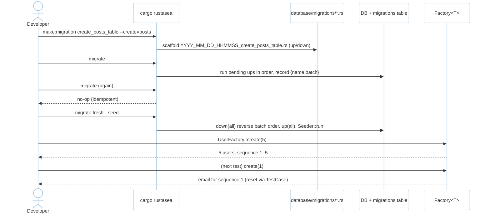
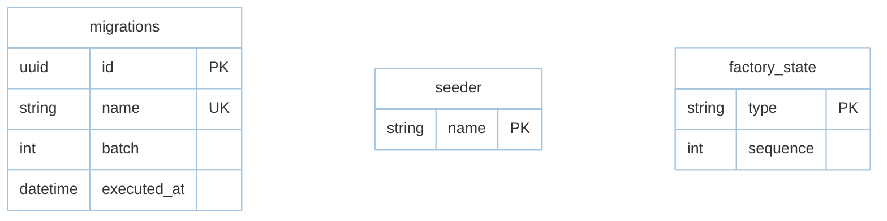

# Feature: Migrations, Seeders & Factories (M2)

> **Module:** `data-orm` — [overview.md](overview.md) · **FSD:** FS-M2-05 · **FR:** FR-208..210 · **BC:** BC-2
> **Stories:** US-M2-05 (make:model + migrate + factory reset) · **BDD:** `@orm`, `@observability-tooling` adjacency

## 1. Feature Overview
- **Brief Description:** `cargo rustasea make:migration create_users_table --create=users` scaffolds `YYYY_MM_DD_HHMMSS_description.rs` with `up`/`down` (`sqlx::migrate!` or `sea-orm-migration` behind `sea-orm` feature), `cargo rustasea migrate`/`migrate:fresh`/`migrate:fresh --seed`/`migrate:status`, idempotent `migrations{name,batch}` table; seeders `Seeder::run(&mut conn)` idempotent (`ON CONFLICT DO NOTHING`); factories `Factory<T>::create(n)` + `definition()→T` + `sequence` + `state(|u| …)` with `Str` sequences reset per test via `TestCase` hook (#20 `Str` factory resets).
- **Role in Module:** Schema authority + test-data factory; reversible `down` unless declared `Irreversible`.

## 2. User Stories

### US-M2-05 — Derived models, migrations, seeders, factories
**Sebagai** Rust developer **Saya ingin** `#[derive(Model)]` + migrations + factories with per-test resets **Sehingga** schema & test data like Laravel

**AC:** `make:model Post -m` → `app/models/post.rs` + migration for `posts` exists → `migrate` → `posts` table exists; `UserFactory::create(5)` in test A then test B `create(1)` restarts at index 1; `Post::query().get()` without migration → `MissingTable("posts")`.

## 3. Business Flow & Rules

### 3.1 Business Flow


### 3.2 Business Rules
- Version order is total; `migrate` re-run is no-op; `migrate:fresh` requires `--force` in non-`testing` env.
- `Irreversible { name }` declared → `down` emits `MigrationError::Irreversible`.
- Factory `Str`/sequence counters reset per test via `TestCase` hook + per-worker `testcontainers` PG random ports.
- Vector column `vector(1536)` created behind `vector` feature; guard `has_extension("vector")` before DDL (see `vector.md`).

## 4. Data Model



- Business tables: `users`, `posts`, `products` (vector example), `jobs` etc. — see `database.md §2`.

## 5. Public Interface

```rust
trait Migration { fn up(&mut self, conn: &mut Conn) -> Result<()>; fn down(&mut self, conn: &mut Conn) -> Result<()>; }
trait Seeder { async fn run(&mut self, conn: &mut Conn) -> Result<()>; }
trait Factory<T> { fn definition() -> T; fn create(n: usize) -> Vec<T>; fn state(f: impl Fn(T)->T) -> Self; }
// CLI
// cargo rustasea make:migration create_users_table --create=users
// cargo rustasea migrate | migrate:fresh [--seed] | migrate:status
enum MigrationError { AlreadyApplied, Irreversible { name: String }, ExtensionMissing { extension: &'static str } }
```

## 6. Dependencies
- `sqlx::migrate!` (primary) / `sea-orm-migration` optional; `tdd.md BC-2` vector blueprint adjacency.

## 7. Limitations
- `cargo rustasea migrate` must run once per test binary via `TestCase` (≈30s `testcontainers` timeout → `TestError::ContainerTimeout`).

## 8. Compliance
- `migrate` idempotence (NFR-Rel-02): hash unchanged on re-run.
- 30s container timeout (NFR-Rel-03 adjacency).

## 9. Implementation Tasks

| ID | Component | Status | Description |
|----|-----------|--------|-------------|
| F-M2-MIG-01 | Migration scaffold | Todo | `make:migration --create` + versioned filename + up/down |
| F-M2-MIG-02 | migrate CLI | Todo | `migrate` idempotent + `migrate:fresh --seed` |
| F-M2-MIG-03 | Seeder/Factory | Todo | `Seeder::run` + `Factory` sequence + `state` + `Str` reset |
| F-M2-MIG-04 | Tests | Todo | migration exists, factory reset, MissingTable |

## 10. Cross-References
- API: [api-query-builder](../../api/data-orm/api-query-builder.md) — migration CLI adjacency
- Tests: [test-orm](../../testing/data-orm/test-orm.md) · `database.md §4 migrations`
- Stub: `testing/stubs/m2-orm.stub.rs`

## 11. Skill Reference
| Layer | Skill |
|-------|-------|
| QA | `test-planning` — state transition on `migrate`↔`migrate:fresh` |
| BDD | `test-generation` `@orm` |
| Migration | `test-generation/rules/migration-test.md` — up→down→up round-trip, idempotence, bulk `migrate:fresh --seed`, irreversible handling |
| Chaos | `non-functional-testing` — `migrate` reentrancy + container startup timeout |

---

> **Archive note (rebrand 2026-09-09):** project renamed from Rustavel to **RustaSea**.
> This document is archived as-is under the historical `Rustavel` name for traceability;
> current branding is RustaSea (`rustasea` crates, `RustaSea` prose).
