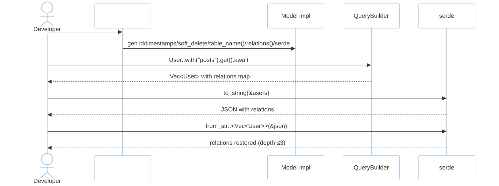
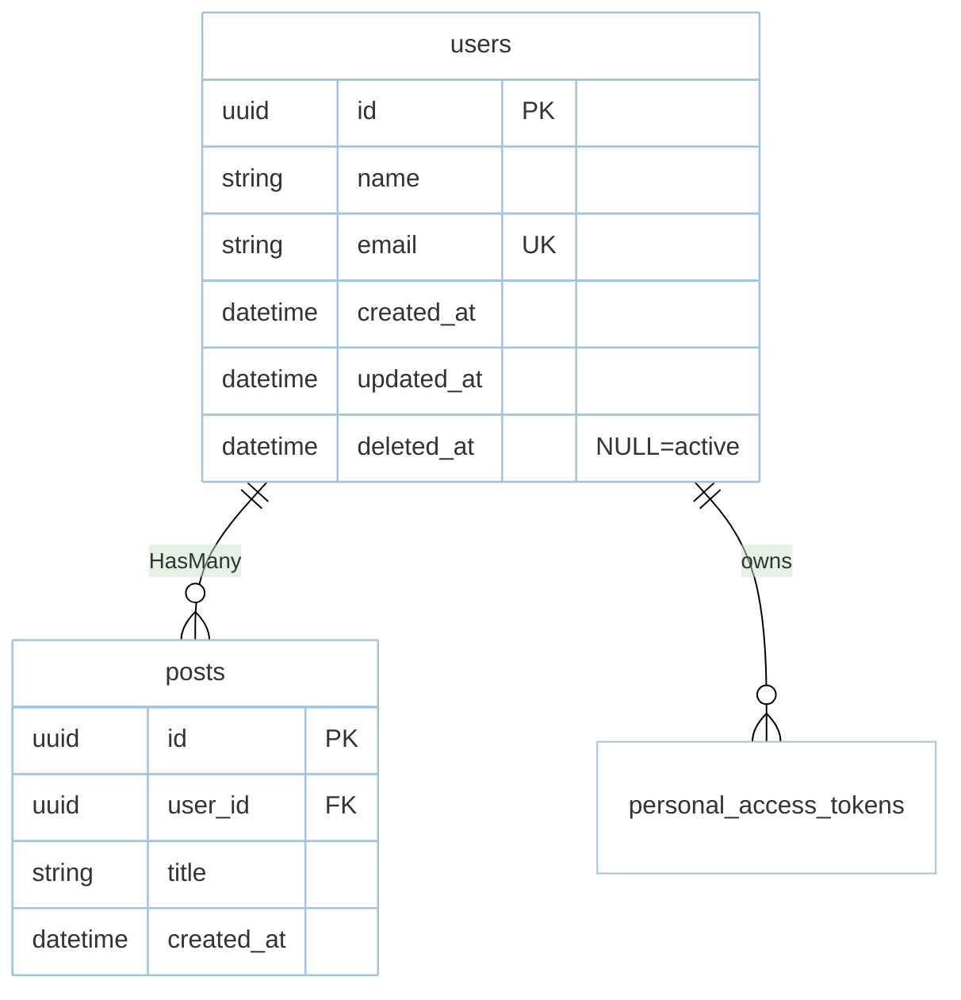

# Feature: Model & Relations (M2)

> **Module:** `data-orm` — [overview.md](overview.md) · **FSD:** FS-M2-02 · **FR:** FR-201..202, FR-206 · **BC:** BC-2
> **Stories:** US-M2-01 (fluent + locks), US-M2-04 (serde round-trip), US-M2-05 (derive/migrations/factories) · **BDD:** `@orm`, `@collection-serialization`

## 1. Feature Overview
- **Brief Description:** `#[derive(Model)]` synthesizes `id: Uuid` + `created_at`/`updated_at`/`deleted_at` (soft delete, partial index `WHERE deleted_at IS NULL`, trigger `set_updated_at()`), table name `snake_plural`, casts, relations `HasMany`/`BelongsTo`/`ManyToMany` with `with("posts")` eager load, scopes, and `serde` round-trip that serializes eager `relations` map and restores on `DeserializeOwned` (#13) — depth-limited to 3 to prevent cycle (`User→Post→User`).
- **Role in Module:** Aggregate root boundary owns `relations` so cross-context serde doesn't leak.
- **Business Value:** Eloquent-style derivation + serde-surviving relations enable collection caching without extra lookups.

## 2. User Stories

### US-M2-01 — Fluent query builder with multi-driver support (model adjacency)
**Sebagai** Rust developer **Saya ingin** `#[derive(Model)]` + fluent + locks **Sehingga** Eloquent-style with compile safety

**AC:** `users` with one row → `first().await == Some(User)`; concurrent `transaction(|tx| select_for_update)` serializes; `firstOrFail()` on missing → `QueryError::NotFound`.

### US-M2-04 — Collection serialization that preserves relations
**Sebagai** Rust developer **Saya ingin** eager relations survive serde **Sehingga** JSON round-trip keeps posts

**AC:** `User::with("posts").get()` with 2 posts → `to_string`→`from_str` → `relation_loaded("posts")` true + 2 posts; empty relation → empty vec not `None`; varied sizes 0/1/5 via `Scenario Outline`.

### US-M2-05 — Derived models, migrations, seeders, factories (derive adjacency)
**AC:** `make:model Post -m` → `app/models/post.rs` with `#[derive(Model)]` + migration for `posts`; `MissingTable` when query without migration; factory reset (see `migrations.md`).

## 3. Business Flow & Rules

### 3.1 Business Flow


### 3.2 Business Rules
- Table `snake_plural` default; `#[table("users")]` overrides.
- `deleted_at` nullable; business entities only (technical `migrations`, `failed_jobs` excluded).
- `serde` depth limit 3 prevents infinite `User↔Post` cycle.
- `ModelError::MissingPrimaryKey` is a compile error via proc-macro.

## 4. Data Model



- `UNIQUE (email) WHERE deleted_at IS NULL`; `idx_users_deleted_at WHERE deleted_at IS NOT NULL`; `set_updated_at()` trigger per business table (see `database.md §2` DDL).
- `personal_access_tokens` scaffolded, guarded behind auth.

## 5. Public Interface

```rust
#[derive(Model)] // proc-macro — generates table_name(), relations(), serde preservation, timestamps/soft-delete
struct User { id: Uuid, name: String, email: String, posts: HasMany<Post> }

trait Model: Serialize + DeserializeOwned + Send + Sync + 'static {
    fn table_name() -> &'static str;
    fn query() -> QueryBuilder<Self> where Self: Sized;
    fn relation_loaded(&self, name: &str) -> bool;
}
struct HasMany<T>(Vec<T>);
enum ModelError { MissingPrimaryKey, RelationNotFound { name: String } }
```

## 6. Dependencies
- Upstream: `foundation` (config), `http-routing` (handler return types).
- External: `serde`, `serde_json`, `uuid`, `sqlx`, `proc-macro2`/`syn`/`quote`.

## 7. Limitations
- Composite keys deferred; `ManyToMany` pivot table naming follows `snake_plural` join convention.

## 8. Compliance
- `serde` round-trip property: `proptest` arbitrary 0..20 relations (TC-PROP-01).

## 9. Implementation Tasks

| ID | Component | Status | Description |
|----|-----------|--------|-------------|
| F-M2-MOD-01 | Derive macro | Todo | `id`/`timestamps`/`soft_delete`/table name/relations/serde |
| F-M2-MOD-02 | HasMany/BelongsTo | Todo | `with("posts")` eager load + `relation_loaded` |
| F-M2-MOD-03 | Soft delete | Todo | `deleted_at` partial index + `find(1)` without `withTrashed` → `None` |
| F-M2-MOD-04 | Tests | Todo | CRUD + serde round-trip (0/1/5) + depth cap |

## 10. Cross-References
- Design: `architecture.md BC-2` · `domain.md BC-2` · `tdd.md BC-2` · `database.md §2 (users/posts)`
- API: [api-query-builder](../../api/data-orm/api-query-builder.md) — Model adjacency
- Tests: [test-orm](../../testing/data-orm/test-orm.md) · BDD `@orm`, `@collection-serialization` · `testing/stubs/m2-orm.stub.rs`

## 11. Skill Reference
| Layer | Skill |
|-------|-------|
| QA | `test-planning` — EP + Property |
| BDD | `test-generation` `@collection-serialization` |
| Contract | `test-generation` — serde snapshot + `cargo insta` |
| Chaos | `non-functional-testing` — concurrent `with("posts")` under load |
