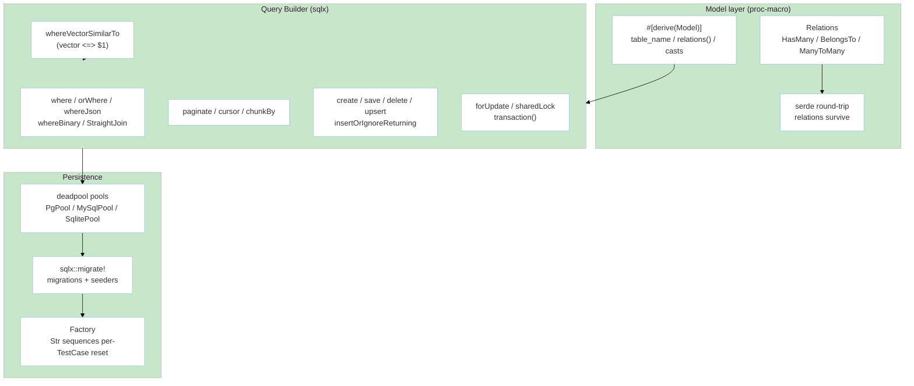

# Module: DataOrm (M2 — ORM & Database)

> **Status:** P8 Final — 2026-09-07 | **Task:** TASK-013
> **Parents:** `requirements/{prd §M2,fsd §3.3,tdd BC-2,bdd-scenarios §2.3,user-stories US-M2-01..06}.md` · `design/{architecture BC-2,domain BC-2,database §2,api-contracts §2}` · `decisions/ADR-002 sqlx/sea-orm, ADR-006 vector` · `modules/manifest.md` · `sprints/sprint-03.md`
> **Crates:** `rustavel-orm` · `rustavel-macros` (`#[derive(Model)]`) · `pgvector` (feature-flag)
> **Milestone:** M2 | **BR:** BR-03 | **FR:** FR-200..210 | **FSD:** FS-M2-01..06 | **BC:** BC-2 | **Stories:** US-M2-01..06

## Header & Navigation

- [Manifest](../manifest.md) · [App README](../../README.md)
- API: [api-query-builder](../../api/data-orm/api-query-builder.md)
- Testing: [testing/data-orm/overview.md](../../testing/data-orm/overview.md)

## 1. Module Introduction

### 1.1 Brief Description
Fluent, type-safe persistence over `sqlx` (primary) + optional `sea-orm` shim, `deadpool` pools for Postgres/MySQL/SQLite, `sqlx::migrate!`, `#[derive(Model)]` with `id`/`created_at`/`updated_at`/`deleted_at` (soft delete), snake_plural table convention, relations (`HasMany`/`BelongsTo`/`ManyToMany`), scopes, `serde` round-trip preserving eager relations (#13), query builder (`where`/`orWhere`/`whereJsonContains`/`whereBinary`/`StraightJoin`/`chunkBy`/`paginate`/`cursor`/`forUpdate`/`sharedLock`/`toSql`/`toRawSql`), strict `upsert` with non-empty `uniqueBy`, migrations/factories/seeders, and `vector` Blueprint type + `whereVectorSimilarTo`.

### 1.2 Position & Role
- **Type:** Persistence kernel. `deadpool` sized via `config.database.pool`.
- **Value:** Eloquent-style ergonomics with compile-time-checked queries. Vector is M2-initial; M6 (`rustavel-search`) completes it.
- **Depends on:** `foundation` (config/Container/AppState) + `http-routing` types for handler returns. **Enables:** M3 (user model), M4 (jobs table), M6 (vector search).

## 2. Feature List

| Feature | Description | Detail |
|---------|-------------|--------|
| Model & Relations | `#[derive(Model)]`, relations, soft-delete, casts, scopes, `Collection` serde round-trip | [model-relations.md](model-relations.md) |
| Query Builder | Fluent `where`/`paginate`/`cursor`/`chunkBy`/`orWhereKey`/`whereBinary`/`StraightJoin`/`insertOrIgnoreReturning`/`saveOrIgnore`/`refreshForUpdate`/`forUpdate`/`sharedLock`/`toSql` | [query-builder.md](query-builder.md) |
| Migrations, Factories & Vector | `sqlx::migrate!`, versioned reversible migrations, seeders, factories, `vector(1536)` + `whereVectorSimilarTo` + `dropVectorIndex`, `Str::toEmbeddings` (M2 initial; M6 full via search) | [migrations.md](migrations.md) · [vector.md](vector.md) |

## 3. High-Level Architecture

- `chunkBy` cursor-paginates (no OFFSET OOM). `upsert` requires non-empty `uniqueBy` or `UpsertError::EmptyUniqueBy` before any round-trip.
- `pgvector` guarded by `vector` feature flag + `has_extension("vector")` in migration (ADR-006).

## 4. Global Dependencies

- **Deps:** `foundation`, `router` (for handler return types), `sqlx`, `deadpool`, `pgvector`, `serde_json`, `uuid`, `chrono`.
- **Schema:** `database.md §2` — `migrations`, `users`/`posts` (HasMany), `jobs`/`failed_jobs`/`job_batches` (queue adjacency), `cache`/`cache_locks`, `products` (vector example). Conventions: UUID PK `gen_random_uuid()`/`Uuid::now_v7()`, `NUMERIC(15,2)` for money, `JSONB` for metadata, FK indexed, partial index on `deleted_at`.

## 5. Skill Reference

| Layer | Skill | Trace |
|-------|-------|-------|
| API | `technical-documentation` Part A | [api-query-builder](../../api/data-orm/api-query-builder.md) |
| QA | `test-planning` | `@orm`, `@query-builder-additions`, `@upsert-delete`, `@collection-serialization`, `@vector-search` |
| BDD | `test-generation` | `bdd-scenarios §2.3` |
| Contract | `test-generation` | `contracts/job-payload` adjacency, `toSql` snapshots |
| Security | `security-audit` | `where("status", payload)` is prepared-statement bound, not string-concatenated |
| Chaos | `non-functional-testing` | concurrent `select_for_update`, `chunkBy` OOM guard, pool lost mid-tx |

## 6. Compliance

- Migration idempotence: `migrate` re-run is no-op; `migrate:fresh` reversible (NFR-Rel-02).
- Collection serialization: serde round-trip preserves `relations` map (FSD FS-M2-02; `proptest` TC-PROP-01).
- Vector dimension mismatch → `VectorDimensionMismatch{expected,actual}` (fixture `testing/fixtures/vector-dim.json`).
