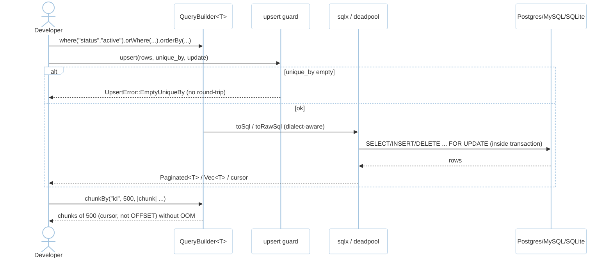
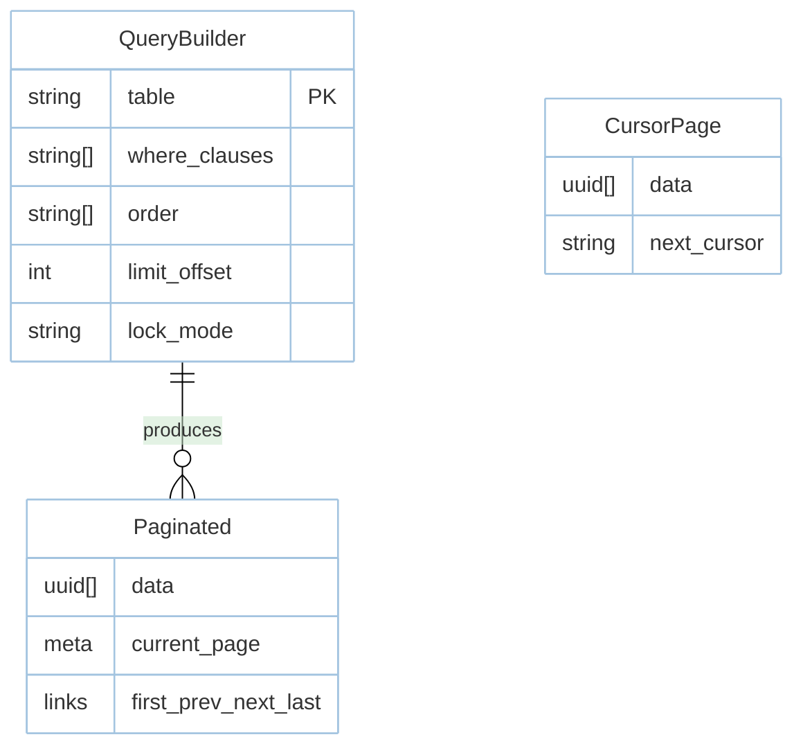

# Feature: Query Builder (M2)

> **Module:** `data-orm` — [overview.md](overview.md) · **FSD:** FS-M2-03 + FS-M2-04 · **FR:** FR-202..205, FR-210 · **BC:** BC-2
> **Stories:** US-M2-01, US-M2-02 (builder additions), US-M2-03 (upsert/delete) · **BDD:** `@query-builder-additions`, `@upsert-delete`, `@orm`

## 1. Feature Overview
- **Brief Description:** Fluent builder `where`/`orWhere`/`whereJsonContains`/`whereJson`/`whereBinary`/`StraightJoin` + `find`/`first`/`firstOrFail` + `create`/`save`/`update`/`delete`/`forceDelete`/`paginate`/`cursor`/`chunkBy`/`orWhereKey`/`orWhereKeyNot`/`insertOrIgnoreReturning`/`saveOrIgnore`/`refreshForUpdate` + `toSql`/`toRawSql`, pessimistic `forUpdate`/`sharedLock` inside `db.transaction(|tx| …)`, `upsert` requiring non-empty `uniqueBy` (`UpsertError::EmptyUniqueBy` before round-trip), MySQL `DELETE … JOIN … ORDER BY/LIMIT`.
- **Role in Module:** Workhorse translating Eloquent builder patterns to `sqlx`-correct SQL across Postgres/MySQL/SQLite.
- **Business Value:** Large-table safety (`chunkBy` cursor-paginated) + strictness (no silent no-ops).

## 2. User Stories

### US-M2-02 — New query builder additions
**Sebagai** Rust developer **Saya ingin** Laravel 13 builder additions **Sehingga** large-table ops without raw SQL

**AC:** 10k rows → `chunkBy("id",500)` yields 20×500; `insertOrIgnoreReturning` ignores conflicting and returns inserted IDs; `whereBinary` on non-binary column → `IncompatibleColumn`.

### US-M2-03 — Strict upsert validation and MySQL DELETE support
**Sebagai** Rust developer **Saya ingin** `upsert` non-empty `uniqueBy` + MySQL DELETE JOIN **Sehingga** silent errors become typed

**AC:** `upsert(rows, unique_by:[], update:["name"])` → `UpsertError::EmptyUniqueBy` before DB; MySQL `DELETE users FROM users JOIN orders` compiles.

### US-M2-01 — Fluent + locks (builder adjacency)
**AC:** `where("status","active").first()==Some(User)`; `transaction` + `select_for_update` serializes contenders.

## 3. Business Flow & Rules

### 3.1 Business Flow


### 3.2 Business Rules
- `chunkBy` paginates by indexed cursor key (no `OFFSET` OOM at 10k).
- `whereVectorSimilarTo` emits `ORDER BY col <=> $1 LIMIT k` (co-located with `vector.md` but builder-owned).
- `paginate` envelope: `Paginated<T> { data, meta{current_page,per_page,total,last_page}, links{first,prev,next,last}}` (shared across modules).
- `upsert` with empty `unique_by` never touches DB; empty `rows` → `Ok({0,0})`; `unique_by` referencing non-unique column → DB error surfaced verbatim.
- MySQL previously-silent ignore cases now throw `DeleteError::Unsupported`.

## 4. Data Model



## 5. Public Interface

```rust
struct QueryBuilder<T> { /* sqlx state */ }
impl<T: Model> QueryBuilder<T> {
    fn where_eq(self, col: &str, val: impl Serialize) -> Self;
    fn or_where(self, col: &str, val: impl Serialize) -> Self;
    fn where_vector_similar_to(self, col: &str, embedding: &[f32], limit: usize) -> Self;
    // + whereJson/whereBinary/chunkBy/orWhereKey/paginate/cursor/forUpdate/sharedLock/toSql/toRawSql ...
    async fn first(self) -> Result<Option<T>, QueryError>;
    async fn first_or_fail(self) -> Result<T, QueryError>; // NotFound
    async fn paginate(self, per_page: usize) -> Result<Paginated<T>, QueryError>;
    async fn chunk_by(self, cursor: &str, size: usize, f: impl Fn(Vec<T>)) -> Result<(), QueryError>;
    async fn upsert(self, rows: Vec<T>, unique_by: &[&str], update: &[&str]) -> Result<UpsertResult, QueryError>;
}
enum QueryError { NotFound, InvalidCursor, UpsertEmptyUniqueBy, VectorDimensionMismatch{ expected:usize, actual:usize }, ExtensionMissing, IncompatibleColumn, Unsupported }
struct UpsertResult { inserted: usize, updated: usize }
```

- `PDO FETCH`-like `FetchMode::Assoc` behind builder (`FR-210` Could).

## 6. Dependencies
- `deadpool`/`sqlx` per-driver `PgPool`/`MySqlPool`/`SqlitePool` (`config.database.driver`).
- `database.md §2–5` DDL + migration guard + HNSW/IVFFLAT index strategies.

## 7. Limitations
- `whereBinary` is Postgres-binary safe; MySQL binary column handling diverges in driver abstraction.
- `toSql`/`toRawSql` snapshot-guarded; dialect differences expected in snapshot per driver.

## 8. Compliance
- `paginate` meta `current_page` off-by-one guard: `chunkBy` 10k→20×500 not 19.
- `upsert` strictness before round-trip (NFR-Usa-02 diagnostics).

## 9. Implementation Tasks

| ID | Component | Status | Description |
|----|-----------|--------|-------------|
| F-M2-BLD-01 | Builder core | Todo | `where`/`orWhere`/`find`/`firstOrFail`/`paginate` |
| F-M2-BLD-02 | Additions | Todo | `chunkBy`/`insertOrIgnoreReturning`/`saveOrIgnore`/`refreshForUpdate`/`StraightJoin` |
| F-M2-BLD-03 | Upsert/Delete | Todo | strict `uniqueBy` + MySQL DELETE JOIN |
| F-M2-BLD-04 | Locks/Tx | Todo | `forUpdate`/`sharedLock` + `db.transaction` |
| F-M2-BLD-05 | Tests | Todo | chunk 10k, upsert empty, MySQL delete join snapshot |

## 10. Cross-References
- API: [api-query-builder](../../api/data-orm/api-query-builder.md)
- Tests: [test-orm](../../testing/data-orm/test-orm.md) · BDD `@query-builder-additions`, `@upsert-delete`
- DB: `database.md §2 (users/posts) §4 migrations`

## 11. Skill Reference
| Layer | Skill |
|-------|-------|
| QA | `test-planning` — BVA on chunk sizes 1/499/500/501/10k |
| BDD | `test-generation` — `@query-builder-additions` |
| Contract | `test-generation` — `toSql` snapshots |
| Chaos | `non-functional-testing` — `select_for_update` contenders |
