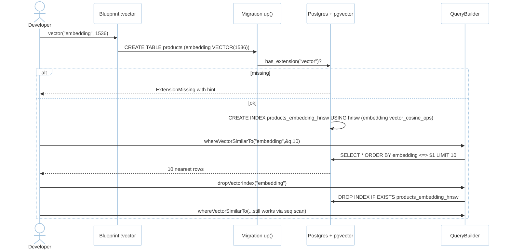
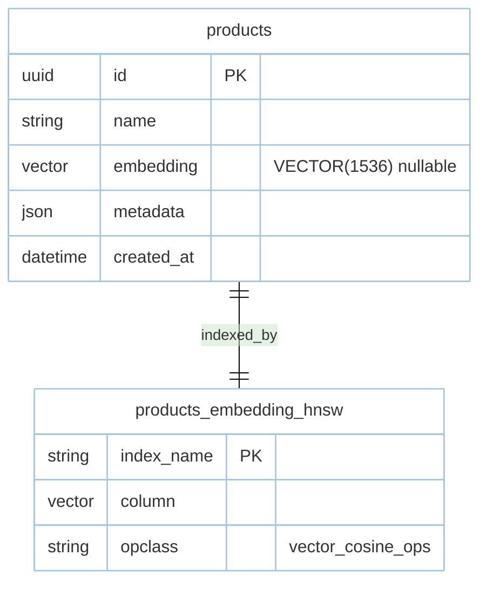

# Feature: Vector Extension (M2 initial; M6 full)

> **Module:** `data-orm` — [overview.md](overview.md) · **FSD:** FS-M2-06 (+ FS-M6-07) · **FR:** FR-207, FR-602 · **BC:** BC-2/BC-6
> **Stories:** US-M2-06 (vector initial), US-M6-07 (M6 full via intelligence-delivery) · **BDD:** `@vector-search`

## 1. Feature Overview
- **Brief Description:** `Blueprint::vector("embedding", 1536)` maps to `pgvector` `VECTOR(1536)` (nullable until `Str::toEmbeddings`/`AiProvider::embeddings` fills), `whereVectorSimilarTo("embedding", &query_vec, limit: k)` emits `ORDER BY embedding <=> $1 LIMIT k` (cosine; `<->` L2 / `<#>` inner product selectable), `dropVectorIndex("embedding")` emits `DROP INDEX` for HNSW/IVFFLAT, strict dimension check (`VectorDimensionMismatch{expected,actual}`), extension guard `has_extension("vector")` → `ExtensionMissing` remediation hint. Feature-flagged `vector`; MariaDB behind `mariadb-vector` flag. M6 extends with `Str::toEmbeddings` provider integration + indexing strategies.
- **Role in Module:** Semantic search primitive enabling `rustasea-search` M6 full.

## 2. User Stories

### US-M2-06 — Vector column and nearest-neighbor search
**Sebagai** AI application builder **Saya ingin** `vector` Blueprint + `whereVectorSimilarTo` over pgvector **Sehingga** semantic search from day one

**AC:** `products` with `vector(1536)` + 100 rows + query `q=[0.1;1536]` → `whereVectorSimilarTo("embedding",&q,limit:10)` returns 10 ordered by cosine; no `CREATE EXTENSION vector` + `vector` feature → `PgVectorError::ExtensionMissing` with hint; `vector(1536)` with query len 768 → `VectorDimensionMismatch{1536,768}`.

## 3. Business Flow & Rules

### 3.1 Business Flow


### 3.2 Business Rules
- `vector(n)` `n` matches embedding provider output (e.g., 1536 `text-embedding-3-small`, 768 smaller models); column nullable until embeddings filled.
- Distance: `whereVectorSimilarTo` cosine (`<=>`); L2 `<->` / IP `<#>` selectable via API param.
- `cargo check -p rustasea-orm --no-default-features` builds without `pgvector`; vector code `#[cfg(feature="vector")]`.
- Post-`dropVectorIndex` query still works via sequential scan until reindexed.
- Dimension mismatch caught at query time mapped to typed error (fixture `testing/fixtures/vector-dim.json`).

## 4. Data Model



- Prefer HNSW (`m=16, ef_construction=64`, pgvector ≥0.5) for small-to-medium churn; IVFFLAT (`lists=100` + `ANALYZE`) for large tables (see `database.md §4`).

## 5. Public Interface

```rust
struct Blueprint;
impl Blueprint { fn vector(name: &str, dim: usize) -> Self; fn drop_vector_index(col: &str) -> Self; }
impl<T: Model> QueryBuilder<T> {
    fn where_vector_similar_to(self, col: &str, embedding: &[f32], limit: usize) -> Self; // cosine
    // alternatives: order_by_distance(col, embedding, kind: Cosine|L2|IP)
}
enum VectorError { ExtensionMissing { extension: &'static str, hint: String }, VectorDimensionMismatch { expected: usize, actual: usize } }
// M6: Str::toEmbeddings("hello", provider:"openai") -> Vec<f32> via AiProvider::embeddings
```

## 6. Dependencies
- Extension guard in migration (see `database.md §4` code); `rustasea-ai` embeddings in M6 (`intelligence-delivery/ai-agents.md`).

## 7. Limitations
- SQLite vector unsupported — feature excluded at compile.
- MariaDB vector operator mapping isolated to driver abstraction.

## 8. Compliance
- Integration test via `testcontainers` piggyback on real Postgres with `pgvector`; `vector-dim.json` drives `TC-M2-21` outline.

## 9. Implementation Tasks

| ID | Component | Status | Description |
|----|-----------|--------|-------------|
| F-M2-VEC-01 | Blueprint | Todo | `vector(n)` + `dropVectorIndex` DDL |
| F-M2-VEC-02 | Builder | Todo | `whereVectorSimilarTo` dispatch + dimension guard |
| F-M2-VEC-03 | Migration guard | Todo | `has_extension("vector")` → typed error |
| F-M2-VEC-04 | Tests | Todo | nearest-10, extension missing, dim mismatch |

## 10. Cross-References
- API: [api-query-builder](../../api/data-orm/api-query-builder.md) — vector section
- Tests: [test-orm](../../testing/data-orm/test-orm.md) · BDD `@vector-search` · `fixtures/vector-dim.json` · `stubs/m2-orm.stub.rs`
- Decisions: [ADR-0004](../../../../../docs/adr/ADR-0004-sqlx-vs-sea-orm.md), [ADR-0008](../../../../../docs/adr/ADR-0008-vector-feature-flag.md)
- M6 full: [intelligence-delivery/ai-agents.md](../intelligence-delivery/ai-agents.md)

## 11. Skill Reference
| Layer | Skill |
|-------|-------|
| Contract | `test-generation` — `vector-dim.json` outline |
| Chaos | `non-functional-testing` — `dropVectorIndex` mid-search seq-scan fallback (TC-M6-25) |

---

> **Archive note (rebrand 2026-09-09):** project renamed from Rustavel to **RustaSea**.
> This document is archived as-is under the historical `Rustavel` name for traceability;
> current branding is RustaSea (`rustasea` crates, `RustaSea` prose).
