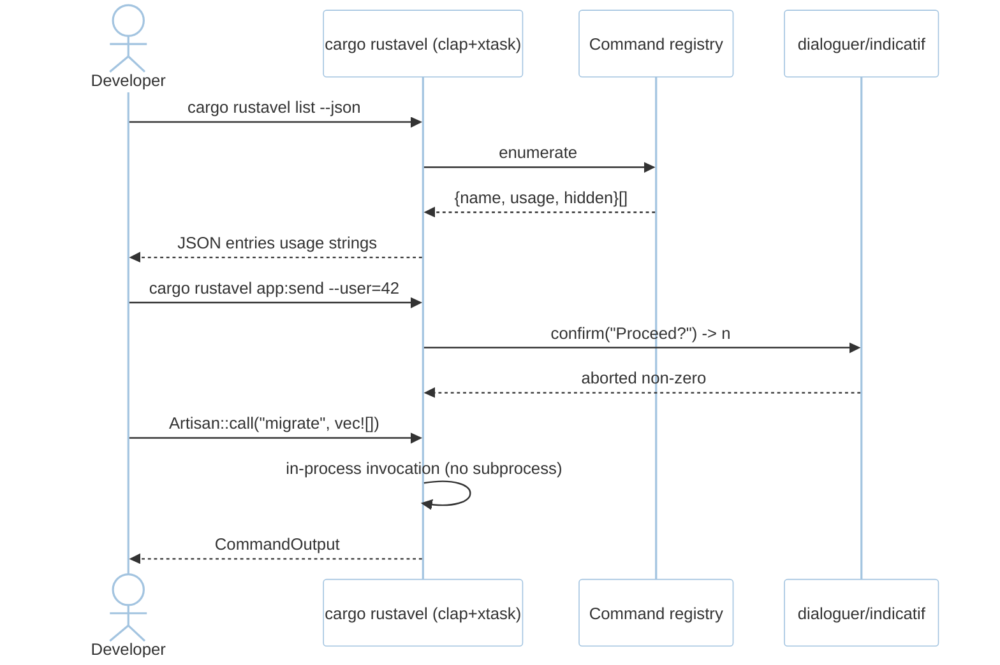
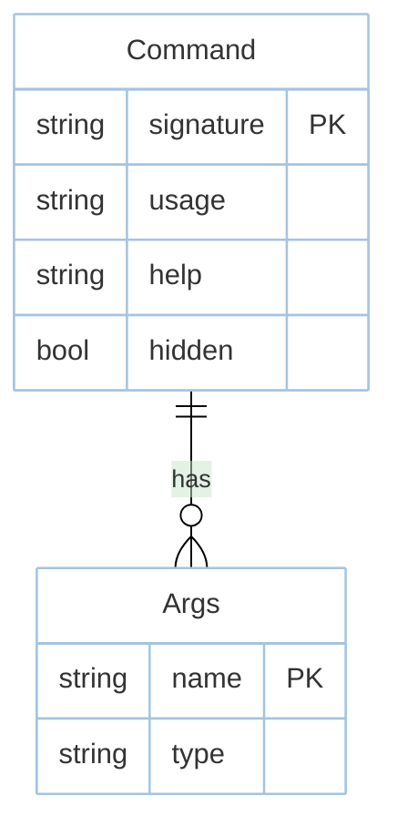

# Feature: CLI (M5)

> **Module:** `developer-platform` — [overview.md](overview.md) · **FSD:** FS-M5-01 · **FR:** FR-500, FR-502..505 · **BC:** BC-5
> **Stories:** US-M5-01 (list + prompts + Artisan::call) · **BDD:** `@cli`, `@attributes`

## 1. Feature Overview
- **Brief Description:** `cargo rustavel <command> [args] [--json]` via `cargo-xtask` (`cargo-xtask` bin) using `clap` derive with typed `Args`/`Flags` per command, `list [--json] [--all]` enumerating commands with `#[usage]`/`#[help]`/`#[hidden]` (hidden omitted without `--all`), prompts `ask`/`secret`/`confirm`/`choice`/`multiSelect` via `dialoguer` and `table`/`progressBar`/`spinner` via `indicatif`/`comfy-table`, `Shutdownable` on long workers (`queue:work`, `schedule:run`), `Artisan::call(command, args)` in-process invocation (no subprocess), unknown command suggests `did you mean?` via `strsim`.
- **Role in Module:** Surface of every framework capability; `list` is the discoverability contract.
- **Business Value:** Artisan-parity CLI; `list --json` machine-readable for agents/tooling.

## 2. User Stories

### US-M5-01 — cargo rustavel CLI with typed commands and prompts
**Sebagai** Rust developer **Saya ingin** `cargo rustavel list` + typed args/flags + prompts + `Artisan::call` **Sehingga** CLI like Artisan

**AC:** `cargo rustavel list --json` contains `make:controller` + `migrate` with `usage`; `#[usage("app:send {user}")]` on `AppSend` shown in help; `confirm("Proceed?")` → `n` aborts with non-zero; `Artisan::call("migrate", vec![])` migrates in-process; `#[hidden]` command omitted without `--all`; `make:controll` → suggests `make:controller` (outline).

## 3. Business Flow & Rules

### 3.1 Business Flow


### 3.2 Business Rules
- Typed `Args`/`Flags` via proc-macro; `ExitCode 0` on success.
- Unknown command suggests `did you mean?` via `strsim` edit distance.
- Long-running workers implement `Shutdownable` so `SIGTERM` drains via foundation shutdown.

## 4. Data Model



## 5. Public Interface

```rust
#[derive(clap::Parser)]
struct Cli { command: String, #[arg(long)] json: bool, #[arg(long)] all: bool }

trait Command: Send + Sync {
    fn signature() -> &'static str;
    async fn handle(&self, args: Args, io: &mut Io) -> ExitCode;
}
struct Artisan;
impl Artisan { fn call(cmd: &str, args: Vec<String>) -> CommandOutput; } // in-process
trait Shutdownable { async fn shutdown(&self, handle: ShutdownHandle) -> Result<()>; }
// Attributes: #[usage("app:send {user}")] #[help("...")] #[hidden]
```

## 6. Dependencies
- `clap` derive, `dialoguer`, `indicatif`, `comfy-table`, `strsim`, `xtask`, `foundation` shutdown handle.

## 7. Limitations
- `secret` echo leakage not allowed (security-audit checks).

## 8. Compliance
- `list --json` stable shape: `{ name, usage, help, hidden }` per entry; `cargo tree`-visible `clap` not `async-openai`.

## 9. Implementation Tasks

| ID | Component | Status | Description |
|----|-----------|--------|-------------|
| F-M5-CLI-01 | CLI registry | Todo | `clap` derive + `list` + `#[usage]`/`#[help]`/`#[hidden]` |
| F-M5-CLI-02 | Prompts | Todo | `ask`/`secret`/`confirm`/`choice`/`multiSelect` + table/spinner |
| F-M5-CLI-03 | Artisan::call | Todo | in-process dispatch + `Shutdownable` |
| F-M5-CLI-04 | Tests | Todo | `list --json` entries, usage help, confirm abort, `did you mean?` |

## 10. Cross-References
- API: [api-cli](../../api/developer-platform/api-cli.md)
- Tests: [test-cli](../../testing/developer-platform/test-cli.md) · BDD `@cli`
- Design: `component-inventory.md` CLI group

## 11. Skill Reference
| Layer | Skill |
|-------|-------|
| QA | `test-planning` `@cli` |
| BDD | `test-generation` — `list --json` contract |
| Security | `security-audit` — hidden enum leak |
| Chaos | `non-functional-testing` — `Shutdownable` drain under `SIGTERM` |
