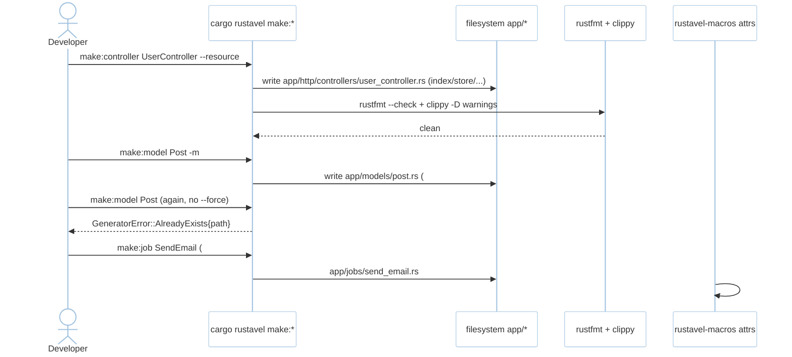
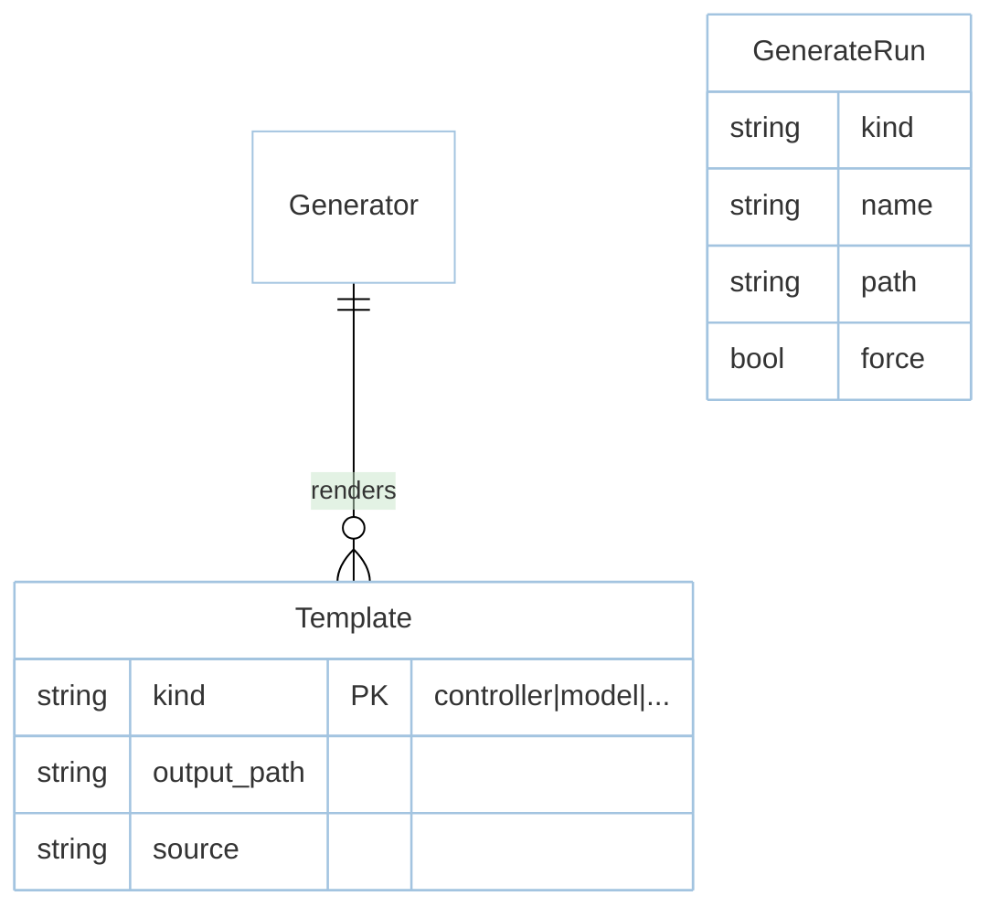

# Feature: Generators `make:*` (M5)

> **Module:** `developer-platform` — [overview.md](overview.md) · **FSD:** FS-M5-02..03 · **FR:** FR-501..502, FR-506, FR-608 adjacency · **BC:** BC-5
> **Stories:** US-M5-02 (make:* rustfmt/clippy clean), US-M5-03 (declarative attributes) · **BDD:** `@generators`, `@attributes`

## 1. Feature Overview
- **Brief Description:** `cargo rustavel make:controller UserController [--resource]` → `app/http/controllers/user_controller.rs` (with `index`/`store`/`show`/`update`/`destroy` if `--resource`), `make:model Post -m` → `app/models/post.rs` with `#[derive(Model)]` + `Factory` + migration if `-m`, `make:provider/provider`/`command`/`job`/`event`/`listener`/`observer`/`test`/`seeder`/`agent`/`tool`, each template `rustfmt`+`clippy -- -D warnings` clean (NFR-Usa-03), `GeneratorError::AlreadyExists { path }` without `--force`, declarative attributes `#[tries(3)]`/`#[backoff(10)]`/`#[timeout(30)]`/`#[failOnTimeout]`/`#[withoutBroadcasting]`/`#[middleware]`/`#[authorize]`/`#[usage]`/`#[help]`/`#[hidden]`/`#[repairToolCalls]` (FSD FS-M5-03).
- **Role in Module:** Scaffolds every domain (BC-0..BC-4, BC-6) — the only writer into `app/` besides the developer.

## 2. User Stories

### US-M5-02 — make:* generators produce rustfmt/clippy-clean code
**Sebagai** Rust developer **Saya ingin** `make:*` for controller/model/.../agent/tool **Sehingga** usable without edits

**AC:** `make:controller UserController` → `app/http/controllers/user_controller.rs` exists and passes `rustfmt --check` + `clippy -- -D warnings`; `make:model Post -m` → `app/models/post.rs` (`#[derive(Model)]`) + `database/migrations/*_create_posts_table.rs`; existing `app/models/post.rs` → second `make:model Post` without `--force` → `AlreadyExists{path}`; outline over `job`/`event`/`listener` → `app/jobs/send_email.rs` etc. exist and lint-clean.

### US-M5-03 — Declarative attributes bundle
**Sebagai** Rust developer **Saya ingin** `#[tries]`/`#[backoff]`/… **Sehingga** retry/policy declared once

**AC:** `#[tries(3)] struct MyJob` always failing on `sync` driver → 3 attempts then `failed_jobs`; job with `#[tries(3)]` and `impl ShouldRetry` returning `false` → attribute wins with compile warning `tries attribute shadows ShouldRetry`.

## 3. Business Flow & Rules

### 3.1 Business Flow


### 3.2 Business Rules
- Generators `L` overall decomposed `make:crud` (controller/model) vs `make:async` (job/event/listener) vs `make:ai` (agent/tool) (FSD FS-M5-02 split note).
- `cargo check` after `make:*` <10s incremental (NFR-Per-04).
- `make:agent`/`make:tool` are M6 generators but hosted in this module's CLI (see `ai-agents.md`).

## 4. Data Model



## 5. Public Interface

```rust
// CLI (per generator)
// cargo rustavel make:controller UserController [--resource]
// cargo rustavel make:model Post -m  [--force]
// + make:provider/command/job/event/listener/observer/test/seeder/agent/tool
enum GeneratorError { AlreadyExists { path: String } }
// Attributes expanded from rustavel-macros
// #[tries(3)] #[backoff(10)] #[timeout(30)] #[failOnTimeout] #[withoutBroadcasting]
// #[middleware("auth:jwt")] #[authorize("update", User)] #[usage("...")] #[help("...")] #[hidden] #[repairToolCalls]
```

## 6. Dependencies
- `xtask` templates (designed in `component-inventory.md`), `syn/quote`, `rustfmt`/`clippy` toolchain.

## 7. Limitations
- `L` size → split into crud/async/ai task groups per FSD FS-M5-02.

## 8. Compliance
- Generated output is not branched on driver at call-site — `sqlx` pool dialect emits correct SQL (M2), but scaffold is dialect-agnostic.

## 9. Implementation Tasks

| ID | Component | Status | Description |
|----|-----------|--------|-------------|
| F-M5-GEN-01 | make:crud | Todo | controller/model (+ `-m` migration) + `--force` |
| F-M5-GEN-02 | make:async | Todo | job/event/listener/observer/test/seeder |
| F-M5-GEN-03 | make:ai | Todo | agent/tool (M6 adjacency) |
| F-M5-GEN-04 | Attributes | Todo | `#[tries]`/`#[backoff]`/`#[timeout]`/… attrs |
| F-M5-GEN-05 | Lint | Todo | `rustfmt`+`clippy -D warnings` gate (C-04) |
| F-M5-GEN-06 | Tests | Todo | controller lint, model -m both artifacts, AlreadyExists, outline |

## 10. Cross-References
- API: [api-cli](../../api/developer-platform/api-cli.md) — generators table
- Tests: [test-cli](../../testing/developer-platform/test-cli.md) · BDD `@generators`, `@attributes` · `testing/stubs/m5-cli-testing.stub.rs`

## 11. Skill Reference
| Layer | Skill |
|-------|-------|
| QA | `test-planning` — contract on generated files (snapshot `toSql` adjacency) |
| BDD | `test-generation` — `make:*` outline matrix |
| Contract | `test-generation` — `ModelInspector` snapshot adjacency |
| Chaos | `non-functional-testing` — `cargo check` <10s incremental |
