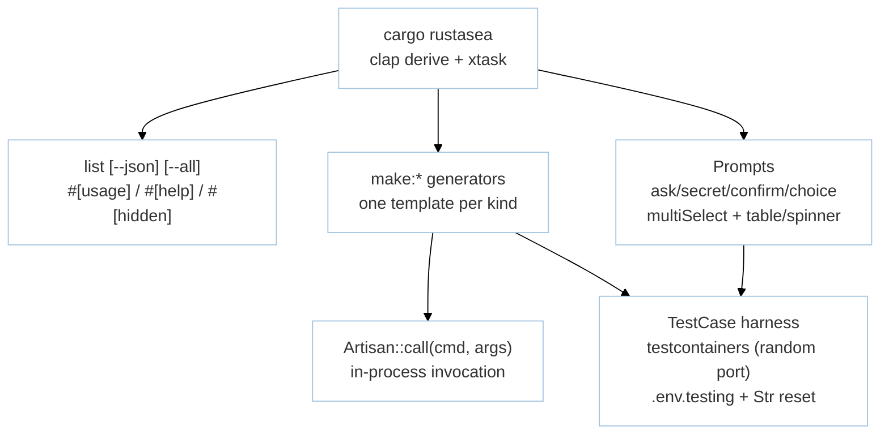

# Module: DeveloperPlatform (M5 — DX, CLI & Testing)

> **Status:** P8 Final — 2026-09-07 | **Task:** TASK-013
> **Parents:** `requirements/{prd §M5,fsd §3.6,tdd BC-5,bdd-scenarios §2.6,user-stories US-M5-01..04}.md` · `design/{architecture BC-5,component-inventory.md,api-contracts §4}` · `modules/manifest.md` · `sprints/sprint-06.md`
> **Crates:** `rustasea-cli` · `rustasea-macros` · `rustasea-testing` · `xtask` (`cargo-xtask` bin)
> **Milestone:** M5 | **BR:** BR-06 | **FR:** FR-500..509 | **FSD:** FS-M5-01..04 | **BC:** BC-5 | **Stories:** US-M5-01..04

## Header & Navigation

- [Manifest](../manifest.md) · [App README](../../README.md)
- API: [api-cli](../../api/developer-platform/api-cli.md)
- Testing: [testing/developer-platform/overview.md](../../testing/developer-platform/overview.md)

## 1. Module Introduction

### 1.1 Brief Description
The DX loop: `cargo rustasea` CLI via `clap`  derive + `cargo xtask` with `list` command (`#[usage]`/`#[help]`/`#[hidden]`), `make:*` generators (`controller`/`model`/`provider`/`command`/`job`/`event`/`listener`/`observer`/`test`/`seeder`/`agent`/`tool`) producing `rustfmt`+`clippy -D warnings` clean code, interactive prompts (`ask`/`secret`/`confirm`/`choice`/`multiSelect`) + output helpers (`table`/`progressBar`/`spinner`) via `dialoguer`/`indicatif`/`comfy-table`, `Shutdownable` on long workers, programmatic `Artisan::call(cmd, args)` in-process invocation, declarative `#[middleware]`/`#[authorize]`/`#[tries]`/`#[backoff]`/`#[timeout]`/`#[failOnTimeout]`/`#[withoutBroadcasting]` bundle, and `TestCase` harness (per-package `.env.testing` + isolated DB/cache via `testcontainers` + `sqlx::test`, teardown after suite, `Str` factory reset, paginator `bootstrap-3` view).

### 1.2 Position & Role
- **Type:** DX + test infrastructure. Scaffolds every domain (BC-0..BC-4, BC-6).
- **Value:** `cargo rustasea list --json` is machine-readable; `make:*` output is immediately `cargo check`-passing; `TestCase` gives deterministic parallelism (random ports, no `Str` leak).
- **Depends on:** all BC-0..BC-4, BC-6 (scaffolds). **Enables:** iterative development of every other module via generators/harness.

## 2. Feature List

| Feature | Description | Detail |
|---------|-------------|--------|
| CLI | `cargo rustasea list [--json] [--all]`, typed `Args`/`Flags`, prompts `ask`/`secret`/`confirm`/`choice`/`multiSelect`, helpers `table`/`progressBar`/`spinner`, `Shutdownable` | [cli.md](cli.md) |
| Generators | `make:controller`/`model`/`provider`/`command`/`job`/`event`/`listener`/`observer`/`test`/`seeder`/`agent`/`tool`, `--resource`, `-m`, `AlreadyExists`/`--force`, `rustfmt`/`clippy` clean | [generators.md](generators.md) |
| Testing Harness | `TestCase`, `testcontainers` per-worker PG/Redis, `.env.testing` overlay, `Str` reset, `Artisan::call`, paginator views | [testing-harness.md](testing-harness.md) |

## 3. High-Level Architecture

- Generators split by group: `make:crud` (controller/model) vs `make:async` (job/event/listener) vs `make:ai` (agent/tool) per FSD FS-M5-02 XL note.
- Unknown command suggests `did you mean?` via `strsim`.

## 4. Global Dependencies

- **Deps:** `clap` derive, `dialoguer`, `indicatif`, `comfy-table`, `strsim`, `syn/quote/proc-macro2`, `testcontainers`, `config`+`dotenvy`, `rustfmt`/`clippy` (toolchain), `cargo tree` for incremental-adoption CI.

## 5. Skill Reference

| Layer | Skill | Trace |
|-------|-------|-------|
| API | `technical-documentation` Part A | [api-cli](../../api/developer-platform/api-cli.md) |
| QA | `test-planning` | `@cli`, `@generators`, `@testing`, `@attributes` |
| BDD | `test-generation` | `bdd-scenarios §2.6` (`@cli`, `@generators`, `@attributes`, `@testing`) |
| Contract | `test-generation` | `ModelInspector` `toSql` snapshots adjacency, paginator views |
| Security | `security-audit` | hidden command enumeration, `secret` echo leakage |
| Chaos | `non-functional-testing` | `cargo check` after `make:*` <10s incremental (NFR-Per-04) — timeout path |

## 6. Compliance

- `cargo check` after `make:*` <10s incremental (NFR-Per-04).
- Generated code `rustfmt` + `clippy -- -D warnings` clean (C-04).
- `Str` factories reset per test (FSD FS-M5-04; NFR-Rel-03).

---

> **Archive note (rebrand 2026-09-09):** project renamed from Rustavel to **RustaSea**.
> This document is archived as-is under the historical `Rustavel` name for traceability;
> current branding is RustaSea (`rustasea` crates, `RustaSea` prose).
