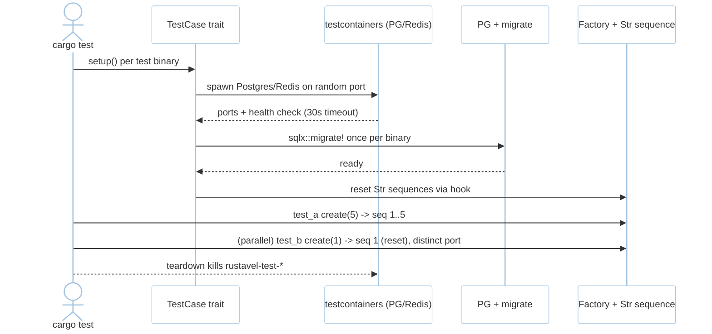
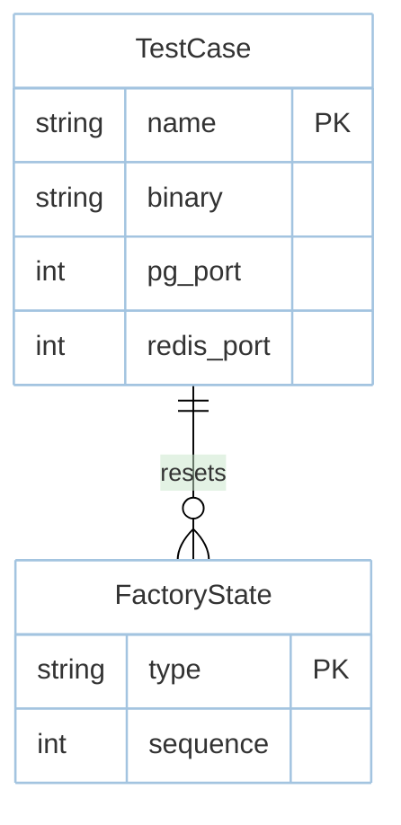

# Feature: Testing Harness (M5)

> **Module:** `developer-platform` — [overview.md](overview.md) · **FSD:** FS-M5-04 · **FR:** FR-507..509 · **BC:** BC-5
> **Stories:** US-M5-04 (TestCase + testcontainers + Str reset) · **BDD:** `@testing`, `@observability-tooling` adjacency

## 1. Feature Overview
- **Brief Description:** `trait TestCase { fn setup(&mut self) -> AppState }` provisioning isolated Postgres (random port via `testcontainers` `Postgres` image) + Redis (`deadpool-redis`) per test binary, `sqlx::test` + `migrate` once per binary with 30s container timeout (`TestError::ContainerTimeout`), per-package `.env.testing` overlay (`dotenvy` + process env > file), `Str` factory `Factory::create(n)` + `Factory::state` + `sequence: AtomicU64` + `definition()→T` reset per test via `TestCase` hook (so `user1@example.com` not `user11`), teardown kills `rustavel-test-*` containers, paginator `bootstrap-3` view for `paginate(15)` HTML, isolation verified with parallel `--test-threads` distinct random ports.
- **Role in Module:** Deterministic `cargo test` under parallelism; executable trace for every story.
- **Business Value:** No `Str` leak between tests; per-worker PG ports via `testcontainers`.

## 2. User Stories

### US-M5-04 — Test harness with isolation and factory resets
**Sebagai** Rust developer **Saya ingin** `TestCase` + `testcontainers` + `Str` reset **Sehingga** `cargo test` deterministic in parallel

**AC:** Tests `test_a`/`test_b` both `impl TestCase` with `cargo test -- --test-threads=2` → distinct random PG ports (no collision); `Factory::sequence` 10 in `test_a` then `test_b create(1)` → `user1@example.com` not `user11`; `cargo test` completes → no `rustavel-test-*` container remains running (teardown); paginator `bootstrap-3` via `paginate(15)` produces bootstrap-3 HTML.

## 3. Business Flow & Rules

### 3.1 Business Flow


### 3.2 Business Rules
- Per-package `.env.testing` overlay `dotenvy` + process env > file.
- Factory traits: `states` + `sequences` + `state("admin")` sub-factory all isolated per test via hook.
- `testcontainers` random ports per binary; port collision handled by allocation; teardown guaranteed.

## 4. Data Model



## 5. Public Interface

```rust
trait TestCase: Send {
    fn setup(&mut self) -> AppState; // isolated PG on random port via testcontainers
}
// Env: per-package .env.testing overlay
// Factory: Factory::create(n), definition()->T, sequence: AtomicU64, state("admin")
// Teardown: kills containers named rustavel-test-*
// Artisan::call adjacency: Artisan::call("migrate", vec![]) in-process, used by TestCase
enum TestError { ContainerTimeout, PaginatorMissing }
```

## 6. Dependencies
- `testcontainers` (PG + Redis health checks), `sqlx::test`, `config`+`dotenvy`.

## 7. Limitations
- Container startup timeout 30s → `TestError::ContainerTimeout`; nightly expands to all drivers `postgres|mysql|sqlite` + `pgvector`.

## 8. Compliance
- Paginator `bootstrap-3` HTML snapshot-guarded (`cargo insta`).

## 9. Implementation Tasks

| ID | Component | Status | Description |
|----|-----------|--------|-------------|
| F-M5-HARN-01 | TestCase | Todo | `testcontainers` random port + migrate once per binary + teardown |
| F-M5-HARN-02 | Str reset | Todo | `Factory` sequence reset via hook + `state` sub-factory |
| F-M5-HARN-03 | Paginator | Todo | `bootstrap-3` view for `paginate(15)` |
| F-M5-HARN-04 | Tests | Todo | distinct ports parallel, Str reset, teardown clean |

## 10. Cross-References
- Tests: [test-cli](../../testing/developer-platform/test-cli.md) · BDD `@testing` · `testing/stubs/harness.stub.rs`
- M2-M4: `data-orm/vector.md` `Str::toEmbeddings` adjacency

## 11. Skill Reference
| Layer | Skill |
|-------|-------|
| QA | `test-planning` — state transition harness smoke ( §1.2 rows @testing) |
| Chaos | `non-functional-testing` — container pause/restart mid-suite |
