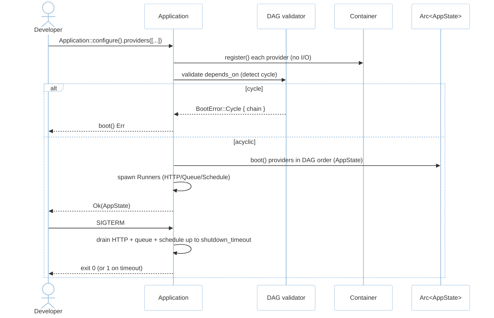
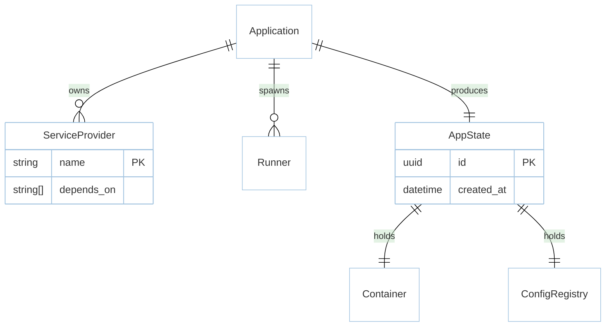

# Feature: Boot & Provider Lifecycle (M0)

> **Module:** `foundation` — [overview.md](overview.md) · **FSD:** FS-M0-01/03/04 · **FR:** FR-000, FR-003, FR-008, FR-001/007 adjacency · **BC:** BC-0
> **Stories:** US-M0-01 (boot + provider ordering + graceful drain) · **BDD:** `@foundation`

## 1. Feature Overview
- **Brief Description:** `Application::configure()` collects `Vec<Box<dyn ServiceProvider>>`, validates DAG via `depends_on()`, runs `register(&mut Container)` (no I/O) then `boot(&AppState)` (ordered), spawns `Runner`s (HTTP/Queue/Schedule), and exposes `Arc<AppState>` via `OnceLock` + `axum::extract::State`. `SIGTERM`/`SIGINT` drains in-flight work up to `shutdown_timeout`.
- **Role in Module:** Entry point; all other modules register their providers through it.
- **Business Value:** Predictable boot order; cycle errors are typed `BootError::Cycle { chain }`; config parse errors carry `file`+`line`; cold boot <2s (NFR-Per-01).

## 2. User Stories

### US-M0-01 — Boot the application with providers and graceful shutdown

**Sebagai** Rust backend team lead
**Saya ingin** a bootable skeleton with typed config and provider lifecycle
**Sehingga** `cargo run` boots <2s and shuts down without dropping work

**Acceptance Criteria:**
- Given `bootstrap/app.rs` registers provider A and B where B `depends_on=[A]`, When `Application::configure().boot().await` runs, Then A boots before B and `AppState` is available.
- Given `config/app.toml` `port=3000` and `.env` `APP_PORT=4000`, When reading `AppConfig::port`, Then `4000`.
- Given `config/database.toml` invalid TOML on line 7, When booting, Then `ConfigError::Parse { file: "config/database.toml", line: 7 }`.
- Given provider A depends on B and B on A, When `boot()` runs, Then `BootError::Cycle { chain: ["A","B"] }`.
- Given `GET /slow` 3s handler and `SIGTERM` during it (`shutdown_timeout=10s`), Then `200` and exit `0`.

## 3. Business Flow & Rules

### 3.1 Business Flow


### 3.2 Business Rules
- `register` must not perform I/O or cross-provider reads.
- Duplicate provider name → last wins with warning (FSD FS-M0-01 edge).
- Missing `config/app.toml` falls back to defaults without crash.
- `withScheduling` deferred until first `schedule:run` tick (FS-M4-05).

## 4. Data Model



- `Application { providers, runners, config }` → `AppState { app, config, container, db, cache, queue }` (`Arc<AppState>`).
- Technical table `migrations` is scaffolded here but populated in M2.

## 5. Public Interface

```rust
trait ServiceProvider: Send + Sync {
    fn name(&self) -> &'static str;
    fn depends_on(&self) -> &'static [&'static str] { &[] }
    fn register(&self, c: &mut Container) -> Result<()>;
    fn boot(&self, state: &AppState) -> Result<()>;
}
trait Runner: Send + Sync { async fn run(&self, state: AppState, shutdown: Shutdown) -> Result<()>; }
struct Application;
impl Application {
    fn configure() -> AppBuilder;          // collects providers
    async fn boot(self) -> Result<AppState>;
    fn shutdown(&self) -> ShutdownHandle;
}
enum BootError { Cycle { chain: Vec<String> }, MissingDependency { provider: String } }
```

Errors: `BootError::Cycle` / `MissingDependency`, `ConfigError::Parse { file, line, source }` (see `config.md`).

## 6. Dependencies
- **Upstream:** none (root). `tokio` 1.x single runtime (ADR-003).
- **Downstream:** every other module registers here.
- **External:** `config` + `dotenvy`, `serde`, `thiserror`, `axum::extract::State`.

## 7. Limitations
- `boot()` is not retryable without `configure()` again after `Failed` state.
- `shutdown_timeout` default 10s; long requests exceeding it exit 1 after logging outstanding count.

## 8. Compliance & Audit
`cargo rustasea new demo` → `demo/bootstrap/app.rs` exists and `cargo check` passes (FR-005). `cargo check -p rustasea-foundation` has no `sqlx`/`async-openai` (NFR-Sca-02).

## 9. UI Layout
CLI scaffold output tree (see `architecture.md §2` skeleton). No browser UI.

## 10. Implementation Tasks

| Task ID | Component | Status | Description |
|---------|-----------|--------|-------------|
| F-M0-BOOT-01 | AppBuilder | Todo | `Application::configure()` + provider vec |
| F-M0-BOOT-02 | DAG validator | Todo | `depends_on` cycle detection + `BootError::Cycle` |
| F-M0-BOOT-03 | Runner | Todo | `Runner` trait + HTTP/Queue/Schedule runners |
| F-M0-BOOT-04 | Shutdown | Todo | `tokio::signal` + drain with timeout |
| F-M0-BOOT-05 | Scaffold | Todo | `cargo rustasea new <app>` producing `bootstrap/app.rs` etc. |
| F-M0-BOOT-06 | Tests | Todo | DAG + shutdown drain + scaffold harness |

## 11. Cross-References
- Design: `design/architecture.md §2-3` · `design/domain.md BC-0` · `tdd.md BC-0` · `api-contracts.md §1`
- API: [api-bootstrap](../../api/foundation/api-bootstrap.md) — trait contracts
- Tests: [testing/foundation/test-boot-container.md](../../testing/foundation/test-boot-container.md) · BDD `@foundation` · `testing/stubs/m0-foundation.stub.rs`
- Capacity: `design/capacity.md S-08` (shutdown)
- Decisions: ADR-003 tokio stack, ADR-004 workspace crates, ADR-005 AppState over facades

## 12. Skill Reference
| Layer | Skill | Rule |
|-------|-------|------|
| API | `technical-documentation` Part A | `api-bootstrap` OpenAPI trait-contract note |
| QA | `test-planning` | `qa-design §1.2` boot rows |
| BDD | `test-generation` | `@foundation` Feature: Application boot… |
| Contract | `test-generation` | `cargo rustasea new` scaffold probe |
| Security | `security-audit` | config file error leaks no secret |
| Chaos | `non-functional-testing` | drain timeout expiry path |

---

> **Archive note (rebrand 2026-09-09):** project renamed from Rustavel to **RustaSea**.
> This document is archived as-is under the historical `Rustavel` name for traceability;
> current branding is RustaSea (`rustasea` crates, `RustaSea` prose).
