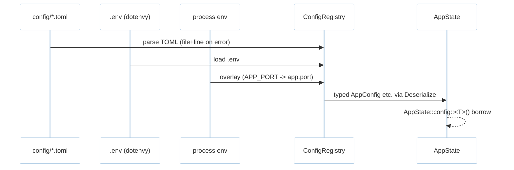
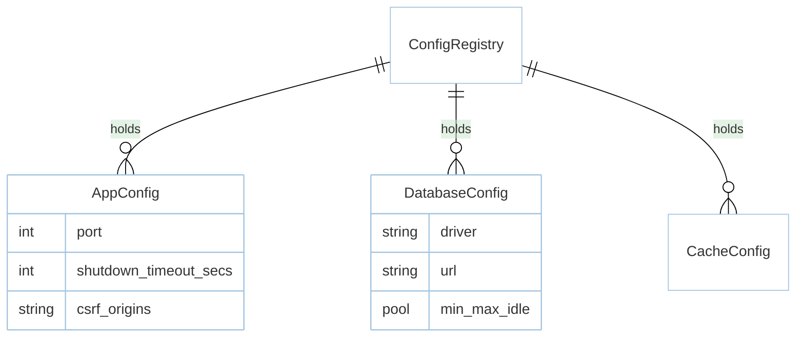

# Feature: Config & Shutdown (M0)

> **Module:** `foundation` — [overview.md](overview.md) · **FSD:** FS-M0-03/04 · **FR:** FR-001, FR-004, FR-007 · **BC:** BC-0
> **Stories:** US-M0-01 (layered config + diagnostics + drain) · **BDD:** `@foundation`, `@observability-tooling`

## 1. Feature Overview
- **Brief Description:** Layered config merge `defaults < config/*.toml < .env < env` via `config`+`dotenvy`, typed `Deserialize` structs (`AppConfig`, `DatabaseConfig`, `CacheConfig`, `QueueConfig`, `AuthConfig`) via `AppState::config::<T>()`; parse errors `ConfigError::Parse { file, line, source }`. Graceful shutdown drains HTTP+queue+schedule up to `shutdown_timeout_secs`.
- **Role in Module:** Configuration source-of-truth for all modules (DB pools, cache, queue, auth).
- **Business Value:** No panics on bad TOML; operable drain with exit `1` + log on timeout.

## 2. User Stories

### US-M0-01 — Layered config & graceful drain (subset)

**Sebagai** Rust backend team lead
**Saya ingin** layered config with typed diagnostics and drain
**Sehingga** invalid config is actionable and shutdown is clean

**Acceptance Criteria:**
- Given `config/app.toml` `port=3000` vs `.env` `APP_PORT=4000`, Then `4000` wins.
- Given `config/database.toml` invalid on line 7, Then `ConfigError::Parse { file: "config/database.toml", line: 7 }`.
- Given `GET /slow` 3s + `SIGTERM` + `shutdown_timeout=10s`, Then `200` and exit `0`; timeout expiry → exit `1` with log.

## 3. Business Flow & Rules

### 3.1 Business Flow


### 3.2 Business Rules
- Missing file → defaults remain, no crash.
- `APP_PORT` mapped `APP_PORT → app.port` (env key mapping).
- Invalid TOML surfaces with file+line, not panic.
- Signal `SIGTERM`/`SIGINT` via `tokio::signal`; draining stops accepting new connections first.

## 4. Data Model



## 5. Public Interface

```rust
struct ConfigRegistry;
impl ConfigRegistry {
    fn get<T: DeserializeOwned>(&self) -> &T; // AppState::config::<T>()
}
enum ConfigError { Parse { file: String, line: usize, source: String }, Missing { key: String } }
struct ShutdownHandle;
impl ShutdownHandle { async fn drain(self, timeout: Duration) -> Result<(), ShutdownTimeout>; }
```

## 6. Dependencies
- Upstream: `boot.md` provides `AppState` holder.
- External: `config` crate, `dotenvy`, `serde`.

## 7. Limitations
- Env overlay does not deep-merge maps beyond one level (known; doc’d per crate).
- `shutdown_timeout` default 10s; override via `config.app.shutdown_timeout_secs`.

## 8. Compliance & Audit
- Every `ConfigError::Parse` carries `file`+`line` (NFR-Usa-02 diagnostics).
- `cargo check` incremental after config change is <10s incremental (shares NFR-Per-04).

## 9. Implementation Tasks

| ID | Component | Status | Description |
|----|-----------|--------|-------------|
| F-M0-CFG-01 | ConfigRegistry | Todo | layered merge + Deserialize |
| F-M0-CFG-02 | Diagnostics | Todo | `ConfigError::Parse { file,line,source }` |
| F-M0-CFG-03 | Shutdown | Todo | `tokio::signal` drain + timeout |
| F-M0-CFG-04 | Tests | Todo | layered precedence + invalid TOML line + drain |

## 10. Cross-References
- API: [api-bootstrap](../../api/foundation/api-bootstrap.md)
- Tests: [test-boot-container](../../testing/foundation/test-boot-container.md)
- Docs: `architecture.md §5`, `tdd.md BC-0`, `database.md §1`

## 11. Skill Reference
| Layer | Skill |
|-------|-------|
| QA | `test-planning` — boundary `D` (date/time) |
| Chaos | `non-functional-testing` — config file deleted mid-boot |

---

> **Archive note (rebrand 2026-09-09):** project renamed from Rustavel to **RustaSea**.
> This document is archived as-is under the historical `Rustavel` name for traceability;
> current branding is RustaSea (`rustasea` crates, `RustaSea` prose).
