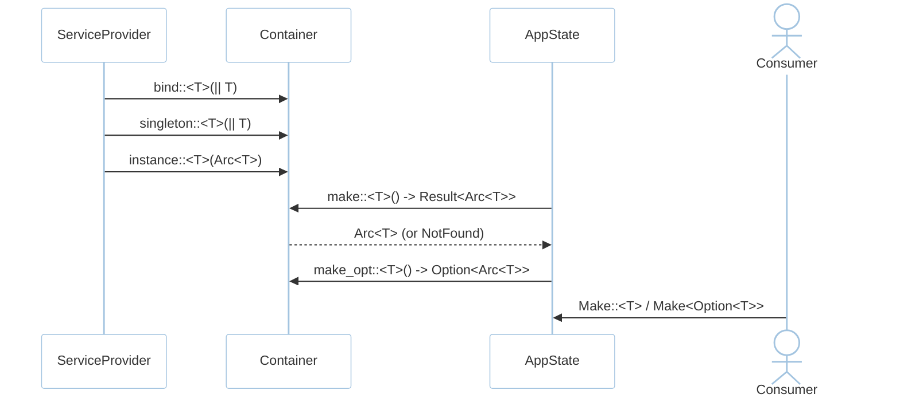
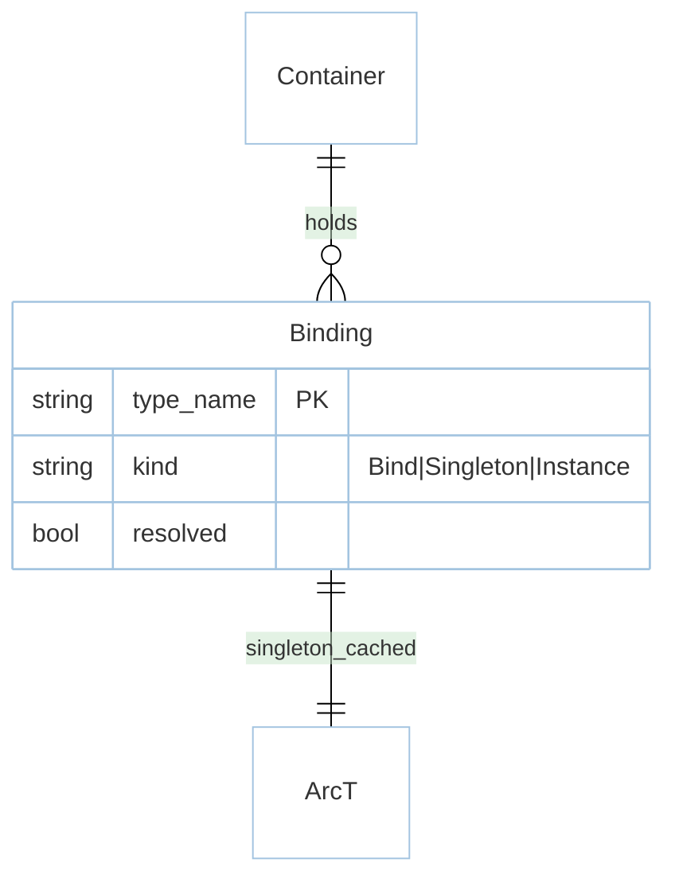

# Feature: Container (M0)

> **Module:** `foundation` — [overview.md](overview.md) · **FSD:** FS-M0-02 · **FR:** FR-002, FR-006, FR-008 · **BC:** BC-0
> **Stories:** US-M0-02 (Bind/Singleton/Instance/Make + Manager::extend) · **BDD:** `@container`

## 1. Feature Overview
- **Brief Description:** Typed service registry: `Bind` (transient factory), `Singleton` (once, `Arc<T>` `ptr_eq`-stable), `Instance` (value), `Make<T>`/`Make<Option<T>>` resolution. `Manager::extend` closures are bound to the manager instance so `self` resolves correctly inside driver extensions (#20).
- **Role in Module:** Central `Container` held in `AppState`; providers register bindings in `register(&mut Container)`.
- **Business Value:** No `static mut` facades; nullable-class defaults model as `Option<T>` (mirrors Laravel 13 `Container::call`).

## 2. User Stories

### US-M0-02 — Resolve services from a typed container

**Sebagai** Rust developer
**Saya ingin** `Bind`/`Singleton`/`Instance`/`Make<T>` typed semantics
**Sehingga** shared state is safe without global mutable state

**Acceptance Criteria:**
- Given `Singleton::<Counter>` starting 0, When `Make::<Counter>` twice, Then `Arc::ptr_eq`.
- Given no binding for `Mailer`, When `Make::<Option<Mailer>>`, Then `None` not auto-constructed.
- Given no binding for `PaymentGateway`, When `Make::<PaymentGateway>`, Then `NotFound { type_name: "PaymentGateway" }`.
- Given `Manager::extend(|mgr, cfg| MyStore::new(mgr.prefix()))`, When resolved, Then closure sees `mgr.prefix()`.

## 3. Business Flow & Rules

### 3.1 Business Flow


### 3.2 Business Rules
- `Singleton` cached on first `Make`; `Bind` fresh each `Make`.
- Resolving inside `register` cannot read not-yet-registered bindings — compile guidance via phase flag.
- `AlreadyBound` only in `strict` mode; otherwise last wins.

## 4. Data Model



- `ContainerError::NotFound { type_name }` / `AlreadyBound { type_name }`.
- `AppState::make::<T>()` is sugar over `Container::make`.

## 5. Public Interface

```rust
struct Container;
impl Container {
    fn bind<T: Send+Sync+'static>(&mut self, f: impl FnOnce() -> T + Send+Sync+'static);
    fn singleton<T: Send+Sync+'static>(&mut self, f: impl FnOnce() -> T + Send+Sync+'static);
    fn instance<T: Send+Sync+'static>(&mut self, v: Arc<T>);
    fn make<T: Send+Sync+'static>(&self) -> Result<Arc<T>, ContainerError>;
    fn make_opt<T: Send+Sync+'static>(&self) -> Option<Arc<T>>;
}
enum ContainerError { NotFound { type_name: &'static str }, AlreadyBound { type_name: &'static str } }
```

## 6. Dependencies
- Upstream: `boot.md` lifecycle. No IO.
- Downstream: every provider uses it.

## 7. Limitations
- No reflection; types must be `Send+Sync+'static`.
- `Singleton` `Arc::ptr_eq` invariant holds only after first resolution is published.

## 8. Compliance & Audit
- Singleton identity verified (`Arc::ptr_eq`) across two resolves (TC-M0-06).
- Advancing to `Make<Option<T>>` gracefully handles optional deps without factory fallback.

## 9. Implementation Tasks

| ID | Component | Status | Description |
|----|-----------|--------|-------------|
| F-M0-CON-01 | Container | Todo | `Bind`/`Singleton`/`Instance`/`Make` |
| F-M0-CON-02 | Manager::extend | Todo | Closure bound to manager (`manager.prefix()`) |
| F-M0-CON-03 | Option<T> | Todo | `Make<Option<T>> -> None` when unbound |
| F-M0-CON-04 | Tests | Todo | `ptr_eq` + NotFound + Manager::extend bound |

## 10. Cross-References
- Design: `domain.md BC-0` · `tdd.md BC-0` · `architecture.md §3 DAG` · `api-contracts.md §1`
- API: [api-bootstrap](../../api/foundation/api-bootstrap.md)
- Tests: [test-boot-container](../../testing/foundation/test-boot-container.md) · BDD `@container`

## 11. Skill Reference
| Layer | Skill | Rule |
|-------|-------|------|
| QA | `test-planning` | `@container` bucket |
| Contract | `test-generation` | `Arc::ptr_eq` probe |
| Chaos | `non-functional-testing` | concurrent `Make::<Counter>` from two tasks |
