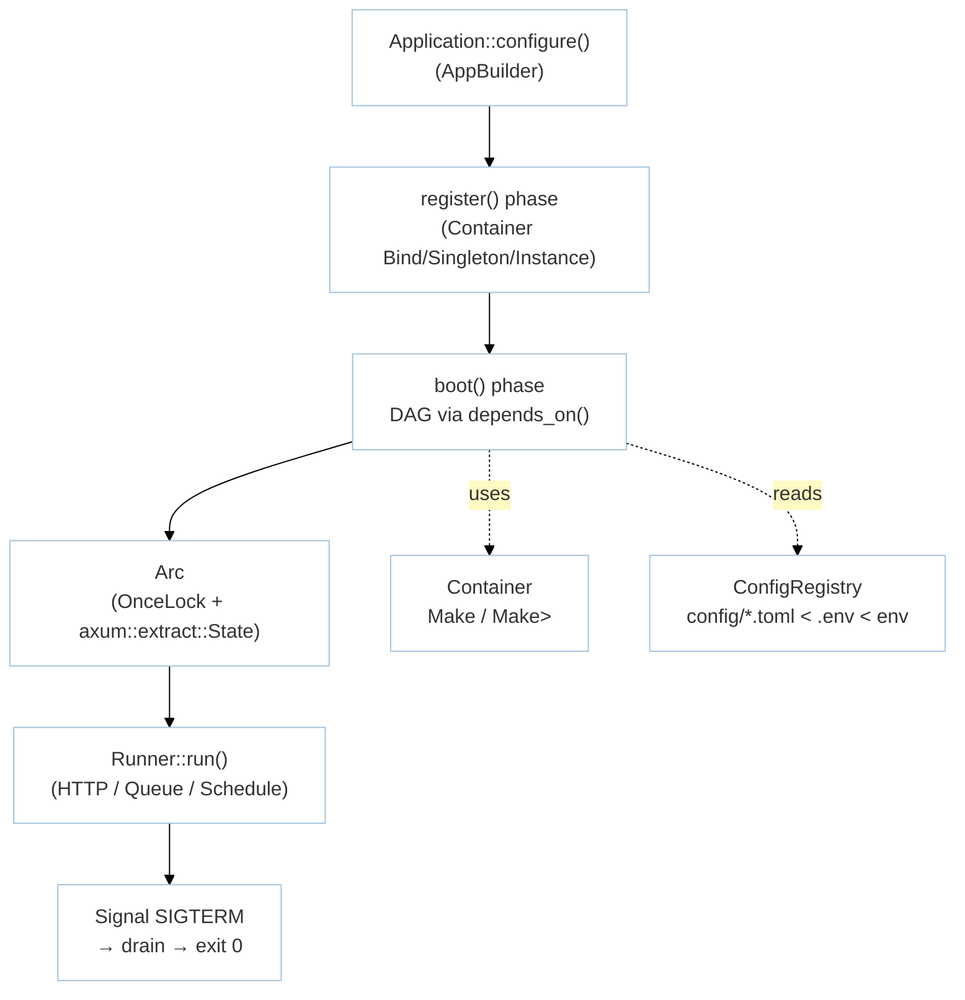

# Module: Foundation (M0 — Bootstrap & Core)

> **Status:** P8 Final — 2026-09-07 | **Task:** TASK-013
> **Parents:** `requirements/{brd,prd,fsd,tdd}.md` · `design/{architecture,domain,database,api-contracts}.md` · `decisions/ADR-003,ADR-004,ADR-005` · `application/modules/manifest.md` · `tasks/sprints/sprint-01.md`
> **Crates:** `rustavel` (umbrella re-exports) · `rustavel-foundation` · `rustavel-config` · `rustavel-container` (inside foundation)
> **Milestone:** M0 | **BR:** BR-01 | **FR:** FR-000..008 | **FSD:** FS-M0-01..04 | **BC:** BC-0 | **Stories:** US-M0-01..02

## Header & Navigation

- [Module manifest](../manifest.md) · [Application README](../../README.md#3-module-index-7-modules--20-crates)
- API: [api-bootstrap](../../api/foundation/api-bootstrap.md) · Testing: [testing/foundation/overview.md](../../testing/foundation/overview.md)

## 1. Module Introduction

### 1.1 Brief Description
Foundation is the boot root. It provides `Application::configure()` → `register` → `boot` (DAG-ordered), a typed `Container` (`Bind`/`Singleton`/`Instance`/`Make<T>`), layered config (`config/*.toml < .env < env`), and graceful shutdown (`SIGTERM → drain → exit 0`). Everything else depends on it — no foundation, no HTTP, no DB.

### 1.2 Position & Role
- **Type:** Shared kernel / bootstrap. Zero HTTP surface.
- **Business value:** 2-second cold boot (NFR-Per-01), deterministic provider order, no `static mut` facades (`Arc<AppState>` via `OnceLock`), typed diagnostics (`BootError::Cycle`, `ConfigError::Parse {file,line}`).
- **Dependents:** all 6 downstream modules. Guarded by sprint S01 gate.

## 2. Feature List

| Feature | Description | Detail doc |
|---------|-------------|------------|
| Boot & Provider Lifecycle | `Application::configure()`, `ServiceProvider` + `Runner`, DAG `depends_on`, shutdown | [boot.md](boot.md) |
| Container | `Bind`/`Singleton`/`Instance`/`Make<T>` + `Manager::extend` closure binding + nullable `Option<T>` | [container.md](container.md) |
| Config & Shutdown | Layered `config/*.toml` + `.env` + env overlay + `ConfigError::Parse` + drain | [config.md](config.md) |

Every story US-M0-01..02 is assigned; every FR-000..008 appears in one of the feature docs.

## 3. High-Level Architecture

- **DAG validator** rejects cycles with `BootError::Cycle { chain }`.
- **Shutdown** drains HTTP + queue + schedule up to `shutdown_timeout` (default 10s, configurable via `config.app.shutdown_timeout_secs`).

## 4. Global Dependencies

- **Database:** none (M0). Migration table `migrations` scaffolded but not executed until M2.
- **Services:** `tokio` 1.x (single runtime per ADR-003), `config` + `dotenvy`, `serde`, `thiserror`, `axum::extract::State`, `cargo xtask` scaffold.
- **Internal crate DAG:** `rustavel-config` ← `rustavel-foundation`; umbrella `rustavel` re-exports both. Verified acyclic via `cargo metadata | xtask check-cycles`.

## 5. Skill Reference

| Doc layer | Skill | Rule |
|-----------|-------|------|
| This overview | `technical-documentation` | `rules/api-module.md` Part B |
| API contracts | `technical-documentation` | `rules/api-module.md` Part A → [api-bootstrap](../../api/foundation/api-bootstrap.md) |
| QA / boundaries | `test-planning` | `qa-design.md §1–2` |
| BDD scenarios | `test-generation` | `bdd-gherkin.md` → `@foundation`, `@container` |
| Contract tests | `test-generation` | snapshot `route:list` / `model-inspector` adjacency |
| Security triage | `security-audit` | session allow-list hardening (M3, but policy originates in config layer) |
| Chaos | `non-functional-testing` | Redis/DB loss during boot (FS-04) |

## 6. Compliance & Audit

- Cold boot <2s p50 (criterion `bench_boot`; NFR-Per-01).
- Graceful drain: running request completes or `ShutdownTimeout` diagnostic (NFR-Rel-01).
- Workspace check `cargo check -p rustavel-foundation` pulls no ORM/queue/AI (NFR-Sca-02) — tested in `cargo tree --depth 1` CI.
- All 3 feature docs below cross-link to this overview, to their API spec, and to their testing doc.
