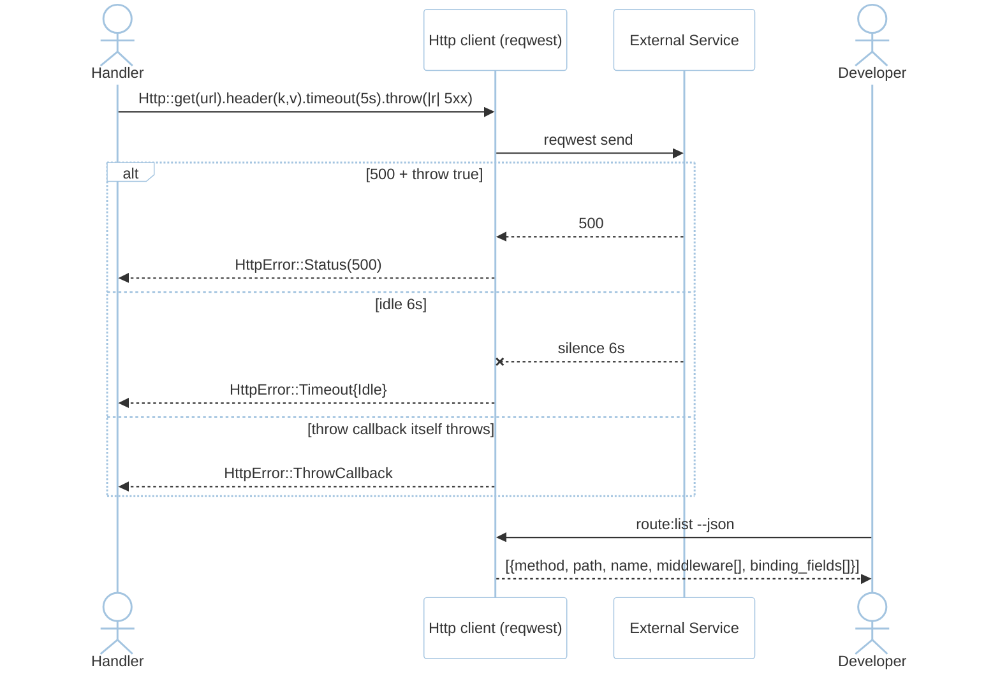
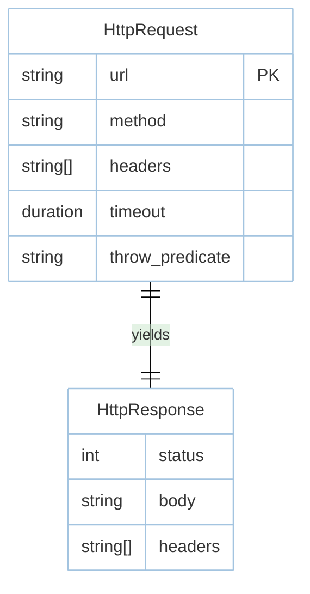

# Feature: Http Client & Introspection (M1)

> **Module:** `http-routing` — [overview.md](overview.md) · **FSD:** FS-M1-06 + FS-M1-03 · **FR:** FR-107..109 · **BC:** BC-1
> **Stories:** US-M1-06 (throw + timeouts) + US-M1-03 (route:list) · **BDD:** `@http-client-process`, `@observability-tooling`

## 1. Feature Overview
- **Brief Description:** `Http::get(url).header(k,v).timeout(d).throw(|resp| predicate).send().await -> Result<Response, HttpError>` over `reqwest`; `throw` callback inspects `Response` and maps to `HttpError::Status` / `ThrowCallback`; idle timeout watches inter-byte silence distinct from total timeout (`HttpError::Timeout{ kind: Connect|Total|Idle }`); `FakeInvokedProcess::stop`/`ensureNotTimedOut` for fakes; `cargo rustavel route:list [--json]` + `show:model` ModelInspector bindings.
- **Role in Module:** Outbound HTTP companion to inbound routing; introspection is the M1 observability signal (NFR-Mai-01).
- **Business Value:** Downstream failure classification without ad-hoc mapping.

## 2. User Stories

### US-M1-06 — HTTP client with throw callbacks and timeouts
**Sebagai** Rust developer **Saya ingin** `throw` callbacks + idle/total timeouts **Sehingga** downstream handling mirrors Laravel Http client

**AC:**
- Given `Http::get(url).throw(|r| r.status().is_server_error())`, When upstream `500`, Then `HttpError::Status { code: 500 }`.
- Given `idle_timeout=5s`, When upstream stops sending 6s, Then `HttpError::Timeout { kind: Idle }`.
- Given mocked `200` with 1ms, When 100 parallel `Http::get`, Then p95 <100ms (localhost mock).

### US-M1-03 — Introspect routes including binding fields (adjacency)
**AC (reuse):** `binding_fields: ["slug"]` for `{user:slug}`; JSON valid for `jq`.

## 3. Business Flow & Rules

### 3.1 Business Flow


### 3.2 Business Rules
- `throw` callback returning true maps to `HttpError::Status`; callback that itself errors → `HttpError::ThrowCallback` (FS-M1-06).
- Idle timeout is inter-byte silence, not total wall time; distinct kinds required (FR-107/#18).

## 4. Data Model



## 5. Public Interface

```rust
struct Http;
impl Http {
    fn get(url: impl Into<String>) -> RequestBuilder;
    // RequestBuilder: header(k,v).timeout(Duration).throw(|Response| bool).send().await -> Result<Response, HttpError>
}
enum HttpError { Status { code: u16 }, Timeout { kind: TimeoutKind }, ThrowCallback { source: Box<dyn Error> } }
enum TimeoutKind { Connect, Total, Idle }
// Introspection
// cargo rustavel route:list [--json]  -> Vec<RouteMeta>
// cargo rustavel show:model User     -> ModelInspector {attributes,relations,casts}
struct ModelInspector { attributes: Vec<String>, relations: Vec<String>, casts: Vec<String> }
```

## 6. Dependencies
- `reqwest` (under hood), `tokio`, `serde`, `schemars` (route:list schema), `wiremock`/`httpmock` for `throw` predicate fakes.

## 7. Limitations
- `FakeInvokedProcess::stop`/`ensureNotTimedOut` is behind `cargo rustavel` internal tooling (FS-M1-06 process idle-timeout adjacency), not general-purpose process supervisor.

## 8. Compliance
- `oha` p95 benchmark is 100-parallel invariant on localhost mock (NFR-Per-02 adjacency).

## 9. Implementation Tasks

| ID | Component | Status | Description |
|----|-----------|--------|-------------|
| F-M1-HTTP-01 | Http client | Todo | `reqwest` wrapper + `throw` |
| F-M1-HTTP-02 | Timeouts | Todo | `Connect`/`Total`/`Idle` classification |
| F-M1-HTTP-03 | Introspection | Todo | `route:list --json` + `show:model` |
| F-M1-HTTP-04 | Tests | Todo | 500 throw, idle kind, route:list snapshot |

## 10. Cross-References
- API: [api-http-client](../../api/http-routing/api-http-client.md)
- Tests: [test-routing](../../testing/http-routing/test-routing.md) · BDD `@http-client-process`, `@observability-tooling`
- Contracts: `testing/contracts/route-list.schema.json` · `__snapshots__/route-list.json.snap` · `testing/stubs/m1-router-http.stub.rs`

## 11. Skill Reference
| Layer | Skill |
|-------|-------|
| QA | `test-planning` — decision table on throw predicates |
| Contract | `test-generation` — `route:list` JSON-Schema + snapshot |
| Chaos | `non-functional-testing` — upstream `docker pause` / 500 burst |
