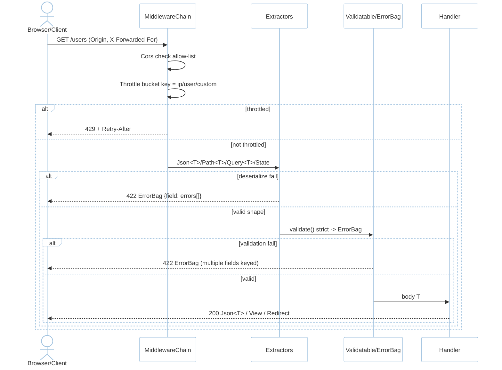
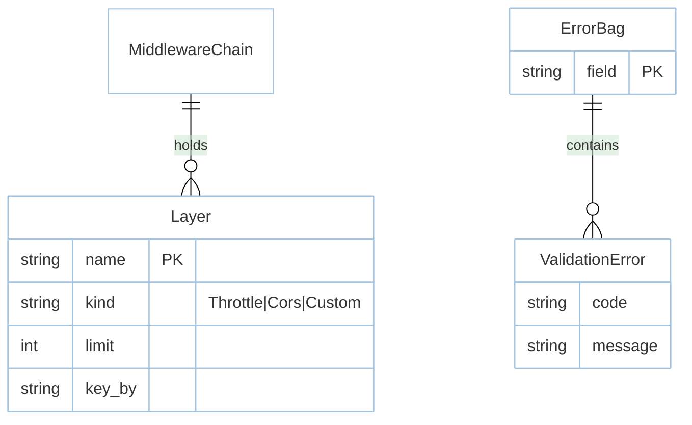

# Feature: Middleware (M1)

> **Module:** `http-routing` — [overview.md](overview.md) · **FSD:** FS-M1-04..05 · **FR:** FR-104..106, FR-306 adjacency · **BC:** BC-1
> **Stories:** US-M1-04 (throttle + CORS), US-M1-05 (typed extractors + ErrorBag) · **BDD:** `@routing`, `@routing-validation`, `@throttle` adjacency

## 1. Feature Overview
- **Brief Description:** Tower-composable `Throttle::per_minute(n).by_ip() | .by_user() | .by_key(|req| ...)` (keyed buckets, `429` + `Retry-After`, `trusted_proxies` for `X-Forwarded-For`) and `Cors::allow_origins([...])` (only allow-listed `Origin` gets `Access-Control-Allow-Origin`), plus typed extractors `Json<T>`/`Query<T>`/`Path<T>`/`State<AppState>` surfacing `422 ErrorBag` (`validator` via `Validatable`) with strict unknowns rejected, and typed responses `Json<T>`/`View<T>` (`askama`/`minijinja`) + `Redirect` + `EventStream` adjacency.
- **Role in Module:** Per-route/group `tower::Layer` chain; validation runs before handler body.

## 2. User Stories

### US-M1-04 — Middleware stack with throttling and CORS
**Sebagai** platform engineer **Saya ingin** composable throttle + CORS **Sehingga** abuse rejected and cross-origin explicit

**AC:**
- Given `throttle(per_minute:60).by_ip()`, When 61 requests same IP in 60s, Then 61st is `429` with `Retry-After`.
- Given `Cors::allow_origins(["https://app.example.com"])`, When preflight with `Origin: https://app.example.com`, Then `Access-Control-Allow-Origin` present; `https://evil.com` → absent (or `403` strict).
- Given `X-Forwarded-For` behind proxy without `trusted_proxies`, Then throttling uses direct peer IP (not spoofed header).

### US-M1-05 — Typed extractors and ErrorBag validation bridge
**Sebagai** Rust developer **Saya ingin** typed extractors surfacing ErrorBag 422 **Sehingga** never hand-parse bodies

**AC:**
- Given `async fn create(Json(CreateUser{name,email}): Json<CreateUser>)`, When `{name:" Ada ", email:"ada@example.com"}`, Then `201`.
- Given same requiring `email` format, When `{email:"not-an-email"}`, Then `422 { errors:{email:[...]}}`.
- Given strict deserialize, When payload has unknown `age:30`, Then `422` with `age` unexpected.

## 3. Business Flow & Rules

### 3.1 Business Flow


### 3.2 Business Rules
- `MiddlewareStack` layer composition is order-preserving; unknown `#[middleware("auth:jwt")]` name → error at boot.
- `Throttle` 60 inclusive: 61st fails; bucket uses `tower-http` or in-memory/Redis store.
- Behind proxy requires `trusted_proxies` for `X-Forwarded-For`; otherwise peer IP.
- CORS `allow_origins` is exact-match; suffix trick (`evil-app.example.com`) must not pass.
- `ErrorBag { field -> Vec<ValidationError> }` aggregates multiple fields in one 422.

## 4. Data Model



## 5. Public Interface

```rust
struct Throttle;
impl Throttle {
    fn per_minute(n: u32) -> Self;
    fn by_ip(self) -> Self; fn by_user(self) -> Self; fn by_key(self, f: fn(&Request)->String) -> Self;
}
struct Cors;
impl Cors { fn allow_origins(origins: impl Into<Vec<String>>) -> Self; }
trait Validatable: DeserializeOwned { fn validate(&self) -> Result<(), ErrorBag>; }
struct ErrorBag { fields: HashMap<String, Vec<ValidationError>> }
// App-level
// 422 body: { "message":"The given data was invalid.", "errors":{ "email":["..."] } }
```

## 6. Dependencies
- `foundation` (AppState), `tower`, `tower-http`, `validator`, `serde`.

## 7. Limitations
- `Cors` allow-list is exact; no wildcard `*.example.com` (requires explicit entries).

## 8. Compliance
- `429` metric emission counted exactly-once (observability helper `throttle:429`).

## 9. UI Layout
CLI `route:list` shows middleware column per route as `["throttle:60,1","cors"]`.

## 10. Implementation Tasks

| ID | Component | Status | Description |
|----|-----------|--------|-------------|
| F-M1-MW-01 | Throttle | Todo | `per_minute`/`by_*` + `429 Retry-After` + `trusted_proxies` |
| F-M1-MW-02 | Cors | Todo | `allow_origins` + `Access-Control-Allow-Origin` per allow-list |
| F-M1-MW-03 | Extractors+Valid | Todo | `Json`/`Path`/`Query` + `ErrorBag` 422 strict |
| F-M1-MW-04 | Tests | Todo | throttle 61st, CORS matrix, ErrorBag dual-field |

## 11. Cross-References
- Design: `domain.md BC-1` · `tdd.md BC-1` · `api-contracts.md §1` · ADR-001
- API: [api-routing](../../api/http-routing/api-routing.md) — middleware & extractors sections
- Tests: [test-routing](../../testing/http-routing/test-routing.md) · BDD `@routing-validation`, `@throttle` adjacency · `fixtures/csrf-matrix.json` adjacency

## 12. Skill Reference
| Layer | Skill |
|-------|-------|
| QA | `test-planning` BVA on 60→61 |
| BDD | `test-generation` `@routing-validation` |
| Security | `security-audit` — `X-Forwarded-For` spoof, CORS suffix trick |
| Chaos | `non-functional-testing` — burst beyond throttle window under `oha` |
