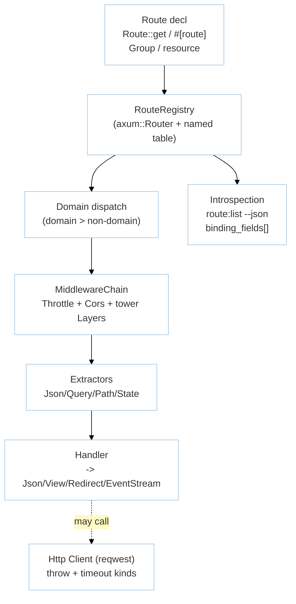

# Module: HttpRouting (M1 — Routing & HTTP)

> **Status:** P8 Final — 2026-09-07 | **Task:** TASK-013
> **Parents:** `requirements/{prd §M1,fsd §3.2,tdd BC-1,bdd-scenarios §2.2,user-stories US-M1-01..06}.md` · `design/{architecture BC-1,domain BC-1,api-contracts §1}` · `decisions/ADR-001 axum` · `modules/manifest.md` · `sprints/sprint-02.md`
> **Crates:** `rustavel-router` · `rustavel-http` · `rustavel-macros` (#[route], #[middleware])
> **Milestone:** M1 | **BR:** BR-02 | **FR:** FR-100..109 | **FSD:** FS-M1-01..06 | **BC:** BC-1 | **Stories:** US-M1-01..06

## Header & Navigation

- [Manifest](../manifest.md) · [App README](../../README.md)
- API: [api-routing](../../api/http-routing/api-routing.md) · [api-http-client](../../api/http-routing/api-http-client.md)
- Testing: [testing/http-routing/overview.md](../../testing/http-routing/overview.md)

## 1. Module Introduction

### 1.1 Brief Description
Expressive HTTP layer over `axum`+`tower`+`tower-http`. Provides method helpers (`get`/`post`/`put`/`delete`/`patch`/`options`/`any`), groups with prefix/name/middleware stacking, `resource(name, controller)` expansion, domain-aware dispatch, typed extractors/responses (`Json`/`Query`/`Path`/`State` → `Json`/`View`/`Redirect`/`EventStream`), `Throttle`/`Cors` middleware, `Http` client wrapper over `reqwest`, and `route:list [--json]` / `show:model` introspection.

### 1.2 Position & Role
- **Type:** Request-surface; deterministic dispatch (domain > non-domain).
- **Value:** Laravel-readable route files, tower-composeable middleware. `binding_fields` in `route:list --json` mirrors Laravel 13 #20.
- **Depends on:** `foundation` (AppState, Container). **Enables:** M3 auth middleware, M6 broadcast/SSE routes.

## 2. Feature List

| Feature | Description | Detail |
|---------|-------------|--------|
| Routing | Methods, groups, `resource` 7 routes, domain precedence, `RouteError::Conflict` | [routing.md](routing.md) |
| Middleware | `Throttle::per_minute(n).by_ip/.by_user/.by_key(fn)` + `Retry-After`, `Cors::allow_origins`, `X-Forwarded-For` via `trusted_proxies` | [middleware.md](middleware.md) |
| Http Client & Introspection | `Http::get().throw().timeout().send()` with `HttpError::Timeout{Connect|Total|Idle}`, `route:list --json` + binding_fields, `show:model` | [http-client.md](http-client.md) |

## 3. High-Level Architecture

- Domain split evaluated before non-domain (FSD FS-M1-02); duplicate `{method,path}` or `name` → `RouteError::Conflict`.
- `Paginated<T>` envelope shared with ORM/JSON:API modules.

## 4. Global Dependencies

- **Deps:** `foundation` (AppState), `axum 0.7`, `tower`, `tower-http`, `reqwest`, `serde/serde_json`, `validator` (via validation adjacency), `syn/quote` for proc-macros.
- **Not yet:** DB/ORM (M2), guards (M3). `queue/cache` not imported — `cargo check -p rustavel-router` has no `sqlx`/`async-openai` (NFR-Sca-02).

## 5. Skill Reference

| Layer | Skill | Trace |
|-------|-------|-------|
| API specs | `technical-documentation` Part A | [api-routing](../../api/http-routing/api-routing.md), [api-http-client](../../api/http-routing/api-http-client.md) |
| QA | `test-planning` | `qa-design §1.2` rows @routing/@routing-validation/@http-client-process |
| BDD | `test-generation` | `@routing`, `@routing-validation`, `@observability-tooling`, `@http-client-process` |
| Contract | `test-generation` | `contracts/route-list.schema.json` + `__snapshots__/route-list.json.snap` |
| Security | `security-audit` | CORS suffix trick, `X-Forwarded-For` spoof |
| Chaos | `non-functional-testing` | `HttpError::Timeout{Idle}` vs total — truncated stream |

## 6. Compliance

- HTTP p95 <50ms no-DB (`oha`; NFR-Per-02).
- Observability: `route:list --json` emits `{method,path,name,middleware[],binding_fields[]}` (FSD FS-M1-03; NFR-Mai-01).
- Seven routes in `resource` (not 6); throttling 60 inclusive (61st is 429 with `Retry-After`).
