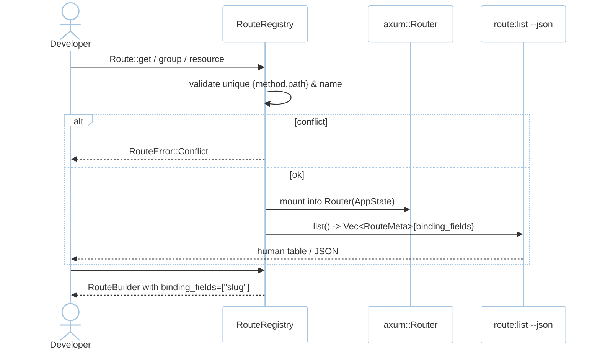
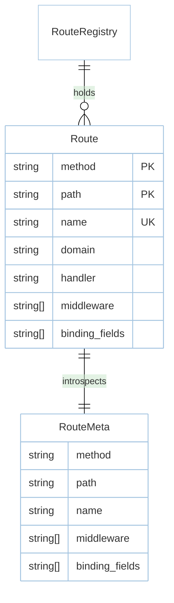

# Feature: Routing (M1)

> **Module:** `http-routing` — [overview.md](overview.md) · **FSD:** FS-M1-01..03 · **FR:** FR-100..103, FR-109 · **BC:** BC-1
> **Stories:** US-M1-01 (resource), US-M1-02 (domain), US-M1-03 (introspection) · **BDD:** `@routing`, `@routing-validation`, `@observability-tooling`

## 1. Feature Overview
- **Brief Description:** HTTP method helpers (`get`/`post`/`put`/`delete`/`patch`/`options`/`any`) over `axum`, groups (`prefix`/`name`/`middleware`), `resource("users", UserController)` expanding to `index/create/store/show/edit/update/destroy` (7 routes), domain-aware dispatch (domain routes before non-domain), and `cargo rustasea route:list [--json]` emitting `{method,path,name,middleware[],binding_fields[]}` (FSD FS-M1-03; Laravel 13 #20) plus `show:model` (ModelInspector).
- **Role in Module:** Core of HTTP surface; middleware chain ordering is preserved across groups.
- **Business Value:** Goravel/Laravel-readable route files; machine-readable auditability.

## 2. User Stories

### US-M1-01 — Define expressive routes with groups and resources
**Sebagai** Rust developer **Saya ingin** axum-backed route helpers + groups + resource **Sehingga** route defs read like Laravel

**AC (EARS):**
- Given `Route::resource("users", UserController)`, When `route:list --json` inspected, Then 7 routes (`index`..`destroy`) with `/users` and `/users/{id}`.
- Given group `prefix("/api/v1")` with `get("/users")`, Then canonical path `/api/v1/users`.
- Given two routes `name("users.index")`, When router built, Then `RouteError::Conflict { name }`.

### US-M1-02 — Domain-aware routing precedence
**Sebagai** platform engineer **Saya ingin** domain routes before non-domain **Sehingga** tenant catch-all never shadows docs

**AC:**
- Given `domain("{tenant}.example.com").get("/*", TenantCatchAll)` + `get("/docs", DocsPage)`, When `GET docs.example.com/docs`, Then tenant catch-all with `tenant=docs`.
- Given `domain("{tenant}.example.com").get("/dashboard")` + `get("/dashboard")`, When `GET example.com/dashboard` (no subdomain), Then non-domain handler.

### US-M1-03 — Introspect routes including binding fields
**Sebagai** Rust developer **Saya ingin** `cargo rustasea route:list` with binding fields **Sehingga** coverage without reading source

**AC:**
- Given `get("/users/{user:slug}")` with binding `slug`, When `route:list --json`, Then entry has `binding_fields: ["slug"]`.
- Given `--json`, When piped to `jq`, Then valid JSON array with `middleware` per route.

## 3. Business Flow & Rules

### 3.1 Business Flow


### 3.2 Business Rules
- Domain routes evaluated before non-domain (deterministic; FSD FS-M1-02). Host from `Host` / `Forwarded`.
- Catch-all `*.example.com/*` never shadows explicit non-domain routes.
- `binding_fields` derived from `{param:field}` syntax.
- Trailing-slash normalization; `any` auto-adds `OPTIONS`.
- Duplicate named route → error at boot (not silent overwrite).
- `RouteMeta` JSON shape: `{method, path, name, middleware[], binding_fields[]}`.

## 4. Data Model



- `ModelInspector { attributes, relations, casts }` adjacency via `show:model` (see `http-client.md`).

## 5. Public Interface

```rust
struct Route { method: Method, path: Cow<'static,str>, name: Option<Cow<'static,str>>, handler: Handler, domain: Option<Cow<'static,str>> }
struct RouteRegistry;
impl RouteRegistry {
    fn get(&mut self, path: impl Into<Cow<'static,str>>, handler: Handler) -> RouteBuilder;
    // post/put/delete/patch/options/any
    fn group(&mut self, prefix: &str, middleware: Vec<String>, f: impl FnOnce(&mut Self));
    fn resource(&mut self, name: &str, ctrl: Controller) -> Vec<Route>;
    fn list(&self) -> Vec<RouteMeta>;
}
struct RouteMeta { method: String, path: String, name: Option<String>, middleware: Vec<String>, binding_fields: Vec<String> }
enum RouteError { Conflict { method: String, path: String, name: Option<String> }, InvalidPattern { path: String } }
// Proc-macros
// #[route(GET, "/users/{user:slug}")] , #[middleware("auth:jwt")]
```

## 6. Dependencies
- Upstream: `foundation` (AppState).
- External: `axum`, `tower`, `serde`, `schemars` (for `RouteMeta` schema), `cargo-xtask`.

## 7. Limitations
- Composite keys deferred; host extraction trusts `Host` header unless behind proxy — then `Forwarded` via `trusted_proxies`.

## 8. Compliance
- `Paginated<T>` envelope `{data,meta,links}` shared with ORM/JSON:API is shaped here (see `api-contracts.md §2`).
- Observability `route:list --json` is snapshot-guarded (`cargo insta`).

## 9. UI Layout
CLI `route:list` human table columns: `METHOD | PATH | NAME | MIDDLEWARE`.

## 10. Implementation Tasks

| ID | Component | Status | Description |
|----|-----------|--------|-------------|
| F-M1-RTE-01 | RouteRegistry | Todo | method helpers + group + resource 7 routes |
| F-M1-RTE-02 | Domain dispatch | Todo | domain > non-domain split + Host extraction |
| F-M1-RTE-03 | Introspection | Todo | `route:list --json` binding_fields + snapshot |
| F-M1-RTE-04 | Proc-macro | Todo | `#[route]` |
| F-M1-RTE-05 | Tests | Todo | resource 7, group prefix, conflict, domain precedence |

## 11. Cross-References
- Design: `architecture.md BC-1` · `domain.md BC-1` · `tdd.md BC-1` · `api-contracts.md §1` · ADR-001
- API: [api-routing](../../api/http-routing/api-routing.md)
- Tests: [testing/http-routing/test-routing.md](../../testing/http-routing/test-routing.md) · BDD `@routing`, `@routing-validation`, `@observability-tooling`
- Fixtures: `testing/contracts/route-list.schema.json` + `__snapshots__/route-list.json.snap`

## 12. Skill Reference
| Layer | Skill |
|-------|-------|
| API | `technical-documentation` Part A |
| QA | `test-planning` — EP on resource count (7 not 6) |
| BDD | `test-generation` — `@routing-validation` domain precedence |
| Contract | `test-generation` — `route:list` snapshot |
| Chaos | `non-functional-testing` — catch-all under load vs thundering herd |

---

> **Archive note (rebrand 2026-09-09):** project renamed from Rustavel to **RustaSea**.
> This document is archived as-is under the historical `Rustavel` name for traceability;
> current branding is RustaSea (`rustasea` crates, `RustaSea` prose).
