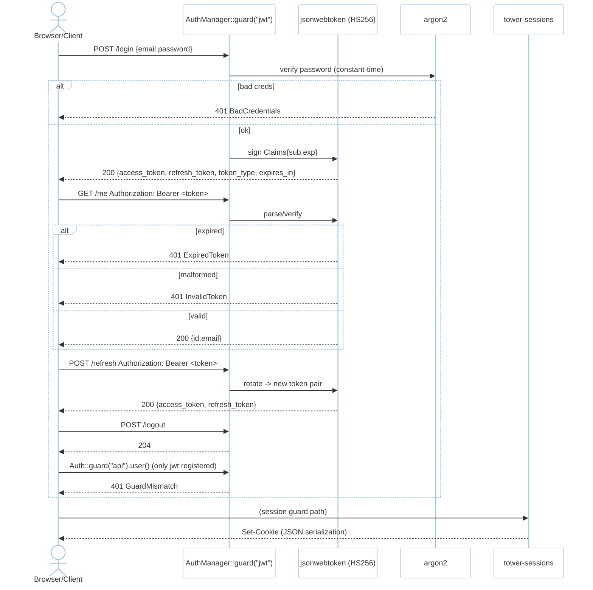
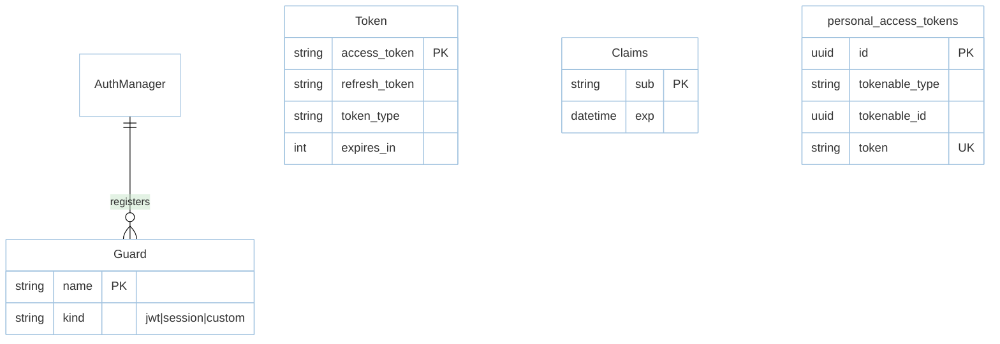

# Feature: Auth (M3)

> **Module:** `identity-access` — [overview.md](overview.md) · **FSD:** FS-M3-01 · **FR:** FR-300..301 · **BC:** BC-3
> **Stories:** US-M3-01 (JWT+session+extend) · **BDD:** `@auth`

## 1. Feature Overview
- **Brief Description:** `Guard` trait (`login`/`parse`/`refresh`/`logout`) with two built-ins — JWT (`jsonwebtoken` HS256 + `argon2` hash + constant-time verify; `login` → `Token{access,refresh,token_type:"Bearer",expires_in}`; `parse`→`Claims{sub,exp}`; `refresh` rotates) and session (`tower-sessions` store keyed by cookie) — plus `Auth::extend("custom", |app| MyGuard::new(...))` at boot and `Auth::guard("api")` → `GuardMismatch{expected,actual}` when wrong guard name.
- **Role in Module:** Identity verifier; downstream `#[authorize]` and `markEmailAsUnverified` hook depend on it.
- **Business Value:** Multiple auth mechanisms coexist with typed mismatch reporting.

## 2. User Stories

### US-M3-01 — JWT + session guards with custom guard extension
**Sebagai** Rust developer **Saya ingin** JWT+session+`Auth::extend` **Sehingga** token+cookie coexist

**AC:** `argon2`-hashed user → `Auth::guard("jwt").login({email,password})` returns token and `parse(token)` yields `AuthUser{id}`; only `jwt` registered then `Auth::guard("api").user()` → `GuardMismatch{expected:"jwt",actual:"api"}`; expired/wrong creds/malformed → `ExpiredToken`/`BadCredentials`/`InvalidToken`.

## 3. Business Flow & Rules

### 3.1 Business Flow


### 3.2 Business Rules
- `Auth::extend` registers at `boot`; attempt with duplicate name → typed error.
- `loginUsingId` (`user_id: UUID`) is internal/testing helper → `200` with token pair without password check.
- Passwords never stored plaintext; `argon2` with per-password salt; `constant-time` verify.

## 4. Data Model



- `personal_access_tokens` optional (future; `database.md §2`).

## 5. Public Interface

```rust
trait Guard: Send + Sync {
    async fn login(&self, creds: &Credentials) -> Result<Token, AuthError>;
    async fn parse(&self, token: &str) -> Result<AuthUser, AuthError>;
    async fn refresh(&self, token: &str) -> Result<Token, AuthError>;
    async fn logout(&self, token: &str) -> Result<(), AuthError>;
}
struct AuthManager;
impl AuthManager {
    fn guard(&self, name: &str) -> Result<&dyn Guard, AuthError>;
    fn extend(&mut self, name: &'static str, factory: impl Fn(&AppState)->Box<dyn Guard> + Send+Sync+'static);
}
struct Token { access_token: String, refresh_token: String, token_type: String, expires_in: u64 }
struct Claims { sub: String, exp: usize }
enum AuthError { GuardMismatch{ expected:String, actual:String }, BadCredentials, InvalidToken, ExpiredToken }
// HTTP (see api-auth)
```

## 6. Dependencies
- `foundation` (AppState), `router/http` (middleware wiring), `orm` (User model), `jsonwebtoken`, `argon2`, `tower-sessions`, `uuid`.

## 7. Limitations
- No `personal_access_tokens` flow shipped until guarded behind auth (future).
- `loginUsingId` is testing/internal only — not exposed without guard `allow_loginUsingId` config.

## 8. Compliance
- `argon2` + constant-time verify (NFR-Sec-04).
- `markEmailAsUnverified` semantics via auth trait hook (FR-311, FS-M3-01 adjacency): verified user → `markEmailAsUnverified` clears `email_verified_at`.

## 9. Implementation Tasks

| ID | Component | Status | Description |
|----|-----------|--------|-------------|
| F-M3-AUTH-01 | JwtGuard | Todo | `jsonwebtoken` HS256 + `argon2` + `login`/`parse`/`refresh`/`logout` |
| F-M3-AUTH-02 | SessionGuard | Todo | `tower-sessions` store + cookie |
| F-M3-AUTH-03 | extend | Todo | `Auth::extend` + `GuardMismatch` |
| F-M3-AUTH-04 | Tests | Todo | login→parse, mismatch, BadCredentials/Expired/Malformed |

## 10. Cross-References
- API: [api-auth](../../api/identity-access/api-auth.md)
- Tests: [test-auth-validation](../../testing/identity-access/test-auth-validation.md) · BDD `@auth` · `testing/contracts/jwt-claims.schema.json`
- Design: `api-contracts.md §3` · `tdd.md BC-3` · `domain.md BC-3`

## 11. Skill Reference
| Layer | Skill |
|-------|-------|
| QA | `test-planning` — decision table on creds × guard |
| Security | `security-audit` — `argon2` invariant, GuardMismatch leak check |
| Contract | `test-generation` — `jwt-claims.schema.json` |
| Chaos | `non-functional-testing` — Redis down during `parse` → typed error |

---

> **Archive note (rebrand 2026-09-09):** project renamed from Rustavel to **RustaSea**.
> This document is archived as-is under the historical `Rustavel` name for traceability;
> current branding is RustaSea (`rustasea` crates, `RustaSea` prose).
