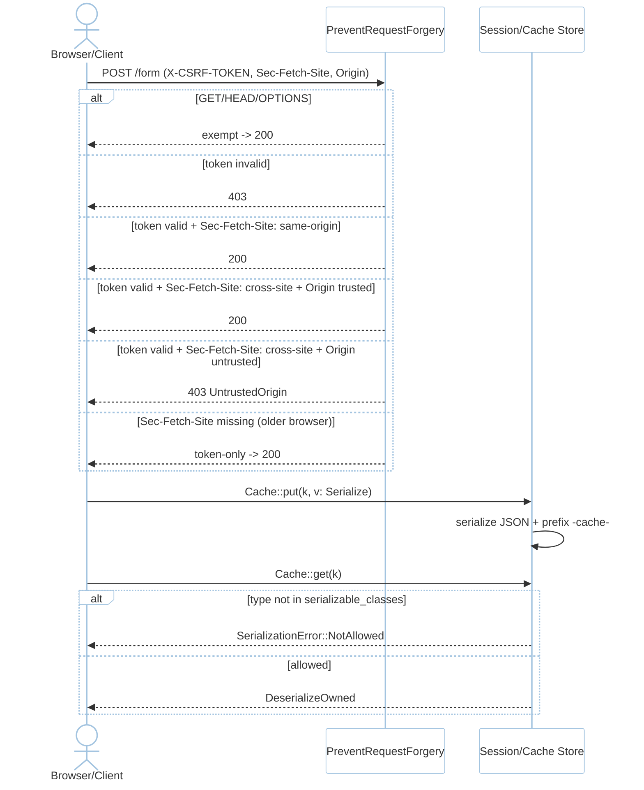
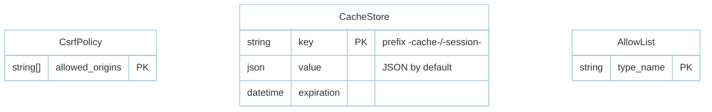

# Feature: CSRF (M3)

> **Module:** `identity-access` — [overview.md](overview.md) · **FSD:** FS-M3-02..03 · **FR:** FR-302..304 · **BC:** BC-3
> **Stories:** US-M3-02 (origin-aware), US-M3-03 (JSON session + allow-list) · **BDD:** `@csrf-origin`, `@cache-session-hardening`

## 1. Feature Overview
- **Brief Description:** `PreventRequestForgery` checks `X-CSRF-TOKEN`/`_token` first, then `Sec-Fetch-Site` (`same-origin` passes, `cross-site` requires origin in `config.app.csrf_origins` otherwise `403 CsrfError::UntrustedOrigin`, `none` treated as same-origin, missing header degrades to token-only, `GET`/`HEAD`/`OPTIONS` exempt). Session/Cache hardening: JSON serialization default (`session.serialization="json"`), hyphenated prefixes `-cache-`/`-session-` vs `_cache_`, `serializable_classes` allow-list checked before `serde` instantiation.
- **Role in Module:** Write-path gate; hardening prevents object-injection via cache/session.
- **Business Value:** Laravel 13 #11/#12 hardened defaults without developer opt-in.

## 2. User Stories

### US-M3-02 — Origin-aware CSRF protection
**Sebagai** security auditor **Saya ingin** CSRF validate `Sec-Fetch-Site` origin **Sehingga** cross-site POST without trusted origin rejected

**AC:** `csrf_origins: ["https://app.example.com"]` + `Sec-Fetch-Site: same-origin` + valid token → `200`; `cross-site` + `Origin:https://evil.com` + valid token → `403 UntrustedOrigin`; older browser omitting `Sec-Fetch-Site` + valid token → passes; safe methods without token → exempt.

### US-M3-03 — JSON session serialization + allow-list + hyphenated prefixes
**Sebagai** security auditor **Saya ingin** JSON + allow-list + hyphenated prefixes **Sehingga** gadget attacks impossible

**AC:** Default config → session cookie JSON + cache key contains `-session-`; `serializable_classes: ["App::UserDto"]` + cached `AdminDto` deserialized → `NotAllowed{type_name:"AdminDto"}`; `CACHE_PREFIX` contains `-cache-` (not `_cache_`).

## 3. Business Flow & Rules

### 3.1 Business Flow


### 3.2 Business Rules
- `allowed_origins` from `config.app.csrf_origins`; `Sec-Fetch-Site: none` (direct navigation) treated as same-origin.
- JSON `CACHE_PREFIX` hygiene: default `-cache-` hyphen, not underscore; override via `CACHE_PREFIX`/`REDIS_PREFIX` (migration guide).
- Missing `Sec-Fetch-Site` (older browsers) → token-only; cross-site without valid origin even with valid token → `403` (NFR-Sec-01).

## 4. Data Model



## 5. Public Interface

```rust
struct PreventRequestForgery { allowed_origins: Vec<String> }
impl PreventRequestForgery {
    fn check(&self, req: &Request) -> Result<(), CsrfError>;
    // GET/HEAD/OPTIONS exempt internally
}
enum CsrfError { UntrustedOrigin { origin: String } }
struct SerializationPolicy { serializable_classes: Vec<String>, prefix: String }
enum SerializationError { NotAllowed { type_name: String } }
// Cache::put/get deserialization gates through SerializationPolicy before serde instantiation
```

## 6. Dependencies
- `router` `tower` layer wiring; `config` `csrf_origins` + `session.serialization` + `serializable_classes` + `CACHE_PREFIX`/`REDIS_PREFIX`.

## 7. Limitations
- `Sec-Fetch-Site` is a signal, not sole gate — token remains primary (browser spec evolution guard).

## 8. Compliance
- NFR-Sec-01: `cross-site` without valid origin → `403` (decision table `testing/fixtures/csrf-matrix.json` 6 rows).
- NFR-Sec-02: JSON session + allow-list enforced + hyphenated prefix invariant.

## 9. Implementation Tasks

| ID | Component | Status | Description |
|----|-----------|--------|-------------|
| F-M3-CSRF-01 | PreventRequestForgery | Todo | token-first + `Sec-Fetch-Site` matrix + safe-method exempt |
| F-M3-CSRF-02 | Hardening | Todo | JSON serialization default + hyphen prefix + allow-list gate |
| F-M3-CSRF-03 | Tests | Todo | CSRF matrix, NotAllowed, prefix -cache- |

## 10. Cross-References
- API: [api-auth](../../api/identity-access/api-auth.md) — CSRF decision table section
- Tests: [test-auth-validation](../../testing/identity-access/test-auth-validation.md) · BDD `@csrf-origin`, `@cache-session-hardening`
- Fixtures: `testing/fixtures/csrf-matrix.json` (6 rows) · `testing/fixtures/allowlist-corpus.json` · `testing/contracts/jwt-claims.schema.json`

## 11. Skill Reference
| Layer | Skill |
|-------|-------|
| Security triage | `security-audit` — `security-triage` over `csrf-matrix.json` |
| Contract | `test-generation` — `jwt-claims` + allow-list corpus |
| Chaos | `non-functional-testing` — `csrf-matrix` under `Sec-Fetch-Site` spec drift |

---

> **Archive note (rebrand 2026-09-09):** project renamed from Rustavel to **RustaSea**.
> This document is archived as-is under the historical `Rustavel` name for traceability;
> current branding is RustaSea (`rustasea` crates, `RustaSea` prose).
