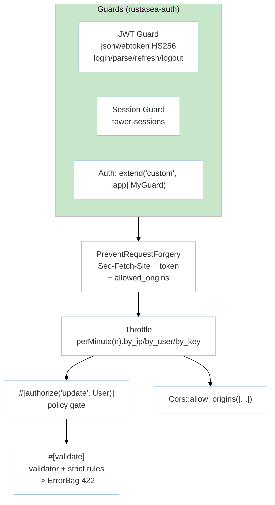

# Module: IdentityAccess (M3 — Auth, Middleware & Validation)

> **Status:** P8 Final — 2026-09-07 | **Task:** TASK-013
> **Parents:** `requirements/{prd §M3,fsd §3.4,tdd BC-3,bdd-scenarios §2.4,user-stories US-M3-01..05}.md` · `design/{architecture BC-3,domain BC-3,api-contracts §3}` · `modules/manifest.md` · `sprints/sprint-04.md`
> **Crates:** `rustasea-auth` · `rustasea-validation`
> **Milestone:** M3 | **BR:** BR-04 | **FR:** FR-300..311 | **FSD:** FS-M3-01..06 | **BC:** BC-3 | **Stories:** US-M3-01..05

## Header & Navigation

- [Manifest](../manifest.md) · [App README](../../README.md)
- API: [api-auth](../../api/identity-access/api-auth.md) · [api-validation](../../api/identity-access/api-validation.md)
- Testing: [testing/identity-access/overview.md](../../testing/identity-access/overview.md)

## 1. Module Introduction

### 1.1 Brief Description
Hardened identity and input layer at Laravel 13 security defaults: JWT guard (`jsonwebtoken` HS256 + `argon2`) + session guard (`tower-sessions`) with `Auth::guard("jwt")`/`Auth::extend("custom")`, origin-aware CSRF (`PreventRequestForgery` checks `Sec-Fetch-Site` + token, `GET`/`HEAD`/`OPTIONS` exempt), JSON session serialization + `serializable_classes` allow-list + hyphenated `-cache-`/`-session-` prefixes, rate limiter `limit.perMinute(n).by(ip|user|key(fn))` → `Throttle` middleware (`429` + `Retry-After`), and strict validation (`#[validate]` + `ErrorBag` per field, strict `contains`/`in_array`/`doesnt_contain`).

### 1.2 Position & Role
- **Type:** Security boundary. Every handler that mutates state should sit behind `#[middleware("auth:jwt")]` or `#[authorize]` and `#[validate]`.
- **Value:** Drop-in security posture matching Laravel 13 #11/#12/#19. Constant-time `argon2` verify; token is primary when `Sec-Fetch-Site` missing (older browsers); `X-Forwarded-For` respected only behind `trusted_proxies`.
- **Depends on:** `http-routing` (tower layers, extractors) + `data-orm` (User model). **Enables:** M4 hardening of queue/cache, M6 channel auth.

## 2. Feature List

| Feature | Description | Detail |
|---------|-------------|--------|
| Auth | JWT `login`/`loginUsingId`/`parse`/`refresh`/`logout` + session guard + `Auth::extend` + `GuardMismatch` | [auth.md](auth.md) |
| CSRF | Origin-aware `PreventRequestForgery`, `Sec-Fetch-Site` matrix, `cross-site` → origin allow-list, `none` = same-origin | [csrf.md](csrf.md) |
| Validation | `#[validate]`, `Validatable`, `ErrorBag` 422, strict rules, `#[middleware]`/`#[authorize]`, CORS allow-list, rate limiter | [validation.md](validation.md) |

## 3. High-Level Architecture

- JWT `exp` in past → `ExpiredToken`; wrong password → `BadCredentials`; wrong guard name → `GuardMismatch{expected,actual}`.
- CSRF: missing `Sec-Fetch-Site` degrades to token-only; `Sec-Fetch-Site: cross-site` + untrusted origin + valid token → `403 UntrustedOrigin`.

## 4. Global Dependencies

- **Deps:** `foundation`, `router`, `http`, `orm` (User), `jsonwebtoken`, `argon2`, `tower-sessions`, `validator`, `serde`.
- **Config:** `config/auth.toml` (guards), `config/app.toml` `csrf_origins`, `session.serialization = "json"`, `serializable_classes`, `CACHE_PREFIX`/`REDIS_PREFIX` (`-cache-` hyphenated).

## 5. Skill Reference

| Layer | Skill | Trace |
|-------|-------|-------|
| API | `technical-documentation` Part A | [api-auth](../../api/identity-access/api-auth.md), [api-validation](../../api/identity-access/api-validation.md) |
| QA | `test-planning` | `@auth`, `@csrf-origin`, `@cache-session-hardening`, `@attributes`, `@throttle` |
| BDD | `test-generation` | `bdd-scenarios §2.4` |
| Contract | `test-generation` | `contracts/jwt-claims.schema.json`, `fixtures/csrf-matrix.json`, `fixtures/allowlist-corpus.json` |
| Security triage | `security-audit` | triaged in `auth.md §7` (see `security-audit` skill) |
| Chaos | `non-functional-testing` | throttle row deleted mid-429 window, Redis down during guard `parse` |

## 6. Compliance

- CSRF origin-aware (NFR-Sec-01: `cross-site` without valid origin → 403).
- JSON session serialization + allow-list (NFR-Sec-02).
- `argon2` + constant-time verify (NFR-Sec-04).
- `ErrorBag` round-trips multiple field errors keyed by field (#19).

---

> **Archive note (rebrand 2026-09-09):** project renamed from Rustavel to **RustaSea**.
> This document is archived as-is under the historical `Rustavel` name for traceability;
> current branding is RustaSea (`rustasea` crates, `RustaSea` prose).
