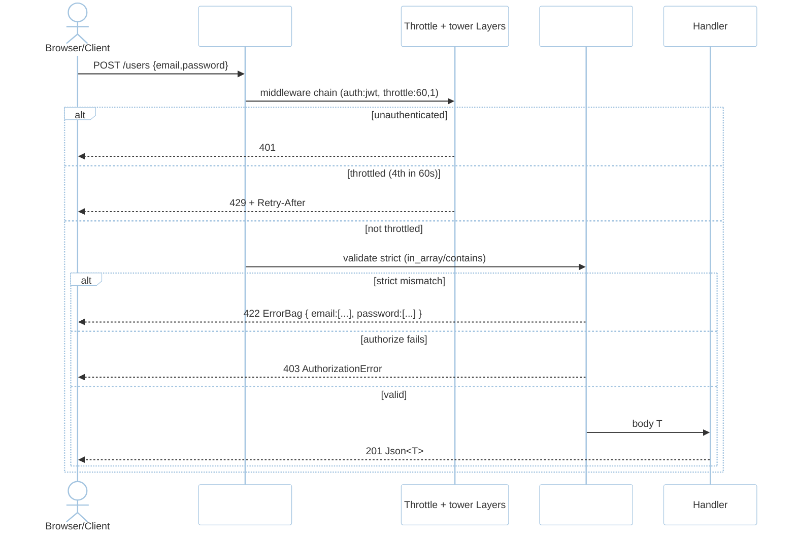
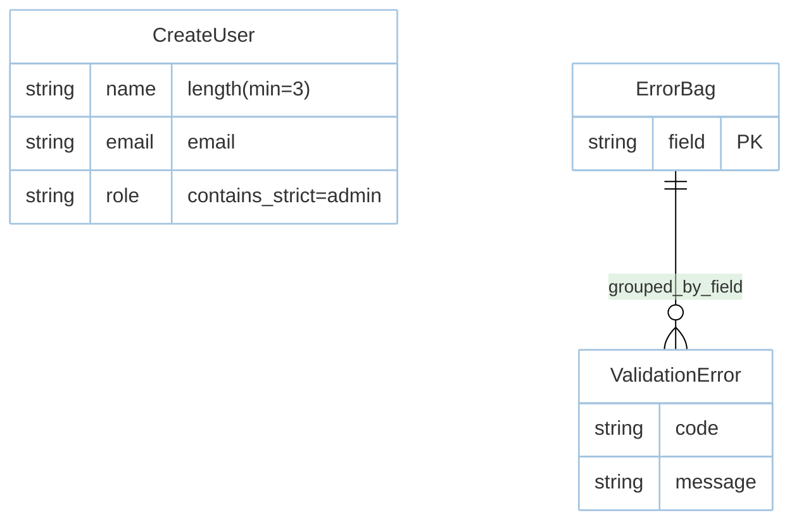

# Feature: Validation (M3)

> **Module:** `identity-access` — [overview.md](overview.md) · **FSD:** FS-M3-04..06 · **FR:** FR-305..311 · **BC:** BC-3
> **Stories:** US-M3-04 (middleware/authorize + strict + ErrorBag), US-M3-05 (rate limiting) · **BDD:** `@attributes`, `@routing-validation`, `@throttle`

## 1. Feature Overview
- **Brief Description:** `#[validate]` wires `validator` derive + strict helpers `in_array`/`contains`/`doesnt_contain` (type+value — `"1" != 1`), `Validatable` trait + `ErrorBag { field -> Vec<ValidationError> }` → `422` with `{ message:"The given data was invalid.", errors:{ field:["..."]}}`, `#[middleware("auth:jwt","throttle:60,1")]` + `#[authorize("update", User)]` proc-macro attributes (evaluated before handler body → `401`/`403`), rate limiter `limit.perMinute(n).by(ip|user|key(fn))` via `Throttle` middleware (`429`+`Retry-After`, `trusted_proxies` for `X-Forwarded-For`), `markEmailAsUnverified` hook, CORS allow-list.
- **Role in Module:** Input correctness + authorization boundary; shared with HTTP middleware.
- **Business Value:** Rules live on handler; multiple field errors coexist; strict contains prevents type confusion (#19).

## 2. User Stories

### US-M3-04 — Declarative middleware/authorize and strict validation
**Sebagai** Rust developer **Saya ingin** `#[middleware]`/`#[authorize]` + `#[validate]` strict + ErrorBag **Sehingga** auth/validation declared on handler

**AC:** `#[middleware("auth:jwt")]` unauthenticated `GET` → `401`; `#[validate(contains_strict="admin")] role` with `"Admin"` or `1` → fails strict; form with `email` wrong + `password` too short → `ErrorBag` has both keys; `#[authorize("update",User)]` non-owner → `403`.

### US-M3-05 — Rate limiting per-IP
**Sebagai** platform engineer **Saya ingin** `limit.per_minute(n).by(ip)` **Sehingga** brute-force bounded

**AC:** `limit.per_minute(3).by_ip()` on `POST /login` 3 successes then 4th in 60s → `429 Retry-After`; `trusted_proxies` unset + `X-Forwarded-For:9.9.9.9` → uses peer `1.2.3.4` not spoofed.

## 3. Business Flow & Rules

### 3.1 Business Flow


### 3.2 Business Rules
- Strict rules compare value + type; `"1" != 1` and `"admin"` vs `"Admin"` fails.
- Aggregates: multiple fields appear in one `ErrorBag`; multiple errors per field coexist.
- `Option<T>` distinction: `null` vs missing field preserved (FSD FS-M3-05 edge).
- `#[middleware]`/`#[authorize]` expand to `tower::Layer` wiring + `Authorize` call at router build time.

## 4. Data Model



- Sample form `CreateUser` shown; `in_array: [1,2,3]` vs `"1"` is the canonical strict test (BDD §2.4 outline).

## 5. Public Interface

```rust
#[validate] // proc-macro wiring validator derive + strict helpers
struct CreateUser {
    #[validate(length(min=3))] name: String,
    #[validate(email)] email: String,
    #[validate(contains_strict="admin")] role: String,
}
trait Validatable: DeserializeOwned { fn validate(&self) -> Result<(), ErrorBag>; }
struct ErrorBag { fields: HashMap<String, Vec<ValidationError>> }
// 422 JSON: {"message":"The given data was invalid.", "errors":{"email":["..."]}}
// #[middleware("auth:jwt","throttle:60,1")] , #[authorize("update", User)]
struct ThrottleConfig { per_minute: u32, key_by: KeyBy } // ip|user|key(fn)
```

## 6. Dependencies
- `validator`, `rustavel-macros` `#[validate]`, `router` `tower::Layer`, `tdd.md BC-3` traits.
- `database.md` adjacency not needed (validation is stateless).

## 7. Limitations
- Unknown field rejection is per `Validatable` strict mode (opt-in via attribute).

## 8. Compliance
- NFR-Usa-02 diagnostics: `code`+`hint`+`source` chain on `ValidationError`.
- `ErrorBag` `422` shape typed via `api-validation` spec.

## 9. Implementation Tasks

| ID | Component | Status | Description |
|----|-----------|--------|-------------|
| F-M3-VAL-01 | Validate macro | Todo | `#[validate]` + `Validatable` + ErrorBag |
| F-M3-VAL-02 | Strict rules | Todo | `in_array`/`contains`/`doesnt_contain` strict (type+value) |
| F-M3-VAL-03 | Middleware attrs | Todo | `#[middleware]`/`#[authorize]` wiring |
| F-M3-VAL-04 | Throttle | Todo | `per_minute(3).by_ip` + 429 + `trusted_proxies` |
| F-M3-VAL-05 | Tests | Todo | dual-field ErrorBag, strict outline, 429, CORS adjacency |

## 10. Cross-References
- API: [api-validation](../../api/identity-access/api-validation.md) · [api-auth](../../api/identity-access/api-auth.md) CSRF adjacency
- Tests: [test-auth-validation](../../testing/identity-access/test-auth-validation.md) · BDD `@attributes`, `@routing-validation`, `@throttle`
- Design: `api-contracts.md §3` · `domain.md BC-3`

## 11. Skill Reference
| Layer | Skill |
|-------|-------|
| QA | `test-planning` — BVA on 3→4 throttle, decision table on CSRF matrix |
| BDD | `test-generation` — strict outline rows (`"1"` vs `1`) |
| Contract | `test-generation` — `ErrorBag` 422 schema via `api-contract-test` |
| Security | `security-audit` — `ErrorBag` info-leak classification |
| Chaos | `non-functional-testing` — concurrent 429 window, Redis down for `Throttle` |
