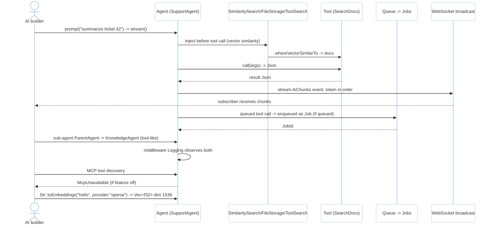
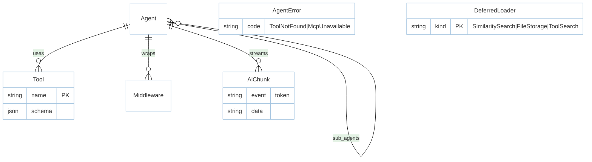

# Feature: AI Agents (M6)

> **Module:** `intelligence-delivery` — [overview.md](overview.md) · **FSD:** FS-M6-06..07 · **FR:** FR-607..610, FR-608, FR-609, FR-602 adjacency · **BC:** BC-6
> **Stories:** US-M6-06 (Agents+tools+streaming+broadcast+queue+MCP+sub-agents), US-M6-07 (toEmbeddings + dropVectorIndex adjacency) · **BDD:** `@ai-agents`, `@vector-search` adjacency

## 1. Feature Overview
- **Brief Description:** `#[derive(Agent)] struct SupportAgent { tools: [SearchDocs], middleware: [Logging], sub_agents: [KnowledgeAgent] }` → `Agent::prompt(input)->Stream<Item=AiChunk>` (`event: token` frames over WS), `trait Tool: Send+Sync { fn name()->&str; fn schema()->Json; async fn call(args:Json)->Json }` + deferred loaders `SimilaritySearch`/`FileStorage`/`ToolSearch` injecting before tool call, `Ai::agent(|a| a.tool(MyTool))` anonymous agent, `middleware` wrapping `prompt→next→output`, sub-agents invoked as tools, `queued` tool calls enqueued as `Job`s, MCP tool discovery via `feature="mcp"` else `AgentError::McpUnavailable` with hint, `make:agent`/`make:tool` generators producing typed scaffolds `#[derive(Tool)]`, `Str::toEmbeddings("hello", provider:"openai")->Vec<f32>` (dim provider-specific, e.g., 1536) calling `AiProvider::embeddings`, `dropVectorIndex` via `Schema::table("products",|t| t.dropVectorIndex("embedding"))` → `DROP INDEX` + seq scan fallback until reindexed.
- **Role in Module:** Agentic orchestrator compacting Laravel 13 #2 four-SDK wiring into one abstraction.
- **Business Value:** End-to-end agentic delivery (XL split 06a/06b/06c per FSD FS-M6-06).

## 2. User Stories

### US-M6-06 — AI Agents with tools, streaming, broadcast, queueing, MCP, sub-agents
**Sebagai** AI builder **Saya ingin** Agents+tools+streaming+broadcast+queued+MCP+sub_agents+middleware+deferred **Sehingga** wire once

**AC:** `SupportAgent` `Tool SearchDocs` prompted `summarize ticket 42` → `SearchDocs::call` invoked and chunks `event: token` stream WS in order; `make:agent SupportAgent` → `app/ai/agents/support_agent.rs` defines `struct SupportAgent: Agent` + rustfmt-clean; `ParentAgent{sub_agents:[KnowledgeAgent],middleware:[Logging]}` prompted requiring sub-agent → `Logging` observes parent+sub-agent; `SimilaritySearch` deferred loads relevant docs via `whereVectorSimilarTo` before tool; `mcp` feature off + MCP discovery → `McpUnavailable` with hint; streaming `1000` tokens WS subscriber receives chunks in order; tool configured `queue` → enqueued as Job.

### US-M6-07 — Extended vector search adjacency
**Sebagai** AI builder **Saya ingin** `Str::toEmbeddings` + `dropVectorIndex` **Sehingga** indices managed + embeddings trait-consistent

**AC:** `Str::toEmbeddings("hello",provider:"openai")` → `Vec<f32>` dimension match (e.g., 1536); `products` vector index dropped via `dropVectorIndex("embedding")` → `DROP INDEX` succeeds and subsequent `whereVectorSimilarTo` still returns via seq scan.

## 3. Business Flow & Rules

### 3.1 Business Flow


### 3.2 Business Rules
- Split note `XL→3`: 06a Agent+Tool core, 06b streaming/broadcast/queue, 06c MCP+sub-agents+deferred (FSD FS-M6-06).
- Deferred loaders inject context on-demand before tool call.
- `Tool` schema is `JsonSchema` via `schemars`; anonymous `Ai::agent(|a| a.tool(MyTool))` is sugar for ad-hoc agent.
- `ToolNotFound` / `McpUnavailable` typed errors with hints (feature-flag hint).
- `reranking` provider trait is `[string]` → `RankedDoc` (ties `ai-sdk.md` capability).

## 4. Data Model



- `Str::toEmbeddings` is `rustavel-search` glue → `AiProvider::embeddings` (vector integration `data-orm/vector.md`).

## 5. Public Interface

```rust
#[derive(Agent)]
struct SupportAgent { tools: [SearchDocs], middleware: [Logging], sub_agents: [KnowledgeAgent] }
trait Agent: Send + Sync { async fn prompt(&self, input: String) -> Result<impl Stream<Item=AiChunk>, AgentError>; }
#[async_trait] trait Tool: Send + Sync { fn name(&self) -> &'static str; fn schema(&self) -> serde_json::Value; async fn call(&self, args: serde_json::Value) -> Result<serde_json::Value, ToolError>; }
// Deferred loaders: SimilaritySearch / FileStorage / ToolSearch (inject before Tool::call)
// Anonymous
// Ai::agent(|a| a.tool(MyTool)).prompt("hi").stream().await?
// Generators
// cargo rustavel make:agent SupportAgent -> app/ai/agents/support_agent.rs
// cargo rustavel make:tool SearchDocs    -> app/ai/tools/search_docs.rs  (#[derive(Tool)])
// Embeddings
impl Str { async fn to_embeddings(text: &str, provider: &str) -> Result<Vec<f32>, AiError>; }
// Vector DDL
struct Schema; impl Schema { fn table(name: &str, f: impl FnOnce(&mut Blueprint)) { t.dropVectorIndex("embedding"); } }
enum AgentError { ToolNotFound, McpUnavailable { hint: String }, UnsupportedCapability { provider:String, capability:String } }
struct AiChunk { event: String, data: String } // event: token frames
```

## 6. Dependencies
- `rustavel-ai` (AiProvider, embedding dimension per `api-contracts §5`), `rustavel-search` vector, `broadcast` for WS streaming, `queue` for queued tools, `xtask` generators.

## 7. Limitations
- `XL→3` split enforces incremental delivery; `agent.stream()` backpressure is `broadcast.md` `Lagged` (bounded `mpsc(64)`).

## 8. Compliance
- MCP requires `feature="mcp"` (otherwise `McpUnavailable`).
- Streaming 1k tokens order-preserving over WS validated deterministically.

## 9. Implementation Tasks

| ID | Component | Status | Description |
|----|-----------|--------|-------------|
| F-M6-AG-01 | Agent+Tool core | Todo | `Agent`/`Tool` traits + `#[derive(Agent)]` + anonymous `Ai::agent` |
| F-M6-AG-02 | Streaming/broadcast/queue | Todo | `Stream<AiChunk>` WS + queued tools |
| F-M6-AG-03 | MCP + sub-agents | Todo | `feature="mcp"` discovery + sub-agents invoked as tools |
| F-M6-AG-04 | Deferred loaders | Todo | `SimilaritySearch`/`FileStorage`/`ToolSearch` |
| F-M6-AG-05 | Embedding+vector | Todo | `Str::toEmbeddings` + `dropVectorIndex` |
| F-M6-AG-06 | Generators | Todo | `make:agent`/`make:tool` |
| F-M6-AG-07 | Tests | Todo | stream, generator, sub-agent+middleware, deferred, MCP gate, WS broadcast, queued tools |

## 10. Cross-References
- API: [api-ai](../../api/intelligence-delivery/api-ai.md) — Agents/streaming/broadcast/queue/MCP sections
- Tests: [test-advanced](../../testing/intelligence-delivery/test-advanced.md) · BDD `@ai-agents`, `@vector-search` adjacency · `testing/stubs/m6-advanced.stub.rs`
- Adjacent: [ai-sdk.md](ai-sdk.md) · [broadcast.md](broadcast.md) · [vector.md](../data-orm/vector.md) · `data-orm/migrations.md` `dropVectorIndex` DDL adjacency

## 11. Skill Reference
| Layer | Skill |
|-------|-------|
| QA | `test-planning` — state `Prompted→ToolCalling→Streaming→Done/ToolError` |
| BDD | `test-generation` — `@ai-agents` + `@vector-search` |
| Contract | `test-generation` — `make:agent` scaffold shape |
| Security | `security-audit` — queued tool payload `serializable_classes` gating adjacency |
| Chaos | `non-functional-testing` — truncated mid-token WS close, `dropVectorIndex` mid-search seq-scan |
