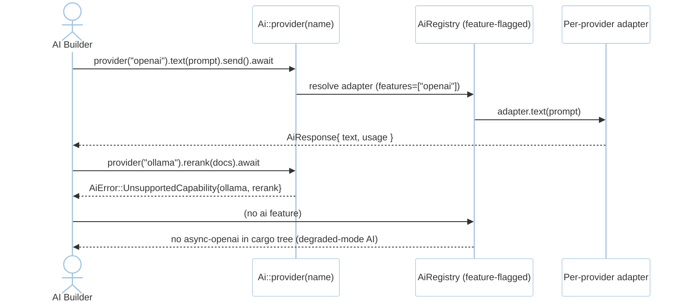
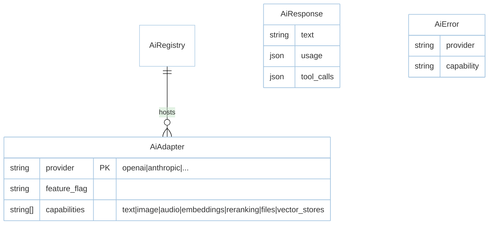

# Feature: AI SDK (M6)

> **Module:** `intelligence-delivery` — [overview.md](overview.md) · **FSD:** FS-M6-05 · **FR:** FR-606, FR-612 · **BC:** BC-6
> **Stories:** US-M6-05 (provider-agnostic trait over 12) · **BDD:** `@ai-sdk`

## 1. Feature Overview
- **Brief Description:** Provider-agnostic `trait AiProvider { text/image/audio/embeddings/reranking/files/vector_stores -> AiResponse/AiImage/etc. }` with adapters per provider (`openai`, `anthropic`, `gemini`, `azure`, `bedrock`, `groq`, `xai`, `deepseek`, `mistral`, `ollama`, `openrouter`, `openai_compatible`) each feature-flagged `features=["openai"]` / `rustavel-ai optional` (so `cargo check -p rustavel-router` pulls no `async-openai` — NFR-Sca-02 degraded-mode AI), `Ai::provider("openai").text(prompt).send().await -> AiResponse{ text, usage, tool_calls }`, unsupported capability → `AiError::UnsupportedCapability{provider,capability}` (`ollama` reranking / `groq` files), `reranking`/`files` handling per provider spec.
- **Role in Module:** Capability traits × adapters matrix; switching provider is one config change.
- **Business Value:** Laravel 13 #1 parity; per-provider semver isolation.

## 2. User Stories

### US-M6-05 — AI SDK provider-agnostic trait over 12 providers
**Sebagai** AI application builder **Saya ingin** provider-agnostic `Ai` across 12 **Sehingga** switching is one-line

**AC:** `Ai::provider("openai").text("hello").send().await` succeeds → `anthropic` same shape; `Ai::provider("ollama").rerank(docs)` (reranking unsupported) → `UnsupportedCapability{provider:"ollama",capability:"rerank"}`; `groq`/`files` similar; `features` excluding `ai` → `cargo check` not in dep graph; 12-provider adapter list invariant (outline over 12 names).

## 3. Business Flow & Rules

### 3.1 Business Flow


### 3.2 Business Rules
- 12-adapter list matches `docs/laravel-13-research.md` at doc date — new providers additive only.
- `AiResponse` shape uniform across providers (typed trait return).
- Per-provider streaming mismatch → `UnsupportedCapability` (see `ai-agents.md` for streaming bridge).

## 4. Data Model



## 5. Public Interface

```rust
#[async_trait] trait AiProvider: Send + Sync {
    async fn text(&self, prompt: &str) -> Result<AiResponse, AiError>;
    async fn image(&self, prompt: &str) -> Result<AiImage, AiError>;
    async fn audio(&self, prompt: &str) -> Result<AiAudio, AiError>;
    async fn embeddings(&self, text: &str) -> Result<Vec<f32>, AiError>;
    async fn rerank(&self, query: &str, docs: &[String]) -> Result<Vec<RankedDoc>, AiError>;
    async fn files(&self, op: FileOp) -> Result<FileRef, AiError>;
    async fn vector_stores(&self, op: VectorStoreOp) -> Result<VectorStore, AiError>;
}
struct AiRegistry { /* 12 adapters */ }
impl AiRegistry {
    fn provider(&self, name: &str) -> &dyn AiProvider; // UnsupportedCapability per method via adapter
}
struct AiResponse { text: String, usage: serde_json::Value, tool_calls: Vec<ToolCall> }
enum AiError { UnsupportedCapability { provider: String, capability: String }, Provider { name: String, source: String } }
// Adapters: openai, anthropic, gemini, azure, bedrock, groq, xai, deepseek, mistral, ollama, openrouter, openai_compatible
```

- Feature gating `Cargo.toml`: `rustavel-ai = { optional=true, features=["openai",...] }`.

## 6. Dependencies
- `async-openai` + per-provider SDKs, `foundation` feature flags, `tdd.md BC-6`.

## 7. Limitations
- Provider drift mitigated via per-adapter feature-flag + semver per adapter (R-02).

## 8. Compliance
- Degraded-mode AI: `rustavel-router` alone → no AI deps in `cargo tree --depth 1` (NFR-Sca-02).

## 9. Implementation Tasks

| ID | Component | Status | Description |
|----|-----------|--------|-------------|
| F-M6-AI-01 | AiProvider trait | Todo | 7 methods + UnsupportedCapability |
| F-M6-AI-02 | 12 adapters | Todo | per-provider feature flags + text/embeddings/… |
| F-M6-AI-03 | Degraded-mode | Todo | `rustavel-ai` optional; `cargo tree` probe |
| F-M6-AI-04 | Tests | Todo | switch provider preserves shape, unsupported capability outline, flag gate |

## 10. Cross-References
- API: [api-ai](../../api/intelligence-delivery/api-ai.md) — SDK section
- Tests: [test-advanced](../../testing/intelligence-delivery/test-advanced.md) · BDD `@ai-sdk` · `testing/stubs/m6-advanced.stub.rs`
- Domain: `domain.md BC-6 AiProvider`

## 11. Skill Reference
| Layer | Skill |
|-------|-------|
| QA | `test-planning` — decision table 12×7 capability matrix |
| BDD | `test-generation` — 12-provider outline |
| Contract | `test-generation` — `AiResponse` shape stability |
| Chaos | `non-functional-testing` — provider 500 injection + fallback |
