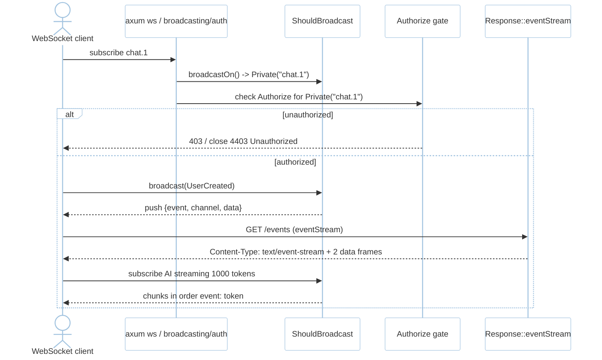
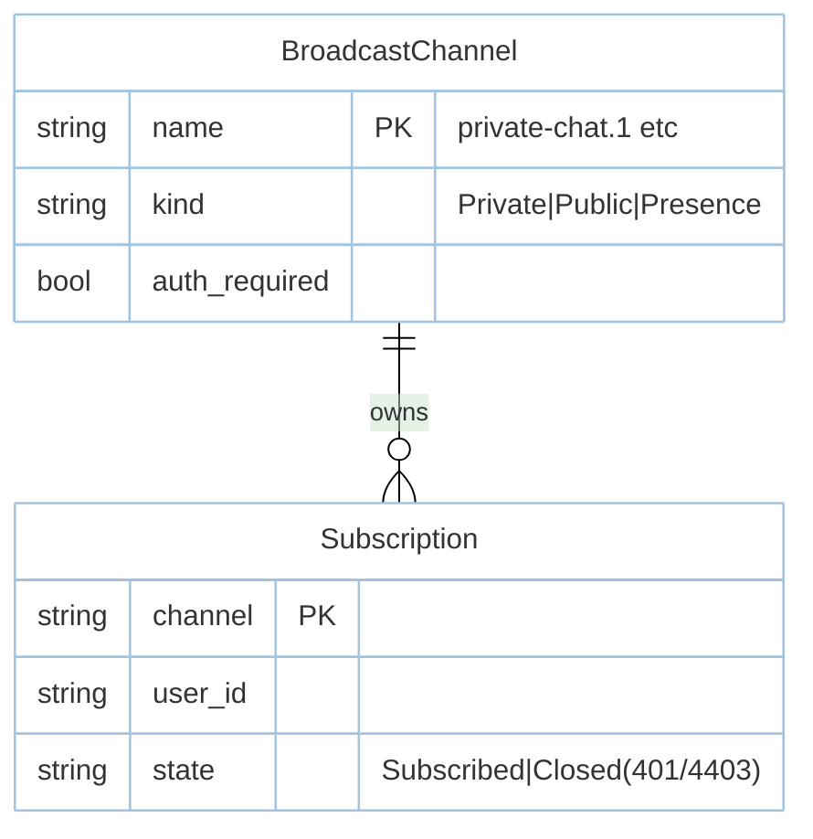

# Feature: Broadcast & SSE (M6)

> **Module:** `intelligence-delivery` — [overview.md](overview.md) · **FSD:** FS-M6-01 · **FR:** FR-600..601, FR-610 adjacency · **BC:** BC-6
> **Stories:** US-M6-01 (WebSocket + SSE with channel auth) · **BDD:** `@broadcast`, `@contracts-expansion` adjacency

## 1. Feature Overview
- **Brief Description:** WebSocket via `axum::extract::ws` + `tokio-tungstenite` with `ShouldBroadcast { fn broadcastOn(&self)->Channel }` (`Channel::Private(String)`/`Public`/`Presence`) over `ws://host/broadcasting/auth` with `Authorize` gate (`Unauthorized { channel: "private-chat.1"}` → WebSocket close `4403` / HTTP `403`), `ws close 4403` on unauthorized, serialized push `{ event:"UserCreated", channel:"private-chat.1", data:{...} }` via `serde`, SSE `Response::eventStream(stream)` → `Content-Type: text/event-stream` chunks `event:` frames, AI streaming broadcast over WS chunk order preserved (`event: token`), bounded `mpsc(64)` backpressure → `Lagged` overflow not OOM.
- **Role in Module:** Realtime primitive; AI streaming multiplexes over same WS mechanism.

## 2. User Stories

### US-M6-01 — WebSocket broadcasting + SSE with channel auth
**Sebagai** Rust developer **Saya ingin** `ShouldBroadcast` WebSocket with auth + SSE `eventStream` **Sehingga** realtime without external service

**AC:** `ShouldBroadcast{channel:Private("chat.1")}` with `Authorize` allowing `user 1` → subscriber receives `UserCreated`; user `2` without access → `Unauthorized{private-chat.1}` / ws `4403`; `Response::eventStream(stream_of(["hello","world"]))` on `/events` → `Content-Type: text/event-stream` + two `data:` frames; streaming `1000` tokens subscriber receives chunks in order with `event: token`.

## 3. Business Flow & Rules

### 3.1 Business Flow


### 3.2 Business Rules
- Channel naming: `private-` prefix on private channels in wire (`private-chat.1`).
- SSE sets `Content-Type: text/event-stream` and streams `event:` chunks; bounded `mpsc` overflow → `Lagged` (not OOM).
- AI streaming shares this WS channel; truncation mid-`event: token` is close frame not silent success (Chaos suite).

## 4. Data Model



- State machine: `Idle → Subscribed → Streaming → Closed(401/4403)` per `domain.md BC-6`.
- `ShouldBroadcast::broadcastOn() -> Channel` is the `Serialize` → broadcast trait.

## 5. Public Interface

```rust
trait ShouldBroadcast: Serialize + Send + Sync { fn broadcast_on(&self) -> Channel; }
enum Channel { Public(String), Private(String), Presence(String) }
enum BroadcastError { Unauthorized { channel: String } } // HTTP 403 / ws close 4403
fn event_stream<S>(stream: S) -> Response // Content-Type: text/event-stream (s. §7)
// Client: ws://host/broadcasting/auth ; subscription to private-chat.1 without auth -> 403/4403
// Push shape: { event: "UserCreated", channel: "private-chat.1", data: {...} }
```

## 6. Dependencies
- `foundation` (AppState), `http-routing` WS routes, `events` `ShouldBroadcast`, `rustasea-broadcast` crate, `tokio-tungstenite`, `serde`.

## 7. Limitations
- Slow consumer via bounded `mpsc(64)` → `Lagged` signal (chaos-supervised).

## 8. Compliance
- Channel auth is `Authorize` gate; unauthorized subscribe `4403` not silent drop.

## 9. Implementation Tasks

| ID | Component | Status | Description |
|----|-----------|--------|-------------|
| F-M6-BRD-01 | ShouldBroadcast | Todo | channels Private/Public/Presence + broadcastOn |
| F-M6-BRD-02 | WS + auth | Todo | `axum ws` + Authorize + close 4403 |
| F-M6-BRD-03 | SSE | Todo | `eventStream` `text/event-stream` frames + bounded mpsc |
| F-M6-BRD-04 | Tests | Todo | authorized receives, unauthorized 4403, SSE 2 frames, WS AI streaming |

## 10. Cross-References
- API: [api-broadcast](../../api/intelligence-delivery/api-broadcast.md)
- Tests: [test-advanced](../../testing/intelligence-delivery/test-advanced.md) · BDD `@broadcast` · `testing/stubs/m6-advanced.stub.rs`
- Domain: `domain.md BC-6`, `architecture.md BC-6`

## 11. Skill Reference
| Layer | Skill |
|-------|-------|
| API | `technical-documentation` Part A (WS security scheme + SSE) |
| QA | `test-planning` — state `Subscribed→Closed 4403` |
| BDD | `test-generation` — WS authorized/unauthorized + SSE |
| Chaos | `non-functional-testing` — mpsc Lagged backpressure, truncated mid-token stream |

---

> **Archive note (rebrand 2026-09-09):** project renamed from Rustavel to **RustaSea**.
> This document is archived as-is under the historical `Rustavel` name for traceability;
> current branding is RustaSea (`rustasea` crates, `RustaSea` prose).
