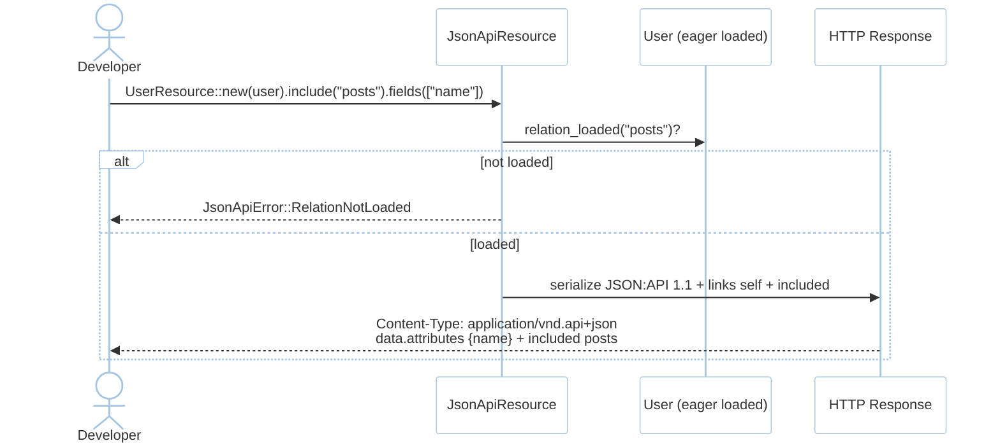
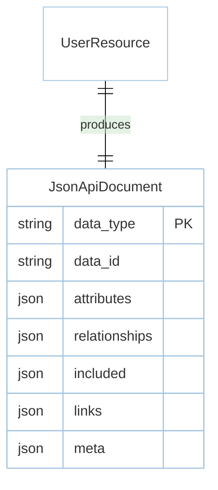

# Feature: JSON:API (M6)

> **Module:** `intelligence-delivery` — [overview.md](overview.md) · **FSD:** FS-M6-03 · **FR:** FR-604 · **BC:** BC-6
> **Stories:** US-M6-03 (sparse + include + RelationNotLoaded) · **BDD:** `@jsonapi`

## 1. Feature Overview
- **Brief Description:** `trait JsonApiResource: Serialize { fn fields(&mut self, &[&str])->&mut Self; fn include(&mut self, relation: &str)->&mut Self; fn to_response(self)->Response }` emitting JSON:API 1.1 `{ data:{type,id,attributes,relationships,links:{self}}, included:[{type,id,attributes}], links{self}, meta{…} }` with `Content-Type: application/vnd.api+json`, sparse fieldsets `fields[users]=name,email` filtering `attributes` (outline over `name`→`name` etc.), inclusion `include=posts` requiring eager-loaded relation (otherwise `JsonApiError::RelationNotLoaded{relation}`), links `self`.
- **Role in Module:** Spec-compliant serializer without hand-rolled JSON.

## 2. User Stories

### US-M6-03 — JSON:API Resources with sparse fieldsets and inclusion
**Sebagai** Rust developer **Saya ingin** `JsonApiResource` sparse + include + `application/vnd.api+json` **Sehingga** spec-compliant without serializers

**AC:** `UserResource::new(user)` where `user` with `posts` loaded → `include("posts").fields(["name"]).to_response()` is `application/vnd.api+json` with `data.attributes` only `name` + `included` containing posts; `include("posts")` where not eager → `RelationNotLoaded{relation:"posts"}`; sparse outline `fields name`→`name`, `name,email`→`name,email`.

## 3. Business Flow & Rules

### 3.1 Business Flow


### 3.2 Business Rules
- `include` is allowed only if relation already eager-loaded by `QueryBuilder::with("posts")` — eager requirement mirrors `ErrorBag` 422 not silent omission.
- Sparse `fields` filters `attributes`; `relationships` still emitted with `data` refs.
- `Paginated<T>` adjacency: `Paginated<T>` meta/links are JSON:API-consistent with `JsonApiResource` `meta`/`links`.

## 4. Data Model



- (`type:"users"`, `id`, `attributes:{name,email}` etc.) snapshot at `testing/contracts/__snapshots__/jsonapi-user.json.snap`.

## 5. Public Interface

```rust
trait JsonApiResource: Serialize {
    fn fields(&mut self, fields: &[&str]) -> &mut Self;
    fn include(&mut self, relation: &str) -> &mut Self;
    fn to_response(self) -> Response; // Content-Type: application/vnd.api+json
}
enum JsonApiError { RelationNotLoaded { relation: String } }
// US returns Result<T, JsonApiError> via to_response() error path
```

## 6. Dependencies
- `serde`, `data-orm` `Model::relation_loaded`, `router` response.

## 7. Limitations
- Sparse fieldsets affect only `attributes`; `relationships` are unaffected.

## 8. Compliance
- Snapshot `jsonapi-user.json.snap` via `cargo insta`.

## 9. Implementation Tasks

| ID | Component | Status | Description |
|----|-----------|--------|-------------|
| F-M6-JA-01 | Serializer | Todo | `JsonApiResource` sparse + include + links |
| F-M6-JA-02 | Guard | Todo | `RelationNotLoaded` when not eager |
| F-M6-JA-03 | Tests | Todo | fieldset+include happy, not-loaded, sparse outline |

## 10. Cross-References
- API: [api-jsonapi](../../api/intelligence-delivery/api-jsonapi.md)
- Tests: [test-advanced](../../testing/intelligence-delivery/test-advanced.md) · BDD `@jsonapi` · `testing/contracts/jsonapi.schema.json` + `__snapshots__/jsonapi-user.json.snap`

## 11. Skill Reference
| Layer | Skill |
|-------|-------|
| QA | `test-planning` — contract |
| BDD | `test-generation` — `@jsonapi` with sparse outline |
| Contract | `test-generation` — `jsonapi.schema.json` + snapshot |
| Chaos | `non-functional-testing` — include large compound doc size guard |

---

> **Archive note (rebrand 2026-09-09):** project renamed from Rustavel to **RustaSea**.
> This document is archived as-is under the historical `Rustavel` name for traceability;
> current branding is RustaSea (`rustasea` crates, `RustaSea` prose).
