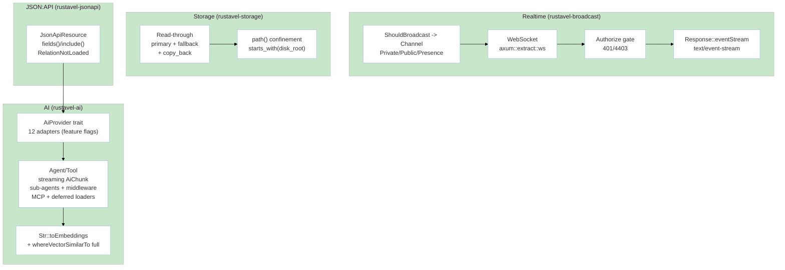

# Module: IntelligenceDelivery (M6 — Advanced: Broadcast, Storage, JSON:API, AI)

> **Status:** P8 Final — 2026-09-07 | **Task:** TASK-013
> **Parents:** `requirements/{prd §M6,fsd §3.7,tdd BC-6,bdd-scenarios §2.7,user-stories US-M6-01..07}.md` · `design/{architecture BC-6,domain BC-6,database §2 (vector/storage),api-contracts §5}` · `modules/manifest.md` · `sprints/sprint-07.md`
> **Crates:** `rustavel-broadcast` · `rustavel-storage` · `rustavel-search` · `rustavel-ai` · `rustavel-jsonapi` (and `pgvector` M6-full via search)
> **Milestone:** M6 | **BR:** BR-07 | **FR:** FR-600..612 | **FSD:** FS-M6-01..07 | **BC:** BC-6 | **Stories:** US-M6-01..07

## Header & Navigation

- [Manifest](../manifest.md) · [App README](../../README.md)
- API: [api-broadcast](../../api/intelligence-delivery/api-broadcast.md) · [api-storage](../../api/intelligence-delivery/api-storage.md) · [api-jsonapi](../../api/intelligence-delivery/api-jsonapi.md) · [api-ai](../../api/intelligence-delivery/api-ai.md)
- Testing: [testing/intelligence-delivery/overview.md](../../testing/intelligence-delivery/overview.md)

## 1. Module Introduction

### 1.1 Brief Description
The differentiator. Provides WebSocket broadcasting (`axum::extract::ws` + `tokio-tungstenite`) with `ShouldBroadcast` channels (`Private`/`Public`/`Presence`) + channel auth `Authorize` gate (`403`/`4403`) and SSE `Response::eventStream` (`text/event-stream`), read-through `Storage` (`primary: "s3"` + `fallback: "local"` + optional `copy_back`) with `Storage::path()` canonical `starts_with(disk_root)` confinement (`PathTraversal`), `JsonApiResource` sparse fieldsets (`fields[users]=name,email`)/inclusion (`include=posts`)/`RelationNotLoaded`, queued notifications `#[deleteWhenMissingModels]` (`NotificationSkipped{MissingModel}`), and the provider-agnostic AI SDK (12 providers: OpenAI/Anthropic/Gemini/Azure/Bedrock/Groq/xAI/DeepSeek/Mistral/Ollama/OpenRouter/OpenAI-Compatible via `AiProvider` trait — `text`/`image`/`audio`/`embeddings`/`reranking`/`files`/`vector_stores` + `AiResponse`, `UnsupportedCapability`) plus Agents (`Agent`/`Tool` streaming, broadcast over WebSocket, queued tool calls, deferred loaders `SimilaritySearch`/`FileStorage`/`ToolSearch`, sub-agents, middleware, anonymous `Ai::agent(|a| a.tool(...))`, MCP `feature="mcp"` else `McpUnavailable`) and `make:agent`/`make:tool` generators + `Str::toEmbeddings`/`dropVectorIndex` + `whereVectorSimilarTo` full (HNSW/IVFFLAT).

### 1.2 Position & Role
- **Type:** Optional differentiator — core builds without it (`rustavel-ai` is `optional`; `cargo check -p rustavel-router` has no `async-openai` — NFR-Sca-02).
- **Value:** End-to-end agentic delivery + realtime without wiring four SDKs.
- **Depends on:** M1 (WS routes), M2/M6 vector columns, M4 (queue streaming), M5 (generators/harness). Feature-flagged so M6 delay does not gate Must block.

## 2. Feature List

| Feature | Description | Detail |
|---------|-------------|--------|
| Broadcast & SSE | `ShouldBroadcast`, channel `Private`/`Public`/`Presence`, WS auth, `eventStream` SSE bounded `mpsc(64)` | [broadcast.md](broadcast.md) |
| Storage | Read-through `primary`/`fallback`/`copy_back`, `object_store` S3/GCS/Azure vs `tokio::fs` local, `path` confinement, `exists` | [storage.md](storage.md) |
| JSON:API | `JsonApiResource` sparse fieldsets + inclusion + `RelationNotLoaded` | [jsonapi.md](jsonapi.md) |
| AI SDK | 12-provider `AiProvider` trait, `text`/`image`/`audio`/`embeddings`/`reranking`/`files`/`vector_stores`, `AiResponse`, `AiError`, opt-in feature flags | [ai-sdk.md](ai-sdk.md) |
| AI Agents | `Agent`/`Tool`, streaming `AiChunk` `event: token`, WS broadcast, sub-agents, middleware, deferred loaders, MCP `feature="mcp"`, queued tools, `make:agent`/`make:tool`, `Str::toEmbeddings`/`dropVectorIndex` | [ai-agents.md](ai-agents.md) |

## 3. High-Level Architecture

- Streaming is `Stream<Item=AiChunk>` with `event: token` frames over WS; truncated WS is a close frame, not a silent success.
- Crate starts as aggregator; profiling flattens when the plan changes — never for convenience.

## 4. Global Dependencies

- **Deps:** `axum ws`, `tokio-tungstenite`, `object_store` + `tokio::fs`, `serde`, `serde_json`, `async-openai` + per-provider SDKs (each `optional feature`), `pgvector` (HNSW/IVFFLAT), `schemars` (Tool schema), `jsonapi` types.
- **Schema:** `database.md §2` vector columns `VECTOR(1536)` + HNSW index + `dropVectorIndex` DDL; `storage_objects` optional metadata index.
- **Feature gating:** `rustavel-ai` `features=["openai","anthropic","gemini","azure","bedrock","groq","xai","deepseek","mistral","ollama","openrouter","openai_compatible"]`; MCP is `feature="mcp"`.

## 5. Skill Reference

| Layer | Skill | Trace |
|-------|-------|-------|
| API | `technical-documentation` Part A | [api-broadcast](../../api/intelligence-delivery/api-broadcast.md), [api-storage](../../api/intelligence-delivery/api-storage.md), [api-jsonapi](../../api/intelligence-delivery/api-jsonapi.md), [api-ai](../../api/intelligence-delivery/api-ai.md) |
| QA | `test-planning` | `@broadcast`/`@storage-readthrough`/`@jsonapi`/`@ai-sdk`/`@ai-agents`/`@vector-search` |
| BDD | `test-generation` | `bdd-scenarios §2.7` (7 features, 9 scenarios+outlines) |
| Contract | `test-generation` | `contracts/jsonapi.schema.json` + `__snapshots__/jsonapi-user.json.snap`, `model-inspector.schema.json`, `route-list` adjacency |
| Security | `security-audit` | `path-traversal.corpus.json` (Sec-03), private-channel auth, allow-list adjacency |
| Chaos | `non-functional-testing` | WS `Lagged` backpressure, `dropVectorIndex` mid-search fallback to seq scan (TC-M6-25), AI mid-stream drop |

## 6. Compliance

- `Storage::path("../../etc/passwd")` → `PathTraversal` (NFR-Sec-03; corpus + fuzz).
- Private channel without auth → `403`/`4403` (broadcast contract).
- Degraded-mode AI: core has no AI deps (NFR-Sca-02, NFR-Sca modularity) — verified via `cargo tree --depth 1` in CI.
