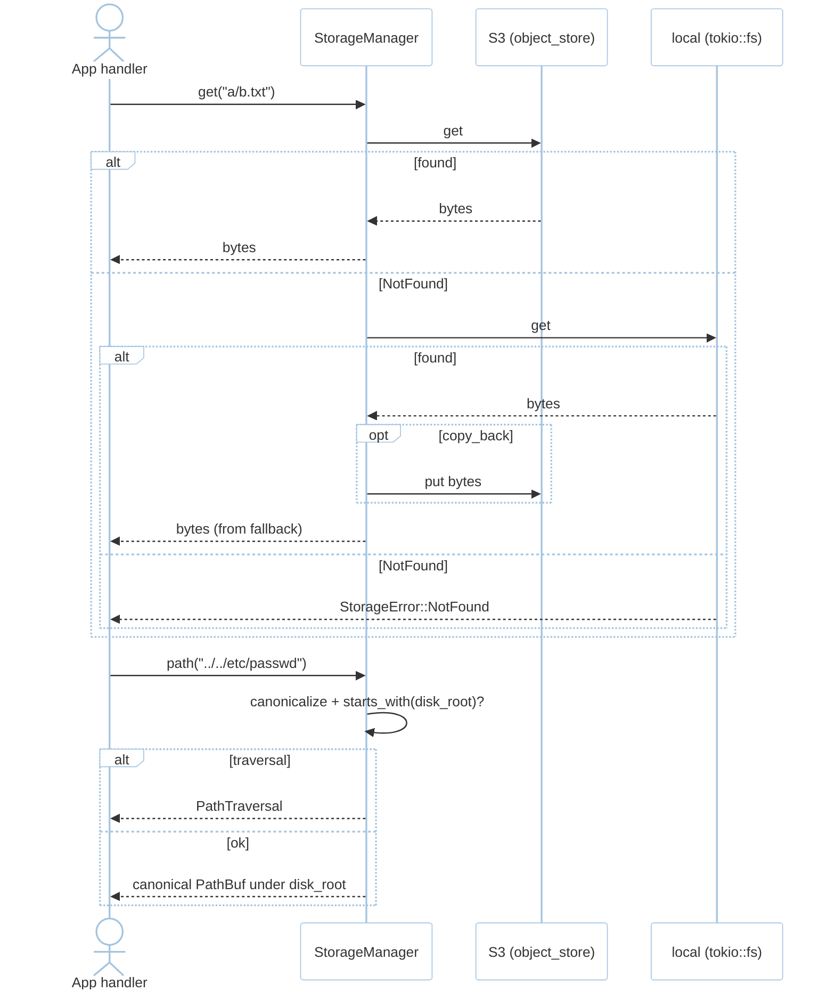
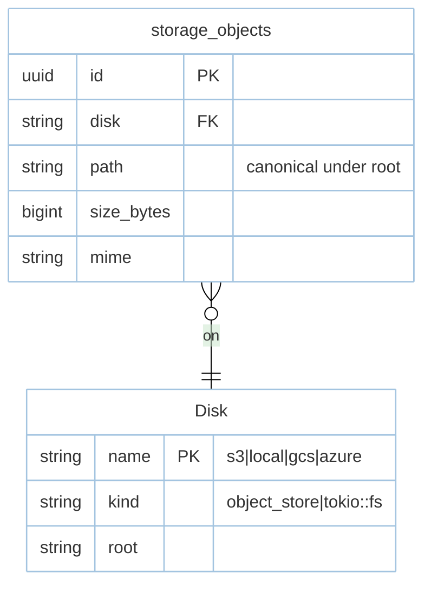

# Feature: Storage (M6)

> **Module:** `intelligence-delivery` — [overview.md](overview.md) · **FSD:** FS-M6-02 · **FR:** FR-603, FR-611 · **BC:** BC-6
> **Stories:** US-M6-02 (read-through + path confinement) · **BDD:** `@storage-readthrough`

## 1. Feature Overview
- **Brief Description:** Read-through `StorageManager { disks: HashMap<String,Disk> }` with `{ primary:"s3", fallback:"local", copy_back: bool }` — `get("a/b.txt").await` tries primary; `NotFound` falls through to fallback; `copy_back:true` writes `fallback` bytes to `primary`; disks backed by `object_store` (S3/GCS/Azure) or `tokio::fs` (local); `path("a/b.txt") -> canonical PathBuf` via `resolved.starts_with(disk_root)` → `StorageError::PathTraversal` on escape (no fs access); `put("a/b.txt", bytes)`/`exists("a/b.txt")`/`size` DDL via `storage_objects`.
- **Role in Module:** Data gravity migrator without code changes.
- **Business Value:** Storage migration without re-plumb; traversal impossible (corpus + fuzz).

## 2. User Stories

### US-M6-02 — Storage read-through with path confinement
**Sebagai** platform engineer **Saya ingin** read-through primary+fallback (+copy_back) + `Storage::path()` confinement **Sehingga** migrate without code + impossible traversal

**AC:** `{primary:"s3",fallback:"local"}` where `a/b.txt` only on `local` → `Storage::get("a/b.txt")` returns `local` bytes; `Storage::path("../../etc/passwd")` → `PathTraversal` without fs access; `copy_back:true` fell through `get("a/b.txt")` → `primary` now stores it; both missing → `NotFound` uniform.

## 3. Business Flow & Rules

### 3.1 Business Flow


### 3.2 Business Rules
- Traversal is `path`-time — no filesystem probe needed.
- Virtual `path` on S3 disk (not filesystem path) still confinement-checked logically.
- Fallback also `NotFound` → surfaced as `NotFound` (not fallback-to-error-of-primary hides).

## 4. Data Model



- `storage_objects` is optional metadata index (file bytes live on disk/object_store); `UNIQUE(disk,path)` + `idx_storage_disk_path(disk,path)`.

## 5. Public Interface

```rust
struct StorageManager { disks: HashMap<String, Disk> }
impl StorageManager {
    fn disk(&self, name: &str) -> &Disk;
    async fn get(&self, path: &str) -> Result<Vec<u8>, StorageError>; // read-through primary->fallback + copy_back
    async fn put(&self, path: &str, bytes: Vec<u8>) -> Result<(), StorageError>;
    fn path(&self, path: &str) -> Result<PathBuf, StorageError>; // canonicalize + starts_with(disk_root)
    async fn exists(&self, path: &str) -> Result<bool, StorageError>;
}
enum StorageError { NotFound, PathTraversal, StoreUnavailable }
// Config: { primary: "s3", fallback: "local", copy_back: true }
```

## 6. Dependencies
- `object_store` (S3/GCS/Azure) or `tokio::fs` (local), `foundation`, `architecture.md §3`.

## 7. Limitations
- `copy_back` races on concurrent `get` duplicate — last write wins (same bytes).

## 8. Compliance
- NFR-Sec-03 fuzzed corpus `testing/fixtures/path-traversal.corpus.json` (`..`, `%2e%2e`, long chains, symlink).

## 9. Implementation Tasks

| ID | Component | Status | Description |
|----|-----------|--------|-------------|
| F-M6-STO-01 | Read-through | Todo | primary→fallback + copy_back + NotFound uniform |
| F-M6-STO-02 | Path confinement | Todo | `path.starts_with(disk_root)` → `PathTraversal` |
| F-M6-STO-03 | Disks | Todo | `object_store` vs `tokio::fs` abstraction |
| F-M6-STO-04 | Tests | Todo | fallback read, PathTraversal corpus, copy_back, missing uniform |

## 10. Cross-References
- API: [api-storage](../../api/intelligence-delivery/api-storage.md)
- Tests: [test-advanced](../../testing/intelligence-delivery/test-advanced.md) · BDD `@storage-readthrough` · `testing/fixtures/path-traversal.corpus.json` · `testing/stubs/m6-advanced.stub.rs`

## 11. Skill Reference
| Layer | Skill |
|-------|-------|
| QA | `test-planning` — corpus boundary on `..%2f`/`..\\`/symlink |
| BDD | `test-generation` — outlines Missing files uniform + copy-back |
| Security | `security-audit` — RegisterSec03 PathTraversal corpus (#9) |
| Chaos | `non-functional-testing` — S3 down mid-readthrough fallback observable |

---

> **Archive note (rebrand 2026-09-09):** project renamed from Rustavel to **RustaSea**.
> This document is archived as-is under the historical `Rustavel` name for traceability;
> current branding is RustaSea (`rustasea` crates, `RustaSea` prose).
