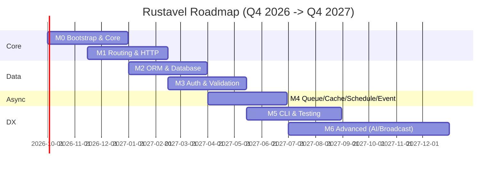
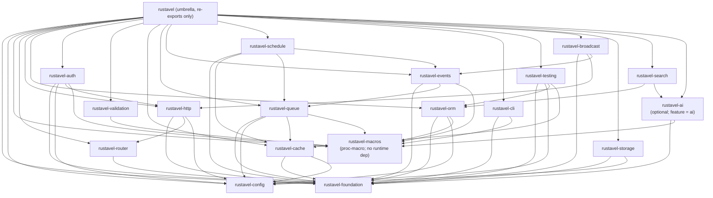

# Rustavel — Presentation Brief

> **Purpose:** Stakeholder-facing overview of the Rustavel SDLC blueprint — for investors, leadership, and engineering review. Concise synthesis; prior docs are the source of truth.
> **Date:** 2026-09-07 | **Status:** Discovery Complete — Conditional Pass (Blueprint Audit P8A)
> **Sources:** `README.md` · `docs/laravel-13-research.md` · `requirements/{brief,brd,prd,validation}.md` · `design/architecture.md` · `tasks/{roadmap.md,sprints/manifest.md}` · `application/blueprint-audit.md`

---

## 1. Executive Summary

**Rustavel is a Rust framework with Laravel ergonomics** — expressive routing, Eloquent-fluent ORM, Artisan-style code generation, and batteries-included DX — on Rust's ownership, compile-time safety, and `tokio`-native concurrency.

**Core thesis:** *Laravel proves ergonomics and velocity win hearts; Rust proves safety and performance win production. Rustavel proves you can have both.* (`README.md` §Vision, `brd.md` §1)

| Dimension | Answer |
|-----------|--------|
| **What** | Workspace framework: 18 crates (`rustavel-*`) + umbrella `rustavel` — incremental adoption, pay-for-crates-you-use |
| **Why now** | Laravel 13 shipped AI SDK + vector + declarative attributes as headlines (2026-03-17, 20 features); `tokio`/`axum`/`sqlx`/`pgvector` stabilized; Goravel v1.18 proves Laravel→compiled-language thesis |
| **Scope** | 7 dependency-ordered milestones M0–M6; 76 FRs (FR-000–FR-612), 9 BRs, 20/20 Laravel 13 features traced; 37 blueprint docs + 6 ADRs + 134 test cases |
| **Horizon** | Q4 2026 → Q4 2027 · 7 sprints (1:1 with milestones) · ~13–18 weeks wall-clock @2 devs +20% contingency (30–40% M6) |
| **Differentiator** | Typed `Job<T>`/`Event<T>` (no `any`), vector-native from M2, provider-agnostic AI over 12 providers (M6), explicit `AppState: Arc` (no global facades) |
| **Go / No-Go** | **GO — Conditional** per `validation.md` §6: M0 spike gate (2-week container+provider+`#[route]` prototype) → public M0 `v0.1.0` adoption signal → M2 exit gate before M6 |

**Audit status:** Blueprint Audit **CONDITIONAL PASS** — D3–D6 PASS, D1 WARN (7 per-module `overview.md` deferred to TASK-013, expected), D2 FAIL (1 ASCII crate DAG in `architecture.md` §3 — 10-min Mermaid fix). Handoff to Sprint 01 approved. (`blueprint-audit.md` §10)

---

## 2. Problem & Opportunity

### Problem (solution-free)

Teams that built on Laravel/Rails/Django hit a ceiling on **performance, correctness, and concurrency** as traffic and team size grow. Rewriting in Rust restores runtime guarantees but destroys the velocity and ergonomics that made the original framework productive — a forced trade-off: *ship fast OR run fast, never both.* (`validation.md` §1)

**Current workarounds and cost:**

- Stay on PHP and patch with caching/queue tuning + horizontal scaling (rising infra + ops cost).
- Extract hot paths as Go/Rust microservices (polyglot tax, deployment complexity, knowledge split).
- Assemble raw `axum`/`actix` + `sqlx` + `tokio` per project — 8–12 crates before M0–M2 parity, 3–5 days before "hello authenticated user" vs. `laravel new` in minutes.

**Verifiable behaviors:** `cargo new` + `axum` requires manual wiring of config/DI/migrations/auth/validation; typed job payloads are `serde_json::Value` without a framework; vector search is bolted on per-project despite Laravel 13 making it headline #6.

### Target Users

| Persona | Role | Pain | Quote |
|---------|------|------|-------|
| **Mira — Platform Lead** (primary) | 40-person B2B SaaS, Laravel monolith + 3 Go services, evaluating Rust | Rebuilding auth/validation/queue per service; `any` payloads; crate-scoped docs | *"I don't need another router. I need `laravel new` for Rust."* |
| **Ken — Solo Founder** (secondary) | Rust-first product, ships alone | No `make:model`, proc-macro DIY | *"If I have to write my own `make:model` again I'm going back to Rails."* |

Platform/SRE (queue metrics, graceful shutdown) and AI builders (provider-agnostic agents + `pgvector`) are secondary stakeholders (`brd.md` §3).

### Opportunity

- **Validation signal:** Goravel 1.8k+ stars, v1.18 — proves demand for Laravel DX on a compiled language.
- **Falsifiable hypothesis:** If we ship Laravel-idiomatic Rust with `cargo rustavel make:*`, typed container/providers, `axum` routing, `sqlx` ORM + `#[derive(Model)]`, and typed `Job<T>`/`Event<T>`, teams like Mira's will adopt for ≥1 production service within 90 days because it eliminates 3–5 days of per-service boilerplate. (`validation.md` §2)
- **Highest-risk assumptions (pre-M2 gates):** #1 demand for framework DX (High) — 10 interviews; #2 `axum`/`tower`/`sqlx`/`tokio` can support Laravel idioms without `unsafe` (High) — 2-week M0 spike.

---

## 3. Solution Overview

### Value Proposition

> **For backend teams that outgrew Laravel on performance but not on productivity, Rustavel is the Rust framework that boots a production-ready service in minutes — unlike raw `axum`/`actix` (weeks of assembly) and unlike Goravel/Go (reintroduces `any` and global facades), Rustavel leverages Rust's type system to make ergonomics safer.** (`validation.md` §3.4)

**Four principles:** Convention over configuration · Type safety as a feature · Zero-cost ergonomics · Incremental adoption (one crate or the full stack). (`brief.md`, `brd.md`)

**Design synthesis:**

| Laravel strength | Rust strength | Rustavel synthesis |
|------------------|---------------|--------------------|
| Expressive routing, middleware, validation | Ownership, fearless concurrency | `axum` + typed extractors + `#[middleware]`/`#[validate]` proc-macros |
| Eloquent — fluent, chainable | Compile-time checked queries | `sqlx`/`sea-orm` + `#[derive(Model)]` + `whereVectorSimilarTo` from M2 |
| Artisan code generation | `cargo` + proc-macros + `clap` | `cargo rustavel make:*` via `clap`+`xtask` |
| Queue / Schedule / Events | `tokio` async runtime | Typed jobs/events, backpressure-aware queues |
| Blade / JSON:API resources | `serde`/`askama` | `JsonApiResource` via `serde` |
| Batteries-included DX | Minimal runtime, no GC | Pay only for crates you include |

Unlike Goravel: explicit `AppState: Arc` via `axum::extract::State` (no `static mut` facades), strongly-typed generics over `any`, proc-macros over reflection. (`README.md` §Goravel Inspiration)

### Laravel 13 Feature Mapping (20 Headlines)

All 20 Laravel 13.0.0 features (2026-03-17, PHP 8.3+) mapped to milestones — 10 NEW + 10 IMPROVED. Full matrix in `README.md` §Laravel 13 Feature Map and `prd.md` §8.

| # | Laravel 13 Feature | Type | Milestone | Rustavel Delivery |
|---|---------------------|------|-----------|-------------------|
| 1 | AI SDK (`laravel/ai`, 12 providers) | NEW | **M6** | Provider-agnostic `AiProvider` trait |
| 2 | AI Agents (tools, streaming, MCP, queueing) | NEW | **M6** | `make:agent`/`make:tool`, sub-agents, middleware |
| 3 | JSON:API Resources (`JsonApiResource`) | NEW | **M6** | `serde` + sparse fieldsets, `application/vnd.api+json` |
| 4 | Queue Routing by Class (`Queue::route()`) | NEW | **M4** | `Queue::route::<Job>(queue:)` registry |
| 5 | Cache `touch()` — extend TTL | NEW | **M4** | `Store` + `Repository::touch()` |
| 6 | Semantic/Vector Search (`whereVectorSimilarTo`) | NEW | **M2** (initial) + **M6** (full) | `pgvector` + `vector` column, feature-flagged |
| 7 | Expanded PHP Attributes (declarative) | NEW | **M5** | `#[middleware]`, `#[tries]`, `#[authorize]` proc-macros |
| 8 | Laravel Cloud Facade & Queue metrics | NEW | **M4** | `pendingSize`/`delayedSize`/`reservedSize`/`oldestPendingJob` |
| 9 | Read-through Filesystem | NEW | **M6** | `Storage` primary+fallback + path confinement |
| 10 | Schedule Pause/Resume | NEW | **M4** | `schedule:pause`/`resume` + `SchedulePaused` event |
| 11 | Request Forgery — origin-aware `Sec-Fetch-Site` | IMPROVED | **M3** | `PreventRequestForgery` + origin allow-list |
| 12 | Cache & Session Hardening | IMPROVED | **M3/M4** | JSON serialization default, `serializable_classes` allow-list |
| 13 | Eloquent Collection Serialization | IMPROVED | **M2** | `serde` round-trip preserves eager relations |
| 14 | Database Upsert/Delete | IMPROVED | **M2** | Strict `uniqueBy` validation, MySQL `DELETE JOIN` |
| 15 | Eloquent/Query Builder Additions | IMPROVED | **M2** | `insertOrIgnoreReturning`, `chunkBy`, `whereBinary` |
| 16 | Event/Queue Contract Expansion | IMPROVED | **M4** | `dispatchAfterResponse`, `JobAttempted`/`QueueBusy` renames |
| 17 | Mail/Notification Defaults | IMPROVED | **M6** | `#[deleteWhenMissingModels]` |
| 18 | HTTP Client & Process | IMPROVED | **M1** | `reqwest` wrapper, `throw` callbacks, idle timeout |
| 19 | Routing & Validation | IMPROVED | **M1/M3** | Domain-route precedence, strict `in_array`, `ErrorBag` |
| 20 | Observability & Tooling | IMPROVED | **M1/M5** | `show:model`, `route:list` binding fields, `Str` resets |

> **Ask early:** M0/M1 specs cite Laravel #20 adjacency (Container `call` nullability → `Option<T>`, `Manager::extend` closure binding) captured as FR-002/FR-006. (`prd.md` §8)

---

## 4. Market & Competition

> Source: `validation.md` §3 — 7 competitors profiled (direct + indirect + cross-language reference). Sizing is proxy-based, flagged Medium/Low confidence.

### Market Sizing — Rust Web Frameworks

| Level | Definition | Estimate | Basis |
|-------|------------|----------|-------|
| **TAM** | Web backend where Rust is viable (perf-sensitive APIs, platforms, infra) | **~450k devs** (1.5M Rust devs × ~30% web/backend) | Rust Survey 2025–2026, GitHub/Stack Overflow — proxy |
| **SAM** | Values perf **and** ergonomics (would choose batteries-included over raw crates) | **~110k–160k devs** (25–35% of TAM; ex-Laravel/Rails/Django or Goravel teams) | Goravel traction + Laravel "most loved" + `axum`/`actix` download ratios |
| **SOM (3yr)** | Rustavel's realistic capture if M0–M2 ship with strong DX | **~600–2,000 active projects** (0.5–1.5% of SAM) | Analog: Goravel ~1.8k stars in Go; Loco/Rocket <5k each |
| **Model** | MIT/Apache-2.0 OSS — adoption, not revenue, is the near-term metric; paid Cloud/support/vector are post-M6 options mirroring Laravel Cloud (#8) | — | `README.md` §License |

### Competitor Matrix (7)

| Competitor | Language | Positioning | Core Strengths | Weakness vs. Rustavel Thesis |
|------------|----------|-------------|----------------|------------------------------|
| **Laravel 13** | PHP 8.3+ | DX king; 20 features (AI SDK, vector, JSON:API, queue routing) | Unmatched ergonomics, ecosystem, hiring pool | Dynamic typing, GC, concurrency limits — the ceiling Rustavel escapes |
| **Goravel v1.18** | Go | Laravel port for Go — closest prior art | Proves providers, container, ORM facades, Artisan CLI translate; 1.8k+ stars | `any`/`interface{}` payloads, global facades, `gin`, stringly-typed config — all fixed by Rustavel (`AppState`, generics, proc-macros, typed `config`+`serde`) |
| **Axum** | Rust | Modular HTTP on `tokio`/`tower` | `tower` middleware, extractors, `tokio` alignment — **Rustavel's chosen base** | Deliberately unopinionated — no ORM/auth/queue/CLI |
| **Actix Web** | Rust | High-perf actor-based HTTP | Benchmark leader, mature | Actor model diverges from Laravel mental model; Tower gap |
| **Rocket** | Rust | Ergonomic, codegen-heavy | Attribute macros, batteries-included feel (closest DX in Rust) | Historically nightly-tied, slower `tokio` alignment; no ORM/queue story |
| **Loco** | Rust | Rails-like framework | Convention, jobs, `sea-orm` — most direct "Rails for Rust" | Rails mapping (not Laravel/Goravel); no AI/vector headline; smaller community |
| **Dioxus** | Rust | Fullstack / frontend-first | Excellent for UI-heavy Rust apps | **Indirect** — not a backend competitor; validates Rust DX appetite |

### Feature Gaps Rustavel Exploits

| Gap | Who Leaves It | Rustavel Opportunity |
|-----|---------------|----------------------|
| Laravel-grade DX on a compiled, memory-safe runtime | `axum`/`actix` (DIY), Loco (Rails idioms) | Typed Laravel idioms: container, providers + DAG, `make:*`, `Job<T>` |
| Strongly-typed jobs/events/queue routing | Goravel `any`; raw Rust `serde_json::Value` | `Queue::route::<Job>` + typed traits (M4, #4) |
| Vector search as a framework primitive | Bolt-on per project | `whereVectorSimilarTo` from M2 via `pgvector` (#6) |
| Declarative attributes over config | Laravel 13 expanded #7 | Proc-macros are idiomatic Rust: `#[middleware]`, `#[tries]` |
| JSON:API + real-time + AI in one stack | Fragmented crates | M6: `JsonApiResource`, WebSocket/SSE, 12-provider `rustavel-ai` |

---

## 5. Product & Milestones (M0–M6)

> Timeline is **aspirational, refined after M0 ships**. Each milestone ships as a tagged release with migration notes (`roadmap.md` §1, `README.md` §Roadmap). Dependency DAG has no cycles — verified in `architecture.md` §3.

### Roadmap at a Glance

| Milestone | Focus | Target Window | Depends On | Sprint | FRs | Status |
|-----------|-------|---------------|------------|--------|-----|--------|
| **M0** | Bootstrap & Core | Q4 2026 (2026-10-01 → 2026-12-31) | — | Sprint 01 | FR-000–FR-008 (9) | Planned |
| **M1** | Routing & HTTP | Q4 2026 – Q1 2027 (2026-11-15 → 2027-02-15) | M0 | Sprint 02 | FR-100–FR-109 (10) | Planned |
| **M2** | ORM & Database | Q1 2027 (2027-01-01 → 2027-03-31) | M0, M1 | Sprint 03 | FR-200–FR-210 (11) | Planned |
| **M3** | Auth, Middleware & Validation | Q1–Q2 2027 (2027-02-15 → 2027-05-15) | M1, M2 | Sprint 04 | FR-300–FR-311 (12) | Planned |
| **M4** | Queue, Cache, Scheduling & Events | Q2 2027 (2027-04-01 → 2027-06-30) | M0, M2, M3 | Sprint 05 | FR-400–FR-410 (11) | Planned |
| **M5** | DX, CLI & Testing | Q2–Q3 2027 (2027-05-15 → 2027-08-31) | M0–M4 | Sprint 06 | FR-500–FR-509 (10) | Planned |
| **M6** | Advanced (Broadcast, Search, FS, AI SDK, Real-time) | Q3–Q4 2027 (2027-07-01 → 2027-12-31) | M1–M5 | Sprint 07 | FR-600–FR-612 (13) | Planned |

**Gantt** (from `roadmap.md` §3 — Mermaid rendered in presentation deck):



**Delivery DAG** (overlap is intentional — Sprint N+1 may scaffold once its dependency's sub-crate is stable, but cannot **close** before dependencies are tagged):

```
M0 ─┬─► M1 ─┬─► M3 ─┬─► M4 ─► M5 ─► M6
    │      │      │      ▲      ▲
    │      └─► M2 ┘      │      │
    └────────► M2 ───────┘      │
           (M2 initial vector)   │
                  M6 full vector─┘
```
Critical path: M0 → M1 → M2 → M3 → M4 → M5 → M6. Slack: M4 can start once M2 stable even if M3 CSRF polish slips ~2 weeks.

### Milestone Detail (Scope → Deliverables → Success Criteria)

| Milestone | Goal | Key Deliverables | Success Criteria (testable) | Laravel 13 Trace |
|-----------|------|------------------|-----------------------------|------------------|
| **M0** | Bootable skeleton | `rustavel` umbrella, `rustavel-foundation`, `rustavel-config`, `cargo rustavel new <app>` scaffold, `bootstrap/app.rs`, `config/`, `AppServiceProvider` | `cargo run` boots, loads `config/*.toml`+`.env` (env wins), resolves `Singleton` via `Make` (`Arc::ptr_eq`), `SIGTERM` drains | #20 `Manager::extend`, Container `call` |
| **M1** | Expressive HTTP | `rustavel-router`, `rustavel-http`, `routes/web.rs`, `#[route]` macro, `route:list` | `Route::get` equivalent returns `200`; `route:list --json` shows `binding_fields: ["slug"]`; domain catch-all does not shadow; `throttle` emits `429` | #18 HTTP client, #19 domain priority, #20 `route:list` |
| **M2** | Type-safe DB | `rustavel-orm`, `#[derive(Model)]`, `database/migrations/`, `make:model`/`make:migration`, `pgvector` flag | `User` model → `migrate` → `Factory::create` → `whereVectorSimilarTo` top-10 → `serde` round-trip preserves relations | #6 vector, #13 serialization, #14 upsert/delete, #15 builder |
| **M3** | Hardened auth/validation | `rustavel-auth`, `rustavel-validation`, `make:middleware`/`make:request`, JWT+session guards | Guard mismatch → `GuardMismatch`; cross-site `POST` without valid `Sec-Fetch-Site` → `403`; strict validation rejects loose equality | #11 CSRF, #12 hardening, #19 validation |
| **M4** | Observable async | `rustavel-queue`/`cache`/`events`/`schedule`, `make:job`/`make:event`/`make:listener` | Routed job executes; `Cache::touch` extends TTL without `get`/`set`; `schedule:pause` emits `SchedulePaused` | #4 queue routing, #5 `touch`, #8 metrics, #10 pause/resume, #16 contracts |
| **M5** | Laravel-like DX loop | `rustavel-cli`, `rustavel-macros`, `rustavel-testing`, `bootstrap/commands.rs`, `tests/feature/` | `make:controller` scaffolds compiles; `cargo test` spins isolated Postgres via `testcontainers`; `Str` factories reset | #7 attributes, #20 `ModelInspector`/`route:list` |
| **M6** | Differentiate | `rustavel-broadcast`/`storage`/`search`/`ai`, `app/ai/agents/`+`tools/`, `make:agent`/`make:tool`, `JsonApiResource` | `Agent`+`Tool` streams over WebSocket in order; `Storage::path("../../etc/passwd")` → `PathTraversal`; `cargo check -p rustavel-router` does not pull `async-openai` | #1 AI SDK, #2 Agents, #3 JSON:API, #6 full, #9 FS, #17 mail, #18 SSE |

---

## 6. Technical Highlights

### Stack (one crate per row — single source of truth is `README.md` §Tech Stack, `architecture.md` §1)

| Layer | Crate(s) | Rationale |
|-------|----------|-----------|
| Async runtime | `tokio` 1.x | De-facto; powers `axum`, `sqlx`, `deadpool`; `select!` shutdown |
| HTTP | `axum` 0.7 + `tower` + `tower-http` | Extractor routing, Tower middleware (CORS, rate-limit, tracing); preferred over `actix-web` for `tokio` alignment |
| ORM / DB | `sqlx` (primary) + `sea-orm` (optional shim) | `sqlx` compile-time checked queries + `pgvector`; `sea-orm` ActiveRecord ergonomics behind flag |
| Pooling | `deadpool` / `bb8` | Postgres + Redis, `tokio`-aware |
| Validation | `validator` + `rustavel-validation` | Derive macros + `ErrorBag`/`FormRequest` |
| Auth | `jsonwebtoken` + `argon2` + `tower-sessions` | JWT guards, password hashing, session store (JSON default) |
| Serialization | `serde` + `serde_json` | Config, JSON:API, queue payloads, session |
| Config | `config` + `dotenvy` | Layered `config/*.toml` + env + `.env`, typed via `serde` |
| CLI | `clap` (derive) + `cargo xtask` | `cargo rustavel` subcommands; `dialoguer`/`indicatif` for prompts |
| Proc-macros | `syn` + `quote` + `proc-macro2` | `#[route]`, `#[middleware]`, `#[derive(Model)]`, `#[tries]` |
| Queue | `tokio` + `deadpool-redis` + `serde_json` | Redis-backed typed payloads; `backoff` for retry |
| Cache | `moka` (memory) + `deadpool-redis` | TTL-aware `moka` + distributed Redis behind `Store` trait |
| Scheduling | `tokio-cron-scheduler` / `cron` | Cron parsing + `schedule:run` loop |
| Templating | `askama` (preferred) or `minijinja` | Compile-time checked (askama) vs runtime (minijinja) |
| WebSocket/SSE | `tokio-tungstenite` + `axum::extract::ws` | Real-time broadcast + `eventStream` |
| HTTP client | `reqwest` | Async client with `throw` callbacks |
| Filesystem | `object_store` + `tokio::fs` | S3/GCS/Azure abstraction + local read-through |
| Vector/AI | `pgvector` + `async-openai` + per-provider SDKs | `rustavel-ai` feature-flagged trait over 12 providers |
| Testing | `testcontainers` + `sqlx::test` + `cargo test` | Isolated DB/cache per test run |
| Lint/Format | `rustfmt` + `clippy -D warnings` | CI-enforced; generated code is format-clean |

### Crate Dependency DAG (No Cycles)

> Validated via `cargo metadata | jq` and `xtask check-cycles`. `architecture.md` §3 — image below is the Mermaid source for the deck.



**Why acyclic:** M0 (foundation/config/macros) is root. M1 depends only on M0. M2 on M0+M1. M3 on M1+M2. M4 on M0+M2+M3. M5 aggregates M0–M4. M6 is feature-flagged leaf — no M0–M5 crate imports M6, so no back-edge.

**Workspace invariant:** `[workspace] members = ["crates/*"]`, `resolver = "2"`, single `workspace.dependencies` — each crate `cargo check`-clean standalone (incremental adoption gate `cargo tree --depth 1` in CI).

### Architecture Decisions (ADRs)

| ADR | Title | Status | One-line |
|-----|-------|--------|----------|
| ADR-001 | HTTP framework: `axum` over `actix-web` | **Accepted** — M1 | Tower-native, `tokio`-aligned, simpler ownership |
| ADR-002 | ORM: `sqlx` primary, `sea-orm` optional | **Accepted** — M2 | Compile-time SQL + `pgvector`; `sea-orm` shim behind flag |
| ADR-003 | Async stack: single `tokio` runtime | **Accepted** — M0 | One executor, `select!` shutdown, shared pools |
| ADR-004 | Workspace crate boundaries per FR domain | **Accepted** — M0 | One crate per milestone domain; umbrella re-export |
| ADR-005 | Facades replaced by `AppState: Arc` | **Accepted** — M0 | `axum::extract::State` + `OnceLock`; no `static mut` |
| ADR-006 | Vector as feature-flagged Postgres extension | **Accepted** — M2/M6 | `pgvector` behind `vector` feature; MariaDB as second flag |

Full ADRs: `design/decisions/ADR-00*.md`. New cross-crate decisions **MUST** add an ADR and update `architecture.md` §4.

### Security & Reliability (Cross-Cutting)

- **CSRF:** `PreventRequestForgery` — token first, then `Sec-Fetch-Site: cross-site` triggers origin allow-list; `GET`/`HEAD`/`OPTIONS` exempt.
- **Session/Cache:** JSON serialization default, `serializable_classes` allow-list before `Deserialize`, hyphenated `-cache-`/`-session-` prefixes.
- **Storage:** `Storage::path()` canonicalizes + `starts_with(disk_root)` — fuzzed with `..` corpus.
- **Auth:** `jsonwebtoken` HS256, `argon2` with per-password salt, constant-time verify.
- **Error handling:** `thiserror` typed enums per crate with `code`+`hint`+`source`; `#[deny(clippy::unwrap_used)]`.
- **Graceful shutdown:** Single binary, three `tokio::spawn` groups (HTTP + queue workers + scheduler ticker) draining on `SIGTERM` up to `shutdown_timeout` (default 10s). (`architecture.md` §5, §7)

---

## 7. Go-to-Market & Next Steps

### Roadmap Execution: Sprint Plan (Normalized)

> **Normalization applied:** `roadmap.md` and `sprints/manifest.md` are the source of truth (7 sprints = 7 milestones, 1:1). No secondary sprint plan required — manifest IS the normalized sprint plan after roadmap decomposition.

| Sprint | Window (overlap intentional) | Goal | Release Tag | Branch |
|--------|------------------------------|------|-------------|--------|
| **Sprint 01 — M0** | 2026-10-01 → 2026-12-31 | Bootstrap & Core | `v0.1.0` | `main` |
| **Sprint 02 — M1** | 2026-11-15 → 2027-02-15 | Routing & HTTP | `v0.2.0` | `main` |
| **Sprint 03 — M2** | 2027-01-01 → 2027-03-31 | ORM & Database | `v0.3.0` | `main` |
| **Sprint 04 — M3** | 2027-02-15 → 2027-05-15 | Auth & Validation | `v0.4.0` | `main` |
| **Sprint 05 — M4** | 2027-04-01 → 2027-06-30 | Queue/Cache/Schedule/Events | `v0.5.0` | `main` |
| **Sprint 06 — M5** | 2027-05-15 → 2027-08-31 | CLI & Testing | `v0.6.0` | `main` |
| **Sprint 07 — M6** | 2027-07-01 → 2027-12-31 | Advanced (AI/Broadcast/FS/JSON:API) | `v0.7.0` | `main` |

- **Capacity:** 26–36 dev-weeks (2-person team) → ~13–18 weeks wall-clock +20% contingency (30–40% on M6, the 13-FR Very High complexity sprint). `roadmap.md` §6, `manifest.md` §3, `prd.md` §7.
- **Gating:** Each tag requires `cargo xtask ci` (fmt+clippy+test) green on CI (2 vCPU baseline per NFR-Per-01), `cargo tree` incremental-adoption check, `xtask check-cycles` DAG check, and `CHANGELOG.md` entry (Keep a Changelog, created at M0).
- **Allocation proof:** `sprints/allocation-audit.md` proves all 76 FRs allocated exactly once, no gaps/overlaps/duplicates; every Laravel feature has ≥1 FR, every FR has ≥1 BDD `@tag` (33 Gherkin features, 134 test cases).
- **How to use the manifest:** Kickoff = read sprint file Goal+Scope+Tasks+Dependencies (DoR = FRs+FSD reviewed); daily = track Tasks acceptance; review = run Acceptance checklist then tag version.

### Top Risks & Mitigations (from `prd.md` §7, `validation.md` §4.2, `roadmap.md` §7)

| # | Risk | L×I | Mitigation | Owner |
|---|------|-----|------------|-------|
| **R-01** | ORM duality (`sqlx` vs `sea-orm`) doubles maintenance (Score 15) | 3×5 | **Spike + ADR before M2**: commit to `sqlx` primary, `sea-orm` as optional compat layer behind feature flag | Tech Lead |
| **R-05** | `Queue::route` wrong-queue delivery (race/ordering) (12) | 3×4 | `OnceLock` registry after `boot`; duplicate `route` → error; E2E per-job routing test | M4 lead |
| **R-06** | `pgvector` extension missing (managed DBs) (12) | 3×4 | `vector` feature flag + `has_extension("vector")` guard in migration + docs workaround | M2/M6 lead |
| **R-07** | Scope creep — M6 drags Must block (12) | 3×4 | MoSCoW gate: M6 is **Should**; RFC required to promote any M6 FR to Must | PM |
| **R-02** | 12-provider AI trait drifts (12) | 4×3 | Per-provider adapter crate; per-provider feature-flag; semver per adapter | M6 lead |
| *(validation)* | **Trait/lifetime ergonomics make DX worse than raw `axum`** (High) | M×H | M0 2-week spike must achieve `Route::get` with typed extractors without `unsafe` — fail → pivot to library crates | M0 owner |
| *(validation)* | **No external adoption despite good DX** (High) | M×H | Ship M0 publicly early; measure stars/PRs; invest in docs/examples over more features | PM |

### Go / No-Go Gates (Validation Decision: GO Conditional)

| Gate | Criterion | What Happens on Fail |
|------|-----------|----------------------|
| **M0 spike gate** (2 weeks, 1–2 eng) | Container + `ServiceProvider` lifecycle + `#[route]` demonstrates Laravel-like ergonomics without `unsafe`, acceptable `cargo check` time | **Pivot:** re-scope to focused library crates (`rustavel-router` + `rustavel-orm` standalone) |
| **Public M0 gate** (`v0.1.0`) | `cargo rustavel new` published; measure adoption (stars/issues/try-outs) before committing M2 headcount | Invest in docs/examples before more code |
| **M2 exit gate** | `serde` collection round-trip + migration story green; `whereVectorSimilarTo` stays feature-flagged | M6 (AI SDK) cannot start |
| **M3–M6 re-validation gate** | Re-run competitor check (Loco/Rocket/Axum releases) and Laravel 14 delta before approving M3–M6 funding | Roadmap amendment via ADR |

### Call to Action

| Audience | Ask | Decision Needed By | Artifact to Approve |
|----------|-----|--------------------|---------------------|
| **Leadership / Investors** | Approve **GO Conditional** to fund M0 spike (2 weeks, 1–2 eng) | **Week of 2026-10-01** | This brief + `validation.md` §6 + `roadmap.md` §1–§6 |
| **Engineering** | Staff Sprint 01; fix **D2-F01** (ASCII→Mermaid, ~10 min) and start `rustavel-foundation` + `rustavel-config` per `sprint-01.md` | Immediately after M0 green-light | `sprints/sprint-01.md` → `sprints/sprint-07.md` + `blueprint-audit.md` |
| **Security** | Review BR-04/NFR-Sec controls (CSRF origin, session allow-list, path confinement) | Before M0 tag (`v0.1.0`) | `tdd.md` BC-3/BC-6 + `api-contracts.md` §4.1 + `architecture.md` §5 |
| **Product** | Confirm M0 spike timebox and public `v0.1.0` adoption signal (≥10 stars + ≥3 RFCs @ M0+30d) | At M0 kickoff | `brd.md` §2 BG-09 + `validation.md` pivot triggers |

**Next reading order (traceability chain):**

`requirements/brief.md` → `brd.md` (9 BRs) → `prd.md` (76 FRs, 20-feature matrix) → `fsd.md` (33 FS) → `user-stories.md` + `bdd-scenarios.md` → `design/architecture.md` (C4, DAG, 6 ADRs) → `tasks/roadmap.md` + `tasks/sprints/manifest.md` (7 sprints) → `application/blueprint-audit.md` (D1–D6) → **this brief closes the loop.**

---

## Appendix — Traceability Fingerprint

| Chain | Count | Proof |
|-------|-------|-------|
| BRs | 9 (BR-01–BR-09, M6 Should) | `brd.md` §5 |
| FRs | 76 (M0 9 + M1 10 + M2 11 + M3 12 + M4 11 + M5 10 + M6 13) | `prd.md` §8, `allocation-audit.md` §1 — 76/76 allocated exactly once |
| Laravel 13 features | 20/20 traced (10 NEW + 10 IMPROVED) | `prd.md` §8 matrix + `user-stories.md` checklist + `allocation-audit.md` §4 |
| Gherkin features | 33 + 9 outlines | `bdd-scenarios.md` |
| Test cases | 134 (M0 12 … M6 26 + cross 7) | `test-cases.md` |
| ADRs | 6 Accepted | `design/decisions/ADR-001..006` |
| Blueprint docs | 37 md + 5 schemas + 3 snapshots + 4 fixtures + 9 stubs | `blueprint-audit.md` §1 |
| Audit verdict | **CONDITIONAL PASS** — 1 FAIL (D2 ASCII DAG) + 1 WARN (D1 deferred to TASK-013) | `blueprint-audit.md` §10 |

> Full document set: `.agents/documents/{requirements,design,tasks,application}` — 0 true orphans at project root (`blueprint-audit.md` §1).

---

*Prepared for stakeholder review. For implementation handoff see `tasks/sprints/sprint-01.md` → `sprint-07.md`. For M0 feasibility evidence see `validation.md` Assumption Mapping (assumptions #1–#7). Generated per TASK-004 requirement.*
