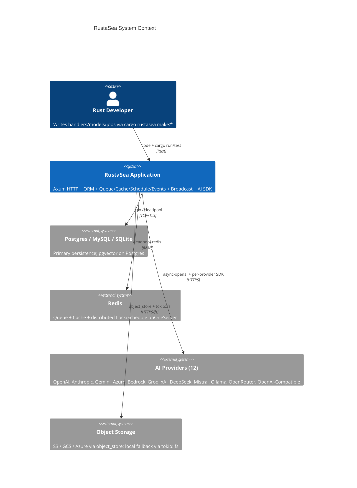
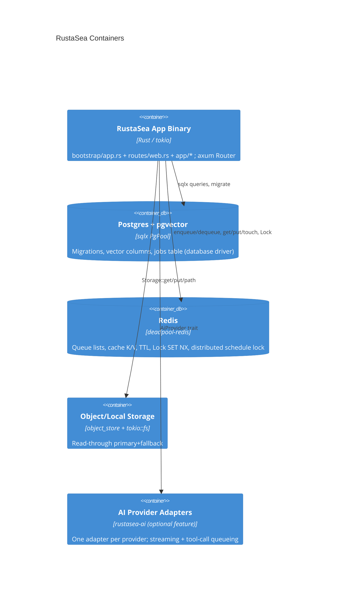
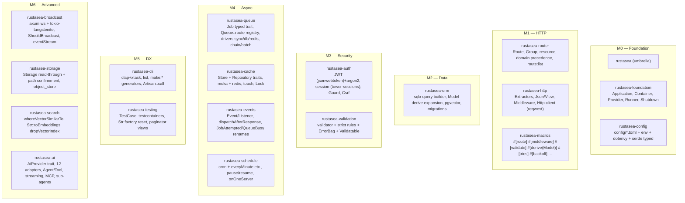
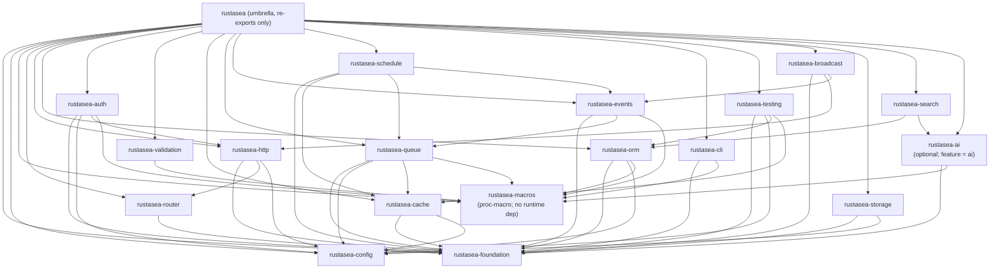

# RustaSea — Technical Architecture

> **Status:** Draft — P3 Technical Architecture & Domain Design (TASK-008)
> **Date:** 2026-09-07 | **Milestones:** M0–M6 | **Stack:** tokio 1.x · axum+tower · sqlx (primary) + sea-orm (optional) · deadpool · serde · clap+xtask · syn/quote · moka+deadpool-redis · pgvector
> **Parents:** `brd.md` · `prd.md` (FR-000–FR-612) · `fsd.md` (FS-M0-01–FS-M6-07) · `README.md` · `docs/laravel-13-research.md`
> **Lineage (P3 → P6):** Authored as a P3 draft and adopted as the design parent by the P6 blueprint (`fsd.md` §8, `tdd.md` §8; `blueprint-audit.md` D4 PASS). The "P3" label records provenance, not unfinished status.
> **Planning vs as-built:** This document records planning intent, not implementation status. Live status: [`docs/milestones.md`](../../../docs/milestones.md) — the authoritative as-built status source (TASK-003).

---

## 1. Goals & Constraints

| # | Driver | Type | Consequence |
|---|--------|------|-------------|
| G-01 | Laravel-ergonomic DX on Rust (BR-01–BR-07) | Business | Every public API must have a Goravel/Laravel analogue mapped in `README.md` §Laravel 13 Feature Map; proc-macros generating `rustfmt`-clean code |
| G-02 | Zero-cost ergonomics (NFR-Per-04, NFR-Sca-02) | Architectural | Pay-for-crates-you-use: workspace-gated `features`; single crate `cargo check` pulls no transitive AI/queue deps |
| G-03 | Hardened security defaults (Laravel 13 #11/#12) | Security | JSON session serialization default; `serializable_classes` allow-list; `Sec-Fetch-Site` CSRF; `-cache-` hyphenated prefixes |
| G-04 | AI/vector-native from day one (Laravel 13 #6, #1–#2) | Differentiator | `pgvector` feature-flagged but present in M2; `rustasea-ai` is `optional` but its trait is designed upfront |

**Hard constraints (C-01–C-05 from PRD §5):** Rust 1.88+ stable, edition 2021, `tokio` everywhere; no `static mut` facades (`Arc<AppState>` via `axum::extract::State`); no `any`/`Box<dyn Any>` for domain payloads; `rustfmt`+`clippy -D warnings` on all `make:*` output; each crate `cargo check`-clean standalone.

---

## 2. C4 Model

### L1 — System Context



External actors other than the developer: **Platform/SRE** (reads queue metrics, triggers `schedule:pause`/`resume`, observes graceful shutdown), **Browser/Client** (HTTP + WebSocket + SSE), **Security auditor** (validates CSRF origin, session allow-list).

### L2 — Container (Deployable Units)



Deployment: single binary; queue workers and HTTP server share the same `AppState` but run on separate `tokio` tasks. `schedule:run` tick loop is a third task. All three drain on `SIGTERM` up to `shutdown_timeout` (default 10s, configurable).

### L3 — Component (Workspace Crates)

The L3 and dependency diagrams below are historical design views, not complete workspace inventories; use the [canonical crate inventory](../application/modules/manifest.md#canonical-crate-inventory-source-of-truth) for the current crate set.



---

## 3. Crate Dependency Graph (DAG — No Cycles)

Edges mean "depends on" (compile-time). Validated post-generation with `cargo metadata --format-version 1 | jq`.



Cross-cutting leaf deps (no crate depends on them in reverse):
  `tokio`, `axum`, `tower`, `tower-http`, `sqlx`, `deadpool`, `deadpool-redis`, `serde`/`serde_json`,
  `jsonwebtoken`, `argon2`, `tower-sessions`, `validator`, `reqwest`, `tokio-tungstenite`,
  `object_store`, `tokio::fs`, `moka`, `async-openai`, `clap`, `dialoguer`, `indicatif`,
  `testcontainers`, `config`, `dotenvy`, `syn`/`quote`/`proc-macro2`, `pgvector`

Acyclicity proof sketch:
  M0 (foundation, config, macros) is root.
  M1 depends only on M0.  M2 depends on M0+M1.  M3 depends on M1+M2.
  M4 depends on M0+M2+M3. M5 depends on M0..M4 (aggregator). M6 depends on M1..M5
  but is feature-flagged; no M0–M5 crate imports M6. Therefore no edge goes
   backwards across milestone index → DAG.

**Workspace structure** (`Cargo.toml` members):

```toml
[workspace]
members = ["crates/*", "xtask"]
resolver = "2"
[workspace.dependencies]
tokio = { version = "1", features = ["full"] }
axum = "0.7"
# ... single source of truth; crates use workspace = true
```

Application skeleton generated by `cargo rustasea new <app>`:

```
<app>/
├── Cargo.toml                # depends on rustasea = { version="0.x", features=[...] }
├── rustasea.toml             # optional overrides (app name, MSRV hint)
├── bootstrap/{app.rs,providers.rs,commands.rs}
├── config/{app.toml,database.toml,cache.toml,queue.toml,auth.toml}
├── routes/web.rs
├── database/{migrations,seeders}
├── resources/views/
├── storage/{app,logs}
├── tests/feature/
└── app/{http/{controllers,middleware},models,providers,console/commands,jobs,events,listeners,ai/{agents,tools},grpc}
```

---

## 4. Key Architectural Decisions (ADR Index)

| ADR | Title | Status | Milestone | One-line |
|-----|-------|--------|-----------|----------|
| [ADR-0003](../../../docs/adr/ADR-0003-axum-vs-actix.md) | HTTP framework: `axum` over `actix-web` | Accepted | M1 | `tower`-native, `tokio`-aligned, simpler ownership |
| [ADR-0004](../../../docs/adr/ADR-0004-sqlx-vs-sea-orm.md) | ORM: `sqlx` primary, `sea-orm` optional | Accepted | M2 | Compile-time checked queries + `pgvector`; `sea-orm` as shim behind feature flag |
| [ADR-0005](../../../docs/adr/ADR-0005-tokio-stack.md) | Async stack: single `tokio` runtime | Accepted | M0 | De-facto runtime powering `axum`/`sqlx`/`deadpool`; `tokio::select!` for shutdown |
| [ADR-0006](../../../docs/adr/ADR-0006-workspace-crates.md) | Workspace crate boundaries per FR domain | Accepted | M0 | One crate per milestone domain; re-export via umbrella (scaffolded) |
| [ADR-0007](../../../docs/adr/ADR-0007-appstate-over-facades.md) | Facades replaced by `AppState: Arc` | Accepted | M0 | `axum::extract::State` + `OnceLock`; no `static mut`; see [ADR-0005](../../../docs/adr/ADR-0005-tokio-stack.md) §Alternatives |
| [ADR-0008](../../../docs/adr/ADR-0008-vector-feature-flag.md) | Vector as feature-flagged Postgres extension | Accepted | M2/M6 | `pgvector` behind `vector` feature; MariaDB as second flag; see [ADR-0004](../../../docs/adr/ADR-0004-sqlx-vs-sea-orm.md) |

Full ADRs: [canonical ADR index](../../../docs/adr/README.md). New cross-crate decisions **MUST** add an ADR and update this table.

---

## 5. Cross-Cutting Concerns

### Error handling
`thiserror`-derived typed enums per crate (`ContainerError`, `ConfigError`, `RouteError`, `QueryError`, `AuthError`, `CacheError` …) with `code` + `hint` + `source` chain per `fsd.md §4.1`. Crate attributes `#[deny(clippy::unwrap_used)]`. New `Store`/`Queue`/`Dispatcher` trait methods use default impl returning `Unsupported` to avoid breaking custom drivers (e.g., `touch` on non-Redis store).

### Security
CSRF: `PreventRequestForgery` — token first, then `Sec-Fetch-Site: cross-site` triggers origin allow-list (`config.app.csrf_origins`). Missing header (older browsers) degrades to token-only. `GET`/`HEAD`/`OPTIONS` exempt.
Session/Cache: JSON serialization default (`session.serialization = "json"`), hyphenated prefixes `-cache-` / `-session-`, `serializable_classes` allow-list checked before `serde` instantiation.
Auth: `jsonwebtoken` HS256, `argon2` with per-password salt, constant-time verify; `tower-sessions` store.
Storage: `Storage::path()` canonicalizes and enforces `path.starts_with(disk_root)` — returns `PathTraversal` on escape; fuzzed with `..` payloads.

### Observability
`route:list --json` emits `{ method, path, name, middleware[], binding_fields[] }` (FS-M1-03); `cargo rustasea show:model` emits `ModelInspector` attributes/relations/casts (FR-109); Queue metrics `pendingSize`/`delayedSize`/`reservedSize`/`creationTimeOfOldestPendingJob` via `Queue` trait (FS-M4-03); schedule emits `SchedulePaused`/`ScheduleResumed` domain events; throttles log `429` with `Retry-After`.

### Configuration
Layered merge `defaults < config/*.toml < .env < process env` via `config` + `dotenvy`; typed `Deserialize` structs (`AppConfig`, `DatabaseConfig`, …) resolved through `AppState::config::<T>()`; parse errors carry `file`+`line` per `ConfigError::Parse`.

---

## 6. Trade-offs (Explicit)

| Choice | Gain | Cost | Mitigation |
|--------|------|------|------------|
| `axum` over `actix-web` | Tower ecosystem, simpler ownership, best `tokio` alignment | Slightly lower raw bench vs actor model | `tower-http` covers throttling/cors/compression; bench at NFR-Per-02 |
| `sqlx` primary over `sea-orm` | Compile-time SQL verification, `query_as!` ergonomics, natural `pgvector` | Less ActiveRecord magic than Eloquent | Proc-macros fill ergonomics; `sea-orm` shim remains available behind flag |
| Single `tokio` runtime | One executor, `select!` shutdown, shared pools | Can't embed sync blocking without `spawn_blocking` | Document `spawn_blocking` for CPU-bound agents/tools |
| Workspace per-crate features | Incremental adoption, thin dep trees (`cargo tree` audit) | Multiple crates increase publish/CI complexity (see the [canonical crate inventory](../application/modules/manifest.md#canonical-crate-inventory-source-of-truth): 21 crates under `crates/` + `xtask`) | `cargo xtask ci` + single `Cargo.toml` workspace dependencies |
| `moka` for memory cache vs `dashmap` | TTL-aware, concurrent, drop-in `Store` impl | Extra dep vs hand-rolled `HashMap+Mutex` | Feature-flag `cache-memory` keeps it optional |
| `pgvector` feature-flag vs mandatory Postgres | Works on MySQL/SQLite without vector | Vector query fallback is sequential scan until indexed | Migration guards with `has_extension("vector")` diagnostic |

---

## 7. Deployment & Runtime Topology

Single binary with three `tokio::spawn` task groups sharing one `PgPool`/`RedisPool`:

```
main
 ├─ axum::Server (bind :3000, Router from rustasea-router)
 ├─ Queue workers (deadpool-redis BRPOP / DB poll; configurable concurrency)
 └─ Scheduler ticker (cron evaluation every 60s; respects schedule_paused flag)

Signal handler (tokio::signal) on SIGTERM/SIGINT:
  stop accepting → drain HTTP up to shutdown_timeout → stop ticker →
  drain queue workers (ack/nack) → flush after-response event buffer → exit 0
  (timeout expiry → log outstanding + exit 1)
```

Health probes: `/health` (liveness), `/ready` (pool connectivity + migration status).

---

## 8. Verification

- **Acyclicity:** `cargo metadata --format-version 1` DAG has no back-edge across milestone indices (script `xtask check-cycles`).
- **Stack justification:** each table row cites a FR or NFR; ADRs 001–003 provide matrices.
- **Incremental adoption:** `cargo check -p rustasea-router` must not pull `sqlx`/`async-openai` (tested in CI with `cargo tree --depth 1`).
- **Security:** CSRF origin, session JSON, allow-list, and path-confinement each have a BDD scenario in `bdd-scenarios.md` covering happy/error/edge.

---

> **Archive note (rebrand 2026-09-09):** project renamed from Rustavel to **RustaSea**.
> This document is archived as-is under the historical `Rustavel` name for traceability;
> current branding is RustaSea (`rustasea` crates, `RustaSea` prose).
