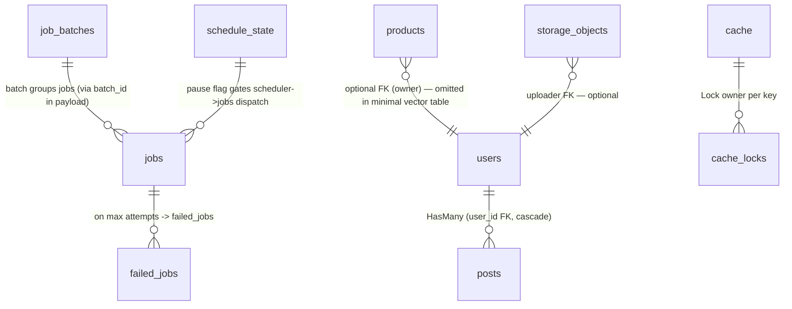

# RustaSea — Database Design

> **Status:** Draft — P3 (TASK-008)  
> **Date:** 2026-09-07  
> **Parents:** `prd.md` (FR-200–210, FR-402, FR-602) · `fsd.md` (FS-M2-01–06, FS-M4-02/04/05) · `architecture.md` · `domain.md`  
> **Drivers:** Postgres (primary, with `pgvector`), MySQL, SQLite. ORM: `sqlx` primary (+ `sea-orm` optional). Pools: `deadpool`. Migrations: `sqlx::migrate!` / `sea-orm-migration`. Success criteria per M2 (see README M2 table).

---

## 1. Conventions (All Tables)

| Rule | Value |
|------|-------|
| PK | `id UUID PRIMARY KEY DEFAULT gen_random_uuid()` (Postgres ≥13; `uuid_generate_v4()` fallback). Application-layer `Uuid::now_v7()` used when client-generated. |
| Timestamps | `created_at TIMESTAMPTZ NOT NULL DEFAULT now()`, `updated_at TIMESTAMPTZ NOT NULL DEFAULT now()` (trigger `set_updated_at()`). |
| Soft delete | `deleted_at TIMESTAMPTZ` nullable; indexed partial `WHERE deleted_at IS NULL`. Business entities only; technical tables (`migrations`, `failed_jobs` excluded). |
| Indexing | Every FK indexed; query hot-paths (`email`, `jobs.queue`, `cache.key`, vector HNSW/IVFFLAT) indexed. |
| Naming | Tables `snake_plural` (`users`, `posts`, `jobs`, `failed_jobs`, `migrations`). FKs `"{entity}_id UUID REFERENCES {parent}(id) ON DELETE CASCADE"`. No non-singular FK. |
| Precision | Money/quantities `NUMERIC(15,2)`, settings/metadata `JSONB` (Postgres) / `JSON` (MySQL/SQLite). No `FLOAT` for monetary. |
| Comments | Every column carries `COMMENT ON COLUMN` in the Postgres migration; MySQL `COMMENT` clause; SQLite `PRAGMA` ignored. |

---

## 2. Schema by Bounded Context

### BC-0/BC-2 — Core & ORM (M0/M2)

#### `migrations` (technical, no soft-delete)

```sql
-- Postgres (sqlx migration 0001__create_migrations_table)
CREATE TABLE IF NOT EXISTS migrations (
  id          UUID PRIMARY KEY,
  name        TEXT NOT NULL UNIQUE,
  batch       INTEGER NOT NULL,
  executed_at TIMESTAMPTZ NOT NULL DEFAULT now()
);
CREATE INDEX idx_migrations_batch ON migrations(batch);
-- MySQL: id CHAR(36), TIMESTAMPS DATETIME, same indexes.
-- SQLite: same DDL without pgvector clauses.
```

#### `users` (example domain aggregate; represents `#[derive(Model)]` output)

```sql
CREATE TABLE users (
  id              UUID PRIMARY KEY DEFAULT gen_random_uuid(),
  name            TEXT NOT NULL,
  email           TEXT NOT NULL,
  email_verified_at TIMESTAMPTZ,
  password        TEXT NOT NULL,         -- argon2 hash
  remember_token  TEXT,
  created_at      TIMESTAMPTZ NOT NULL DEFAULT now(),
  updated_at      TIMESTAMPTZ NOT NULL DEFAULT now(),
  deleted_at      TIMESTAMPTZ,
  UNIQUE (email) WHERE deleted_at IS NULL
);
CREATE INDEX idx_users_email ON users(email);
CREATE INDEX idx_users_deleted_at ON users(deleted_at) WHERE deleted_at IS NOT NULL;
COMMENT ON COLUMN users.deleted_at IS 'Soft delete — NULL means active; partial index for not-deleted fast path.';
```

#### `_trigger` — `updated_at` auto-bump (Postgres)

```sql
CREATE OR REPLACE FUNCTION set_updated_at() RETURNS TRIGGER AS $$
BEGIN NEW.updated_at = now(); RETURN NEW; END; $$ LANGUAGE plpgsql;
CREATE TRIGGER trg_users_updated_at BEFORE UPDATE ON users
  FOR EACH ROW EXECUTE FUNCTION set_updated_at();
-- Applied per business table via helper in migration.
```

#### `posts` (relation example for HasMany)

```sql
CREATE TABLE posts (
  id         UUID PRIMARY KEY DEFAULT gen_random_uuid(),
  user_id    UUID NOT NULL REFERENCES users(id) ON DELETE CASCADE,
  title      TEXT NOT NULL,
  body       TEXT,
  created_at TIMESTAMPTZ NOT NULL DEFAULT now(),
  updated_at TIMESTAMPTZ NOT NULL DEFAULT now(),
  deleted_at TIMESTAMPTZ
);
CREATE INDEX idx_posts_user_id ON posts(user_id);
CREATE INDEX idx_posts_created_at ON posts(created_at);
```

#### `personal_access_tokens` (future, guarded behind auth — scaffolded)

```sql
CREATE TABLE personal_access_tokens (
  id            UUID PRIMARY KEY DEFAULT gen_random_uuid(),
  tokenable_type TEXT NOT NULL,
  tokenable_id   UUID NOT NULL,
  name          TEXT NOT NULL,
  token         TEXT NOT NULL UNIQUE,
  abilities     JSONB,
  last_used_at  TIMESTAMPTZ,
  expires_at    TIMESTAMPTZ,
  created_at    TIMESTAMPTZ NOT NULL DEFAULT now(),
  updated_at    TIMESTAMPTZ NOT NULL DEFAULT now()
);
CREATE INDEX idx_pat_tokenable ON personal_access_tokens(tokenable_type, tokenable_id);
```

### BC-4 — Async Workloads (M4): Queue, Cache, Schedule

#### `jobs` (database queue driver; `sync`/`redis` use memory/Redis lists, no table)

```sql
CREATE TABLE jobs (
  id           BIGSERIAL PRIMARY KEY,
  queue        TEXT NOT NULL,            -- e.g. 'default', 'podcasts', 'urgent'
  payload      JSONB NOT NULL,           -- { job: "ProcessPodcast", data: T, attempts, id, ... }
  attempts     SMALLINT NOT NULL DEFAULT 0,
  reserved_at  TIMESTAMPTZ,
  available_at TIMESTAMPTZ NOT NULL,     -- delay support: available_at > now() means delayed
  created_at   TIMESTAMPTZ NOT NULL DEFAULT now()
);
CREATE INDEX idx_jobs_queue_available ON jobs(queue, available_at) WHERE reserved_at IS NULL;
CREATE INDEX idx_jobs_reserved_at ON jobs(reserved_at) WHERE reserved_at IS NOT NULL;
COMMENT ON COLUMN jobs.payload IS 'Typed Job<T> serialized via serde_json; deserialization gated by serializable_classes allow-list.';
```

*FK note:* `jobs` is queue-internal; no FK to business tables. Payload `data` is validated on dequeue.

#### `failed_jobs`

```sql
CREATE TABLE failed_jobs (
  id         UUID PRIMARY KEY DEFAULT gen_random_uuid(),
  connection TEXT NOT NULL,               -- e.g. 'database', 'redis'
  queue      TEXT NOT NULL,
  payload    JSONB NOT NULL,
  exception  TEXT NOT NULL,
  failed_at  TIMESTAMPTZ NOT NULL DEFAULT now()
);
CREATE INDEX idx_failed_jobs_queue ON failed_jobs(queue);
CREATE INDEX idx_failed_jobs_failed_at ON failed_jobs(failed_at);
```

#### `job_batches` (batch dispatch)

```sql
CREATE TABLE job_batches (
  id               UUID PRIMARY KEY,
  name             TEXT NOT NULL,
  total_jobs       INTEGER NOT NULL,
  pending_jobs     INTEGER NOT NULL,
  failed_jobs      INTEGER NOT NULL DEFAULT 0,
  failed_job_ids   JSONB NOT NULL DEFAULT '[]'::jsonb,
  options          JSONB,
  created_at       TIMESTAMPTZ NOT NULL DEFAULT now(),
  cancelled_at     TIMESTAMPTZ,
  finished_at      TIMESTAMPTZ
);
CREATE INDEX idx_job_batches_finished ON job_batches(finished_at) WHERE finished_at IS NULL;
```

#### `cache` (database cache driver; `memory`/`redis` are in-proc/Redis — not table-backed)

*Postgres example; framework also supports `moka`/`redis` drivers which bypass this table.*

```sql
CREATE TABLE cache (
  key        TEXT PRIMARY KEY,
  value      JSONB NOT NULL,              -- JSON serialized by default (fsd §4.1)
  expiration TIMESTAMPTZ
);
CREATE INDEX idx_cache_expiration ON cache(expiration) WHERE expiration IS NOT NULL;
COMMENT ON COLUMN cache.value IS 'Always JSON (session.serialization=json); deserialization checks serializable_classes allow-list.';
```

#### `cache_locks` (optional — when using DB as lock backend; Redis uses SET NX)

```sql
CREATE TABLE cache_locks (
  key        TEXT PRIMARY KEY,
  owner      TEXT NOT NULL,               -- worker id
  expiration TIMESTAMPTZ NOT NULL
);
```

#### `schedule_state` (pause/resume flag; alternative is Redis key `schedule:paused`)

```sql
CREATE TABLE schedule_state (
  id         SMALLINT PRIMARY KEY DEFAULT 1 CHECK (id = 1), -- singleton row
  paused     BOOLEAN NOT NULL DEFAULT FALSE,
  paused_at  TIMESTAMPTZ,
  paused_by  TEXT,
  updated_at TIMESTAMPTZ NOT NULL DEFAULT now()
);
```

### BC-6 — Intelligence & Filesystem (M6): Vector, Storage refs

#### `products` / `documents` — example vector-enabled table (pgvector)

```sql
-- Requires: CREATE EXTENSION IF NOT EXISTS vector;  (guarded; see §4)
CREATE TABLE products (
  id         UUID PRIMARY KEY DEFAULT gen_random_uuid(),
  name       TEXT NOT NULL,
  embedding  VECTOR(1536),               -- pgvector type; NULL until toEmbeddings() fills
  metadata   JSONB,
  created_at TIMESTAMPTZ NOT NULL DEFAULT now(),
  updated_at TIMESTAMPTZ NOT NULL DEFAULT now(),
  deleted_at TIMESTAMPTZ
);
-- HNSW index (preferred for pgvector ≥0.5; IVFFLAT fallback documented)
CREATE INDEX products_embedding_hnsw ON products
  USING hnsw (embedding vector_cosine_ops) WITH (m = 16, ef_construction = 64);
-- Query: SELECT * FROM products ORDER BY embedding <=> $1 LIMIT $2;
-- Distance operators: <=> cosine, <-> L2, <#> inner product.
COMMENT ON COLUMN products.embedding IS 'pgvector cosine-search column; dimension must match AiProvider::embeddings output; mismatch -> VectorDimensionMismatch.';
```

#### `storage_objects` (optional metadata index for filesystem; file bytes live on disk/object_store)

```sql
CREATE TABLE storage_objects (
  id         UUID PRIMARY KEY DEFAULT gen_random_uuid(),
  disk       TEXT NOT NULL,               -- 's3', 'local', etc.
  path       TEXT NOT NULL,               -- canonical path under disk root
  size_bytes BIGINT NOT NULL,
  mime       TEXT,
  created_at TIMESTAMPTZ NOT NULL DEFAULT now(),
  updated_at TIMESTAMPTZ NOT NULL DEFAULT now(),
  UNIQUE (disk, path)
);
CREATE INDEX idx_storage_disk_path ON storage_objects(disk, path);
```

---

## 3. Entity-Relationship (Text + Mermaid)



Relation notes: `users` ↔ `posts` is the canonical `#[derive(Model)]` HasMany example. Queue tables have no FK into business tables to keep queue domain independent. Vector tables carry no FK requirement.

---

## 4. Migrations

### Tooling

- `sqlx::migrate!` (primary) or `sea-orm-migration` when `sea-orm` feature is enabled. Migrations live in `database/migrations/`.
- Naming: `YYYY_MM_DD_HHMMSS_description.rs` (e.g., `2026_09_07_000001_create_users_table.rs`) with `up(&mut conn)` / `down(&mut conn)`. `SEA-ORM` style uses `Migration` trait.
- `cargo rustasea make:migration create_products_table --create=products` scaffolds a file with `createTable("products")` + vector column helper.
- Commands: `cargo rustasea migrate`, `cargo rustasea migrate:fresh`, `cargo rustasea migrate:fresh --seed`, `cargo rustasea migrate:status`.

### Vector extension guard (M2/M6)

```rust
// In migration up(), before creating vector column:
if !has_extension(&mut conn, "vector").await? {
    return Err(MigrationError::ExtensionMissing {
        extension: "vector",
        hint: "Install pgvector: CREATE EXTENSION vector; — see docs/vector.md for managed-DB workarounds.",
    });
}
// CREATE EXTENSION IF NOT EXISTS vector;  (idempotent, requires superuser or rds_superuser)
```

Dimension mismatch is caught at query time (DB error `vector dimension mismatch`) and mapped to `VectorDimensionMismatch { expected, actual }`.

### Reversibility & Idempotence

- Every `up` has a matching `down` unless `Irreversible` is declared (`MigrationError::Irreversible { name }`). `migrate` records `(name, batch)` in `migrations` table; re-run is no-op. `migrate:fresh` drops all business tables in reverse batch order then re-`up`s. Extra safety: `migrate:fresh` requires `--force` in non-`testing` env.

### Index strategies for vectors

| Strategy | When | DDL |
|----------|------|-----|
| HNSW (recommended, pgvector ≥0.5) | New Postgres, small-to-medium churn | `USING hnsw (embedding vector_cosine_ops) WITH (m=16, ef_construction=64)` |
| IVFFLAT | Large tables where HNSW build is slow | `USING ivfflat (embedding vector_cosine_ops) WITH (lists=100)` — requires `ANALYZE` after creation |
| None (sequential) | Post-`dropVectorIndex` state | No index; query still works via seq scan until reindexed |
| `dropVectorIndex` | `Schema::table("products", \|t\| t.dropVectorIndex("embedding"))` | `DROP INDEX IF EXISTS products_embedding_hnsw;` |

---

## 5. Vector Extension Deep Dive (`pgvector`)

- **Type:** `VECTOR(n)` where `n` matches embedding provider output (e.g., 1536 for `text-embedding-3-small`, 768 for smaller models). Column is nullable until `Str::toEmbeddings` / `AiProvider::embeddings` fills it.
- **Distance:** `whereVectorSimilarTo("embedding", &query_vec, limit: k)` emits `ORDER BY embedding <=> $1 LIMIT k` (cosine). Alternatives: `<->` L2, `<#>` inner product — selectable via API.
- **Providers:** `Str::toEmbeddings("hello", provider: "openai") -> Vec<f32>` (M6) calls `AiProvider::embeddings`. Embedding dimension is provider/model dependent; mismatch with column DDL is a typed error.
- **Blueprint:** `Blueprint::vector("embedding", 1536)` adds `VECTOR(1536)`. `Blueprint::dropVectorIndex("embedding")` drops the associated HNSW/IVFFLAT.
- **MariaDB:** vector column `VECTOR(1536)` behind `mariadb-vector` feature flag; operator mapping differs — isolated to driver abstraction.
- **Feature gating:** `cargo check -p rustasea-orm --no-default-features` builds without `pgvector`; vector code is `#[cfg(feature="vector")]`.

---

## 6. Seeds & Factories

- `database/seeders/*.rs` each implement `Seeder::run(&mut conn)`; idempotent (upsert or `INSERT … ON CONFLICT DO NOTHING`). Invoked via `migrate:fresh --seed` or `cargo rustasea db:seed`.
- Factories: `UserFactory::create(n)` + `definition() -> User` with `sequence` counter and `state(|u| …)` overrides. `Str`/sequence counters reset per test via `TestCase` hook (see `architecture.md` Test Harness).

---

## 7. Multi-Driver Mapping (Postgres / MySQL / SQLite)

| Concern | Postgres | MySQL | SQLite |
|---------|----------|-------|--------|
| UUID PK | `UUID` + `gen_random_uuid()` | `CHAR(36)` with `UUID()` or app-generated `Uuid::now_v7()` | `TEXT` |
| Vector type | `VECTOR(n)` + `pgvector` ext | `VECTOR(n)` via MariaDB (feature-flag) | Not supported — feature excluded at compile |
| JSON | `JSONB` (indexable) | `JSON` | `TEXT` (JSON) |
| `jobs.queue` index | Partial `WHERE reserved_at IS NULL` | `INDEX(queue, available_at)` (no partial) | `INDEX(queue)` |
| Full-text / vector distance | `<=>` / `<->` operators | MariaDB distance funcs | — |
| Migration table | `migrations` (same DDL, type-adjusted) | Same | Same |

Application never branches on driver at call-site — `sqlx` pool type is selected via `config.database.driver` and the builder emits dialect-correct SQL.

---

## 8. Verification

- Every business table has `id UUID PK`, `created_at`/`updated_at`/`deleted_at`, per-convention indexing; verified by `sqlx::migrate` dry-run in CI.
- `whereVectorSimilarTo` integration test (FR-207) runs against a real Postgres with `pgvector` via `testcontainers`; dimension-mismatch and `ExtensionMissing` diagnostics are asserted.
- No FK without index; no `FLOAT` for money; no table without `timestamps`/`soft_delete` unless annotated technical (e.g., `migrations`, `cache`).

---

> **Archive note (rebrand 2026-09-09):** project renamed from Rustavel to **RustaSea**.
> This document is archived as-is under the historical `Rustavel` name for traceability;
> current branding is RustaSea (`rustasea` crates, `RustaSea` prose).
