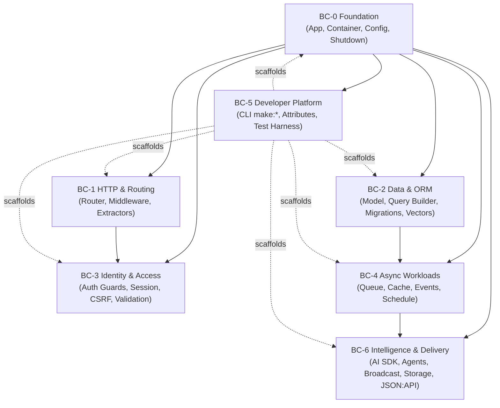

# RustaSea — Domain Model & Bounded Contexts

> **Status:** Draft — P3 (TASK-008)  
> **Date:** 2026-09-07  
> **Parents:** `brd.md` (BR-01–BR-09) · `prd.md` (FR-000–FR-612) · `fsd.md` (FS-M0-01–FS-M6-07) · `architecture.md`  
> **Method:** Domain-Driven Design — event storming → bounded contexts → aggregates → domain events → ubiquitous language
> **Lineage (P3 → P6):** Authored as a P3 draft and adopted as the design parent by the P6 blueprint (`fsd.md` §8, `tdd.md` §8; `blueprint-audit.md` D4 PASS). The "P3" label records provenance, not unfinished status.
> **Planning vs as-built:** This document records planning intent, not implementation status. Live status: [`docs/milestones.md`](../../../docs/milestones.md) — the authoritative as-built status source (TASK-003).

---

## 1. Ubiquitous Language (Glossary)

| Term | Definition | Source |
|------|------------|--------|
| `AppState` | `Arc`-shared application state; replaces Goravel/Laravel global facades. Injected via `axum::extract::State`. | BR-08/C-03 |
| `ServiceProvider` | Unit registering bindings (`register`) and wiring them (`boot`) with explicit DAG ordering via `depends_on`. | FS-M0-01 |
| `Container` | Registry for `Bind` (transient), `Singleton` (once, `Arc<T>`), `Instance` (value). Resolution via `Make<T>`. | FS-M0-02 |
| `Job<T>` | Typed queue payload with `handle(self) -> Result<()>`. `T` is the domain payload — no `any`. | FR-400 |
| `Queue::route` | Central registry `OnceLock<HashMap<TypeId, Route>>` mapping `Job` type → `{connection, queue}`. | FR-401 |
| `Store` / `Repository` | `Store` is the low-level driver trait (`get`/`put`/`touch`/…); `Repository` is the prefixed/serialized facade. | FS-M4-04 |
| `Event` / `Listener` | `Event` is a domain fact; `Listener` handles it. `Queue { enable: true }` dispatches listener as a `Job`. | FR-406 |
| `touch` | Extend a cache entry's TTL without re-reading its value (Laravel 13 #5). | FR-403 |
| `Schedule` | Builder `daily()`/`cron()`/`everyMinute()` with `skipIfStillRunning()` / `onOneServer()` modifiers. | FR-407 |
| `Agent` / `Tool` | `Agent` prompts an LLM with `Tool`s (typed `name`+`JsonSchema`/`call`); supports streaming, broadcast, sub-agents, middleware, MCP. | FR-607–612 |
| `JsonApiResource` | Serializer emitting JSON:API spec `{ data, included, links, meta }` with sparse fieldsets + relationship inclusion. | FR-604 |
| `Storage` (read-through) | Primary + fallback disk composition with optional copy-back; `path()` confined to disk root. | FR-603/611 |
| `whereVectorSimilarTo` | Nearest-neighbor query `ORDER BY vector <=> $1 LIMIT k` over `pgvector` (cosine/L2/IP). | FR-207/602 |

---

## 2. Bounded Contexts (7)

Contexts are scoped to workspace crate groups; each owns its aggregates, invariants, and persistence. Communication between contexts is via domain events (see §4) or explicitly via shared kernel types from `rustasea-foundation`.



| # | Bounded Context | Crates | Owns | Depends On | Language Front |
|---|-----------------|--------|------|------------|----------------|
| BC-0 | Foundation | `rustasea-foundation`, `rustasea-config`, `rustasea` (umbrella) | `Application`, `Container` (`Bind`/`Singleton`/`Instance`/`Make`), `ServiceProvider` + `Runner`, layered config, graceful shutdown | — (root) | `Application::configure()`, `register`→`boot`, `Manager::extend` |
| BC-1 | HTTP & Routing | `rustasea-router`, `rustasea-http`, `rustasea-macros` (routing) | Routes, groups, `resource` expansion, domain-aware dispatch, `route:list`, middleware chain (`throttle`/`cors`), typed extractors (`Json`/`Query`/`Path`/`State`), `Http` client | BC-0 | `Route::get`, `#[route]`, `Throttle::per_minute().by_ip()` |
| BC-2 | Data & ORM | `rustasea-orm`, `rustasea-macros` (Model), `pgvector` ext | `Model` aggregates, query builder, relations (`HasMany`/`BelongsTo`), soft-delete, scopes, transactions, locks, migrations, seeders, factories, vector columns | BC-0 | `User::query().where(...).firstOrFail()`, `whereVectorSimilarTo`, `#[derive(Model)]` |
| BC-3 | Identity & Access | `rustasea-auth`, `rustasea-validation` | JWT + session `Guard`s, `Auth::extend`, `PreventRequestForgery` + `Sec-Fetch-Site`, rate limiter, strict validation + `ErrorBag`/`Validatable` | BC-1, BC-2 | `Auth::guard("jwt").login`, `#[authorize]`, `#[validate]`, `ErrorBag` |
| BC-4 | Async Workloads | `rustasea-queue`, `rustasea-cache`, `rustasea-events`, `rustasea-schedule` | Typed `Job<T>`, `Queue::route` registry, queue drivers, `chain`/`batch`/`failed_jobs`, `Store`/`Repository` + `touch` + `Lock`, `Event`/`Listener` + `dispatchAfterResponse`, scheduler + `pause`/`resume`/`onOneServer`/`skipIfStillRunning` + Cloud metrics | BC-0, BC-2 (DB), BC-3 (hardening) | `Queue::route::<Job>`, `Cache::touch`, `Schedule::command(...).daily()` |
| BC-5 | Developer Platform | `rustasea-cli`, `rustasea-macros`, `rustasea-testing` | `cargo rustasea` CLI (`clap`+`xtask`), `make:*` generators, `Artisan::call`, declarative attributes bundle, `TestCase` + `testcontainers` harness, `Str` factory resets | All BC-0..BC-4, BC-6 (scaffolds) | `cargo rustasea make:model`, `#[tries]`, `TestCase` |
| BC-6 | Intelligence & Delivery | `rustasea-broadcast`, `rustasea-storage`, `rustasea-search`, `rustasea-ai` | `AiProvider` (12 adapters), `Agent`/`Tool` streaming/broadcast/queue/MCP/sub-agents + deferred loaders, `ShouldBroadcast` + SSE `eventStream`, read-through `Storage` + `path()` confinement, `JsonApiResource` + sparse fieldsets, `Str::toEmbeddings` | BC-1, BC-2, BC-4, BC-5 | `Ai::provider("anthropic").text(...)`, `ShouldBroadcast`, `Storage::get`, `JsonApiResource` |

**Context map relationships:** BC-0 is *Shared Kernel*; BC-5 is *Conformist* scaffolding over every domain; BC-6 depends on BC-4 for streaming/queueing. No cycle.

---

## 3. Aggregates & Entities

### BC-0 — Foundation

| Aggregate | Root | Entities / VOs | Invariants | State Machine |
|-----------|------|----------------|------------|---------------|
| `Application` | `Application` | `ServiceProvider` (trait), `Runner` (enum HTTP/Queue/Schedule), `AppState` (VO, `Arc`) | Providers form a DAG; no cycle. `register` before `boot`. `AppState` is `Send+Sync`. | `Idle → Registering → Booting → Running → Draining → Stopped` · `Booting ─×→ Failed` |
| `Container` | `Container` | `Binding<T>` (VO), `Make<T>` (query) | `Singleton` returns `ptr_eq` stable `Arc<T>`. `Bind` is transient. `Manager::extend` closures bound to manager. | — |
| `Config` | `ConfigRegistry` | `AppConfig`, `DatabaseConfig`, `CacheConfig`, `QueueConfig`, `AuthConfig` (VOs, `Deserialize`) | Layer merge `defaults < file < .env < env`. Missing file → defaults, invalid TOML → `Parse {file,line}`. | — |

### BC-1 — HTTP & Routing

| Aggregate | Root | Invariants | Key Operations |
|-----------|------|------------|----------------|
| `Router` | `RouteRegistry` | Domain routes evaluated before non-domain (deterministic). Duplicate `{method,path}` or `name` → `Conflict`. Group prefix concatenation with slash normalization. | `register(Route)`, `group(prefix,middleware,children)`, `resource(name,controller)`, `dispatch(Request) -> Handler`, `list() -> Vec<RouteMeta>` |
| `MiddlewareStack` | `MiddlewareChain` | Per-route + per-group `tower::Layer` composition is order-preserving. Unknown middleware name → error at boot. | `layer(L)`, `throttle(n).by_ip()`, `cors(origins)` |

Extractors (`Json<T>`, `Query<T>`, `Path<T>`) and responses (`Json<T>`, `View<T>`, `Redirect`, `EventStream`) are value objects, not aggregates.

### BC-2 — Data & ORM

| Aggregate | Root | Entities / VOs | Invariants | State |
|-----------|------|----------------|------------|-------|
| `Model` | `ModelMeta` (proc-macro generated) | `Column`, `Relation` (`HasMany`/`BelongsTo`/`ManyToMany`), `Scope`, `Cast`, `SoftDelete` | Table `snake_plural`; `id: Uuid` + `created_at`/`updated_at`/`deleted_at` synthesized. `serde` round-trip preserves `relations` map. `upsert` requires non-empty `uniqueBy`. | `Persisted { soft_deleted: bool }`, `Transient` |
| `QueryBuilder<T>` | `QueryBuilder<T>` | `Condition`, `Order`, `Pagination` (`Paginated`/`CursorPage`), `LockMode` (`ForUpdate`/`SharedLock`) | `chunkBy` by cursor key (no OFFSET OOM). `whereVectorSimilarTo` emits `ORDER BY col <=> $1 LIMIT k`. | — |
| `Migration` | `MigrationRegistry` | `Migration` (`up`/`down`, versioned `YYYY_MM_DD_HHMMSS_name`) + `Seeder` + `Factory<T>` | Version order is total; `migrate` is idempotent; `migrate:fresh` is `down(all)` then `up(all)`. Factory `Str` sequences reset per test. | `Pending → Applied → Reverted` |

ACID transactions are provided by `Db::transaction(|tx| …)` (`deadpool`/`sqlx`); pessimistic locks require an enclosing transaction.

### BC-3 — Identity & Access

| Aggregate | Root | VOs / Policies | Invariants |
|-----------|------|----------------|------------|
| `Guard` | `AuthManager` | `Guard` trait, `AuthUser {id,email,guard}`, `Claims {sub,exp}`, `Token {access,refresh}`, `ApiKey` (extensibility) | Custom `Guard` via `Auth::extend` at boot. Guard mismatch → `GuardMismatch {expected,actual}`. Passwords `argon2` hashed, constant-time verify. |
| `CsrfPolicy` | `PreventRequestForgery` | `SecFetchSite` (`same-origin`/`cross-site`/`none`/missing) + `allowed_origins` + `X-CSRF-TOKEN` | `GET`/`HEAD`/`OPTIONS` exempt. Missing `Sec-Fetch-Site` degrades to token-only. `cross-site` requires origin allow-list. `none` treated as `same-origin`. |
| `Validation` | `Validator` | `Validatable` trait, `ErrorBag { field -> Vec<ValidationError> }`, rules (`email`/`length`/`contains_strict`/…) | Strict rules compare value + type. Failures aggregate — multiple fields in one `ErrorBag`. `#[validate]` runs before handler body → `422`. |

### BC-4 — Async Workloads

| Aggregate | Root | Invariants | State |
|-----------|------|------------|-------|
| `Job<T>` | `JobEnvelope<T>` | Payload `T: Serialize+DeserializeOwned`. `#[tries]`/`#[backoff]`/`#[timeout]` override `ShouldRetry`. `Queue::route::<J>` is `OnceLock` after `boot`; duplicate → `DuplicateRoute`. Per-dispatch `onQueue`/`onConnection` overrides registry. | `Pending → Reserved → Processing → Succeeded \| Failed → Retrying → Pending (loop) → DeadLetter(failed_jobs)` |
| `Queue` (registry+driver) | `QueueRegistry` + `Driver` (`Sync`/`Database`/`Redis`) | `chain` stops on first failure; `batch` returns `BatchId`. `dispatchAfterResponse` buffered until HTTP `Response` sent. | — |
| `Cache` | `CacheStore` (`Store` trait) + `Repository` | `touch` extends TTL without `get`/`set` (missing key → `false`). `Lock` is atomic (`SET NX EX` on Redis). Hardening (JSON + `-cache-` prefix + `serializable_classes`) applies to cached values. | — |
| `Event` | `Dispatcher` | `Listener { queue: {enable:true} }` dispatched as a `Job`. Renames: `JobAttempted { exception }` (not `exceptionOccurred`), `QueueBusy { connectionName }` (not `connection`). | — |
| `Schedule` | `Scheduler` | `skipIfStillRunning` suppresses overlapping tick; `onOneServer` acquires `Cache::lock`. `pause` sets `schedule_paused` flag checked before dispatch; emits `SchedulePaused`/`Resumed`. `withScheduling` deferred until first `schedule:run`. | `Running ↔ Paused` (pause is idempotent; running mid-job job completes) |

### BC-5 — Developer Platform

Aggregates: `CliCommand` (with `Args`/`Flags` + typed derive + `#[usage]`/`#[help]`/`#[hidden]`), `GeneratorTemplate` per `make:*` type, `TestBed` (`TestCase` trait) provisioning per-worker `testcontainers` PG/Redis on random ports. Cross-cuts every BC as scaffolding consumer.

### BC-6 — Intelligence & Delivery

| Aggregate | Root | Invariants | State |
|-----------|------|------------|-------|
| `AiProvider` | `AiRegistry` | Trait `text`/`image`/`audio`/`embeddings`/`reranking`/`files`/`vector_stores`. Per-provider adapter behind feature flag (`features=["openai"]`). Unsupported capability → `UnsupportedCapability {provider,capability}`. Opt-in: workspace with only `rustasea-router` has no `async-openai` in `cargo tree`. | — |
| `Agent` | `Agent` + `Tool` | `Tool { name, schema: JsonSchema, call(args:Json)->Json }`. `Agent::prompt -> Stream<AiChunk>`. Deferred loaders (`SimilaritySearch`/`FileStorage`/`ToolSearch`) inject before tool call. Anonymous agent via `Ai::agent(|a| a.tool(...))`. | `Prompted → ToolCalling → Streaming → Done \| ToolError` |
| `BroadcastChannel` | `ChannelRegistry` | `ShouldBroadcast::broadcastOn() -> Channel::Private/Public/Presence`. Channel auth checks `Authorize` gate. `eventStream` sets `Content-Type: text/event-stream`. Bounded `mpsc` — overflow → `Lagged`. | `Idle → Subscribed → Streaming → Closed(401/4403 on auth fail)` |
| `Storage` | `StorageManager` | Disks `s3`/`gcs`/`azure` (`object_store`) or `local` (`tokio::fs`). Read-through `primary`+`fallback` (+ `copy_back`). `path()` checked `resolved.starts_with(disk_root)` → `PathTraversal` on escape. | — |
| `JsonApiResource` | `JsonApiDocument` | Sparse fieldsets `fields[type]=...`; inclusion `include=posts` requires eager-loaded relation or `RelationNotLoaded`. Response header `Content-Type: application/vnd.api+json`. | — |

---

## 4. Domain Events (Cross-Context)

All events are `Event` trait objects dispatched via `Dispatcher`. Persistent events (schedule/queue) are also enqueued as typed jobs when `Queue { enable: true }`.

| # | Event | Produced By | Consumed By | Notes |
|---|-------|-------------|-------------|-------|
| E-01 | `SchedulePaused` / `ScheduleResumed` | BC-4 `Scheduler` on `schedule:pause`/`resume` CLI | Observability / logging; GUI (future) | Laravel 13 #10 |
| E-02 | `JobAttempted { exception }` | BC-4 Queue worker attempt boundary | Logging/listeners | Renamed field `exception` (not `exceptionOccurred`) |
| E-03 | `QueueBusy { connectionName }` | BC-4 Queue driver under backpressure | SRE dashboards | Renamed `connectionName` |
| E-04 | `CacheLockAcquired` / `CacheLockReleased` | BC-4 `Cache::Lock` | `Scheduler::onOneServer` gating | Internal |
| E-05 | `UserCreated` (example) | BC-2 Model observer (`onCreate`) | BC-4 broadcast (`ShouldBroadcast`), BC-4 async listener, BC-6 notification | App-level example wired in `Fsd §3.5` |
| E-06 | `NotificationSkipped { reason: MissingModel }` | BC-6 (notification dispatch) | Log / queue dead-letter | Guarded by `#[deleteWhenMissingModels]` |
| E-07 | `ConfigReloaded` (future) | BC-0 on SIGHUP (optional, deferred) | All contexts re-read `AppState::config` | Not in M0 scope; noted for M4+ hot-reload |

Flow example — `schedule:pause`:

```text
Platform operator -> rustasea-cli: `schedule:pause`
  -> BC-4 Scheduler: set flag `schedule_paused=true` in Cache/DB
  -> Dispatcher::dispatch(SchedulePaused)
  -> listeners: observability sink, log sink, (future) GUI
  -> next schedule tick: checks flag -> suppress dispatch (no Jobs enqueued)
```

---

## 5. Context Map Detail

```text
[BC-0]  Shared Kernel — consumed by every context; no upstream deps
[BC-1]  Customer / Supplier -> BC-0
[BC-2]  Customer / Supplier -> BC-0
[BC-3]  Anti-corruption layer over axum/tower-http + jsonwebtoken/tower-sessions;
        consumes BC-1 (middleware) and BC-2 (User model) but translation is isolated
[BC-4]  Depends on BC-0 (AppState), BC-2 (DB for queue jobs table), BC-3 (hardening policy)
[BC-5]  Conformist — generators emit code into BC-0..BC-4,BC-6 domains; test harness provisions BC-2+BC-4 backends
[BC-6]  Depends on BC-1 (WebSocket routes), BC-2 (vector columns), BC-4 (queue streaming), BC-5 (make:agent/tool)
        Feature isolation ensures `rustasea-ai` absent from core cargo tree
```

---

## 6. Design Principles Applied

- **Aggregate boundaries follow transaction boundaries:** `Job` + `Queue` share the DB/Redis tx; `Model` owns its `relations` map so `serde` round-trip doesn't leak across contexts.
- **No `any`:** all cross-context handoffs are typed (`Job<T>`, `Event<T>`, `AiResponse`, `JsonApiDocument`).
- **Eventual consistency between contexts** via `dispatchAfterResponse` and async listeners — no distributed transactions across Redis/DB boundaries.
- **Incremental adoption constraint** forces BC boundaries to align with crate boundaries; a consumer of `rustasea-router` alone sees only BC-0+BC-1 types in `cargo tree`.


---

> **Archive note (rebrand 2026-09-09):** project renamed from Rustavel to **RustaSea**.
> This document is archived as-is under the historical `Rustavel` name for traceability;
> current branding is RustaSea (`rustasea` crates, `RustaSea` prose).
