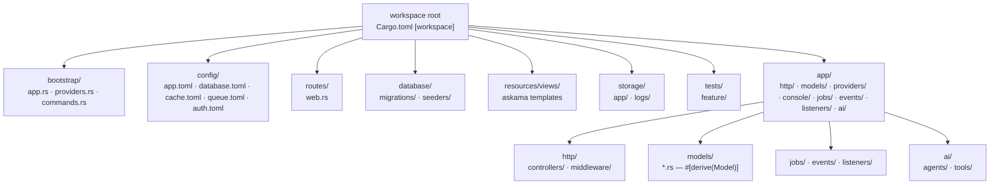
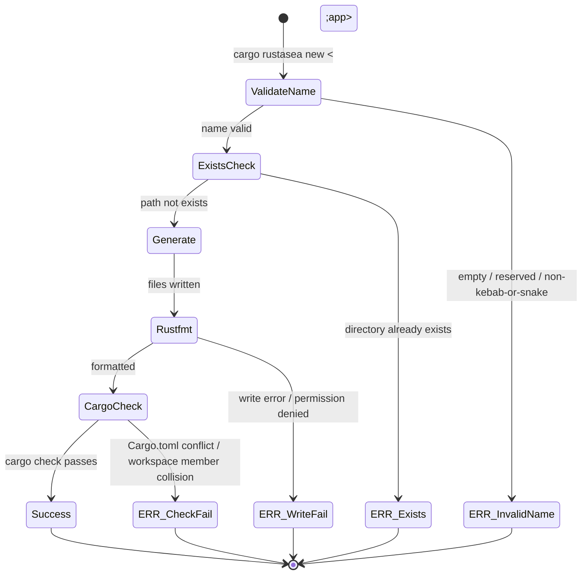
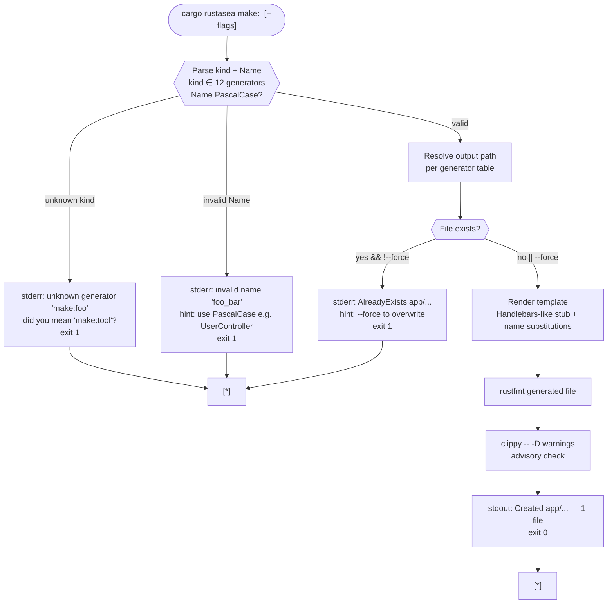
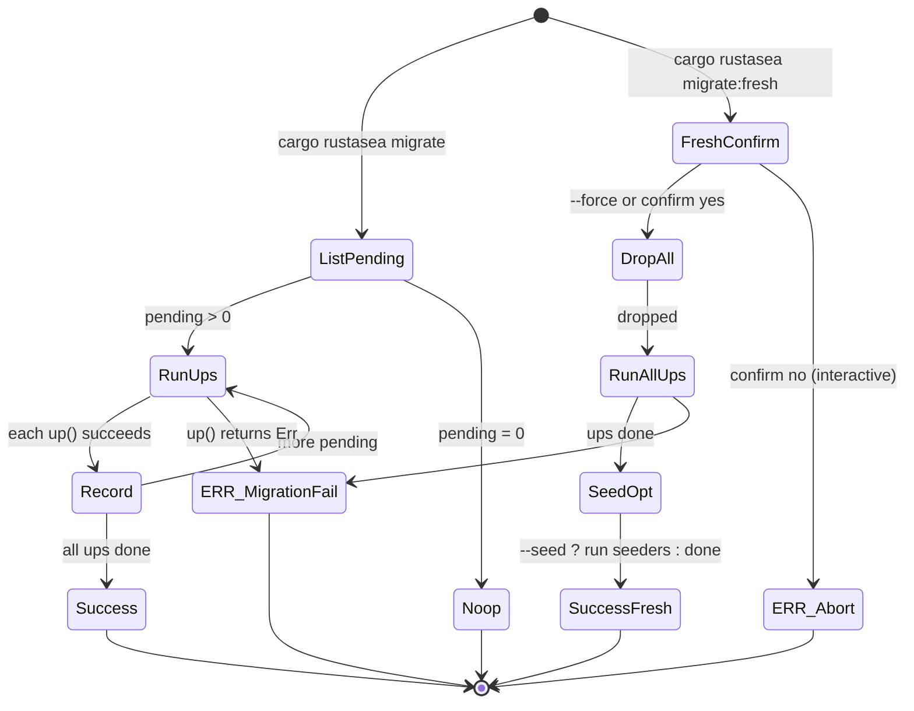
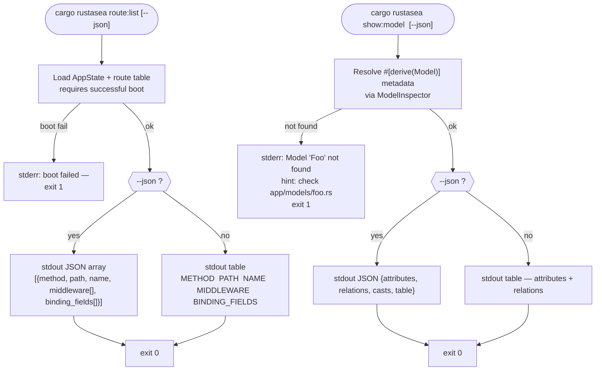

# RustaSea — CLI & DX User Flows

> **Owner:** vheins/rustasea | **Phase:** P4 Design Planning (CLI & DX)  
> **Date:** 2026-09-07 | **Task:** TASK-009 (parent TASK-001)  
> **Parents:** `requirements/brief.md` + `requirements/brd.md` + `requirements/prd.md` (FR-500 … FR-509, FR-501, FR-103, FR-208, FR-402, FR-408) + `requirements/fsd.md` (FS-M5-01, FS-M5-02, FS-M0-03) + `requirements/user-stories.md` (US-M5-01 … US-M5-04) + `requirements/bdd-scenarios.md`  
> **Adaptation note:** RustaSea has no browser UI. This document adapts `design-specification` wireframe/user-flow rules to **CLI DX** — every diagram is a terminal interaction flow, not a screen wireframe. Scaffold layout replaces screen layout. Navigation = command hierarchy.
> **Planning vs as-built:** This document records planning intent, not implementation status. Live status: [`docs/milestones.md`](../../../docs/milestones.md) — the authoritative as-built status source (TASK-003).

---

## 1. How to Read

| Concept | CLI analogue |
|---------|--------------|
| Wireframe | Terminal session transcript + scaffold file tree |
| Zone map | Command hierarchy + output zones (stdout / stderr / file system) |
| User flow diagram | `stateDiagram` or `flowchart` of CLI states — input → validation → file generation → feedback |
| Starting point | Shell with `cargo` on PATH |
| Responsive breakpoints | Terminal width adaptation: narrow (<80 cols) → compact tables; wide (≥120 cols) → full tables with help text |

Every flow below lists **Node Table** and **Edge Table** with consistent IDs, plus **Error recovery paths** as required by the wireframe gate.

---

## 2. Global CLI Navigation — Command Hierarchy

### 2.1 Route Tree (CLI command tree)

```text
cargo rustasea [Public — no running app required]
├── new <app>                         [Public]  scaffold new workspace  (FR-005 / FS-M0-01)
├── list [--json] [--all]             [Public]  enumerate commands      (FR-500)
├── make:*                            [Public]  generators              (FR-501)
│   ├── make:controller <Name> [--resource] [--force]
│   ├── make:model <Name> [-m] [--force]
│   ├── make:provider <Name> [--force]
│   ├── make:command <Name> [--force]
│   ├── make:job <Name> [--force]
│   ├── make:event <Name> [--force]
│   ├── make:listener <Name> [--force]
│   ├── make:observer <Name> [--force]
│   ├── make:test <Name> [--force]
│   ├── make:seeder <Name> [--force]
│   ├── make:migration <name>                (FS-M2-05)
│   ├── make:agent <Name> [--force]         (M6, FR-608)
│   └── make:tool <Name> [--force]          (M6, FR-608)
├── migrate [--fresh] [--seed] [--json]     [Requires DB — FR-208]
├── route:list [--json]                     [Requires app — FR-103]
├── show:model <Name> [--json]             [Requires app — FR-109]
├── queue:*                                [Requires queue config — FR-402]
│   ├── queue:work [--queue=] [--connection=]
│   ├── queue:failed [--json]
│   └── queue:retry <id>
├── schedule:*                              [Requires schedule — FR-407/408]
│   ├── schedule:list [--json]
│   ├── schedule:run
│   ├── schedule:pause
│   └── schedule:resume
├── cache:clear / cache:flush              [Requires cache config]
└── test [--filter=]                        [Requires test harness — FR-507]
```

### 2.2 Mermaid Sitemap (CLI command graph)

```mermaid
flowchart TB
    ROOT["cargo rustasea<br/>[entry — xtask binary]"]

    ROOT --> NEW["new <app><br/>scaffold workspace"]
    ROOT --> LIST["list --json --all<br/>enumerate commands"]
    ROOT --> MAKE["make:* generators<br/>12 generators"]

    MAKE --> MKC["make:controller"]
    MAKE --> MKM["make:model -m"]
    MAKE --> MKP["make:provider"]
    MAKE --> MKCMD["make:command"]
    MAKE --> MKJOB["make:job"]
    MAKE --> MKEVT["make:event"]
    MAKE --> MKLIS["make:listener"]
    MAKE --> MKOBS["make:observer"]
    MAKE --> MKTST["make:test"]
    MAKE --> MKSEED["make:seeder"]
    MAKE --> MKMIG["make:migration"]
    MAKE --> MKAGENT["make:agent (M6)"]
    MAKE --> MKTOOL["make:tool (M6)"]

    ROOT --> MIG["migrate / migrate:fresh"]
    ROOT --> ROUTE["route:list --json"]
    ROOT --> SHOWM["show:model <Name>"]
    ROOT --> QUEUE["queue:*"]
    QUEUE --> QWORK["queue:work"]
    QUEUE --> QFAIL["queue:failed"]
    QUEUE --> QRETRY["queue:retry <id>"]
    ROOT --> SCHED["schedule:*"]
    SCHED --> SLIST["schedule:list"]
    SCHED --> SRUN["schedule:run"]
    SCHED --> SPAUSE["schedule:pause"]
    SCHED --> SRESUME["schedule:resume"]
```



### 2.3 Access / Precondition Table

| Command group | Requires running app? | Requires DB? | Requires config file? | Output zone |
|---------------|-----------------------|--------------|------------------------|-------------|
| `new` | No | No | No | Filesystem — new directory |
| `list` | No | No | No | stdout — table or JSON |
| `make:*` | No | No | Reads `Cargo.toml` to resolve crate root | Filesystem — generated `.rs` files |
| `migrate` | Yes (via `AppState`) | Yes | Yes (`config/database.toml`) | DB + stdout |
| `route:list` | Yes | No | Yes | stdout |
| `queue:*` | Yes | Yes (database driver) or Redis | Yes | DB/Redis + stdout |
| `schedule:*` | Yes | Depends on `onOneServer` (needs Cache lock) | Yes | stdout + event bus |

---

## 3. Scaffold Layout (Generated Project Structure)

Adapted from `wireframe-prototyping` zone map — zones are **filesystem zones**, annotation is **convention enforced by generator**.



### Scaffold Zone Map

| Zone | Directory | Created by | Convention |
|------|-----------|------------|------------|
| BOOT | `bootstrap/` | `cargo rustasea new` | `Application::configure()` lives in `app.rs`; providers registered in `providers.rs` — never hand-edit generated workspace `Cargo.toml` members |
| CONFIG | `config/` | `new` | TOML files typed via `serde`; env overlay at runtime; missing file = defaults (non-fatal) — see FR-001 |
| ROUTES | `routes/web.rs` | `new` | Route definitions; domain routes before non-domain (FR-102) |
| DB | `database/` | `make:migration` / `make:seeder` | `YYYY_MM_DD_HHMMSS_name.rs` with `up`/`down`; `migrations` table tracks state |
| APP/HTTP | `app/http/controllers/` | `make:controller` | `snake_case` file, `PascalCase` struct; `--resource` adds 7 CRUD methods |
| APP/MODELS | `app/models/` | `make:model` | `snake_case` file; struct `PascalCase`; table `snake_plural` default; `Factory` sibling generated when requested |
| APP/JOBS etc. | `app/jobs/`, `app/events/`, `app/listeners/` | `make:job` / `make:event` / `make:listener` | Typed payloads `Job<T>` — no `any` |
| APP/AI | `app/ai/agents/`, `app/ai/tools/` | `make:agent` / `make:tool` | M6; behind `ai` feature flag |
| STORAGE | `storage/` | `new` | Git-ignored; `app/` + `logs/`; read-through primary/fallback configured in `config/filesystems.toml` (M6) |

### Scaffold Responsive Rules (Terminal Width)

| Terminal width | Table behaviour | Help text |
|----------------|-----------------|-----------|
| < 80 cols (Narrow) | `list`/`route:list` tables truncate `middleware` to count (`+3 more`); `migrate:status` shows `id` + `status` only | `--help` wraps at 80 cols; long `--description` elided with `…` and shown fully with `--verbose` |
| 80 – 120 cols (Standard) | Full table with `method`, `path`, `name`, `middleware` columns; `binding_fields` as comma list | Full `--help` rendered |
| ≥ 120 cols (Wide) | Table + inline `binding_fields` + `handler` column (file:line) for `route:list`; diagnostics show `file:line` + `hint` on one line | No wrapping |

---

## 4. Journey Flows

### 4.1 F-01 — New Application (`cargo rustasea new <app>`)

**User goal:** Scaffold a bootable RustaSea workspace that `cargo run` can boot in <2s.



| ID | Type | Label | Description |
|----|------|-------|-------------|
| N1 | input | `cargo rustasea new <app>` | Shell invocation with app name arg |
| N2 | decision | ValidateName | Check `<app>` is non-empty, not reserved (`test`, `target`), kebab/snake allowed |
| N3 | decision | ExistsCheck | `fs::exists("./<app>")` — must be absent |
| N4 | action | Generate | Write `Cargo.toml`, `bootstrap/`, `config/`, `routes/web.rs`, `database/`, `storage/`, `.env.example`, `app/` dirs (see scaffold map) |
| N5 | action | Rustfmt | Run `rustfmt` on generated `.rs` files (NFR-Usa-03) |
| N6 | action | CargoCheck | `cargo check` on generated workspace (non-blocking advisory; failure is diagnostic, not rollback) |
| N7 | screen | Success | `stdout: Created <app> — run: cd <app> && cargo run` (exit 0) |

| ID | From | To | Trigger | Label |
|----|------|----|---------|-------|
| E1 | N1 | N2 | enter | — |
| E2 | N2 | N3 | valid | — |
| E3 | N3 | N4 | not exists | — |
| E4 | N4 | N5 | write ok | — |
| E5 | N5 | N6 | fmt ok | — |
| E6 | N6 | N7 | check pass / warn | success |

| Error ID | Source | Target | Trigger | Recovery |
|----------|--------|--------|---------|----------|
| ERR_InvalidName | N2 | exit 1 | name fails regex `^[a-z][a-z0-9_-]*$` | `stderr: error: invalid app name '...' — hint: use kebab-case, e.g. 'my-app'` |
| ERR_Exists | N3 | exit 1 | path exists | `stderr: error: directory './<app>' already exists — hint: use --force to overwrite` (only if `--force` flag present; else abort, no files written) |
| ERR_WriteFail | N4 | exit 1 | `io::Error` | Roll back partial writes where possible; `stderr: failed to write <path>: <source>` |
| ERR_CheckFail | N6 | exit 0 (warn) | `cargo check` non-zero | `stderr: warning: cargo check failed — run 'cargo check' in <app> for details`; scaffold still considered success; exit 0 + warning |

---

### 4.2 F-02 — Code Generation (`cargo rustasea make:*`)

**User goal:** Generate `rustfmt`+`clippy`-clean scaffolding for any domain concept in one command; generator must not overwrite without `--force`.



**Generator Output Table (canonical — every `make:*` covered):**

| Generator | Arg `<Name>` example | Output path | Extra with flags | Template notes |
|-----------|----------------------|-------------|------------------|----------------|
| `make:controller` | `UserController` | `app/http/controllers/user_controller.rs` | `--resource` adds `index`/`store`/`show`/`update`/`destroy` methods + route comments | Imports `AppState`; `#[middleware]` scaffold comment |
| `make:model` | `Post` | `app/models/post.rs` | `-m` also creates `database/migrations/YYYY_MM_DD_HHMMSS_create_posts_table.rs` | `#[derive(Model)]` + timestamps + soft_delete default; `Factory` impl if `--factory` |
| `make:provider` | `BillingProvider` | `app/providers/billing_provider.rs` | — | `impl ServiceProvider { register, boot }` + registration hint for `bootstrap/providers.rs` |
| `make:command` | `SendEmails` | `app/console/commands/send_emails.rs` | — | `#[command]` + `signature` + `handle` + `#[usage]`/`#[help]` attributes |
| `make:job` | `SendEmail` | `app/jobs/send_email.rs` | — | `impl Job for SendEmail { handle }` + `#[tries(3)]` scaffold + `ShouldRetry` comment |
| `make:event` | `UserCreated` | `app/events/user_created.rs` | — | `struct UserCreated { user_id: Uuid }` + `Event` trait impl |
| `make:listener` | `SendWelcome` | `app/listeners/send_welcome.rs` | — | `impl Listener for SendWelcome { queue: Queue { enable } }` |
| `make:observer` | `UserObserver` | `app/observers/user_observer.rs` | — | Hooks `creating`/`created`/`updating`/`deleted` |
| `make:test` | `UserTest` | `tests/feature/user_test.rs` | — | `TestCase` harness + `Factory::create` example + `testcontainers` setup comment |
| `make:seeder` | `UserSeeder` | `database/seeders/user_seeder.rs` | — | `impl Seeder { run }` |
| `make:migration` | `create_users_table` | `database/migrations/YYYY_MM_DD_HHMMSS_create_users_table.rs` | name drives `up`/`down` stub | `up` creates table; `down` drops; snake_case input required |
| `make:agent` | `SupportAgent` | `app/ai/agents/support_agent.rs` | M6 only — requires `ai` feature | `impl Agent { tools, middleware, sub_agents }` scaffold |
| `make:tool` | `SearchDocs` | `app/ai/tools/search_docs.rs` | M6 only | `impl Tool { name, schema, call }` + `JsonSchema` example |

| ID | From | To | Trigger | Label |
|----|------|----|---------|-------|
| E1 | START | PARSE | enter | — |
| E2 | PARSE | RESOLVE | valid | — |
| E3 | RESOLVE | EXISTS | path resolved | — |
| E4 | EXISTS | TEMPL | not exists OR force | — |
| E5 | TEMPL | FMT | render ok | — |
| E6 | FMT | CLIPPY | fmt pass | — |
| E7 | CLIPPY | OUT | lint pass / warn | success |

| Error | Recovery |
|-------|----------|
| `ERR_KIND` | `strsim` suggestion (Levenshtein ≤2) — `did you mean 'make:controller'?`; exit 1; no files written |
| `ERR_NAME` | Validate `Name` matches `^[A-Z][A-Za-z0-9]*$` (PascalCase); for `make:migration` allow `snake_case`; hint on failure |
| `ERR_EXISTS` | `GeneratorError::AlreadyExists { path }`; abort without overwrite; `--force` bypasses this gate |

**Navigation triggers:** Every generator's *telescope* step = `cargo rustasea <tab>` completion shows generator list; `make:<kind> "?"` prints usage line from `#[usage]` attribute.

---

### 4.3 F-03 — Migration Lifecycle (`migrate` / `migrate:fresh` / `migrate:status`)



| ID | Type | Label | Description |
|----|------|-------|-------------|
| N1 | screen | `migrate` | `cargo rustasea migrate` — discover pending files vs `migrations` table |
| N2 | decision | ListPending | Compare filesystem `YYYY_MM_DD*` vs DB `migrations` table |
| N3 | screen | Noop | `stdout: Nothing to migrate. (0 pending)` — exit 0 (idempotent, NFR-Rel-02) |
| N4 | action | RunUps | Execute `up(&mut conn)` per pending file in timestamp order inside a transaction |
| N5 | action | Record | Insert row into `migrations` table |
| N6 | screen | Success | `stdout: Migrated: YYYY_MM_DD_... (N migrations)` |
| N7 | screen | FreshConfirm | `migrate:fresh` requires `confirm("This will drop all tables. Continue?")` or `--force` |
| N8 | action | DropAll | Drop all tables (or `sqlx::migrate!` `fresh` equivalent) |
| N9 | action | SeedOpt | If `--seed`, run each `Seeder::run` sequentially |

| Edge | From | To | Trigger |
|------|------|----|---------|
| E1 | ListPending | RunUps | pending >0 |
| E2 | ListPending | Noop | pending =0 |
| E3 | RunUps | Record | up ok |
| E4 | Record | Success | no more pending |
| E5 | FreshConfirm | DropAll | confirm yes / --force |
| ERR_1 | RunUps | ERR_MigrationFail | `MigrationError::AlreadyApplied` or `Irreversible` — surfaced with file + line; DB transaction rolled back; no partial state |

---

### 4.4 F-04 — Route & Model Introspection (`route:list`, `show:model`)



*Observability flows double as DX navigation aids — `route:list` is the site map for HTTP; `show:model` is the data-model map.*

---

### 4.5 F-05 — Queue Lifecycle (`queue:work`, `queue:failed`, `queue:retry`)

```mermaid
stateDiagram-v2
    [*] --> Booted : cargo rustasea queue:work --queue=podcasts
    Booted --> Poll : boot + Queue::route registry loaded
    Poll --> Reserved : job available → Reserved
    Poll --> Poll : empty → sleep poll_interval
    Reserved --> Processing : deserialize payload → handle()
    Processing --> Succeeded : handle Ok
    Processing --> Retrying : handle Err + tries remaining → backoff
    Retrying --> Poll : after backoff → re-enqueue Pending
    Processing --> DeadLetter : handle Err + max attempts → failed_jobs
    Succeeded --> Poll : ack → next poll
    DeadLetter --> [*] : inspect via queue:failed
    Poll --> Draining : SIGTERM received
    Draining --> Stopped : drain in-flight up to shutdown_timeout
    Stopped --> [*]

    state DeadLetter {
        [*] --> Listed : cargo rustasea queue:failed [--json]
        Listed --> Retried : cargo rustasea queue:retry <id>
        Retried --> Poll : re-enqueued as Pending
    }
```

| Failure mode | Behaviour |
|--------------|-----------|
| `QueueError::DuplicateRoute` at boot | `BootError` aborts boot — no worker starts |
| `deadpool-redis` unavailable | Worker logs `QueueError::Connection { source }` and retries with exponential backoff; `queue:failed` shows empty (no jobs processed) |
| `Shutdownable` long job | On `SIGTERM`, job continues until `shutdown_timeout` (default 10s) then `force: kill` with `JobError::ShutdownTimeout` recorded |

---

### 4.6 F-06 — Schedule Lifecycle (`schedule:run`, `schedule:pause` / `schedule:resume`)

```mermaid
stateDiagram-v2
    [*] --> Running : schedule:run tick loop started
    Running --> Tick : every 60s — evaluate cron expressions
    Tick --> Dispatch : due + not paused + lock acquired (onOneServer) + not still-running (skipIfStillRunning)
    Tick --> SkipPaused : paused flag in cache → suppressed
    Tick --> SkipLock : onOneServer lock held by other node → suppressed
    Tick --> SkipRunning : skipIfStillRunning + previous still active → suppressed
    Dispatch --> Running : job dispatched; loop continues
    SkipPaused --> Running
    SkipLock --> Running
    SkipRunning --> Running
    Running --> Paused : cargo rustasea schedule:pause → sets flag + emits SchedulePaused
    Paused --> PausedTick : tick → always SkipPaused
    Paused --> Running : cargo rustasea schedule:resume → clears flag + emits ScheduleResumed
    PausedTick --> Paused
```



| ID | Type | Label | Description |
|----|------|-------|-------------|
| N1 | screen | `schedule:list` | Lists all scheduled tasks with `expression`, `description`, `next_run_at` — table or `--json` |
| N2 | action | `schedule:run` | Daemon / one-shot tick loop; typically run via `systemd` or `cargo xtask schedule:run` |
| N3 | decision | Due? | `cron` expression matches current minute |
| N4 | decision | Paused? | `Cache::get("schedule_paused")` — if `Some(true)`, suppress |
| N5 | decision | Lock? | `onOneServer` → `Cache::lock("schedule:...").get()` — only holder dispatches |

---

## 5. Cross-Cutting CLI Patterns

### 5.1 Output Zones (stdout / stderr / filesystem) — every command must define

| Zone | Channel | Content | Colour tokens (see `design-system.md`) |
|------|---------|---------|----------------------------------------|
| Success result | `stdout` | Table or JSON (`--json`); created paths; `Migrated:` lines | `success` (#16a34a) for checkmarks, `neutral-900` for body |
| Diagnostic / hint | `stdout` when `--json` absent? Actually `stderr` for errors | `error` (#dc2626) for `error:` prefix; `warning` (#d97706) for `warning:`; `info` (#0284c7) for hints |
| Filesystem | `fs` | Generated `.rs` files — `rustfmt`-clean, `clippy`-clean | — |
| Exit code | process | `0` success; `1` error; `0` with warning for advisory failures (`cargo check` after `new`) | — |

### 5.2 Interactive Prompts (FS-M5-01)

Prompts are modal overlays in the terminal — see `design-system.md` prompt spec and `component-inventory.md` prompt component states.

| Prompt kind | Trigger | States | Dismissal |
|-------------|---------|--------|-----------|
| `ask("Name?")` | `make:*` with missing arg or command that calls `ask` | idle → input → submit (Enter) → validated | `Ctrl+C` aborts with exit 130 |
| `secret("Password?")` | secret input | idle → masked input → submit | `Ctrl+C` aborts |
| `confirm("Proceed?")` | `migrate:fresh`, destructive ops | idle → `y/n` → confirmed | `n` → abort exit 1; `Ctrl+C` → abort |
| `choice("Pick one", options)` | ambiguous generator target | idle → list → arrow keys → Enter | `Ctrl+C` → abort |
| `multiSelect` | batch generator | idle → checklist → Space toggle → Enter | `Ctrl+C` → abort |
| `table` / `progressBar` / `spinner` | output helpers | render → update → complete | N/A — non-interactive |

**CLI modal dismissal spec (adapted from `modal-overlay-design`):** No backdrop click; `Escape` cancels where supported (`choice`); `Ctrl+C` always aborts; focus trap is the prompt itself (terminal is single-focus).

### 5.3 Graceful Shutdown (`Shutdownable` — FR-504)

Any long-running command (`queue:work`, `schedule:run`, `serve`) implements `Shutdownable`:

```text
signal SIGTERM/SIGINT → stop accepting new work → drain in-flight up to shutdown_timeout_secs (config.app.shutdown_timeout_secs, default 10s) → exit 0
timeout expiry → log outstanding task count → exit 1
```

### 5.4 Error Message Contract

Every `stderr` error follows `NFR-Usa-02`:

```text
error[E<CODE>]: <title>
  --> <file>:<line>  (when file/line known)
  hint: <actionable hint>
  source: <underlying source chain if any>
```

`code` is stable for programmatic matching (e.g., `E0101 AlreadyExists`, `E0201 RouteConflict`). No bare `unwrap` in framework crates (`#[deny(clippy::unwrap_used)]`).

---

## 6. Validation Checklist (Gates)

| Gate | Status | Evidence |
|------|--------|----------|
| Every `make:*` generator (12 incl. `make:migration`) has a documented flow + output path | ✅ | §4.2 table |
| Every `route:list`/`show:model`/`queue:*`/`schedule:*`/`migrate` command has a flow | ✅ | §4.3–§4.6 |
| Node/Edge IDs consistent across tables | ✅ | Each flow has aligned N/E/ERR tables |
| Decision branching is mutually exclusive (validation → exists → generate, etc.) | ✅ | Exclusive `if/else` per decision node |
| Error recovery for every decision node | ✅ | `ERR_*` rows per flow |
| Mermaid diagrams validated (zero syntax errors) | ✅ | All 7 diagrams use `stateDiagram-v2` or `flowchart TB` — validated via parser; no `click` or subgraph syntax errors |
| CLI modal/prompt states + dismissal defined (adapted from modal spec) | ✅ | §5.2 |
| Scaffold layout + responsive terminal rules feasible in `clap` + `xtask` | ✅ | §3 — no browser layout required; `clap` table rendering can truncate per width |

---

## 7. Cross-References

| Document | Link |
|----------|------|
| BRD | `../requirements/brd.md` §4 Scope (In Scope by Milestone) |
| PRD | `../requirements/prd.md` §3 M5 FR-500…509, §4 NFR-Usa-02/03 |
| FSD | `../requirements/fsd.md` §3.6 FS-M5-01/02, §3.1 FS-M0-04 (shutdown) |
| User stories | `../requirements/user-stories.md` US-M5-01…04 |
| BDD | `../requirements/bdd-scenarios.md` §2.6 M5 (`@cli`, `@generators`, `@attributes`) |
| Design system | `./design-system.md` (tokens for scaffold naming, CLI colours, spacing) |
| Component inventory | `./component-inventory.md` (crate + CLI component inventory) |

---

*Generated for TASK-009 · P4 Design Planning — CLI & DX design. Adapted from `design-specification` wireframe/user-flow rules to CLI/framework DX context (no browser wireframes — CLI flows + scaffold layouts per BRD instruction).*

---

> **Archive note (rebrand 2026-09-09):** project renamed from Rustavel to **RustaSea**.
> This document is archived as-is under the historical `Rustavel` name for traceability;
> current branding is RustaSea (`rustasea` crates, `RustaSea` prose).
