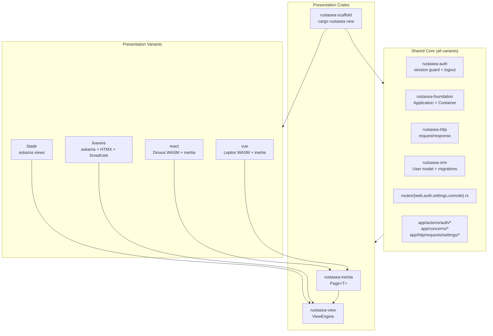
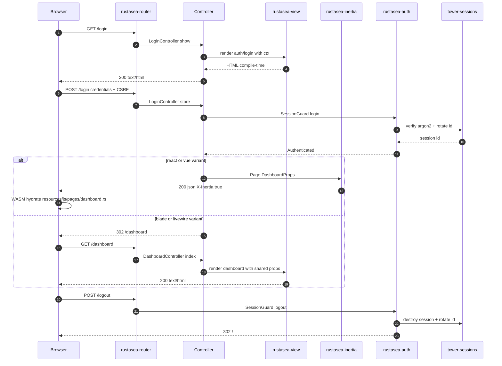

# RustaSea Starter-Kit Architecture

> **Status:** Draft — design proposal (TASK-004)
> **Date:** 2026-09-11
> **Scope:** First-party application starter kits — the Rust equivalent of Laravel's Blade / React / Vue / Livewire starter kits.
> **Milestones:** spans **M3** (auth core), **M5** (scaffolder + generators), **M6** (view engine, Inertia-analogue, real-time).
> **Parents:** `README.md` §Milestones · `docs/milestones.md` · `docs/laravel-parity.md` §8 · TASK-004 enrichment comment.
> **ADR:** [`docs/adr/ADR-0002-rustasea-starter-kit-architecture.md`](../../../docs/adr/ADR-0002-rustasea-starter-kit-architecture.md)
> **Planning vs as-built:** This document records planning intent, not implementation status. Live status: [`docs/milestones.md`](../../../docs/milestones.md) — the authoritative as-built status source (TASK-003).

---

## 1. Problem & Current State

RustaSea has no presentation layer. The audit (TASK-001 C8, TASK-002) and the current tree agree:

| Surface | State today | Evidence |
|---|---|---|
| View engine | **None selected.** `resources/views/` holds one static `welcome.html` served via `include_str!`; no `askama`/`minijinja` in any `Cargo.toml`. | `routes/web.rs:16`, `resources/views/welcome.html`; `README.md:199` proposes a choice; `docs/laravel-parity.md:80` marks `Illuminate\View` **Planned**; `docs/milestones.md:280` "template rendering integration — not declared" |
| Routes | Only `routes/web.rs`. No `routes/{auth,settings,console}.rs`. | `routes/` listing |
| Bootstrap | Provider + command registries are empty placeholders; `AppServiceProvider` is a no-op. | `bootstrap/providers.rs:11`, `bootstrap/commands.rs:11`, `bootstrap/app.rs:15-21` |
| Auth | JWT-only. `SessionGuard` is a placeholder; `store()` is `#[cfg(test)]`; `logout` is a no-op. | `crates/rustasea-auth/src/session.rs:117`, `:147`, `:202-210` |
| Config | Loader reads only `config/app.toml`. | `crates/rustasea-config/src/lib.rs:16` |
| Scaffolder | None. 13 `make:*` kinds exist; no `new`. | `crates/rustasea-cli/src/generators/mod.rs:19`; `docs/milestones.md:74,247` |
| App layout | `app/` has `http/{controllers,middleware}`, `models`, `providers`, `console`, `jobs`, `events`, `listeners`, `ai`; no `app/actions`, `app/concerns`, `database/{factories,seeders}`, `tests/{feature,unit}`. | `README.md:264-279` |

**Goal:** define a starter-kit architecture where auth and domain logic are a single shared core and the four variants differ **only** in presentation — exactly the Laravel model (Fortify is shared; Blade/React/Vue/Livewire swap the view layer).

---

## 2. Canonical Laravel Model (reference)

Laravel 13 starter kits share one Fortify-based core and differ only in presentation:

- **Shared core:** `app/Actions/Fortify`, `app/Concerns`, `app/Http/Requests/Settings`, `app/Http/Middleware`, `bootstrap/{app,providers}.php`, `config/{fortify,inertia}.php`, `routes/{web,auth,settings,console}.php`, `database/{migrations,factories,seeders}`, `tests/{Feature,Unit}`.
- **Variant deltas:**
  - **Blade** → `resources/views`.
  - **React** / **Vue** → `resources/js` + Inertia + shadcn + Wayfinder + Vite.
  - **Livewire** → `resources/views` + Flux.

RustaSea mirrors this split: one shared Rust core, four presentation strategies, one scaffolder that emits the right layout.

---

## 3. Module Architecture



**Layer responsibilities**

| Layer | Contents | Shared? |
|---|---|---|
| Domain / auth core | `rustasea-auth`, generated `app/actions/auth`, `app/concerns`, `app/http/requests/settings`, `app/models` | **Yes — identical across variants** |
| HTTP / routing | `routes/{web,auth,settings,console}.rs`, `app/http/{controllers,middleware}` | **Yes**, except presentation controllers emit variant responses |
| Presentation | `rustasea-view`, `rustasea-inertia`, `resources/{views,js}` | **Variant-specific** |
| Infra | `rustasea-scaffold`, `config/*.toml`, `database/*`, `tests/*` | **Yes**, with variant-aware templates |

**Crate dependency additions** (no cycles; all hang off the existing M0–M6 DAG in `architecture.md:107-145`):

```text
rustasea-scaffold  --> rustasea-cli (generator primitives), rustasea-foundation, rustasea-config
rustasea-view      --> rustasea-http, rustasea-foundation, rustasea-config
rustasea-inertia   --> rustasea-view, rustasea-http, rustasea-foundation
rustasea-auth      (existing; completed — no new inbound edges)
```

`rustasea-view` and `rustasea-inertia` are **opt-in** members of the umbrella `rustasea` crate behind features `view` / `inertia`, preserving the pay-for-crates-you-use rule (`architecture.md:14`). A Blade app never links WASM/Inertia code.

---

## 4. Decision Register

Each decision lists the chosen option, rationale, and **at least one rejected alternative with the reason**. The single final recommendation is in §12.

### D1 — Shared core, not four forked kits

**Chosen:** one generated core (`app/actions/auth`, `app/concerns`, `app/http/requests/settings`, `app/models`, `routes/{web,auth,settings,console}.rs`, `database/*`) plus a variant-specific presentation layer. The scaffolder parameterizes only `resources/` and the generated `Cargo.toml` feature set.

**Rationale:** matches Laravel (Fortify shared, kits swap presentation); fixes bugs once; keeps auth/security identical across variants.

**Rejected:**
- **Four independent template repositories** (the `laravel/react-starter-kit`-style split): four copies of auth drift, quadruple the security-patch surface, and cross-variant fixes are missed. Rejected.
- **Runtime presentation dispatch** (one binary, switch view engine by config): Rust has no runtime reflection for typed templates; it would pull every engine + WASM target into every app and violate zero-cost ergonomics. Rejected.

### D2 — View engine: askama default, minijinja behind a feature

**Chosen:** `rustasea-view` exposes a `ViewEngine` trait with two implementations:
- `AskamaEngine` — **default**. Jinja-like `{{ }}` / `` syntax, templates compiled into the binary, type-checked at build time.
- `MinijinjaEngine` — behind feature `runtime-templates`. Runtime template loading, Jinja2-compatible.

**Rationale:** askama delivers the project's core thesis — *type safety as a feature* (`README.md:20`) — and zero runtime dependency; its syntax is the closest Rust analogue to Blade. minijinja covers the two cases askama cannot: (a) hot-reload during development without recompiling, (b) user/CMS-authored templates loaded at runtime.

**Rejected:**
- **minijinja only:** no compile-time template checking; a typo ships to production. Rejected as default (kept as the optional engine).
- **`tera`:** runtime-only, heavier dependency tree, no type-checked templates; no advantage over minijinja for this use. Rejected.
- **`maud` (Rust macro HTML):** type-safe, but templates live in Rust source, not `resources/views/` — breaks Laravel layout parity and designer workflows. Rejected.
- **Handlebars (`handlebars` crate):** syntax farther from Blade/Jinja; runtime-only. Rejected.

### D3 — Inertia-analogue contract (`rustasea-inertia`)

**Chosen:** a Rust-native Inertia protocol implementation. The wire contract:

```rust
/// Inertia page envelope sent to the WASM client.
pub struct Page<T> {
    /// Client component key, e.g. "auth/login".
    pub component: String,
    /// Page props (typed at construction, `serde_json::Value` on the wire).
    pub props: T,
    /// Current URL.
    pub url: String,
    /// Asset version for cache-busting / 409 redirect.
    pub version: String,
}
```

Behavior:
- Request header `X-Inertia: true` → respond `application/json` with `Page<T>`; otherwise render the HTML shell (`resources/views/app.html`) embedding `data-page`.
- Always set `Vary: X-Inertia` (correct HTTP caching) and `X-Inertia: true` on JSON responses.
- **Partial reloads:** `X-Inertia-Partial-Component` must match the page component; `X-Inertia-Partial-Data` / `X-Inertia-Partial-Except` filter the prop map. Because filtering is by prop name at the wire boundary, props serialize to a JSON map and filtering happens on that map — typed structs are used for construction, not for partial filtering.
- **Shared props:** an `Inertia::share(...)` / `SharedProps` provider resolved per request (e.g. authenticated user, flash, CSRF token), merged into every page; `HandleInertiaRequests` middleware owns this.
- **Version mismatch:** on `GET` with stale `X-Inertia-Version`, return `409 Conflict` + `X-Inertia-Location` so the client hard-navigates.

**Rationale:** reproduces the Inertia value proposition — server owns routing/auth/validation, client owns rendering — without a JS/Node toolchain, keeping the frontend in Rust/WASM.

**Rejected:**
- **REST + separate SPA repo:** duplicates routing, auth, and token handling; CORS and CSRF get re-solved per app; diverges from Laravel parity. Rejected.
- **GraphQL / tRPC analogue:** heavier contract, no Laravel analogue, overkill for kit screens. Rejected.
- **Server-side HTML only for React/Vue:** abandons the SPA interaction model the variants exist to provide. Rejected.
- **Embedded V8/QuickJS SSR runtime:** enormous dependency and operational surface, not Rust-native. Rejected.

### D4 — WASM framework mapping: `react` → Dioxus, `vue` → Leptos

**Chosen:** each JS variant maps to one Rust WASM framework, sharing `rustasea-inertia`:
- **`react` variant → Dioxus** — RSX syntax and hooks are the closest mental model to React.
- **`vue` variant → Leptos** — fine-grained signals/reactivity map to Vue's reactive model.
- A generated `resources/js/` (kept as the canonical path for parity) holds the WASM entrypoint and `pages/` registry; `rustasea-inertia-client` parses `Page<T>` and mounts the matching component via a generated `match component { ... }` registry (WASM has no reflection, so the scaffolder emits the map).

**Rationale:** preserves React/Vue developer expectations while keeping the whole stack Rust; both frameworks compile to WASM and interoperate with the same Inertia envelope.

**Rejected:**
- **One framework for both variants** (e.g. Leptos only): halves the variant matrix but breaks React/Vue fidelity — the kits exist precisely to offer both mental models. Rejected.
- **`yew`:** viable, but offers no capability Dioxus/Leptos lack for this scope; adding a third framework increases maintenance without user value. Rejected.
- **Real React/Vue via `wasm-bindgen` + Node/Vite:** reintroduces the JS toolchain and `node_modules` the Rust-native thesis avoids. Rejected.

### D5 — Livewire analogue: askama + HTMX + `rustasea-broadcast`

**Chosen:** the `livewire` variant is server-rendered askama templates enhanced with HTMX attributes (`hx-get`/`hx-post`/`hx-target`), returning **fragments** when `HX-Request: true` is present. `rustasea-broadcast` (WS/SSE, already real — `crates/rustasea-broadcast/src/lib.rs:36`) supplies server-push updates, the analogue of Livewire's polling/broadcast.

**Rationale:** HTMX gives Livewire's "interactive without writing JS" ergonomics using the same askama engine as Blade; broadcast already exists in M6, so no new runtime is needed.

**Rejected:**
- **Full stateful Livewire component protocol over WebSocket** (server holds the component tree): Rust ownership/lifetime complexity, per-connection memory cost, and a bespoke protocol to maintain. Rejected.
- **Alpine.js/JS sprinkles:** adds a JS toolchain and breaks the all-Rust stack. Rejected.
- **SSE only, no HTMX:** loses form submission and targeted DOM swaps; degrades DX. Rejected.

### D6 — Scaffolder: `cargo rustasea new <app> --variant <v>`

**Chosen:** a cargo subcommand binary named `cargo-rustasea` (so `cargo rustasea new ...` resolves via cargo's PATH subcommand discovery) that delegates to the `rustasea-scaffold` library. Templates are embedded and parameterized by app name + variant.

**Rationale:** `cargo <name>` is the idiomatic Rust equivalent of `composer create-project` / `laravel new`; the library split makes scaffolding unit-testable with golden-file snapshots.

**Rejected:**
- **`cargo artisan new`** (the README's current wording): chicken-and-egg — `artisan` runs *inside* an app that does not exist yet. Keep `artisan new` as an in-app alias only. Rejected as the primary entrypoint.
- **`cargo generate` (third-party `cargo-generate`):** external dependency, template engine not Rust-typed, and cannot share code with the runtime `make:*` generators. Rejected.
- **`cargo xtask new`:** `xtask` is workspace-local and unavailable to end users. Rejected.

> **Naming reconciliation:** `README.md:111` and `docs/milestones.md:74,247` say `cargo artisan new`; this design standardizes on `cargo rustasea new` and records the change in ADR-0002. `cargo artisan new` remains an alias.

### D7 — Auth core: complete `rustasea-auth` session guard (not JWT for web kits)

**Chosen:** complete the existing `SessionGuard` on `tower-sessions` (already declared at `Cargo.toml:28`): remove the `#[cfg(test)]` gate on `store` (`session.rs:147`), implement `logout` as a real store destroy + session-id rotation (`session.rs:202-210`), rotate the session id on login (fixation defense), and generate Fortify-like `app/actions/auth/*` (`CreateNewUser`, `AttemptToAuthenticate`, `EnsureLoginIsNotThrottled`, `RedirectIfAuthenticated`, `PrepareAuthenticatedSession`) plus `app/concerns` validation rules.

**Rationale:** browser starter kits authenticate with session cookies + CSRF — the secure default and the Fortify model. JWT stays for API guards; the session guard already owns the hardening policy (JSON serialization, `-session-` prefix, allow-list — `session.rs:13-31`).

**Rejected:**
- **JWT for all web variants:** bearer tokens in a browser require JS token storage (XSS exposure) and do not match Laravel's session-based kits. Rejected for web kits (JWT remains the API guard).
- **`axum-login` crate:** couples the app to its types and abstracts away the session hardening policy already implemented in `rustasea-auth`. Rejected.
- **Hand-rolled session store:** `tower-sessions` is already declared and battle-tested; rebuilding it is needless risk. Rejected.

### D8 — Config auto-discovery for all `config/*.toml`

**Chosen:** extend `rustasea-config` so `ConfigLoader::load()` discovers every `config/*.toml` (not just `config/app` — `crates/rustasea-config/src/lib.rs:16`), preserving the layered `defaults < config/*.toml < .env < process env` merge.

**Rationale:** the kits add `config/session.toml` and (React/Vue) `config/inertia.toml`; a hardcoded list would require a code change per new config file.

**Rejected:**
- **Keep the hardcoded `config/app` path:** every new config file silently fails to load — a correctness bug. Rejected.

### D9 — Generated route/test layout mirrors Laravel

**Chosen:** `routes/{web,auth,settings,console}.rs` and `tests/{feature,unit}`, exactly mirroring the Laravel kit layout, replacing the single `routes/web.rs` and absent `tests/feature`.

**Rationale:** parity, discoverability, and one-file-per-concern; `console.rs` gives the previously-empty command registry (`bootstrap/commands.rs:11`) a real registration site.

**Rejected:**
- **Single `routes/web.rs`:** grows unbounded and hides the auth/settings boundaries. Rejected.
- **Deep nested module tree (`routes/auth/login.rs`, …):** over-fragmentation for kit-scale apps. Rejected.

---

## 5. Generated Directory Layout

`cargo rustasea new my-app --variant react` emits:

```text
my-app/
├── Cargo.toml                     # rustasea umbrella + variant feature (e.g. inertia, wasm)
├── rustasea.toml                  # app name / MSRV hint
├── .env.example
├── bootstrap/
│   ├── app.rs                     # Application::configure + provider/route/schedule wiring
│   ├── providers.rs               # populated provider registry (was empty: providers.rs:11)
│   └── commands.rs                # populated command registry (was empty: commands.rs:11)
├── app/
│   ├── actions/
│   │   └── auth/                  # Fortify analogue: CreateNewUser, AttemptToAuthenticate,
│   │                              # EnsureLoginIsNotThrottled, RedirectIfAuthenticated, ...
│   ├── concerns/                  # PasswordValidationRules, ProfileValidationRules
│   ├── http/
│   │   ├── controllers/           # AuthController, DashboardController, settings/*
│   │   ├── middleware/            # HandleInertiaRequests (react/vue), EnsureEmailIsVerified
│   │   └── requests/
│   │       └── settings/          # ProfileUpdateRequest, PasswordUpdateRequest
│   ├── models/                    # user.rs (#[derive(Model)])
│   └── providers/                 # AppServiceProvider, AuthServiceProvider
├── routes/
│   ├── web.rs                     # dashboard, welcome
│   ├── auth.rs                    # login, register, password reset, verify email
│   ├── settings.rs                # profile, password, appearance
│   └── console.rs                 # console command registration
├── resources/
│   ├── views/                     # blade + livewire
│   │   ├── layouts/app.html       # askama base layout
│   │   ├── auth/{login,register,forgot-password,reset-password}.html
│   │   ├── settings/{profile,password}.html
│   │   ├── dashboard.html
│   │   └── partials/              # livewire: HTMX fragments (hx-target)
│   └── js/                        # react + vue (WASM)
│       ├── main.rs                # WASM entrypoint + inertia client mount
│       └── pages/                 # one Dioxus/Leptos component per Inertia component key
├── config/
│   ├── app.toml
│   ├── auth.toml
│   ├── database.toml
│   ├── cache.toml
│   ├── queue.toml
│   ├── session.toml               # new
│   └── inertia.toml               # react/vue only
├── database/
│   ├── migrations/                # create_users, create_sessions, create_password_reset_tokens
│   ├── factories/                 # UserFactory
│   └── seeders/                   # DatabaseSeeder
├── storage/{app,logs}
└── tests/
    ├── feature/                   # auth, settings, dashboard HTTP tests (TestCase)
    └── unit/                      # app/actions + app/concerns unit tests
```

**Variant deltas** (everything not listed is byte-identical across variants):

| Path | blade | react | vue | livewire |
|---|---|---|---|---|
| `resources/views/**` | ✅ askama | shell only (`app.html`) | shell only | ✅ askama + HTMX partials |
| `resources/js/**` | — | ✅ Dioxus WASM | ✅ Leptos WASM | — |
| `app/http/middleware/handle_inertia_requests.rs` | — | ✅ | ✅ | — |
| `config/inertia.toml` | — | ✅ | ✅ | — |
| `Cargo.toml` features | `view` | `inertia`,`wasm-dioxus` | `inertia`,`wasm-leptos` | `view`,`broadcast` |
| Auth/domain core | identical | identical | identical | identical |

---

## 6. View-Engine Design (`rustasea-view`)

```rust
/// Render a named template with typed data.
pub trait ViewEngine: Send + Sync {
    /// Render `name` with `data`; returns an HTML response or a `ViewError`.
    fn render<T: serde::Serialize>(&self, name: &str, data: &T) -> Result<ViewResponse, ViewError>;
}

/// A rendered view that converts into an axum response.
pub struct ViewResponse { /* status, body, content-type */ }
```

- `AskamaEngine` (default): resolves templates compiled by `#[derive(Template)]` in the app; missing templates fail the build, not the request.
- `MinijinjaEngine` (feature `runtime-templates`): loads templates from `resources/views` at runtime; used for dev hot-reload and user-authored templates.

**Blade → askama/minijinja directive mapping** (documented for parity):

| Blade | askama / minijinja |
|---|---|
| `{{ $user->name }}` | `{{ user.name }}` |
| `@if ($x)` / `@else` / `@endif` | `` / `` / `` |
| `@foreach ($items as $i)` / `@endforeach` | `` / `` |
| `@extends('layouts.app')` | `` |
| `@section('content')` / `@endsection` | `` / `` |
| `{{ $slot }}` (component) | `{{ slot }}` (askama include/block) |

---

## 7. Inertia-Analogue Design (`rustasea-inertia`)

**Server** (`rustasea-inertia`):

```rust
/// Build an Inertia page response.
pub struct Inertia;

impl Inertia {
    /// Register a shared prop provider resolved on every request.
    pub fn share<F>(provider: F) where F: Fn(&RequestContext) -> serde_json::Value + Send + Sync + 'static;
    /// Render `component` with typed `props`, honoring partial reloads.
    pub fn render<T: serde::Serialize>(component: &str, props: T, ctx: &RequestContext) -> InertiaResponse;
}
```

**Client** (`rustasea-inertia-client`, compiled to WASM inside the generated app):
- reads `data-page` from the HTML shell or parses the JSON response;
- matches `Page.component` against a generated component registry (`match component { "auth/login" => rsx! { Login {} }, ... }`);
- `navigate(url, only: &[&str])` issues an `X-Inertia` fetch and swaps props without a full reload;
- handles `409` + `X-Inertia-Location` by hard-navigating.

**Header contract**

| Header | Direction | Purpose |
|---|---|---|
| `X-Inertia: true` | req + resp | Marks an Inertia request/response |
| `X-Inertia-Version` | req | Asset version; mismatch → `409` |
| `X-Inertia-Location` | resp | Hard-navigate target on version mismatch |
| `X-Inertia-Partial-Component` | req | Component the partial reload targets |
| `X-Inertia-Partial-Data` / `-Except` | req | Prop allow/deny list for the partial |
| `Vary: X-Inertia` | resp | Cache correctness |

---

## 8. Scaffolder Design (`rustasea-scaffold`)

```rust
/// Supported starter-kit presentation variants.
pub enum StarterKitVariant { Blade, React, Vue, Livewire }

/// Scaffold a new application.
pub struct Scaffold { /* app name, variant, target path */ }

impl Scaffold {
    /// Generate the full app tree for `variant` under `path`.
    pub fn generate(&self, path: &Path) -> ScaffoldResult<Vec<Generated>>;
}
```

- **Binary:** `cargo-rustasea` (cargo subcommand) → `cargo rustasea new <app> --variant {blade|react|vue|livewire} [--force] [--no-git]`.
- **Templates:** embedded via `include_str!`, parameterized by app name; shared templates emitted for every variant, variant templates merged in.
- **Validation:** golden-file snapshot tests per variant (tree + file contents), plus a CI job that runs `cargo check` on each generated app to prove it compiles.
- **Reuse:** shares `Generator`/`Generated` primitives with `rustasea-cli` (`crates/rustasea-cli/src/generator.rs`) so `make:*` and `new` never diverge.

---

## 9. Request Flow (login/logout)



---

## 10. Phased Delivery (M0–M6 mapping)

| Phase | Deliverable | Milestone | Depends on | Exit criterion |
|---|---|---|---|---|
| **SK-0** | Config auto-discovery of `config/*.toml` (D8) | M0 | — | `ConfigLoader` loads app + session + inertia without code change |
| **SK-1** | Complete `rustasea-auth` session guard + logout + rotation (D7) | M3 | M1/M2 | Login sets a session cookie; logout destroys + rotates it; unit + feature tests pass |
| **SK-2** | `rustasea-view` (`ViewEngine`, askama default, minijinja feature) (D2) | M6 | M1 | Blade layout + auth/dashboard pages render from `resources/views` |
| **SK-3** | `rustasea-inertia` + `rustasea-inertia-client` (`Page<T>`, headers, partials, shared props) (D3) | M6 | SK-2 | JSON page + HTML shell + 409 version flow verified |
| **SK-4** | `rustasea-scaffold` + `cargo-rustasea new` for **blade** + **livewire** (D6, D5) | M5 | SK-1, SK-2 | `cargo rustasea new demo --variant blade` compiles and serves login/dashboard |
| **SK-5** | **react** (Dioxus) + **vue** (Leptos) variants on the shared Inertia contract (D4) | M6 | SK-3, SK-4 | Both WASM variants build and hydrate the dashboard |
| **SK-6** | Golden-file + `cargo check` generator tests, docs, kit READMEs | M5/M6 | SK-4, SK-5 | CI generates and compiles all four variants |

> The `View` surface is tracked as **M6** in `docs/laravel-parity.md:80` / `docs/milestones.md:280`; the scaffolder is **M5** (`docs/milestones.md:247`); the session guard is **M3** (`docs/milestones.md:172`). This plan sequences them so the first usable kit (blade) lands at **SK-4**.

---

## 11. Risks & Trade-offs

| Risk / cost | Impact | Mitigation |
|---|---|---|
| Two WASM frameworks (Dioxus + Leptos) to track | Maintenance + upgrade churn | Isolate behind `rustasea-inertia-client`; a framework bump touches only the client adapter + `pages/` |
| askama recompiles on template change | Slower dev loop | `runtime-templates` (minijinja) feature for dev hot-reload |
| Typed props vs partial reloads | Partial filtering needs untyped map | Serialize to `serde_json::Value` at the wire boundary; keep typed construction API |
| Session-guard completion touches security | Auth regression risk | Dedicated M3 tests: fixation rotation, logout destroy, CSRF on login; reuse `SessionPolicy` allow-list |
| Generator drift from hand-written app | Kits diverge from framework | Golden-file tests + generated apps compiled in CI |
| `resources/js` holds Rust WASM | Naming is a parity compromise | Document explicitly; optionally alias `resources/ui` in a future ADR |

---

## 12. Recommendation

**Adopt this architecture as the single starter-kit plan:** one shared Rust auth/domain core, `rustasea-view` (askama default, minijinja behind a feature) and `rustasea-inertia` (`Page<T>`) as the two presentation engines, a `rustasea-scaffold` library behind the `cargo rustasea new <app> --variant {blade|react|vue|livewire}` subcommand, and completion of the existing `rustasea-auth` session guard. Sequence delivery SK-0 → SK-6 so a working Blade kit ships first, then livewire (HTMX + broadcast), then react/vue (Dioxus/Leptos WASM) on the same Inertia contract.

---

## 13. Related Documents

- [`docs/adr/ADR-0002-rustasea-starter-kit-architecture.md`](../../../docs/adr/ADR-0002-rustasea-starter-kit-architecture.md) — the decision record for this design.
- `README.md` §Milestones — M0–M6 goals and crate layout.
- `docs/laravel-parity.md` §8 — `Illuminate\View` planned; adoption order.
- `docs/milestones.md` — M3 session guard, M5 scaffolder, M6 template status.
- `.agents/documents/design/architecture.md` — existing C4 / crate DAG this design extends.
