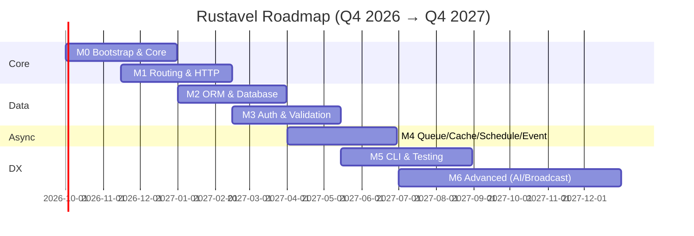

# Rustavel — Roadmap (M0–M6)

> **Status:** Approved — P7 Delivery Planning
> **Date:** 2026-09-07 | **Horizon:** Q4 2026 → Q4 2027
> **Parents:** `README.md` §Milestones + `brd.md` §1 + `prd.md` §3–§6 + `fsd.md` §3 + `design/architecture.md`
> **Task:** TASK-012 (P7: Delivery Planning — Roadmap & Sprints)

---

## 1. At a Glance

| Milestone | Focus | Target | Depends On | Sprint | Status |
|-----------|-------|--------|------------|--------|--------|
| **M0** | Bootstrap & Core | Q4 2026 (2026-10-01 → 2026-12-31) | — | Sprint 01 | Planned |
| **M1** | Routing & HTTP | Q4 2026 – Q1 2027 (2026-11-15 → 2027-02-15) | M0 | Sprint 02 | Planned |
| **M2** | ORM & Database | Q1 2027 (2027-01-01 → 2027-03-31) | M0, M1 | Sprint 03 | Planned |
| **M3** | Auth, Middleware & Validation | Q1 – Q2 2027 (2027-02-15 → 2027-05-15) | M1, M2 | Sprint 04 | Planned |
| **M4** | Queue, Cache, Scheduling & Events | Q2 2027 (2027-04-01 → 2027-06-30) | M0, M2, M3 | Sprint 05 | Planned |
| **M5** | DX, CLI & Testing | Q2 – Q3 2027 (2027-05-15 → 2027-08-31) | M0 – M4 | Sprint 06 | Planned |
| **M6** | Advanced (Broadcast, Search, FS, AI SDK, Real-time) | Q3 – Q4 2027 (2027-07-01 → 2027-12-31) | M1 – M5 | Sprint 07 | Planned |

> Timeline is aspirational; refined after M0 ships. Each milestone ships as a tagged release with migration notes (`CHANGELOG.md` at M0).

## 2. Dependency DAG (Delivery Order)

```
M0 ─┬─► M1 ─┬─► M3 ─┬─► M4 ─► M5 ─► M6
    │      │      │      ▲      ▲
    │      └─► M2 ┘      │      │
    └────────► M2 ───────┘      │
           (M2 initial vector)   │
                  M6 full vector─┘
```

- **No circular dependencies.** Verified in `design/architecture.md` §3.
- Overlap is intentional: M1 starts before M0 closes (router scaffolding parallel to container hardening); M2 starts once `rustavel-foundation` is stable, not waiting for full M1 polish.
- **Critical path:** M0 → M1 → M2 → M3 → M4 → M5 → M6. Slack: M4 can start once M2 stable even if M3 CSRF polish slips by ~2 weeks (cache/queue do not require auth).

## 3. Gantt



## 4. Milestone Detail (Scope → Deliverables → Success Criteria)

### M0 — Bootstrap & Core · Sprint 01

| Field | Detail |
|-------|--------|
| **Goal** | Bootable skeleton: config, container, providers, graceful shutdown. |
| **Scope** | `foundation::Application`, typed config loader (TOML/YAML + env overlay), container `Bind`/`Singleton`/`Instance` + `Make<T>`, provider `register` → `boot` DAG, `Runner` lifecycle (HTTP/Queue/Schedule), `SIGTERM`/`SIGINT` drain, `.env` via `dotenvy`. Laravel 13: Container `call` (`Option<T>`), `Manager::extend` bound closures. |
| **FRs** | FR-000 – FR-008 (9) · FS-M0-01 – FS-M0-04 |
| **Crates** | `rustavel` (umbrella), `rustavel-foundation`, `rustavel-config`, `rustavel-macros` (scaffold) |
| **Deliverables** | `cargo rustavel new <app>` scaffold (`bootstrap/app.rs`, `config/`, `routes/web.rs`, `.env.example`, workspace `Cargo.toml`), `AppServiceProvider` example, `config/` directory, graceful shutdown path. |
| **Success Criteria** | `cargo run` boots, loads `config/*.toml` + `.env` (env wins), resolves a bound singleton via `Make` (`Arc::ptr_eq`), shuts down on `SIGTERM` without data loss. `cargo check -p rustavel-foundation` clean standalone. |
| **Laravel 13 trace** | #20 (`Manager::extend` bound) + Container `call` nullability. |

### M1 — Routing & HTTP · Sprint 02

| Field | Detail |
|-------|--------|
| **Goal** | Expressive HTTP layer with routing, middleware, introspection. |
| **Scope** | `axum`-backed router (`get`/`post`/`put`/`delete`/`patch`/`options`/`any`), groups + prefix + naming, `resource` helper, domain-aware routing (domain routes prioritized), `route:list` with binding fields, middleware (`throttle`/`cors`/`TrimStrings`), typed extractors `Json`/`Query`/`Path`/`State`, `Json`/`View` responses, `reqwest` HTTP client (`throw`, timeouts). |
| **FRs** | FR-100 – FR-109 (10) · FS-M1-01 – FS-M1-06 |
| **Crates** | `rustavel-router`, `rustavel-http` |
| **Deliverables** | `routes/web.rs`, `#[route]` proc-macro, `cargo rustavel route:list` (table + `--json`), `app/http/middleware/` shape. |
| **Success Criteria** | `Route::get("/users", [UserController, "index"])` equivalent returns `200` over wire; `route:list --json` shows `binding_fields: ["slug"]`; domain catch-all does not shadow non-domain routes; `throttle` emits `429` + `Retry-After`. |
| **Laravel 13 trace** | #18 HTTP Client/Process, #19 domain priority, #20 `route:list` binding fields. |

### M2 — ORM & Database · Sprint 03

| Field | Detail |
|-------|--------|
| **Goal** | Fluent, type-safe DB layer with migrations, seeders, factories. |
| **Scope** | Query builder over `sqlx`/`sea-orm` (Postgres/MySQL/SQLite), `where`/`orWhere`/`whereJson*`, `find`/`first`/`firstOrFail`, `create`/`save`/`update`/`delete`/`forceDelete`, `paginate`/`cursor`/`chunkBy`/`orWhereKey`/`whereBinary`/`StraightJoin`/`insertOrIgnoreReturning` + strict `upsert` (`uniqueBy` validated), `toSql`/`toRawSql`, pessimistic locks, scopes, transactions, raw queries, `#[derive(Model)]` + soft deletes + `snake_plural` + `serde` eager-relation round-trip, `vector` column + `whereVectorSimilarTo`, migrations/seeders/factories. |
| **FRs** | FR-200 – FR-210 (11) · FS-M2-01 – FS-M2-06 |
| **Crates** | `rustavel-orm` (+ `rustavel-macros` `#[derive(Model)]`), `pgvector` behind `vector` feature. |
| **Deliverables** | `database/migrations/`, `database/seeders/`, `#[derive(Model)]` macro, `cargo rustavel make:model` + `make:migration`/`make:seeder`, `pgvector` support. |
| **Success Criteria** | `User` model → `migrate` → `Factory::create(&user)` → `whereVectorSimilarTo` returns top-10 by cosine → `serde` round-trip preserves eager relations; `chunkBy("id", 500)` without OOM; empty `uniqueBy` throws `UpsertError::EmptyUniqueBy`. |
| **Laravel 13 trace** | #6 vector (M2 initial), #13 collection serialization, #14 upsert/delete, #15 builder additions. |

### M3 — Auth, Middleware & Validation · Sprint 04

| Field | Detail |
|-------|--------|
| **Goal** | Hardened auth, authorization, validation at Laravel 13 security defaults. |
| **Scope** | JWT (`jsonwebtoken`) + session (`tower-sessions`), `login`/`loginUsingId`/`parse`/`refresh`/`logout`/`user`/`id`, `Auth::extend`, `#[authorize]`, CSRF origin-aware (`Sec-Fetch-Site`), `#[middleware]`, rate limiter → `Throttle`, CORS, strict `in_array`/`contains`/`doesnt_contain`, `ErrorBag`, `#[validate]`, JSON session store, allow-list deserialization, hyphenated cache prefix. |
| **FRs** | FR-300 – FR-311 (12) · FS-M3-01 – FS-M3-06 (in `fsd.md`) |
| **Crates** | `rustavel-auth`, `rustavel-validation` |
| **Deliverables** | `app/http/middleware/`, `make:middleware`/`make:request`, JWT + session guards, `PreventRequestForgery`. |
| **Success Criteria** | Guard mismatch → `Error::GuardMismatch`; cross-site `POST` without valid `Sec-Fetch-Site` → `403`; strict validation rejects loose equality; session cookie uses JSON + hyphenated prefix; `ErrorBag` preserves multi-field errors. |
| **Laravel 13 trace** | #11 origin-aware CSRF, #12 cache/session hardening, #19 strict validation + `ErrorBag`. |

### M4 — Queue, Cache, Scheduling & Events · Sprint 05

| Field | Detail |
|-------|--------|
| **Goal** | Observable async workloads. |
| **Scope** | Queue: `Queue::route::<Job>` central routing, `Job` trait + `ShouldRetry`/`#[tries]`/`#[backoff]`/`#[timeout]`, drivers `sync`+`database`+`redis`, `dispatch`/`dispatchSync`/`chain`/`delay`/`onQueue`/`onConnection`, batch, `failed_jobs`. Cache: `Store` + `Repository` traits, `touch()` (extend TTL), stores `memory` (`moka`) + `redis`, `Lock`. Events: `Event`/`Listener` with `Queue { enable: true }` async, `dispatch`+`dispatchAfterResponse`, `JobAttempted`/`QueueBusy` renames. Schedule: `schedule:list`/`schedule:run`/`schedule:pause`/`resume` + events, frequencies, `skipIfStillRunning`/`onOneServer`. Cloud metrics `pendingSize`/`delayedSize`/`reservedSize`/`creationTimeOfOldestPendingJob`. |
| **FRs** | FR-400 – FR-410 (11) · FS-M4-01 – FS-M4-06 |
| **Crates** | `rustavel-queue`, `rustavel-cache`, `rustavel-events`, `rustavel-schedule` |
| **Deliverables** | `app/jobs/`, `app/events/`, `app/listeners/`, `make:job`/`make:event`/`make:listener`, `failed_jobs` + `jobs` tables. |
| **Success Criteria** | Typed job routes to `Queue::route` queue; `Cache::touch` extends TTL without `get`/`set`; `schedule:pause` halts ticker + emits `SchedulePaused`; `Listener` with `Queue { enable: true }` enqueues; `pendingSize` returns depth. |
| **Laravel 13 trace** | #4 queue routing, #5 `touch`, #8 Cloud metrics, #10 pause/resume, #16 contract expansion. |

### M5 — DX, CLI & Testing · Sprint 06

| Field | Detail |
|-------|--------|
| **Goal** | Laravel-like DX loop: CLI, generators, testing harness. |
| **Scope** | `cargo rustavel` CLI (`clap` derive + `xtask`): `list`, `make:*` (controller/model/provider/command/job/event/listener/observer/test/seeder/agent/tool) with typed args/flags, `#[usage]`/`#[help]`/`#[hidden]`, prompts `ask`/`secret`/`confirm`/`choice`/`multiSelect`, `table`/`progressBar`/`spinner`, `Shutdownable`, `Artisan::call()`. Attributes `#[middleware]`/`#[authorize]`/`#[tries]`/`#[backoff]`/`#[timeout]`. Testing: `TestCase` + `.env.testing` + `testcontainers` isolated DB/cache + `Factory::create` + `Str` reset + paginator views. |
| **FRs** | FR-500 – FR-509 (10) · FS-M5-01 – FS-M5-07 |
| **Crates** | `rustavel-cli`, `rustavel-macros`, `rustavel-testing` |
| **Deliverables** | `bootstrap/commands.rs`, `tests/feature/`, `make:*` generators (rustfmt+clippy clean), `#[test]` helpers. |
| **Success Criteria** | `make:controller UserController` scaffolds `app/http/controllers/user_controller.rs` that compiles `cargo check`; `cargo test` spins isolated Postgres via `testcontainers` and tears down; factory sequences reset between tests; paginator `bootstrap-3` view renders. |
| **Laravel 13 trace** | #7 expanded attributes (`#[Tries]` etc.), #20 `ModelInspector`/`route:list`/`Str` resets + paginator. |

### M6 — Advanced (Broadcast, Search, FS, AI SDK, Real-time) · Sprint 07

| Field | Detail |
|-------|--------|
| **Goal** | Differentiate with AI-native capabilities + complete advanced parity. |
| **Scope** | WebSocket (`axum`+`tokio-tungstenite`) + channel auth + `ShouldBroadcast` + SSE `Response::eventStream`; `whereVectorSimilarTo` + `Str::toEmbeddings` + `dropVectorIndex` + embedding trait (full); read-through `Storage` (primary+fallback+copy-back) + `Storage::path()` confinement; `JsonApiResource` (sparse fieldsets, inclusion, links, headers, `application/vnd.api+json`); queued notifications `#[deleteWhenMissingModels]`; AI SDK provider-agnostic trait over 12 providers (text/image/audio/embeddings/reranking/files/vector-stores) + `Agent` contracts + `make:agent`/`make:tool` + `SimilaritySearch`/`FileStorage`/`ToolSearch` deferred loaders + sub-agents/middleware/anonymous agents + streaming+broadcasting+queueing + MCP; feature-flag `rustavel-ai` opt-in. |
| **FRs** | FR-600 – FR-612 (13) · FS-M6-01 – FS-M6-07 |
| **Crates** | `rustavel-broadcast`, `rustavel-storage`, `rustavel-search`, `rustavel-ai` (`optional` feature) |
| **Deliverables** | `app/ai/agents/`+`app/ai/tools/`, `resources/views/` (askama/minijinja), `make:agent`/`make:tool`, `JsonApiResource` + `Storage` facade. |
| **Success Criteria** | `Agent`+`Tool` streams over WebSocket with ordered chunks; `Storage::get` falls through to fallback; `Storage::path("../../etc/passwd")` → `PathTraversal`; `JsonApiResource` renders correct `Content-Type` + sparse fieldsets; `cargo check -p rustavel-router` does not pull `async-openai`. |
| **Laravel 13 trace** | #1 AI SDK, #2 Agents, #3 JSON:API, #6 full vector, #9 read-through FS, #17 mail/notifications, #18 SSE + full map (see PRD §8 table). |

## 5. Release & Tagging Strategy

| Milestone | Tag | Branch | Notes |
|-----------|-----|--------|-------|
| M0 | `v0.1.0` | `main` | `CHANGELOG.md` created; migration guide empty baseline. |
| M1 | `v0.2.0` | `main` | HTTP breaking changes allowed pre-1.0; document `axum` upgrade path. |
| M2 | `v0.3.0` | `main` | `sqlx` 0.8 baseline; `vector` feature documented. |
| M3 | `v0.4.0` | `main` | Security advisory section if CSRF/session behavior changed. |
| M4 | `v0.5.0` | `main` | `failed_jobs` schema freeze. |
| M5 | `v0.6.0` | `main` | `cargo rustavel` CLI stable surface. |
| M6 | `v0.7.0` | `main` | Feature-flag `ai` stable; `1.0.0` candidate after dog-food. |

Each tag: `cargo xtask ci` (fmt+clippy+test) green on CI (2 vCPU baseline per NFR-Per-01), `cargo tree` incremental-adoption check, `xtask check-cycles` DAG check.

## 6. Capacity & Contingency (from PRD §7)

| Milestone | Est. dev-weeks (2-person team) | Contingency | Wall-clock (2 devs, parallel partially) |
|-----------|-------------------------------|-------------|-----------------------------------------|
| M0 | 3–4 | 20% | 1.5–2 wks |
| M1 | 3–4 | 20% | 1.5–2 wks |
| M2 | 4–6 | 20% | 2–3 wks |
| M3 | 3–4 | 20% | 1.5–2 wks |
| M4 | 4–6 | 20% | 2–3 wks |
| M5 | 3–4 | 20% | 1.5–2 wks |
| M6 | 6–8 | 30–40% | 3–4 wks |
| **Total** | **26–36 dev-weeks** | +20% std / 30–40% M6 | **~13–18 wks wall-clock** |

## 7. Risks & Mitigations (Top-5 from PRD §7)

1. **R-01 ORM duality (sqlx vs sea-orm)** — spike + ADR pre-M2; `sqlx` primary, `sea-orm` shim behind flag.
2. **R-02 AI provider drift** — per-provider adapter crate + per-provider feature-flag + semver per adapter.
3. **R-03 Sec-Fetch-Site spec divergence** — spec-version-gated tests; token remains primary gate.
4. **R-05 Queue routing wrong-queue delivery** — `OnceLock` registry post-`boot`; duplicate `route` → error; E2E per-job test.
5. **R-06 pgvector missing** — migration `has_extension("vector")` guard + feature-flag; doc fallback.

## 8. Handoff to Sprints

Decomposed into **7 sprints** (1 sprint per milestone) — see `sprints/manifest.md` + `sprint-01.md` … `sprint-07.md`. Allocation audit in `sprints/allocation-audit.md` proves every FR (76 total: FR-000–FR-612 per PRD §8) is allocated exactly once with no gaps/overlaps.

---

*Source of truth for sequencing: this roadmap + `sprints/manifest.md`. PRD `§6 MoSCoW` governs priority; any M6 promotion to Must requires RFC + roadmap amendment.*
