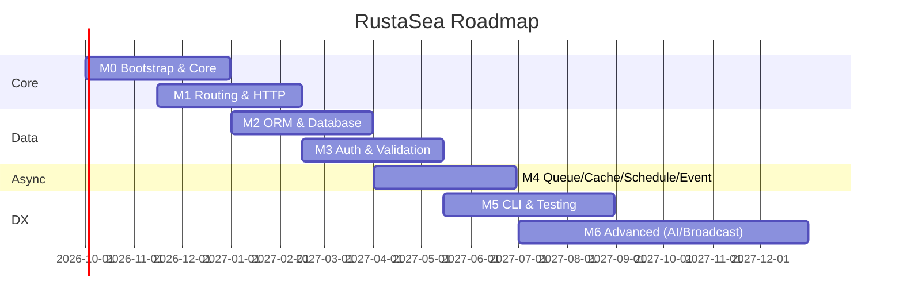

# RustaSea

> A Rust framework with Laravel ergonomics — expressive syntax, convention over configuration, and Rust-grade safety and performance.

[](https://www.rust-lang.org)
[](#license)
[](#roadmap)

---

## Vision

RustaSea brings the developer experience that made Laravel the most loved PHP framework to Rust — without sacrificing what makes Rust great. Route definitions that read like prose, Eloquent-inspired query builders with compile-time safety, Artisan-like code generation via proc-macros, and a service container that leverages Rust's type system instead of fighting it.

**Core thesis:** Laravel proves ergonomics and velocity win hearts; Rust proves safety and performance win production. RustaSea proves you can have both.

**Design principles:**

- **Convention over configuration** — sensible defaults, explicit opt-out.
- **Type safety as a feature** — generics, lifetimes, and traits replace runtime `any` blobs.
- **Zero-cost ergonomics** — expressive APIs that compile away where possible.
- **Incremental adoption** — use one crate or the full stack.

---

## Why Rust × Laravel Ergonomics

| What Laravel does best | What Rust does best | RustaSea synthesis |
|---|---|---|
| Expressive routing, middleware, validation | Ownership, lifetimes, fearless concurrency | `axum` routing with typed extractors + proc-macro attributes (`#[middleware]`, `#[validate]`) |
| Eloquent ORM — fluent, chainable | Compile-time query checking | `sqlx` / `sea-orm` query builder with derive macros; `whereVectorSimilarTo` from day one |
| Artisan code generation | `cargo` + proc-macros + `clap` | `cargo rustasea make:*` with `clap`-powered CLI and `xtask` |
| Queue / Schedule / Events | `tokio` async runtime | Typed jobs/events (no `any`), backpressure-aware queues |
| Blade / JSON:API resources | `serde` / `askama` / `minijinja` | `JsonApiResource` via `serde` with sparse fieldsets + relationship inclusion |
| Batteries-included DX | Minimal runtime, no GC | Pay only for crates you include; workspace-gated features |

**Who is RustaSea for?** Teams that outgrew dynamic-language frameworks on performance, correctness, or concurrency — but do not want to outgrow the productivity that made them ship fast.

---

## Laravel 13 Feature Map

Laravel 13.0.0 shipped 2026-03-17 (PHP 8.3+, 20 headline features). Every feature is mapped to the RustaSea milestone that delivers its equivalent.

| # | Laravel 13 Feature | Type | RustaSea Milestone | Notes |
|---|---|---|---|---|
| 1 | AI SDK (`laravel/ai`) — 12 providers, agents, tools, streams | NEW | **M6** | Provider-agnostic trait + agentic workflow |
| 2 | AI Agents (tools, structured output, streaming, MCP, queueing) | NEW | **M6** | `make:agent` / `make:tool`, sub-agents, middleware |
| 3 | JSON:API Resources (`JsonApiResource`) | NEW | **M6** | `serde`-based with sparse fieldsets, links, headers |
| 4 | Queue Routing by Class (`Queue::route()`) | NEW | **M4** | Central registry `Queue::route::<Job>(queue:)` |
| 5 | Cache `touch()` — extend TTL without get/set | NEW | **M4** | Added to `Store` + `Repository` traits |
| 6 | Semantic / Vector Search (`whereVectorSimilarTo`, `toEmbeddings`) | NEW | **M2** + **M6** | `pgvector` + embedding trait from day one |
| 7 | Expanded PHP Attributes (declarative) | NEW | **M5** | Rust proc-macros: `#[middleware]`, `#[tries]`, `#[authorize]`, etc. |
| 8 | Laravel Cloud Facade & Cloud Queue metrics | NEW | **M4** | Cloud driver + queue depth/age metrics |
| 9 | Read-through Filesystem (primary + fallback disk) | NEW | **M6** | `Storage` with fallback + path confinement |
| 10 | Schedule Pause / Resume (`schedule:pause`) | NEW | **M4** | `schedule:pause` / `schedule:resume` + events |
| 11 | Request Forgery Protection (origin-aware `Sec-Fetch-Site`) | IMPROVED | **M3** | `PreventRequestForgery` with origin verification |
| 12 | Cache & Session Hardening (JSON serialization, allow-list) | IMPROVED | **M3** / **M4** | `serde` allow-listing; JSON session store by default |
| 13 | Eloquent Collection Serialization (relations survive serialize) | IMPROVED | **M2** | `serde` round-trip preserves eager-loaded relations |
| 14 | Database Upsert & Delete Improvements (strict `uniqueBy`) | IMPROVED | **M2** | `upsert` validates `uniqueBy`; MySQL `DELETE JOIN` support |
| 15 | Eloquent / Query Builder Additions (`insertOrIgnoreReturning`, etc.) | IMPROVED | **M2** | `chunkBy`, `whereBinary`, `orWhereKey`, `StraightJoin` |
| 16 | Event / Queue Contract Expansion (`dispatchAfterResponse`, etc.) | IMPROVED | **M4** | Expanded `Dispatcher` + `Queue` traits |
| 17 | Mail / Notification Defaults | IMPROVED | **M6** | Queued notification `DeleteWhenMissingModels` |
| 18 | HTTP Client & Process (`throw` callbacks, `CarbonInterval` timeouts) | IMPROVED | **M1** | Typed HTTP client with `reqwest` |
| 19 | Routing & Validation (domain priority, strict `in_array`, `ErrorBag`) | IMPROVED | **M1** / **M3** | Domain-route precedence; strict validation |
| 20 | Observability & Tooling (`show:model`, `route:list` binding fields) | IMPROVED | **M1** / **M5** | Model inspector, route introspection |

> Source: [`docs/laravel-13-research.md`](docs/laravel-13-research.md) — cross-checked against `laravel.com/docs/releases`, `laravel.com/docs/13.x/upgrade`, and `laravel/framework` v13.0.0 changelog.

---

## Goravel Inspiration

[Goravel](https://goravel.dev) (Go port of Laravel, v1.18) is the closest prior art and the primary reference for porting Laravel idioms to a compiled, statically-typed language.

**What Goravel proves works:**

- **Service providers** with explicit `Register` → `Boot` lifecycle and DAG ordering (`Relationship()`) + `Runner` lifecycle (HTTP, Queue, Schedule) translate cleanly to Rust.
- **Container** (`Bind` / `Singleton` / `Instance` + `Make`) — in Rust this becomes trait objects + `Any` / `typemap` with compile-time registration.
- **ORM** — `facades.Orm().Query()` builder over GORM shows a fluent Eloquent-style API is viable outside PHP; Rust equivalent uses `sqlx` / `sea-orm` with derive macros.
- **Artisan CLI** (`make:controller`, `make:job`, signatures + typed Args/Flags) maps to `clap` + `cargo xtask` with `#[command]` proc-macros.
- **Queue / Event / Schedule / Cache / Auth** — typed `queue.Arg` / `event.Arg` patterns, `Cache::Remember`, `Auth(ctx).Login` all have direct Rust analogues.

**What RustaSea does differently:**

| Goravel (Go) | RustaSea (Rust) |
|---|---|
| Global facades `facades.Cache().Get()` | Explicit `AppState` via `axum::extract::State` (`OnceLock` / `Arc`, no global `static mut`) |
| `any` / `interface{}` job/event args | Strongly-typed generic jobs/events — `Job<T>`, `Event<T>` |
| Runtime reflection for container | Proc-macros + trait bounds; no reflection |
| `gin` / `fiber` router | `axum` (tower-native, `tokio`-aligned) |
| `testify/suite` + Docker helpers | `cargo test` + `testcontainers` + `sqlx::test` |
| Stringly-typed config `GetString("app.name")` | Typed config via `config` + `serde` with env overlay |

> See `TASK-002` findings for the full Goravel → Rust mapping table and crate implications.

---

## Milestones

Milestones are **dependency-ordered**: each builds only on predecessors. No circular dependencies.

> **Status:** See [`docs/milestones.md`](docs/milestones.md) for the authoritative, evidence-backed done/partial/missing recap of M0–M6, and [`docs/laravel-parity.md`](docs/laravel-parity.md) for the Laravel 13.x API adoption mapping.

### M0 — Bootstrap & Core

| Field | Detail |
|---|---|
| **Goal** | Bootable application skeleton with config, container, and service providers. |
| **Scope** | `foundation::Application`, typed config loader (TOML/YAML + env overlay), service container (`Bind`/`Singleton`/`Instance`), provider lifecycle (`register` → `boot`), graceful shutdown, `.env` support. |
| **Deliverables** | `rustasea` umbrella crate, `rustasea-foundation` crate, `cargo rustasea new <app>` scaffold, `config/` directory, `bootstrap/app.rs` entry point, example `AppServiceProvider`. |
| **Success Criteria** | `cargo run` boots, loads config from `config/*.toml` + `.env`, resolves a bound singleton from the container, and shuts down gracefully on `SIGTERM`. |
| **Laravel 13 features** | Container `call` semantics, `Manager::extend` closure binding. |

### M1 — Routing & HTTP

| Field | Detail |
|---|---|
| **Goal** | Expressive HTTP layer with routing, middleware, and request/response ergonomics. |
| **Scope** | `axum`-backed router (`get`/`post`/`put`/`delete`/`patch`/`options`/`any`), route groups + prefix + naming, `resource` helper, domain-aware routing (domain routes prioritized), `route:list` introspection, middleware stack (including `throttle` / `cors`), typed request extractors, `Json`/`View` responses, HTTP client (`reqwest` wrapper with `throw` callbacks). |
| **Deliverables** | `rustasea-router` + `rustasea-http` crates, `routes/web.rs`, `#[route]` proc-macro, `cargo rustasea route:list`. |
| **Success Criteria** | Define `Route::get("/users", [UserController, "index"])` equivalent in Rust, hit it with `cargo test` HTTP assertions, see it in `route:list` with middleware and binding fields. Domain catch-all routes do not shadow non-domain routes. |
| **Laravel 13 features** | #18 HTTP Client & Process, #19 domain-route priority, #20 `route:list` binding fields. |

### M2 — ORM & Database

| Field | Detail |
|---|---|
| **Goal** | Fluent, type-safe database layer with migrations, seeders, and factories. |
| **Scope** | Query builder over `sqlx` / `sea-orm` (drivers: Postgres, MySQL, SQLite), `where`/`orWhere`/`whereJson*`, `find`/`first`/`firstOrFail`, `create`/`save`/`update`/`delete`/`forceDelete`, `paginate`/`cursor`, scopes, transactions, `toSql`/`toRawSql`, pessimistic locks, raw queries, `insertOrIgnoreReturning`/`saveOrIgnore`/`refreshForUpdate`/`whereBinary`/`chunkBy`/`orWhereKey`, `#[derive(Model)]` with `id`/`created_at`/`updated_at`/`deleted_at` (soft deletes), snake_plural table convention, vector extension (`whereVectorSimilarTo`, `vector` column type). Migrations (`cargo rustasea make:migration` + `migrate`/`migrate:fresh`), seeders, factories. |
| **Deliverables** | `rustasea-orm` crate, `database/migrations/`, `database/seeders/`, `#[derive(Model)]` macro, `cargo rustasea make:model` generator, `pgvector` support behind feature flag. |
| **Success Criteria** | Create a `User` model, run `cargo rustasea migrate`, `Factory::create(&user)` in tests, demonstrate `whereVectorSimilarTo` with `pgvector`, and round-trip a collection with eager-loaded relations via `serde`. |
| **Laravel 13 features** | #6 vector search, #13 collection serialization, #14 upsert/delete, #15 query builder additions. |

### M3 — Auth, Middleware & Validation

| Field | Detail |
|---|---|
| **Goal** | Complete auth, authorization, and validation with hardened security defaults. |
| **Scope** | Auth guards (JWT via `jsonwebtoken` + session), `login`/`loginUsingId`/`parse`/`refresh`/`logout`/`user`/`id`, `Auth::extend` for custom guards, `#[authorize]` attribute, CSRF origin-aware protection (`PreventRequestForgery` with `Sec-Fetch-Site` check), `#[middleware]` attribute, rate limiter (`limit.perMinute().by(ip)` → `Throttle`), CORS, validation rules (strict `in_array`/`contains`/`doesnt_contain`, `ErrorBag` for form requests), `#[validate]` proc-macro, session store (JSON serialization by default), security allow-list for deserialization. |
| **Deliverables** | `rustasea-auth` + `rustasea-validation` crates, `app/http/middleware/`, `cargo rustasea make:middleware` / `make:request`, JWT + session guard implementations. |
| **Success Criteria** | Guard mismatch returns typed `Error::GuardMismatch`; CSRF rejects cross-site `POST` without valid `Sec-Fetch-Site`; `#[validate]` rejects strict-mismatch payloads; session cookie uses JSON serialization and hyphenated cache prefix. |
| **Laravel 13 features** | #11 origin-aware CSRF, #12 cache/session hardening, #19 strict validation + `ErrorBag`. |

### M4 — Queue, Cache, Scheduling & Events

| Field | Detail |
|---|---|
| **Goal** | Async workloads, caching, scheduling, and event dispatch with observable queue metrics. |
| **Scope** | Queue: `Queue::route::<Job>(connection:, queue:)` central routing, `Job` trait with `handle`, `ShouldRetry` / `#[tries]` / `#[backoff]` / `#[timeout]`, drivers `sync` + `database` + `redis` (via `deadpool-redis`), `dispatch`/`dispatchSync`/`chain`/`delay`/`onQueue`/`onConnection`, batch dispatch, `queue:failed` / `queue:retry`, `failed_jobs` table. Cache: `get`/`put`/`add`/`remember`/`forever`/`forget`/`flush`/`increment`/`decrement`/`pull`/`has` + `touch()` (extend TTL), `Lock` (atomic `get`/`block`/`release`), stores `memory` + `redis`, `withContext`/`store("redis")`. Events: `Event` trait, `Listener` with `Queue { enable: true }` for async, `dispatch` + `dispatchAfterResponse`, `JobAttempted { exception }`, `QueueBusy { connectionName }`. Schedule: `schedule:list`, `schedule:run`, `schedule:pause`/`schedule:resume` + `SchedulePaused`/`ScheduleResumed` events, frequencies (`daily`/`cron`/`everyMinute`/`skipIfStillRunning`/`onOneServer`). Cloud queue metrics (`pendingSize`/`delayedSize`/`reservedSize`/`creationTimeOfOldestPendingJob`). |
| **Deliverables** | `rustasea-queue` + `rustasea-cache` + `rustasea-events` + `rustasea-schedule` crates, `app/jobs/`, `app/events/`, `app/listeners/`, `cargo rustasea make:job` / `make:event` / `make:listener`. |
| **Success Criteria** | Dispatch a typed job to a routed queue and assert it executes; `Cache::touch` extends TTL without re-reading; `schedule:pause` halts the scheduler and emits `SchedulePaused`; event listener runs async when `Queue { enable: true }`. |
| **Laravel 13 features** | #4 queue routing, #5 `Cache::touch`, #8 Cloud queue metrics, #10 schedule pause/resume, #16 event/queue contracts. |

> **Status:** `MemoryStore` + `SyncDriver` + inline event dispatch are live, and `origin/master` added real `database` + `redis` queue drivers with a worker loop and DB-backed failed jobs (`crates/rustasea-queue/src/driver/{database,redis,worker}.rs`; `queue:work` at `crates/rustasea-cli/src/commands/queue.rs:18`). Still pending: the Redis **cache** store returns `Err(StoreUnavailable("redis not wired"))` (`crates/rustasea-cache/src/redis.rs:37`), queue-backed listeners error, and `queue:failed`/`queue:retry` CLI are absent. Tracked in `GAP-005` (P1).

### M5 — DX, CLI & Testing

| Field | Detail |
|---|---|
| **Goal** | First-class developer experience: CLI, code generation, and a testing story that feels like Laravel. |
| **Scope** | `cargo rustasea` CLI (via `clap` + `cargo xtask`): `list`, `make:*` (controller, model, provider, command, job, event, listener, observer, test, seeder, agent, tool), typed command args/flags, `ask`/`secret`/`confirm`/`choice`/`multiSelect` prompts, `table`/`progressBar`/`spinner`, graceful shutdown (`Shutdownable`), programmatic `Artisan::call()`. Declarative attributes: `#[middleware]`, `#[authorize]`, `#[tries]`, `#[backoff]`, `#[timeout]`, `#[usage]`/`#[help]`/`#[hidden]` for commands. Testing: `cargo test` integration, `TestCase` harness, per-package `.env.testing`, `testcontainers` isolated DB/cache, `Factory::create`, `Str` factory resets between tests, paginator views. |
| **Deliverables** | `rustasea-cli` + `rustasea-macros` + `rustasea-testing` crates, `bootstrap/commands.rs`, `tests/` directory, `cargo rustasea make:test` generator, `#[test]` helpers. |
| **Success Criteria** | `cargo rustasea make:controller UserController` scaffolds a controller with a route; all generated `make:*` commands produce `rustfmt`-clean code that compiles; `cargo test` spins up an isolated Postgres via `testcontainers` and tears it down. |
| **Laravel 13 features** | #7 expanded attributes (all `#[Tries]`/`#[Backoff]`/`#[Timeout]`/`#[WithoutBroadcasting]` etc.), #20 `ModelInspector`/`route:list`/`Str` factory resets. |

### M6 — Advanced (Broadcasting, Search, Filesystem, AI SDK, Real-time)

| Field | Detail |
|---|---|
| **Goal** | Differentiate RustaSea with AI-native capabilities and complete Laravel parity on advanced features. |
| **Scope** | Broadcasting & real-time: WebSocket via `axum` + `tokio-tungstenite`, channel auth, `ShouldBroadcast` trait, SSE via `Response::eventStream`. Search: `whereVectorSimilarTo` integration with embedding providers, `Str::toEmbeddings`, `dropVectorIndex`. Filesystem: read-through disk (primary + fallback with optional copy), `Storage::path()` confinement, `Storage` facade over `object_store` / local. JSON:API resources: `JsonApiResource` with sparse fieldsets, relationship inclusion, links, headers. Notifications & mail (queued with `#[deleteWhenMissingModels]`). AI SDK (`rustasea-ai`): provider-agnostic trait over 12 providers (OpenAI, Anthropic, Gemini, Azure, Bedrock, Groq, xAI, DeepSeek, Mistral, Ollama, OpenRouter, OpenAI-Compatible), `Agent` contracts, `make:agent`/`make:tool`, `SimilaritySearch`/`FileStorage`/`ToolSearch` deferred loading, sub-agents, middleware, anonymous agents, streaming + broadcasting + queueing, MCP support. |
| **Deliverables** | `rustasea-broadcast` + `rustasea-storage` + `rustasea-search` + `rustasea-ai` crates, `app/ai/agents/` + `app/ai/tools/`, `resources/views/` (askama/minijinja), `cargo rustasea make:agent` / `make:tool`. |
| **Success Criteria** | Define an `Agent` with a `Tool`, stream its response over WebSocket, and assert the stream includes structured output; `Storage` read falls through to fallback disk and `path()` never escapes root; `JsonApiResource` renders correct `Content-Type: application/vnd.api+json` with sparse fieldsets. |
| **Laravel 13 features** | #1 AI SDK, #2 AI Agents, #3 JSON:API Resources, #6 semantic/vector search (full), #9 read-through filesystem, #17 mail/notification defaults, #18 SSE `eventStream`. |

> **Status:** Broadcast WS/SSE, `object_store`-backed storage, and JSON:API are implemented. `object_store` is **wired** via `ObjectDisk` (`crates/rustasea-storage/src/manager.rs:15-239`) — not pending. AI providers remain deterministic in-process stubs (`crates/rustasea-ai/src/adapters.rs:50`); real SDK adapters (`async-openai` + per-provider crates) land in M6-full. Vector search is `MemoryVectorStore` only (`crates/rustasea-search/src/lib.rs:15`); real `pgvector` lands with DB execution. Tracked in `GAP-014` (P3).

---

## Tech Stack

| Layer | Crate | Rationale |
|---|---|---|
| Async runtime | `tokio` | De-facto async runtime; powers `axum`, `sqlx`, `deadpool`, and queue workers. Work-stealing scheduler, `tokio::select!` for graceful shutdown. |
| HTTP | `axum` + `tower` + `tower-http` | Ergonomic, extractor-based routing; `tower` middleware composes cleanly; `tower-http` ships CORS, rate-limit, tracing, compression. Preferred over `actix-web` for `tokio` alignment and simpler ownership. |
| ORM / DB | `sqlx` (primary) + `sea-orm` (optional) | `sqlx` gives compile-time checked queries and `pgvector` support; `sea-orm` offers ActiveRecord-style ergonomics where desired. `sqlx::migrate!` for migrations. |
| Connection pooling | `deadpool` / `bb8` | `deadpool` for Postgres/Redis; `bb8` if `diesel`-backed. Async-native, `tokio`-aware. |
| Migrations | `sqlx::migrate` / `sea-orm-migration` | Versioned, reversible, `cargo rustasea migrate` wraps them. |
| Validation | `validator` + custom `rustasea-validation` | `validator` derive macros for struct-level rules; custom crate for `ErrorBag` + FormRequest semantics. |
| Auth | `jsonwebtoken` + `argon2` + `tower-sessions` | `jsonwebtoken` for JWT guards; `argon2` for password hashing; `tower-sessions` for session store (JSON by default). |
| Serialization | `serde` + `serde_json` | Universal; powers config, JSON:API, queue payloads, session store. |
| Config | `config` + `dotenvy` | Layered `config/*.toml` + env overlay + `.env` via `dotenvy`. Typed via `serde`. |
| CLI | `clap` (derive) + `cargo xtask` | `clap` for `cargo rustasea` subcommands; `xtask` pattern avoids extra binary install. `dialoguer` / `indicatif` for prompts/progress. |
| Proc-macros | `syn` + `quote` + `proc-macro2` | Powers `#[route]`, `#[middleware]`, `#[validate]`, `#[derive(Model)]`, `#[tries]`, etc. |
| Queue | `tokio` + `deadpool-redis` (feature-gated) + `serde_json` | `database` and `redis` drivers plus a worker loop are live (`crates/rustasea-queue/src/driver/{database,redis,worker}.rs`); the `sync` driver remains for tests. `tokio::spawn` for workers; `backoff` crate for retry. |
| Cache | `moka` (in-memory) + `deadpool-redis` (stub) | `moka` for local store (concurrent, TTL-aware); Redis is an in-process stub — `RedisStore::get`/`put` return `StoreUnavailable` until `deadpool-redis` wiring lands. Both behind `Store` trait. |
| Scheduling | `tokio-cron-scheduler` / `cron` | Cron parsing + `tokio` interval for schedule runner; `schedule:run` loop. |
| Templating | `askama` or `minijinja` | `askama` for compile-time checked templates (preferred); `minijinja` if runtime templates needed. |
| WebSocket / SSE | `tokio-tungstenite` + `axum::extract::ws` | Real-time broadcasting; `axum` native WS extractor + `tokio-tungstenite` for standalone. |
| HTTP client | `reqwest` | Async HTTP client with middleware; Laravel-style `throw`/`try_throw` callbacks and typed `HttpError` implemented (`crates/rustasea-http/src/lib.rs:286-342`). |
| Filesystem | `object_store` + `tokio::fs` | `object_store` for S3/GCS/Azure abstraction, wrapped by `ObjectDisk` (`crates/rustasea-storage/src/manager.rs:162`); local disk via `tokio::fs`. Read-through across primary + fallback disks is implemented. |
| Vector / AI | `pgvector` stub (`MemoryVectorStore`) + `async-openai` stubs | In-process stubs; real `pgvector` via `sqlx` and real SDK adapters (`async-openai` + per-provider crates) land in M6-full. |
| Testing | `testcontainers` + `sqlx::test` + `cargo test` | Isolated DB/cache per test run; `sqlx::test` for fixture management. |
| Lint / Format | `rustfmt` + `clippy` | Enforced in CI; generated code is `rustfmt`-clean. |

---

## Proposed Directory Structure

Workspace with one crate per milestone domain. Application code lives in `app/` (mirrors Laravel/Goravel conventions).

```text
rustasea/                          # workspace root
├── Cargo.toml                     # [workspace] — members = ["crates/*"]
├── rustasea.toml                  # framework config (optional)
├── .env.example
├── bootstrap/
│   ├── app.rs                     # Application::configure() — providers, routing, schedule, events
│   ├── providers.rs               # provider registry
│   └── commands.rs                # CLI command registry
├── config/
│   ├── app.toml
│   ├── database.toml
│   ├── cache.toml
│   ├── queue.toml
│   └── auth.toml
├── routes/
│   └── web.rs                     # route definitions
├── database/
│   ├── migrations/
│   └── seeders/
├── resources/
│   └── views/                     # askama / minijinja templates
├── storage/
│   ├── app/
│   └── logs/
├── tests/
│   └── feature/                   # integration tests (TestCase harness)
├── docs/
│   ├── laravel-13-research.md
│   ├── laravel-parity.md
│   └── milestones.md
├── crates/
│   ├── rustasea/                  # umbrella re-export crate (like `laravel/framework`)
│   ├── rustasea-foundation/       # M0 — Application, Container, ServiceProvider
│   ├── rustasea-config/           # M0 — layered config loader
│   ├── rustasea-router/           # M1 — routing + route:list
│   ├── rustasea-http/             # M1 — request/response, middleware, HTTP client
│   ├── rustasea-orm/              # M2 — query builder, Model derive, migrations
│   ├── rustasea-macros/           # M2/M5 — proc-macros (Model, route, middleware, validate, tries, …)
│   ├── rustasea-auth/             # M3 — guards, JWT, session, authorize
│   ├── rustasea-validation/       # M3 — rules, ErrorBag, FormRequest
│   ├── rustasea-queue/            # M4 — jobs, routing, workers, failed_jobs
│   ├── rustasea-cache/            # M4 — Store trait, memory + redis, Lock, touch
│   ├── rustasea-events/           # M4 — Event/Listener, dispatchAfterResponse
│   ├── rustasea-schedule/         # M4 — scheduler, pause/resume, frequencies
│   ├── rustasea-cli/              # M5 — clap CLI, make:* generators
│   ├── rustasea-testing/          # M5 — TestCase, factories, testcontainers helpers
│   ├── rustasea-broadcast/        # M6 — WebSocket, SSE, channel auth
│   ├── rustasea-storage/          # M6 — Storage facade, read-through disks
│   ├── rustasea-search/           # M6 — vector search, embeddings
│   ├── rustasea-ai/               # M6 — provider trait, Agent, Tool, MCP, streaming
│   ├── rustasea-jsonapi/          # M6 — JSON:API resources, sparse fieldsets
│   └── rustasea-app/              # runnable example app (`cargo run -p rustasea-app`)
├── xtask/                         # workspace dev tasks (check-cycles, ci)
└── app/                           # application layer (generated by `cargo rustasea new`)
    ├── http/
    │   ├── controllers/
    │   └── middleware/
    ├── models/
    ├── providers/
    ├── console/
    │   └── commands/
    ├── jobs/
    ├── events/
    ├── listeners/
    ├── ai/
    │   ├── agents/
    │   └── tools/
    └── grpc/                      # optional — mirrors Goravel grpc support
```

---

The [canonical crate inventory](.agents/documents/application/modules/manifest.md#canonical-crate-inventory-source-of-truth)
records **21 crates under `crates/` + `xtask` (22 workspace packages total)**;
the directory tree above mirrors that inventory.

## Roadmap

| Milestone | Focus | Target | Depends On |
|---|---|---|---|
| **M0** | Bootstrap & Core | Q4 2026 | — |
| **M1** | Routing & HTTP | Q4 2026 – Q1 2027 | M0 |
| **M2** | ORM & Database | Q1 2027 | M0, M1 |
| **M3** | Auth, Middleware & Validation | Q1 – Q2 2027 | M1, M2 |
| **M4** | Queue, Cache, Scheduling & Events | Q2 2027 | M0, M2, M3 |
| **M5** | DX, CLI & Testing | Q2 – Q3 2027 | M0 – M4 |
| **M6** | Advanced (Broadcast, Search, AI SDK, Real-time) | Q3 – Q4 2027 | M1 – M5 |

> Timeline is aspirational and will be refined after M0 ships. Each milestone ships as a tagged release with migration notes.



---

## Contributing

> Early stage — M2 (ORM & Database) is complete; M0, M1, and M3–M6 are partial. See [`docs/milestones.md`](docs/milestones.md) for the authoritative, evidence-backed status. Contributions to research, RFCs, and prototype crates are welcome.

1. **Read the research** — [`docs/laravel-13-research.md`](docs/laravel-13-research.md) and `TASK-002` Goravel study.
2. **Pick a milestone** — check the [Issues](https://github.com/vheins/rustasea/issues) for `milestone:M0` … `milestone:M6` labels.
3. **Open an RFC** — for any cross-crate design decision, open a discussion/issue before coding.
4. **Conventions** — `rustfmt` + `clippy -- -D warnings` must pass; generated code must be `rustfmt`-clean; workspace `Cargo.toml` is the source of truth for versions.

```bash
# local setup (once M0 lands)
cargo xtask check    # fmt + clippy + test
cargo xtask migrate  # run migrations
cargo test --workspace
```

Questions? Open a [Discussion](https://github.com/vheins/rustasea/discussions) or reach out via Issues.

---

## License

Licensed under the [MIT License](LICENSE-MIT).

---

*Inspired by [Laravel](https://laravel.com) and [Goravel](https://goravel.dev). Not affiliated with either project.*
